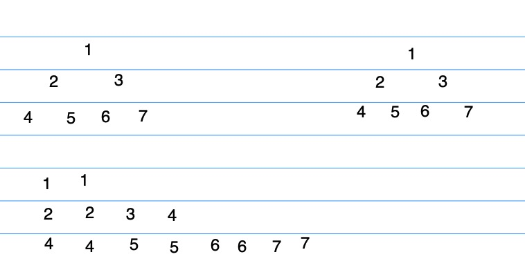
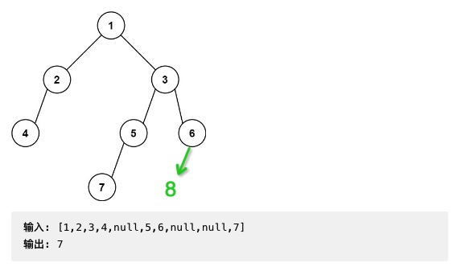

#### [101. 对称二叉树](https://leetcode.cn/problems/symmetric-tree/)

##### 层序遍历

层序遍历是没法实现的

```kotlin
    fun isSymmetric3(root: TreeNode?): Boolean {
        val queue = LinkedList<TreeNode>()
        if (root != null) {
            queue.offer(root)
        }
        while (queue.isNotEmpty()) {
            val layerSize = queue.size
            for (i in 0 until layerSize) {
//                val lastIndex = layerSize - 1 - i // 这样不可以,poll取出元素后，就少了元素越界了
                val headNode = queue.poll()

                val lastNode = queue.lastOrNull()
                if (headNode.`val` != lastNode?.`val`) {
                    return false
                }
                headNode.left?.let { queue.offer(it) }
                headNode.right?.let { queue.offer(it) }
            }
        }
        return true
    }
```

##### 递归

// 不能判断true,判断true直接返回了，判断false返回没问题，true返回就不会往下走了

```kotlin
private fun leftRightSymmetric(nodeLeft: TreeNode?, nodeRight: TreeNode?): Boolean {
    if (nodeLeft?.`val` == nodeRight?.`val`) { // 不能判断true,判断true直接返回了，判断false返回没问题，true返回就不会往下走了
        return true
    } else if (nodeLeft == nodeRight) { // = null
        return true
    }
    leftRightSymmetric(nodeLeft?.left, nodeRight?.right)
    leftRightSymmetric(nodeLeft?.right, nodeRight?.left)
    return false
}
```


https://programmercarl.com/0101.%E5%AF%B9%E7%A7%B0%E4%BA%8C%E5%8F%89%E6%A0%91.html#%E9%80%92%E5%BD%92%E6%B3%95

从根节点的左右子树开始，深度遍历比较


```kotlin
fun isSymmetric(root: TreeNode?): Boolean {
    return leftRightSymmetric(root?.left, root?.right)
}

private fun leftRightSymmetric(nodeLeft: TreeNode?, nodeRight: TreeNode?): Boolean {
    if (nodeLeft == null && nodeRight != null) {
        return false
    } else if (nodeLeft != null && nodeRight == null) {
        return false
    } else if (nodeLeft?.`val` != nodeRight?.`val`) {
        return false
    } else if (nodeLeft == null && nodeRight == null) {
        return true //这里需要，否则就递归 溢出了,如果根节点的左右节点为null,退出也是没问题的
    }
    val leftFlag = leftRightSymmetric(nodeLeft?.left, nodeRight?.right)
    val rightFlag = leftRightSymmetric(nodeLeft?.right, nodeRight?.left)
    return leftFlag && rightFlag
}
```

##### 队列


队列，一直向下按照对称的条件添加


```kotlin
fun isSymmetric1(root: TreeNode?): Boolean {
    val queue = LinkedList<TreeNode>()
    if (root != null) { 
        root.left?.let { queue.offer(it) } // 官方解法中，根节点入队2次也可以
        root.right?.let { queue.offer(it) }
    }
    while (queue.isNotEmpty()) {
        val node1 = queue.poll()
        val node2 = queue.poll()
        if(node1==null&&node2==null){ // 一开始没写这个条件，提示超出时间限制
            return true
        }
        if (node1?.`val` != node2?.`val`) {
            return false
        }
        queue.offer(node1?.left) // 两边的节点比较
        queue.offer(node2?.right)
        queue.offer(node1?.right) //中间的节点比较
        queue.offer(node2?.left)
    }
    return true
}
```


栈也是可以的，只要保证位置靠近


#### [100. 相同的树](https://leetcode.cn/problems/same-tree/)

##### 递归

```kotlin
fun isSameTree(p: TreeNode?, q: TreeNode?): Boolean {
    if (p == null && q != null) {
        return false
    } else if (p != null && q == null) {
        return false
    } else if (p == null && q == null) {
        return true
    }
    return p?.`val` == q?.`val` && isSameTree(p?.left, q?.left) && isSameTree(p?.right, q?.right)
}
```


##### 队列



```kotlin

fun isSameTree1(p: TreeNode?, q: TreeNode?): Boolean {
    if (p == null && q != null) {
        return false
    } else if (p != null && q == null) {
        return false
    }
    val queue = LinkedList<TreeNode>()
    queue.offer(p)
    queue.offer(q)
    while (queue.isNotEmpty()) {
        val node1 = queue.poll()
        val node2 = queue.poll()
        if (node1 == null && node2 == null) { // continue后，因为null,就不会加入新的节点
            continue
        }
        if (node1?.`val` != node2?.`val`) {
            return false
        }
        queue.offer(node1?.left)
        queue.offer(node2?.left)
        queue.offer(node1?.right)
        queue.offer(node2?.right)
    }
    return true
}
```


#### [572. 另一棵树的子树](https://leetcode.cn/problems/subtree-of-another-tree/)


```kotlin
fun isSubtree(root: TreeNode?, subRoot: TreeNode?): Boolean {
    if (root == null && subRoot == null) {
        return true
    } else if (root == null && subRoot != null) {
        return false
    } else if (root != null && subRoot == null) {
        return false
    }
    return isSameTree(root, subRoot) || isSubtree(root?.left, subRoot) || isSubtree(root?.right, subRoot) //subRoot和root相同,subRoot和root左子树相同，subRoot和右子树相同
}

private fun isSameTree(node1: TreeNode?, node2: TreeNode?): Boolean {
    if (node1 == null && node2 == null) {
        return true
    } else if (node1 == null && node2 != null) {
        return false
    } else if (node1 != null && node2 == null) {
        return false
    }
    return node1?.`val` == node2?.`val` && isSameTree(node1?.left, node2?.left) && isSameTree(
        node1?.right,
        node2?.right
    )
}
```


#### [222. 完全二叉树的节点个数](https://leetcode.cn/problems/count-complete-tree-nodes/)


##### DFS 普通二叉树解法 

```kotlin
fun countNodes(root: TreeNode?): Int {
    if (root == null) return 0
    val leftCount = countNodes(root.left)
    val rightCount = countNodes(root.right)
    return leftCount + rightCount + 1
}
```


##### BFS

```kotlin
fun countNodes1(root: TreeNode?): Int {
    val queue = LinkedList<TreeNode>()
    if (root != null) {
        queue.offer(root)
    }
    var count = 0
    while (queue.isNotEmpty()) {
        val size = queue.size
        for (i in 0 until size) {
            val treeNode = queue.poll()
            count++
            treeNode.left?.let { queue.offer(it) }
            treeNode.right?.let { queue.offer(it) }
        }
    }
    return count
}
```


##### DFS 完全二叉树特性

一开始打算用先序遍历，但是这样不行,

如果一颗树 是平衡的，永远是得到 1,  想了一下，这种也不属于 先序遍历

```kotlin
fun countNodes(root: TreeNode?): Int {
    val depth = 0
    return postTraversal(root, depth)
}

private fun postTraversal(root: TreeNode?, depth: Int): Int {
    if (isBalanced(root)) {
        return 2 shl (depth - 1)
    }
    val leftNums = postTraversal(root?.left, depth + 1)
    val rightNums = postTraversal(root?.right, depth + 1)
    return leftNums + rightNums + 1
}
```


##### 先序遍历

```kotlin
fun countNodes(root: TreeNode?): Int {
    if (root == null) return 0
    var leftNode = root.left
    var depthLeft = 0 //左子树深度
    while (leftNode != null) {
        leftNode = leftNode.left
        depthLeft++
    }
    var rightNode = root.right
    var depthRight = 0
    while (rightNode != null) {
        rightNode = rightNode.right
        depthRight++
    }
    if (depthLeft == depthRight) {
        return (2 shl depthLeft) - 1 // 节点数
    }
    val leftNums = countNodes(root.left)
    val rightNums = countNodes(root.right)
    return leftNums + rightNums + 1
}
```


##### 后序遍历

```kotlin
fun countNodes3(root: TreeNode?): Int {
    if (root == null) return 0
    var leftNode = root.left
    var depthLeft = 0 //左子树深度
    while (leftNode != null) {
        leftNode = leftNode.left
        depthLeft++
    }
    var rightNode = root.right
    var depthRight = 0
    while (rightNode != null) {
        rightNode = rightNode.right
        depthRight++
    }
    val leftNums = countNodes(root.left)
    val rightNums = countNodes(root.right)
    if (depthLeft == depthRight) {
        return (2 shl depthLeft) - 1 // 节点数
    }
    return leftNums + rightNums + 1
}
```


#### [110. 平衡二叉树](https://leetcode.cn/problems/balanced-binary-tree/)


一开始错误的解答是这样的

```kotlin
    fun isBalanced(root: TreeNode?): Boolean {
        return postTraversal(root) != -1
    }

    private fun postTraversal(node: TreeNode?): Int {
        if (node == null) return 0
        val leftDepth = postTraversal(node.left)
        val rightDepth = postTraversal(node.right)
        val isBalance = Math.abs(leftDepth - rightDepth) <= 1
        if (isBalance) {
            return Math.max(leftDepth, rightDepth) + 1
        }
        return -1
    }
}
```

这里问题是   return -1，作为父节点的深度返回给了 depth，然后继续计算 Math.abs(leftDepth - rightDepth) <= 1，出现了问题


改进解法

```kotlin
fun isBalanced(root: TreeNode?): Boolean {
    return postTraversal(root) != -1
}

private fun postTraversal(node: TreeNode?): Int {
    if (node == null) return 0
    val leftDepth = postTraversal(node.left)
    val rightDepth = postTraversal(node.right)
    if (leftDepth == -1 || rightDepth == -1) { // 子节点已经有不是平衡的节点 直接返回，来判断
        return -1
    }
    val isBalance = Math.abs(leftDepth - rightDepth) <= 1
    if (isBalance) {
        return Math.max(leftDepth, rightDepth) + 1
    }
    return -1
}
```


随想录迭代遍历，看起来很复杂，看起来是统一解法.

https://programmercarl.com/0110.%E5%B9%B3%E8%A1%A1%E4%BA%8C%E5%8F%89%E6%A0%91.html#%E9%A2%98%E5%A4%96%E8%AF%9D


#### [257. 二叉树的所有路径](https://leetcode.cn/problems/binary-tree-paths/)


##### 隐藏回溯过程

这一题 没理解透字符串怎么形成的和回溯的, 用到了先序遍历，

https://www.bilibili.com/video/BV1ZG411G7Dh 视频包含了回溯过程

 可以看下随想录回溯过程

```kotlin
    fun binaryTreePaths(root: TreeNode?): List<String> {
        val result = LinkedList<String>()
        if (root == null) return result

        dfs(root, result, root.`val`.toString())
        return result
    }

    /**
     * https://www.youtube.com/watch?v=swG70SQBJ-A
     *
     * 1. String不能用 StringBuilder,存在引用传递问题，会输出
     *    ["1->2->5","1->2->5->3"]
     *
     * 2. 在先序位置 val存到path也有问题,头节点会存在重复的情况 ["1->1->2->5","1->1->2->5->3"]
     */
    private fun dfs(node: TreeNode?, result: LinkedList<String>, path: String) {
        if (node == null) return
        if (node.left == null && node.right == null) {
            result.add(path)
        }
        if (node.left != null) {
            dfs(node.left, result, "$path->${node.left.`val`}")
        }
        if (node.right != null) {
            dfs(node.right, result, "$path->${node.right.`val`}")
        }
    }
```


上面2的情况演示

```kotlin
private fun dfs(node: TreeNode?, result: LinkedList<String>, path: String?) {
    if (node == null) return
    val mPath = "$path-> ${node.`val`}"
    if (node.left == null && node.right == null) {
        result.add(mPath)
    }
    if (node.left != null) {
        dfs(node.left, result, mPath)
    }
    if (node.right != null) {
        dfs(node.right, result, mPath)
    }
}
```


上面两种写法，回溯隐藏在参数里面.


##### 显示回溯

这是随想录的代码，二刷可以自己写, 

```kotlin
fun binaryTreePaths(root: TreeNode?): List<String>? {
    val res: MutableList<String> = ArrayList()
    if (root == null) {
        return res
    }
    val paths: MutableList<Int> = ArrayList()
    traversal(root, paths, res)
    return res
}

private fun traversal(root: TreeNode, paths: MutableList<Int>, res: MutableList<String>) {
    paths.add(root.`val`)
    // 叶子结点
    if (root.left == null && root.right == null) { // 碰到叶子节点，开始把path遍历放进string中 
        // 输出
        val sb = StringBuilder()
        for (i in 0 until paths.size - 1) {
            sb.append(paths[i]).append("->")
        }
        sb.append(paths[paths.size - 1]) //也可以放到上面一起再把"->" 删除
        res.add(sb.toString()) 
        return
    }
    if (root.left != null) {
        traversal(root.left, paths, res)
        paths.removeAt(paths.size - 1) // 回溯  
    }
    if (root.right != null) {
        traversal(root.right, paths, res)
        paths.removeAt(paths.size - 1) // 回溯
    }
}
```


```
 paths.removeAt(paths.size - 1) 最初这里没理解，都删除了，为什么,上面还能遍历所有节点，其实递归是一致先走的，碰到叶子节点的时候，遍历path, 最后才开始 paths.removeAt(paths.size - 1) 回溯 到上面. 
```


https://programmercarl.com/0257.%E4%BA%8C%E5%8F%89%E6%A0%91%E7%9A%84%E6%89%80%E6%9C%89%E8%B7%AF%E5%BE%84.html

https://www.bilibili.com/video/BV1ZG411G7Dh

迭代法 后面再说吧


#### [404. 左叶子之和](https://leetcode.cn/problems/sum-of-left-leaves/)

这一题和【 222 完全二叉树的节点个数】很像，这里是普通的二叉树，所以我的想法就前两种做法

1. 后序遍历
2. 层序遍历

把根节点换成左子树的节点

看错了题目，其实是左子树叶子值的和


https://programmercarl.com/0404.%E5%B7%A6%E5%8F%B6%E5%AD%90%E4%B9%8B%E5%92%8C.html#%E6%80%9D%E8%B7%AF

只看了随想录题解，自己这样写的代码


##### 递归法

```kotlin
fun sumOfLeftLeaves(root: TreeNode?): Int {
    return dfsLeaves(root, 0)
}

/**
 * @param direction 0 右子树， 1：左子树
 */
private fun dfsLeaves(node: TreeNode?, direction: Int): Int {
    if (node == null) return 0
    if (node.left == null && node.right == null && direction == 1) { // 左右子树为空，根据父亲节点的传入，判断它是左子树
        return node.`val` //这种情况返回值，根据后序规则，上层节点叠加
    }
    val leftCount = dfsLeaves(node.left, 1)
    val rightCount = dfsLeaves(node.right, 0)
    return leftCount + rightCount
}
```


看了随想录解法，可以直接看更下一层节点，就不用再传入方向了

```cpp
  if (root->left != NULL && root->left->left == NULL && root->left->right == NULL) {
            leftValue = root->left->val;
  }
```


迭代法

随想录统一迭代法


#### [513. 找树左下角的值](https://leetcode.cn/problems/find-bottom-left-tree-value/)

想了下

1. 层序遍历可以解决
2. 递归法还没想道，到了最底层，没想到如何判断 哪个是最左边的。


##### BFS

先存下来每一层的第一个节点，知道queue为空，那么最后一层的头节点就是要返回的.

```kotlin
fun findBottomLeftValue1(root: TreeNode?): Int {
    val queue = LinkedList<TreeNode>()
    if (root != null) {
        queue.offer(root)
    }
    var leftNodeVal = root?.`val`
    while (queue.isNotEmpty()) {
        val size = queue.size
        leftNodeVal = queue.peek().`val` //每一层的第一个节点
        for (i in 0 until size) {
            val node = queue.poll()
            node?.left?.let { queue.offer(it) }
            node?.right?.let { queue.offer(it) }
        }
    }
    return leftNodeVal!! // queue为empty的时候退出，此时上一层存的节点就是最左边的节点
}
```


##### DFS

My idea

1. 一开始以为树的层级里，树的左边的值小于右边，来得出结果，但是这是二叉树，不是平衡形的，即使平衡这种思路也不一定对.

2. 然后又看了树结构,想了下可以用 inorder traversal ,中序遍历, 层数最深，然后最先得到的数据就是要拿到的结果. 

   想下面8肯定是后面遍历到的





1. 一开始不知道leetcode可以用全局变量，用对象返回还很麻烦，删掉了
2. 判断层级，如果大于之前的深度，那么就更新深度和值
3. 中序和后序肯定没问题，但是先序不确定（随想录说是可以的）而且随想录 depth + 1 展开了用回溯

```kotlin
var mDepth = 0 //一开始不知道leetcode可以用全局变量，用对象返回还很麻烦，删掉了
var result = -1

fun findBottomLeftValue(root: TreeNode?): Int {
    if (root == null) return 0
    inOrderTraversal(root, mDepth)
    return result
}

// 最左边的节点最先访问到
private fun inOrderTraversal(node: TreeNode?, depth: Int) {
    if (node == null) return
    inOrderTraversal(node.left, depth + 1)
    if (depth + 1 > mDepth) { // 判断层级，如果大于之前的深度，那么就更新深度和值
        mDepth = depth + 1
        result = node.`val`
    }
    inOrderTraversal(node.right, depth + 1)
}
```


#### [112. 路径总和](https://leetcode.cn/problems/path-sum/)


解决所有二叉树路径的问题文章

https://leetcode.cn/problems/path-sum-ii/solution/yi-pian-wen-zhang-jie-jue-suo-you-er-cha-oo63/


这一题和  [112. 路径总和]  类似

使用回溯写法，因为添加和删除，回溯的规则，那么感觉用栈比较合适.

1. 终止条件就是 到达了叶子节点，此时开始计算当前路径和 是否满足条件
2. 手写判断是否有左子树，有的话继续判断，又继续preOrderTraversal, 这里用的是先序遍历,方法查看条件
3. 遍历完叶子节点后判断，此时这条路径完成，开始回溯，回退上一层preOrderTraversal，继续判断右子树


```kotlin
fun hasPathSum(root: TreeNode?, targetSum: Int): Boolean {
    val pathStack = Stack<Int>()
    if (root != null) {
        pathStack.push(root.`val`) // root需要放在遍历外面，否则会push多次
    }else{
        return false //按照前面的规则 root==null ,0 应该是对的,但是题目说false,就单独加一句
    }
    return preOrderTraversal(root, targetSum, pathStack) // pathstack必须传进去，否则每次都new
}

private fun preOrderTraversal(root: TreeNode?, targetSum: Int, pathStack: Stack<Int>): Boolean {
    if (root?.left == null && root?.right == null) {
        var pathSum = 0
        pathStack.forEach {
            pathSum += it
        }
        println("pathSum $pathSum")
        if (pathSum == targetSum) {
            return true
        }
    }
    if (root?.left != null) {
        pathStack.push(root.left.`val`) // 有左节点，加入当前路径
        if (preOrderTraversal(root.left, targetSum, pathStack)) { //有路径是和 == targetSum 直接返回
            return true
        }
        pathStack.pop()  // 不会直接把上面的回退了，需要上一句遍历执行完回退后，才把自己回退了，此时已经到了叶子判断了 root?.left == null && root?.right == null
    }
    if (root?.right != null) {
        pathStack.push(root.right.`val`)
        if (preOrderTraversal(root.right, targetSum, pathStack)) { //有路径是和 == targetSum 直接返回
            return true
        }
        pathStack.pop()
    }
    return false
}
```


```kotlin
fun hasPathSum1(root: TreeNode?, targetSum: Int): Boolean {
    if (root == null) {
        return false //按照前面的规则 root==null ,0 应该是对的,但是题目说false,就单独加一句
    }
    val pathSum = root.`val`
    return preOrderDFS(root, pathSum, targetSum) // pathstack必须传进去，否则每次都new
}

private fun preOrderDFS(node: TreeNode, pathSum: Int, targetSum: Int): Boolean {
    val nodeValue = node.`val`
    println("nodeValue $nodeValue")
    if (node.left == null && node.right == null && targetSum == pathSum) {
        return true
    }

    if (node.left != null)
        if (preOrderDFS(node.left, pathSum + node.left.`val`, targetSum)) { // 这个直接放回，容易忘了
            return true
        }

    if (node.right != null)
        if (preOrderDFS(node.right, pathSum + node.right.`val`, targetSum)) {
            return true
        }
    return false
}
```


#### [113. 路径总和 II](https://leetcode.cn/problems/path-sum-ii/)

如果是找路径和等于给定target的路径的，那么可以不用新增一个临时变量cursum来判断当前路径和，
只需要用给定和target减去节点值，最终结束条件判断target==0即可


##### DFS


这一题的思路和前面的差不多，就是他要求返回所有符合条件的集合，所以直接添加值觉得不合适，除非多加一个参数，不加一个参数就不好弄。


//这种解法要注意 值引用问题，即使最初加入到resultList的pathList是正确的，后序的回退也会把值给修改了.

```kotlin
    val resultList = LinkedList<List<Int>>()
    fun pathSum(root: TreeNode?, targetSum: Int): List<List<Int>> {
        if (root == null) return resultList
        val stackList = Stack<Int>()
        stackList.add(root.`val`)
        preDFS(root, stackList, targetSum)
        return resultList
    }

    private fun preDFS(node: TreeNode, pathList: Stack<Int>, targetSum: Int) {
        val data = node.`val`
        println(data)
        if (node.left == null && node.right == null && pathSum(pathList) == targetSum) {
            resultList.add(pathList.toMutableList().toList()) // 注意引用传递
        }
        if (node.left != null) {
            pathList.push(node.left.`val`)
            preDFS(node.left, pathList, targetSum)
            pathList.pop()
        }
        if (node.right != null) {
            pathList.push(node.right.`val`)
            preDFS(node.right, pathList, targetSum)
            pathList.pop()
        }
    }

    fun pathSum(pathList: Stack<Int>): Int {
        var sum = 0
        pathList.forEach {
            sum += it
        }
        return sum
    }
```


这一题的官方DFS解法没看懂，感觉不好理解.


这是看完官方写法自己写的

```kotlin
val pathList = LinkedList<Int>()
fun pathSum1(root: TreeNode?, targetSum: Int): List<List<Int>> {
    if (root == null) return resultList
    val stackList = Stack<Int>()
    stackList.add(root.`val`)
    preTraversal(root, targetSum - root.`val`)
    return resultList
}

private fun preTraversal(node: TreeNode?, targetSum: Int) {
    if (node == null) return
    val data = node.`val`
    println(data)
    pathList.offer(node.`val`)
    if (node.left == null && node.right == null && targetSum == 0) {
        resultList.add(pathList.toMutableList())
    }
    if (node.left != null)
        preTraversal(node.left, targetSum - node.left.`val`)
    if (node.right != null)
        preTraversal(node.right, targetSum - node.right.`val`)
    pathList.pop()
}
```


这是官方解法，也很棒

```kotlin
fun pathSum2(root: TreeNode?, targetSum: Int): List<List<Int>> {
    if (root == null) return resultList
    val stackList = Stack<Int>()
    stackList.add(root.`val`)
    preDFSTraversal(root, targetSum)
    return resultList
}

private fun preDFSTraversal(node: TreeNode?, targetSum: Int) {
    if (node == null) return
    val data = node.`val`
    println(data)
    val targetSum = targetSum - node.`val`
    pathList.offer(node.`val`)
    if (node.left == null && node.right == null && targetSum == 0) {
        resultList.add(pathList.toMutableList())
    }
    preDFSTraversal(node.left, targetSum)
    preDFSTraversal(node.right, targetSum)
    pathList.pop()
}
```


官方BFS 就很不好理解


### 构建树


先序，中序

后序，中序

inOrder 		[L, 3 ,R ]

PostOrder 	[L, R, 3] 

PreOrder 	  [3,L ,R]
可以看到 只有PostOrder ,PreOrder左右是分不清的.


```
 			1    					1 
 		2									2
  3											3
  
PreOrder  1,2,3				PreOrder  1,2,3
PostOrder 3,2,1 			PostOrder 3,2,1
```


#### [106. 从中序与后序遍历序列构造二叉树](https://leetcode.cn/problems/construct-binary-tree-from-inorder-and-postorder-traversal/)


效率低，但是好理解的方法

https://www.bilibili.com/video/BV1pp4y1k75Q/

为什么post右子树是从 , [i , n-1],因为他是后序遍历，所以从 i开始

```
inorder = 	[9,3,15,20,7]
postorder = [9,15,7,20,3]
```

1. 根据后序postorder 得到root 3, 然后根据中序知道 left branch [9] , right branch [15 , 20 , 7]

2. 根据 left branch 的9,可以把 postorder后序分成[9], [15 , 20 , 7]两部分

3. 然后 inorder= [15 , 20 , 7] , postorder=[15 , 20 , 7] 继续进行遍历

   

总的来说，就是这样

1. 确定终止条件
2. 构造节点
3. 构造左子树， 构造右子树


```kotlin
fun buildTree(inorder: IntArray, postorder: IntArray): TreeNode? {
    if (inorder.isEmpty() && postorder.isEmpty()) {
        return null
    }
    val node = TreeNode(postorder[postorder.size - 1]) //postorder.size用的地方多，可以提取出来
    val index = getIndex(node, inorder)
    node.left = buildTree(inorder.copyOfRange(0, index), postorder.copyOfRange(0, index)) // copyOfRange数组效率低
    node.right = buildTree(
        inorder.copyOfRange(index + 1, inorder.size), postorder.copyOfRange(index, postorder.size - 1)
    ) // 注意copyOfRange(0,2)获取的是index 0,1两个元素
    return node
}

private fun getIndex(node: TreeNode, inorder: IntArray): Int {
    for (i in inorder.indices) {
        if (node.`val` == inorder[i]) {
            return i
        }
    }
    return 0
}
```


##### 优化方法

写出来还有问题,先pass这题耗时太久了,边界不好掌握可以考虑用日志调试


还可以再看下随想录的视频讲解

https://www.bilibili.com/video/BV1vW4y1i7dn


随想录代码优化前的写法，和上面代码写法是一样的，只是用了C++语言

https://programmercarl.com/0106.%E4%BB%8E%E4%B8%AD%E5%BA%8F%E4%B8%8E%E5%90%8E%E5%BA%8F%E9%81%8D%E5%8E%86%E5%BA%8F%E5%88%97%E6%9E%84%E9%80%A0%E4%BA%8C%E5%8F%89%E6%A0%91.html


最初错误的解法,上面的解法数组有变化所以 end位置就是数组的大小，但是这里不同，数组是没变化，就不能这样做

```
// 数组不变，只改变下标
private fun buildDFSTree(
    inorder: IntArray,
    postorder: IntArray,
    inStart: Int,
    inEnd: Int,
    postStart: Int,
    postEnd: Int
): TreeNode? {
    if (inStart > inEnd || postStart > postEnd || inEnd < 0 || postEnd < 0) {
        return null
    }
    val node = TreeNode(postorder[postEnd]) //postorder.size用的地方多，可以提取出来
    val index = getIndex(node, inorder)

    node.left = buildDFSTree(inorder, postorder, inStart, index - 1, 0, index - 1)   //[0,index) 左闭右开
    node.right = buildDFSTree(inorder, postorder, index + 1, inEnd, index + 1, postEnd)
    return node
}
```


这一题花了不少时间，思路不难，主要是 切割后序的数组的时候，左右子树的边界值不好处理,


1. map用来存储，中序value值和position的对应关系，这里value应该是唯一的.
2. 采用的是左闭右闭的方案，所以inStart > inEnd 不能用 >=, 否则return了，叶子节点无法构造出来.
3. 根据后序root节点，分割中序数组，拿到左子树后，再用左子树树的分割后序数组,因为左子树的长度是一样的。


```kotlin
val map = HashMap<Int, Int>()
fun buildTree1(inorder: IntArray, postorder: IntArray): TreeNode? {
    if (inorder.isEmpty() && postorder.isEmpty()) {
        return null
    }
    val inStart = 0
    val inEnd = inorder.size - 1
    val postStart = 0
    val postEnd = postorder.size - 1
    inorder.forEachIndexed { position, item ->
        map[item] = position
    }
    return buildDFSTree(inStart, inEnd, postStart, postEnd, inorder, postorder)
}

// 数组不变，只改变下标
private fun buildDFSTree(
    inStart: Int,
    inEnd: Int,
    postStart: Int,
    postEnd: Int,
    inorderArr: IntArray,
    postorderArr: IntArray
): TreeNode? {
    println(" inStart $inStart inEnd $inEnd  postStart $postStart postEnd $postEnd")
    if (inStart > inEnd || postStart > postEnd) { // 因为是左闭右闭的方案，所以这里不能用 >= ,否则叶子节点无法构造出来
        return null
    }
    val node = TreeNode(postorderArr[postEnd]) //postorder.size用的地方多，可以提取出来
    val index = map[postorderArr[postEnd]] ?: 0 // 这里要改

    /**
     * 切割左子树,这种坐标定义好更清晰
     */
    val leftInBegin = inStart
    val leftInEnd = index - 1 // 左闭右闭
    val leftPostBegin = postStart
    val leftPostEnd = postStart + (index - inStart - 1) //(index - inStart) 左子树的长度, 因为选择是左闭右闭的方案，所以自身也-1

    node.left = buildDFSTree(
        leftInBegin, leftInEnd, leftPostBegin, leftPostEnd,
        inorderArr,
        postorderArr
    )

    /**
     * 切割右子树
     */
    val rightInBegin = index + 1
    val rightInEnd = inEnd
    val rightPostBegin = postStart + index - inStart //(index - inStart) 这里不用-1,因为左子树的右边就是右子树，所以右子树就是从这个位置开始的
    val rightPostEnd = postEnd - 1

    node.right = buildDFSTree(
        rightInBegin, rightInEnd, rightPostBegin, rightPostEnd,
        inorderArr,
        postorderArr
    )
    return node
}
```


官方

先构建右子树的想法好巧妙，要是先构建的是左子树还有个确定后序区间的步骤。

https://leetcode.cn/problems/construct-binary-tree-from-inorder-and-postorder-traversal/solution/cong-zhong-xu-yu-hou-xu-bian-li-xu-lie-gou-zao-14/


官方解法很妙，根据后序数组pop，post_idx--;先开始右子树,然后左子树,构造方法也很简单，这样不用找后序数组的 开始和结束位置在哪. 做了上面的解法，也就是这个后序的边界值最难搞. 这种方式直接给省去了。


不得不说太妙了


官方迭代法后面再看吧 。


#### [654. 最大二叉树](https://leetcode.cn/problems/maximum-binary-tree/)

输入：nums = [3,2,1,6,0,5]
输出：[6,3,5,null,2,0,null,null,1]
解释：递归调用如下所示：

[3,2,1,6,0,5] 中的最大值是 6 ，左边部分是 [3,2,1] ，右边部分是 [0,5] 。

- [3,2,1] 中的最大值是 3 ，左边部分是 [] ，右边部分是 [2,1] 。 ,3的左边是[]没有节点, 右边是[0,5],所以树也是这样构造的.
    - 空数组，无子节点。
    - [2,1] 中的最大值是 2 ，左边部分是 [] ，右边部分是 [1] 。
        - 空数组，无子节点。
        - 只有一个元素，所以子节点是一个值为 1 的节点。
- [0,5] 中的最大值是 5 ，左边部分是 [0] ，右边部分是 [] 。
    - 只有一个元素，所以子节点是一个值为 0 的节点。
    - 空数组，无子节点。


##### preTraversal

思路 : 

1. 因为需要构造中间节点，所以用先序遍历
2. 先找到数组中最大值，然后切割成左右子树。
3. 在切割后的左右子树中继续切割，直至无法切割为止


自己写的，做法和随想录类似 

https://programmercarl.com/0654.%E6%9C%80%E5%A4%A7%E4%BA%8C%E5%8F%89%E6%A0%91.html#java


```kotlin
fun constructMaximumBinaryTree(nums: IntArray): TreeNode? {
    return buildTree(nums, 0, nums.size - 1)
}

private fun buildTree(nums: IntArray, start: Int, end: Int): TreeNode? {
    println("buildTree start $start end $end")
    if (start > end) return null            //分割的左右下标越界就退出 ,不能加==，否则叶子节点构造不到.
    val maxIndex = getMaxIndex(nums, start, end)
    val node = TreeNode(nums[maxIndex])     // 构造先序的父节点
    node.left = buildTree(nums, start, maxIndex - 1) // 构造左节点
    node.right = buildTree(nums, maxIndex + 1, end)
    return node
}

fun getMaxIndex(nums: IntArray, start: Int, end: Int): Int {
    var maxIndex = start
    for (i in start..end) {  // 在对应的数组范围内，找到最大值
        if (nums[maxIndex] < nums[i]) {
            maxIndex = i
        }
    }
    return maxIndex
}
```


##### 单调栈

官方还有一种单调栈的写法，后面再看吧

https://leetcode.cn/problems/maximum-binary-tree/solution/zui-da-er-cha-shu-by-leetcode-solution-lbeo/


#### [105. 从前序与中序遍历序列构造二叉树](https://leetcode.cn/problems/construct-binary-tree-from-preorder-and-inorder-traversal/)


Idea


##### 只分割中序数组

按照上面106官方很妙的思路，下面解法

1. 根据中序遍历。value和index构造hash map,方便后面获取中序位置
2. 根据先序遍历数组从 左子树到右子树构造节点, 这样就不用分割先序数组，也是很麻烦的
3. 根据先序数组的节点的位置，分割中序遍历数组，拿到左右子树
4. 然后是递归分割.


```kotlin
    val map = HashMap<Int, Int>()
    var preNodeIndex = 0
    fun buildTree(preorder: IntArray, inorder: IntArray): TreeNode? {
        inorder.forEachIndexed { position, item -> //
            map[item] = position
        }
        return buildDFS(preorder, inorder, 0, inorder.size - 1)
    }

    private fun buildDFS(preorder: IntArray, inorder: IntArray, inBegin: Int, inEnd: Int): TreeNode? {
        if (inBegin > inEnd) {
            return null
        }
        val node = TreeNode(preorder[preNodeIndex])  // 根据先序遍历数组从 左子树到右子树构造节点
        val inIndex = map[preorder[preNodeIndex]]!! // 根据先序数组的节点的位置，分割中序遍历数组，拿到左右子树
        println("${preorder[preNodeIndex]} inBegin $inBegin inEnd $inEnd")
        preNodeIndex++
        node.left = buildDFS(preorder, inorder, inBegin, inIndex - 1)
        node.right = buildDFS(preorder, inorder, inIndex + 1, inEnd)
        return node
    }
```


##### 分割先序 中序数组


1. 根据中序数组构造，位置和值的hashmap 。
2. 根据先序数组的中节点位置，分割中序数组，得到左右子树。
3. 根据中序数组得到的左子树的长度，分割 先序数组的左右子树.
4. 构造左右子树.


左闭右闭的情况

```kotlin
val map = HashMap<Int, Int>()
var preNodeIndex = 0
fun buildTree1(preorder: IntArray, inorder: IntArray): TreeNode? {
    inorder.forEachIndexed { position, item ->
        map[item] = position  // 获得 中序 value和index hash
        map.put(item,position)
    }
    return splitPreInOrder(preorder, 0, preorder.size - 1, inorder, 0, inorder.size - 1)
}

private fun splitPreInOrder(
    preorderArr: IntArray,
    preStart: Int,
    preEnd: Int,
    inorderArr: IntArray,
    inStart: Int,
    inEnd: Int
): TreeNode? {
    println(" preStart $preStart preEnd $preEnd inStart $inStart inEnd $inEnd")

    if (preStart > preEnd || inStart > inEnd) return null
    val inIndex = map[preorderArr[preStart]]!!  // 分割中序数组
    val node = TreeNode(preorderArr[preStart])

    val leftInBegin = inStart //左闭
    val leftInEnd = inIndex-1    // 右闭
    val leftPreBegin = preStart + 1 // 先序中节点的后一个位置，就是左子树的开始位置
    val leftPreEnd = preStart + (inIndex - inStart) // 其实位置 + 中序中左子树的长度

    node.left = splitPreInOrder(preorderArr, leftPreBegin, leftPreEnd, inorderArr, leftInBegin, leftInEnd)
    val rightInBegin = inIndex + 1 // 分割点的后一个位置
    val rightInEnd = inEnd
    val rightPreBegin = preStart + (inIndex - inStart) + 1 // 先序数组 左子树位置+1 后一个位置
    val rightPreEnd = preEnd
    node.right = splitPreInOrder(preorderArr, rightPreBegin, rightPreEnd, inorderArr, rightInBegin, rightInEnd)
    return node
}
```


感觉还是左闭右闭好点，右开的情况容易越界.


#### [617. 合并二叉树](https://leetcode.cn/problems/merge-two-binary-trees/)

##### DFS

1. 合并二叉树，通过先序遍历，先构造根节点
2. 然后再分别构造左右子树

```kotlin
fun mergeTrees(root1: TreeNode?, root2: TreeNode?): TreeNode? {
    if (root1 == null && root2 == null) return null //这里还可以优化, 看官方解法和随想录的优化一样的
    val node = TreeNode((root1?.`val` ?: 0) + (root2?.`val` ?: 0))
    node.left = mergeTrees(root1?.left, root2?.left)
    node.right = mergeTrees(root1?.right, root2?.right)
    return node
}
```


BFS

这题官方有一种BFS的解法,感觉有点麻烦，后面继续

https://leetcode.cn/problems/merge-two-binary-trees/solution/he-bing-er-cha-shu-by-leetcode-solution/
