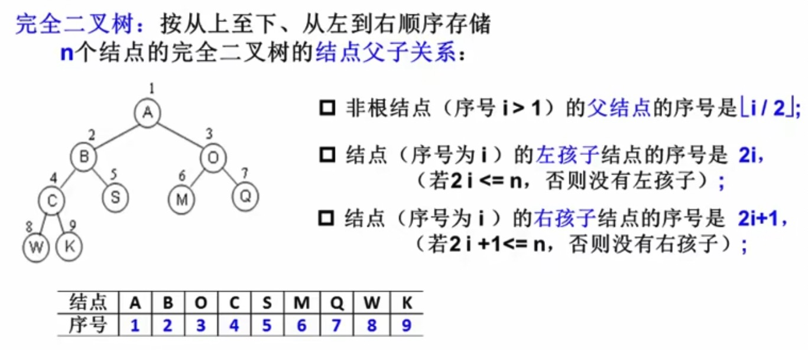
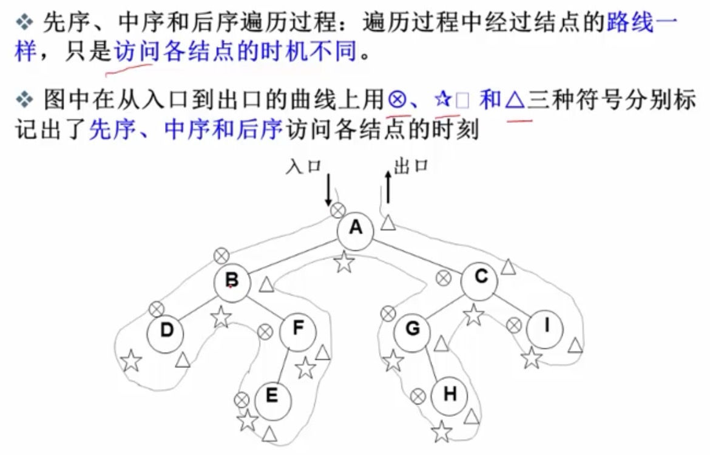
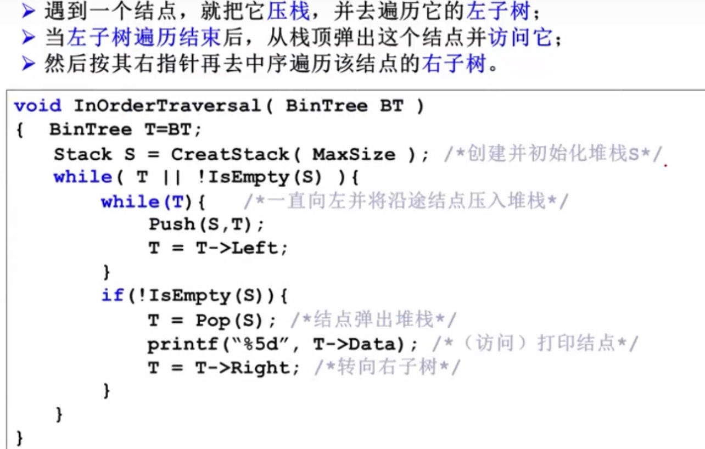
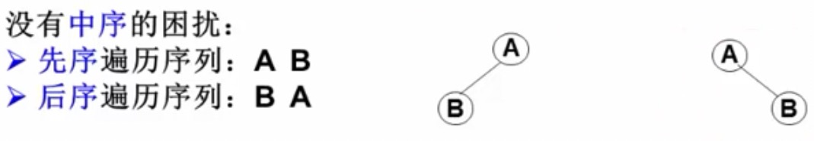

#### Tree

https://www.bilibili.com/video/BV1JW411i731

##### 完全二叉树

数组存储方式

i 是数组下标

#### 遍历

##### 构建和打印树

https://blog.nowcoder.net/n/f3799d64ed764fd49c63947d617d4cd5

https://leetcode.cn/playground/VDCGQ8Ds/

https://leetcode.cn/circle/discuss/vpcMyM/

中间节点  在哪,代表的遍历方式

- 前序遍历：中左右
- 中序遍历：左中右
- 后序遍历：左右中

https://github.com/azl397985856/leetcode/blob/master/thinkings/tree.md

##### 层序遍历

用队列实现

#### 确定二叉树

必须有中序遍历，和先 后 序遍历之一

二叉搜索树

BST. Binary Search Tree

