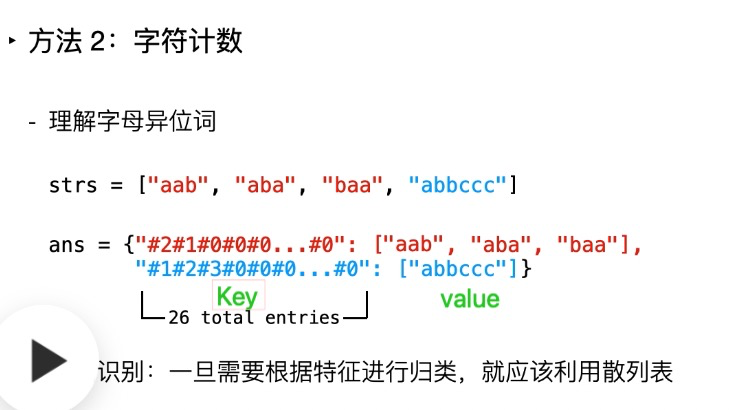

#### [242. 有效的字母异位词](https://leetcode.cn/problems/valid-anagram/)

```kotlin
    fun isAnagram(s: String, t: String): Boolean {
        val record = IntArray(26) // 存整数，就用整形数
        s.toCharArray().forEachIndexed { _, char ->
            record[char - 'a']++
        }

        t.toCharArray().forEachIndexed { _, char ->
            record[char - 'a']--
        }

        record.forEach {
            if (it != 0) {
                return false
            }
        }
        return true
    }
```


#### [383. 赎金信](https://leetcode.cn/problems/ransom-note/)

https://blog.csdn.net/c15158032319/article/details/78209740


```kotlin
    fun canConstruct(ransomNote: String, magazine: String): Boolean {
        val record = IntArray(26)
        magazine.toCharArray().forEach { char ->
            record[char - 'a'] += 1 // 这里可以优化下
        }
        ransomNote.toCharArray().forEach { char ->
            record[char - 'a'] -= 1		//同上
        }

        record.forEach {
            if (it < 0) { //就这里和242.有效的字母异位词 不一样，数量不够就<0
                return false
            }
        }
        return true
    }
```


//若 a = i++; 则等价于 a=i;i=i+1;
//而 a = ++i; 则等价于 i=i+1;a=i;
//a += 1 和   a = a + 1


```kotlin
    fun canConstruct(ransomNote: String, magazine: String): Boolean {
        val record = IntArray(26)
        magazine.toCharArray().forEach { char ->
            record[char - 'a'] ++ 
        }
        ransomNote.toCharArray().forEach { char ->
            record[char - 'a'] --
        }

        record.forEach {
            if (it < 0) { //就这里和242.有效的字母异位词 不一样，数量不够就<0
                return false
            }
        }
        return true
    }
```


#### [49. 字母异位词分组](https://leetcode.cn/problems/group-anagrams/)


用的官方题解

https://leetcode.cn/problems/group-anagrams/solution/zi-mu-yi-wei-ci-fen-zu-by-leetcode-solut-gyoc/


##### 题解一

```kotlin
fun groupAnagrams(strs: Array<String>): List<List<String>> {
    val ansMap = HashMap<String, ArrayList<String>>() // 相同异位词的key, 和所有异位词的数组
    strs.forEach { str ->
        val char = str.toCharArray() // String to char 进行排序，结果相同异位词key一致
        Arrays.sort(char)
        val key = String(char)
        if (!ansMap.containsKey(key)) { // map不存在，就创建新的ArrayList()
            ansMap[key] = ArrayList()
        }
        ansMap[key]?.add(str)          //拿到ArrayList(),添加元素

    }
    return ArrayList(ansMap.values)
}
```


##### 题解二

官方题解2 和题解一差不多，题解一进行排序的相同key,题解二用的散列计数，中间用#间隔作为 key.

其他的都类似，后面再写吧 。




复杂度分析

时间复杂度：O(nk \log k)O(nklogk)，其中 nn 是 \textit{strs}strs 中的字符串的数量，kk 是 \textit{strs}strs 中的字符串的的最大长度。需要遍历 nn 个字符串，对于每个字符串，需要 O(k \log k)O(klogk) 的时间进行排序以及 O(1)O(1) 的时间更新哈希表，因此总时间复杂度是 O(nk \log k)O(nklogk)。

空间复杂度：O(nk)O(nk)，其中 nn 是 \textit{strs}strs 中的字符串的数量，kk 是 \textit{strs}strs 中的字符串的的最大长度。需要用哈希表存储全部字符串。


#### [438. 找到字符串中所有字母异位词](https://leetcode.cn/problems/find-all-anagrams-in-a-string/)


https://leetcode.cn/problems/find-all-anagrams-in-a-string/solution/zhao-dao-zi-fu-chuan-zhong-suo-you-zi-mu-xzin/


##### 解法一


```kotlin
fun findAnagrams(s: String, p: String): List<Int> {
    val sLength = s.length
    val pLength = p.length
    if (sLength < pLength) { // 如果字符s的长度 小于p 直接返回
        return emptyList()
    }

    val ansList = arrayListOf<Int>()
    val sCount = IntArray(26)
    val pCount = IntArray(26)

    val sCharArray = s.toCharArray()
    val pCharArray = p.toCharArray()
    for (i in 0 until pLength) {      //初始情况， p s字符相同，看是否相等.
        sCount[sCharArray[i] - 'a']++          // 对于位置字符个数
        pCount[pCharArray[i] - 'a']++
    }
    if (sCount.contentEquals(pCount)) {         //比较初始数量
        ansList.add(0)
    }

    for (i in 0 until (sLength - pLength)) { // 从0开始，s的字符 左边-1 右边+1 字符，调整相应位置字符数量，
        sCount[sCharArray[i] - 'a']--
        sCount[sCharArray[i + pLength] - 'a']++
        if (sCount.contentEquals(pCount)) {
            ansList.add(i + 1)              //如果 i==0, 那么0位置字符去掉， p.length + 0 字符+1, 新的字符开始位置就是1了
        }
    }
    return ansList
}
```


##### 解法二

diff方式，感觉没太明白 , 而且感觉作用不大,后面可以试试


##### 解法三

这个滑动窗口，解法很高级，但是没明白

```kotlin
public List<Integer> findAnagrams(String s, String p) {
    int[] cnt = new int[128];
    for (char c : p.toCharArray()) cnt[c]++;
    int lo = 0, hi = 0;
    List<Integer> res = new ArrayList<>();
    // 该循环确保[lo, hi)的区间中的出现的字符总是p的一个子集
    // PS1: "na"是"and"的子集，而"nn"则不是"and"的子集
    // PS2: 除了评论中那个边际条件，前面已经有评论解释过了
    while (hi < s.length()) {
        char c = s.charAt(hi);
        if (cnt[c] > 0) {
            // 子集条件满足，右移增大窗口
            char c1 = s.charAt(hi++);
            cnt[c1]--;
            // 窗口长度 == p.len，且窗口内字符是p的子集
            // <=> (充要条件) s.substring(lo, hi)是p的同字母异序词
            if (hi - lo == p.length()){
                res.add(lo);
            }
        } else {
            // 再右移hi不可能满足子集条件，
            // 右移左边界lo、复位计数器，直到这个条件（子集条件）再次满足
            char c1 = s.charAt(lo++);
            cnt[c1]++;
        }
    }
    return res;
}
```


#### [349. 两个数组的交集](https://leetcode.cn/problems/intersection-of-two-arrays/)


计算两个数组的交集，直观的方法是遍历数组 nums1，对于其中的每个元素，遍历数组 nums2 判断该元素是否在数组 nums2 中，如果存在，则将该元素添加到返回值。假设数组 nums1 和 nums2 的长度分别是 mm 和 nn，则遍历数组 nums1 需要 O(m)O(m) 的时间，判断 nums1 中的每个元素是否在数组 nums2 中需要 O(n)O(n) 的时间，因此总时间复杂度是 O(mn)O(mn)。

如果使用哈希集合存储元素，则可以在 O(1)的时间内判断一个元素是否在集合中，从而降低时间复杂度。 if (set.contains(it))这句是o(1)?

首先使用两个集合分别存储两个数组中的元素，然后遍历较小的集合，判断其中的每个元素是否在另一个集合中，如果元素也在另一个集合中，则将该元素添加到返回值。该方法的时间复杂度可以降低到 O(m+n)


```kotlin
val set = hashSetOf<Int>()
nums1.forEach {
    set.add(it)
}
val anSet = hashSetOf<Int>()
nums2.forEach {
    if (set.contains(it)) { // hashmap是怎么hash表是怎么存储的，为什么这样时间复杂度低, 因为在hash表中存储
        anSet.add(it)
    }
}
return anSet.toIntArray()
```


https://programmercarl.com/0349.%E4%B8%A4%E4%B8%AA%E6%95%B0%E7%BB%84%E7%9A%84%E4%BA%A4%E9%9B%86.html#_349-%E4%B8%A4%E4%B8%AA%E6%95%B0%E7%BB%84%E7%9A%84%E4%BA%A4%E9%9B%86

https://leetcode.cn/problems/intersection-of-two-arrays/solution/liang-ge-shu-zu-de-jiao-ji-by-leetcode-solution/


#### [350. 两个数组的交集 II](https://leetcode.cn/problems/intersection-of-two-arrays-ii/)


##### 解法一

自己的思路


```kotlin
fun intersect(nums1: IntArray, nums2: IntArray): IntArray {
    val ansArray = arrayListOf<Int>()
    val map1 = hashMapOf<Int, Int>()
    nums1.forEach {
        map1[it] = (map1[it] ?: 0).plus(1) // key是 nums1 数组的值，value是个数
    }
    val map2 = hashMapOf<Int, Int>()
    nums2.forEach {
        map2[it] = (map2[it] ?: 0).plus(1) //key是 nums2 数组的值，value是个数
    }
    val map3 = hashMapOf<Int, Int>()
    val keySet2 = map2.keys
    map1.entries.forEach { entry ->
        if (keySet2.contains(entry.key)) {
            if (entry.value < map2[entry.key]!!) { // 存在相同的值，比较数组的个数
                map3[entry.key] = entry.value
            } else {
                map3[entry.key] = map2[entry.key]!!      //较小的放给新的map
            }
        }
    }
    map3.entries.forEach { entry ->
        for (i in 0 until entry.value) { // entry.value是map的个数，然后添加的list
            ansArray.add(entry.key)
        }
    }
    return ansArray.toIntArray()
}
```


##### 解法二


```kotlin
fun intersect1(nums1: IntArray, nums2: IntArray): IntArray {
    val ansArray = arrayListOf<Int>()
    val map = hashMapOf<Int, Int>()
    nums1.forEach {
        map[it] = (map[it] ?: 0).plus(1) // key是 nums1 数组的值，value是个数
    }
    nums2.forEach {
        if ((map[it] ?: 0) > 0) {   // 判断是否存在相同的元素
            ansArray.add(it)        // 添加
            map[it] = map[it]!!.minus(1) // 原来的元素-1
        } else {
            map.remove(it)
        }
    }
    return ansArray.toIntArray()
}
```


##### 解法三


```kotlin
fun intersect3(nums1: IntArray, nums2: IntArray): IntArray {
    Arrays.sort(nums1)
    Arrays.sort(nums2)
    val ansArray = arrayListOf<Int>()
    var index1 = 0
    var index2 = 0 // 排序后，设置两个指针，指向数组头节点

    while (index1 < nums1.size && index2 < nums2.size)
        if (nums1[index1] > nums2[index2]) { // 谁小，谁走
            index2++
        } else if (nums1[index1] < nums2[index2]) {
            index1++
        } else {                        //相等的情况，就添加到结果数组中
            ansArray.add(nums1[index1])
            index2++
            index1++
        }
    return ansArray.toIntArray()
}
```


还有进阶题目

https://leetcode.cn/problems/intersection-of-two-arrays-ii/solution/liang-ge-shu-zu-de-jiao-ji-ii-by-leetcode-solution/


#### [202. 快乐数](https://leetcode.cn/problems/happy-number/)

可以看作一个链表， 不是快乐数会形成环, 否则就是快乐数了


1. 最终会得到 11。
2. 最终会进入循环。
3. 值会越来越大，最后接近无穷大。

根据题解猜测，第3种情况不会发生

https://leetcode.cn/problems/happy-number/solution/kuai-le-shu-by-leetcode-solution/


##### Hash表解法

```kotlin
fun isHappy(n: Int): Boolean {
    val set = hashSetOf<Int>()
    var value = n
    while (!set.contains(value)) { // 没有环，就继续下一个
        if (value == 1) {
            return true
        }
        set.add(value)          // 把中间数加入hash表，为了判断是否有环的情况
        value = nextSquareSum(value)
    }
    return false
}

private fun nextSquareSum(n: Int): Int {
    var sum = 0
    var num = n
    while (num > 0) {
        val balance = num % 10 //每次都获取余数
        sum += balance * balance
        num = (num / 10)       // 拿到上一位，然后求余
    }
    return sum
}
```


##### 双指针解法

```kotlin

fun isHappy2(n: Int): Boolean {
    var slow = n
    var fast = n
    do {
        slow = nextSquareSum(slow) //每个数据可以看作一个node, 然后设置快慢节点
        fast = nextSquareSum(fast)
        fast = nextSquareSum(fast)
        if (slow == 1 || fast == 1) {
            return true
        }
    } while (slow != fast)

    return false
}
```


#### [1. 两数之和](https://leetcode.cn/problems/two-sum/)


##### 暴力解法

当我们使用遍历整个数组的方式寻找 target - x 时，需要注意到每一个位于 x 之前的元素都已经和 x 匹配过(这个一句一开始不理解，其实如果i = 6,  j = 5+1(1+1 , 2+1.. 4+1) 之前的都没匹配上，所以说x之前的都没匹配)，因此不需要再进行匹配。而每一个元素不能被使用两次，所以我们只需要在 x 后面的元素中寻找 target - x。


```java
 public int[] twoSum(int[] nums, int target) {
        int n = nums.length;
        for (int i = 0; i < n; ++i) {
            for (int j = i + 1; j < n; ++j) {
                if (nums[i] + nums[j] == target) {
                    return new int[]{i, j};
                }
            }
        }
        return new int[0];
    }

链接：https://leetcode.cn/problems/two-sum/solution/liang-shu-zhi-he-by-leetcode-solution/

```


##### Hash法

2, 7, 11, 15

```kotlin
    fun twoSum(nums: IntArray, target: Int): IntArray {
        val map = hashMapOf<Int, Int>()
        nums.forEachIndexed { index, value ->
            if (map.containsKey(target - nums[index])) {    //假如index = 0加入map,当index==2时, 9 - 7 = 2 就可以在map中找到，就匹配上了
                return intArrayOf(index, map[target - nums[index]]!!) //相当于另一个数先加入map，找对应的数
            }
            map[value] = index    
        }
        throw RuntimeException("do not have the array")
    }
```


#### [454. 四数相加 II](https://leetcode.cn/problems/4sum-ii/)

这题不是很明白

```kotlin
fun fourSumCount(nums1: IntArray, nums2: IntArray, nums3: IntArray, nums4: IntArray): Int {
    val map = hashMapOf<Int, Int>()
    nums1.forEach { n1 ->
        nums2.forEach { n2 ->
            map[n1 + n2] = map.getOrDefault(n1 + n2, 0) + 1
        }
    }

    var ans = 0
    nums3.forEach { n3 ->
        nums4.forEach { n4 ->
            if (map.containsKey(-n3 - n4)) { // 6, 12 , -7 , -11   4个数2 2相加 不管怎么组合，结果都一样
                ans += map[-n3 - n4] ?: 0  // 根据当前的key,区前面num1 num2找个数
            }
        }
    }
    return ans
}
```


#### [15. 三数之和](https://leetcode.cn/problems/3sum/)

i 位置为target = nuts[-i] , 剩下的left right就是 twosum的问题

##### 解法1

```
    fun threeSum(nums: IntArray): List<List<Int>> {
        Arrays.sort(nums)
        val hashSetOf = hashSetOf<List<Int>>()
        nums.forEachIndexed { i, value ->
            val target = -nums[i]
            var left = i + 1
            var right = nums.size - 1
            while (left < right) {
                if (nums[left] + nums[right] < target) {
                    left++
                } else if (nums[left] + nums[right] > target) {
                    right--
                } else {
                    val list = arrayListOf(nums[i], nums[left], nums[right])
                    hashSetOf.add(list)
                    right--  // 为了防止重复元素，所以这两个也需要移动
                    left++
                }
            }
        }
//        return hashSetOf.toList()
        return ArrayList(hashSetOf) // 这里时间复杂度是 o(n),第2种解法是对这里进行优化
    }
```


##### 解法2

优化后的第二种解法，竟然超出时间限制，刷第2遍再看看

```
//超出时间限制
fun threeSum2(nums: IntArray): List<List<Int>> {
    Arrays.sort(nums)
    val ans = ArrayList<List<Int>>()
    for (i in nums.indices) {
        if (i > 0 && nums[i] == nums[i - 1]) { // 相同的target元素直接pass
            continue
        }
        val target = -nums[i]
        var left = i + 1
        var right = nums.size - 1
        while (left < right) {
            if (nums[left] + nums[right] < target) {
                left++
            } else if (nums[left] + nums[right] > target) {
                right--
            } else {
                val list = arrayListOf(nums[i], nums[left], nums[right])
                ans.add(list)
                right--  // 为了防止重复元素，所以这两个也需要移动
                left++
                while (left < right && nums[left] == nums[left - 1]) continue // 这两句放在while循环外面 退出不了,拿到结果后， 相同的元素pass
                while (left < right && nums[right] == nums[right - 1]) continue
            }
        }
    }
    return ans
}
```
