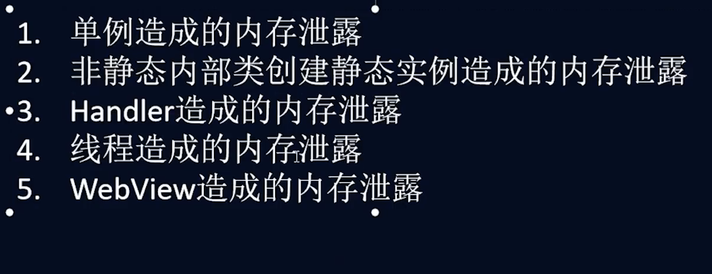
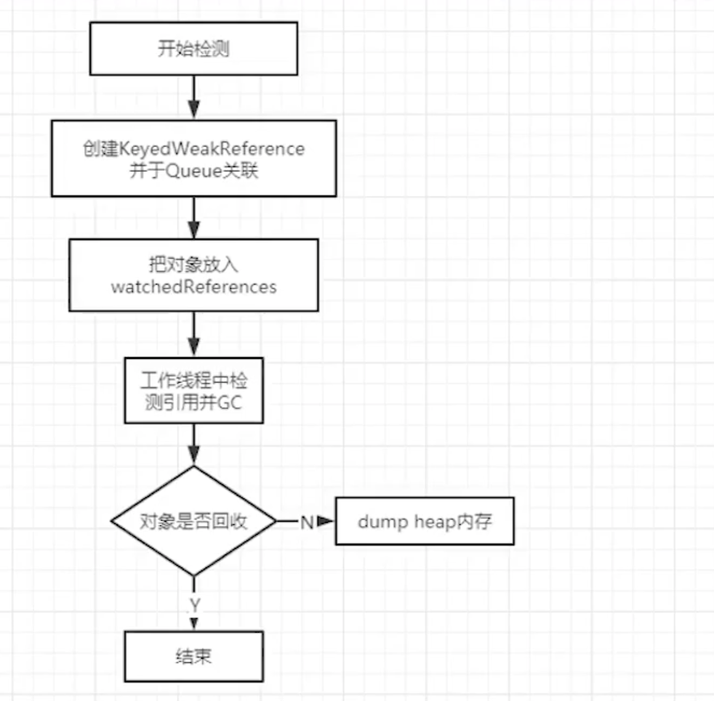
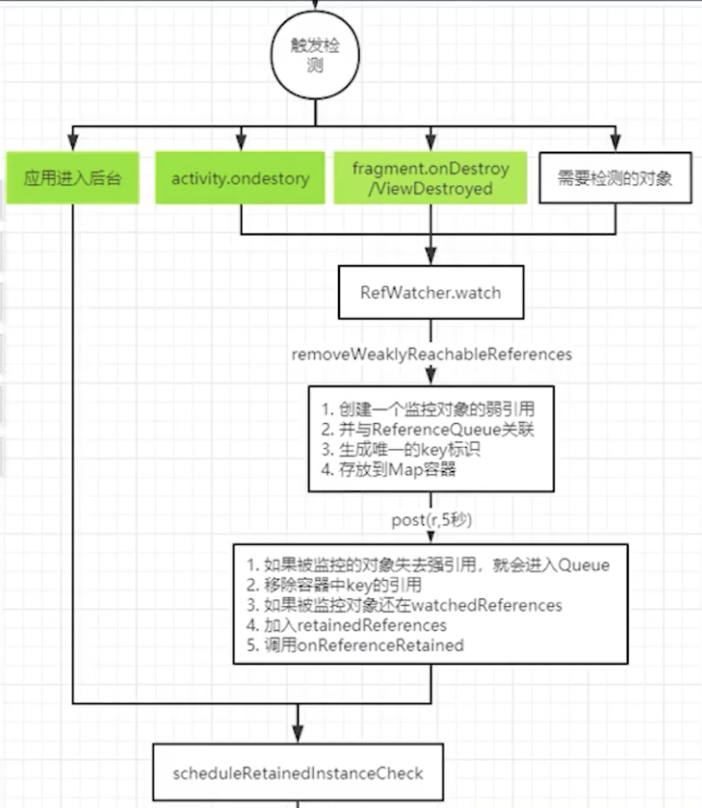
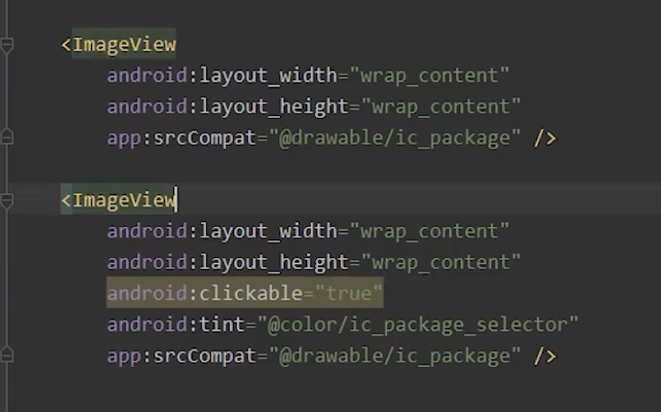

#### 内存泄漏




https://mp.weixin.qq.com/s/tO1yxFs2qNQlQ2bJ8vGzQA

https://www.jianshu.com/p/ac00e370f83d

[内存泄漏总结](https://github.com/francistao/LearningNotes/blob/master/Part1/Android/Android%E5%86%85%E5%AD%98%E6%B3%84%E6%BC%8F%E6%80%BB%E7%BB%93.md)

```
public class SampleActivity extends Activity {

  /**
   * Instances of static inner classes do not hold an implicit
   * reference to their outer class.
   */
  private static class MyHandler extends Handler {
    private final WeakReference<SampleActivity> mActivity;

    public MyHandler(SampleActivity activity) {
      mActivity = new WeakReference<SampleActivity>(activity);
    }

    @Override
    public void handleMessage(Message msg) {
      SampleActivity activity = mActivity.get();
      if (activity != null) {
        // ...
      }
    }
  }

  private final MyHandler mHandler = new MyHandler(this);

  /**
   * Instances of anonymous classes do not hold an implicit
   * reference to their outer class when they are "static".
   */
  private static final Runnable sRunnable = new Runnable() {
      @Override
      public void run() { /* ... */ }
  };

  @Override
  protected void onCreate(Bundle savedInstanceState) {
    super.onCreate(savedInstanceState);

    // Post a message and delay its execution for 10 minutes.
    mHandler.postDelayed(sRunnable, 1000 * 60 * 10);
    
    // Go back to the previous Activity.
    finish();
  }
}
```

* kotin Fragment方式

  ```
    class MyHandler : Handler {
          private var mFragment: WeakReference<Any>
  
          constructor(fragment: Fragment) {
              mFragment = WeakReference(fragment)
          }
  
          override fun handleMessage(msg: android.os.Message?) {
              super.handleMessage(msg)
              val fragment = mFragment.get() as PayProFragment
              fragment.reloadPay()
          }
      }
  ```

  

* [内存泄漏处理-Handler](https://www.jianshu.com/p/63aead89f3b9)

* [查找方式](https://juejin.im/entry/589542ed2f301e0069054007)

  https://www.jianshu.com/p/bdfd2a6b2681

​    https://developer.android.com/studio/profile/memory-profiler


#### leakcanary

https://square.github.io/leakcanary/recipes/

https://juejin.im/post/5d617d6851882575e8054fab








#### 内存抖动

Profiler


https://www.bilibili.com/video/BV1oz4y1m7Gw?p=14


#### App瘦身

1. 大图转成 webapp

2. svg批量转换

   设置` vectorDrawables.useSupportLibrary = true`  然后 `app:srcCompat = ` 否则会在每个drawable生成一个png图片，达不到效果了。

   tink修改图片颜色

   

3. 国际化

   ```groovy
   android{
   	defaultConfig{
   		 resConfigs 'en'  //只适配英语
   	}
   }
   ```

    这样只会保存 语言的映射

4. so库

    一般像微信用Armeabi-v7a

   虚拟机运行 还需要 x86

5. 删除无用资源

   ```groovy
   debug{
     minifyEnabled true // 删除无用代码
     shrinkResource true //删除资源文件 minifyEnabled 为true,删除了无用代码，这个才知道删除哪些资源。
     
   }
   ```

   

