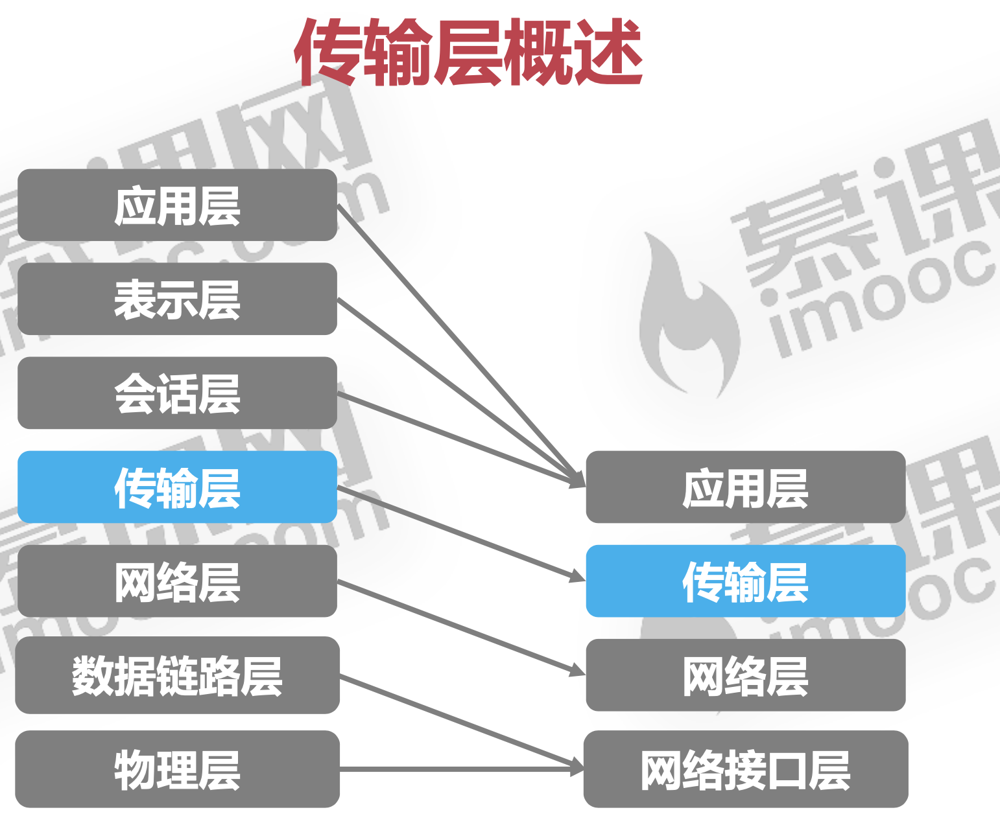

iso7层模型

4层模型

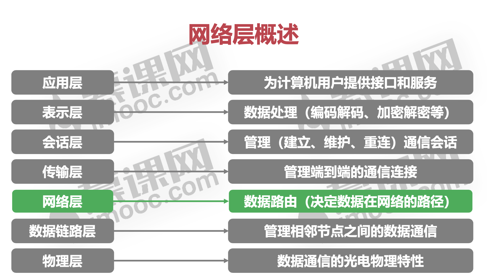

 网络协议分为 四层，从底到上

#### 物理层: 铜线介质类

1. 数据链路层  ： 相邻两台机器间的连接，把数据报以帧的形式发送, 以太网协议

     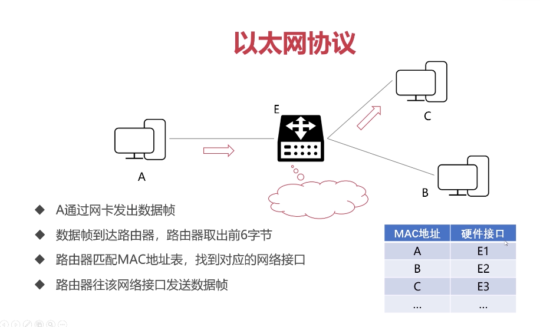

     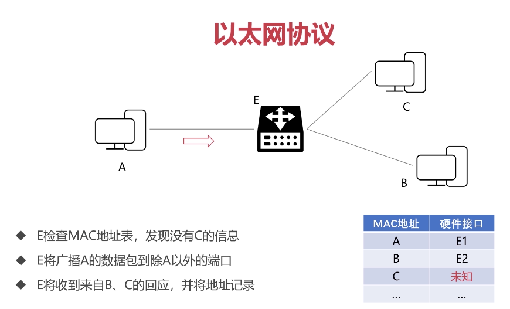

#### 网络层 ： 通过ISP、路由 找到 ,运行在路由器上 rip协议:不太理解

#### 传输层  (TCP UDP) 

代码运行在用户机器上，为了对 网络层进行更好的控制 UDP(User Datagram Protocol)

1. 面向报文传输
   
2. 没有拥塞控制,无法保证数据在网络中是否丢失

3. UDP首部开销小

   ​     

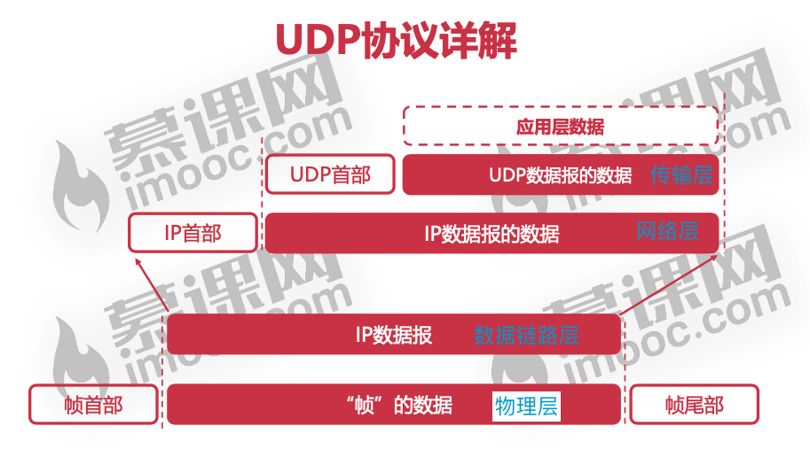

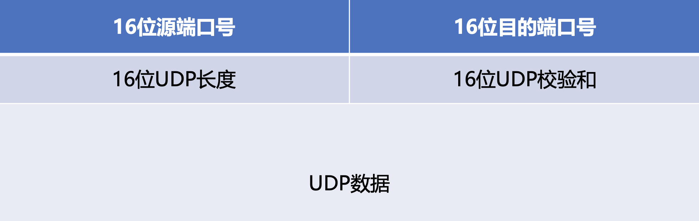

  TCP (Transmission Control Protocol)

1.  面向连接的协议
2. 提供可靠传输
3. 全双工通信
4. 面向字节流协议: 可能对用户数据合并或分拆进行传输

 	 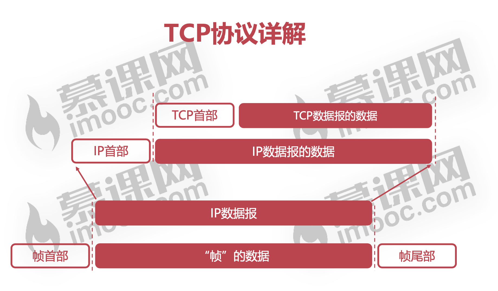

TCP首部 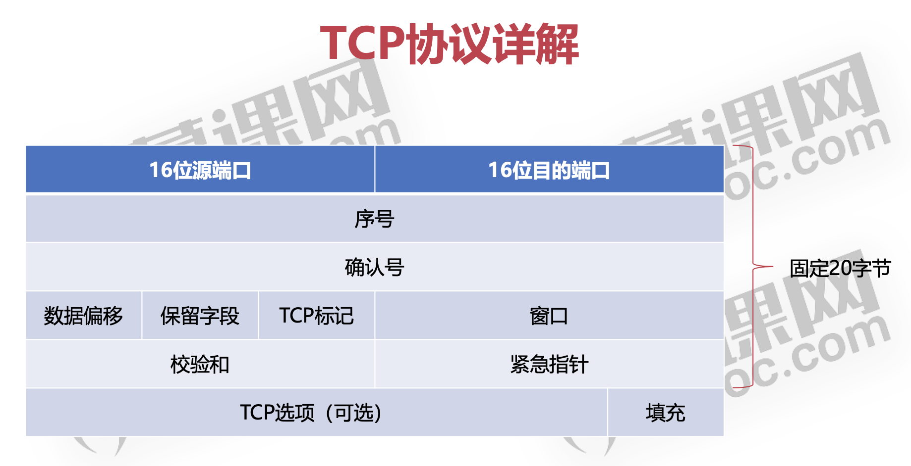

 序号

 tcp标记

##### 如何保证TCP可靠传输?

* 停止等待协议

* 连续ARQ协议(Automatic Repeat request) :

  ​		滑动窗口: 以字节为单位，实现流量控制 累计确认

  ​		选择重传: 重传边界和范围

* 定时器

  超时定时器

  坚持定时器: 解决死锁局面,当收到窗口为0的消息，则启动坚持定时器,每隔一段时间发送一个窗口探测报文

  TCP协议的拥塞控制

   报文超时即认为拥塞

    慢启动算法

     由小到大逐渐增加发送数据量,直到到达 “慢启动阈值”=>开始 拥塞避免算法

   拥塞避免算法

     只要网络不拥塞，就试探拥塞窗口调大

#####  TCP三次握手	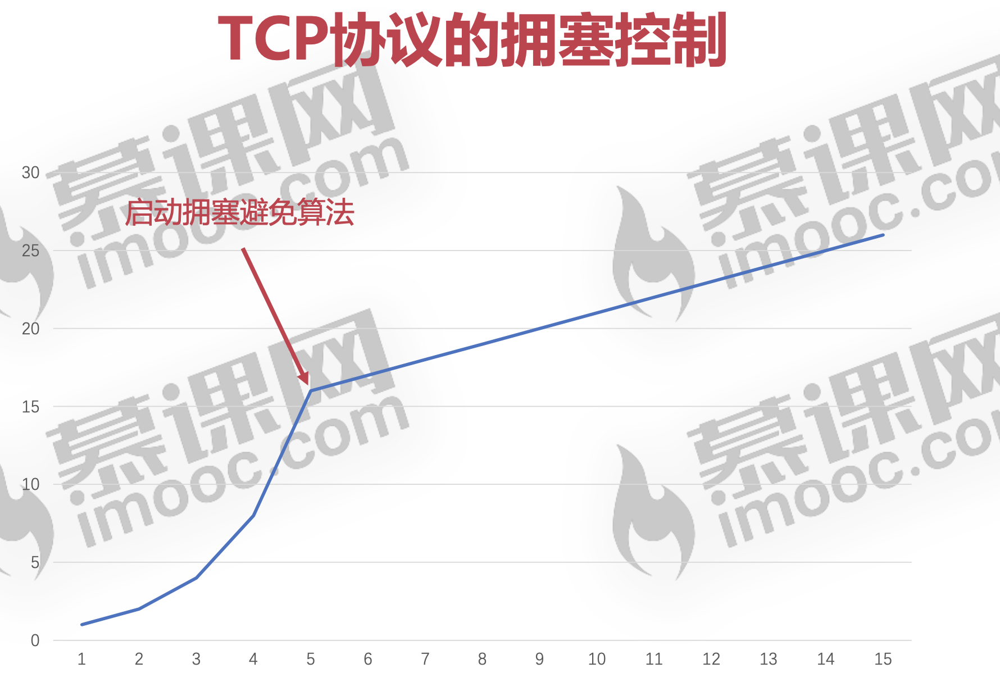

 TCP标记

 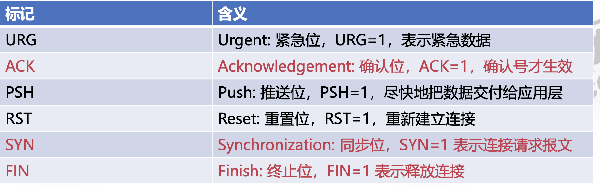

三次握手 

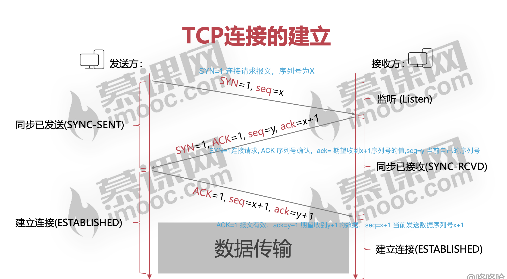  **为什么要第三次握手?**

只有两次握手的话，一旦第二次握手接收超时，重新发送后就会重新发送，会导致建立2个连接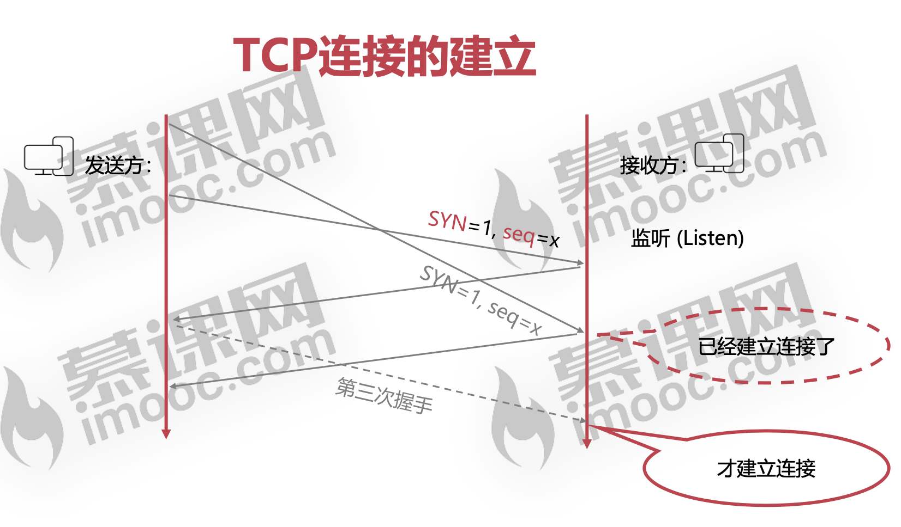

#####  TCP连接的4次挥手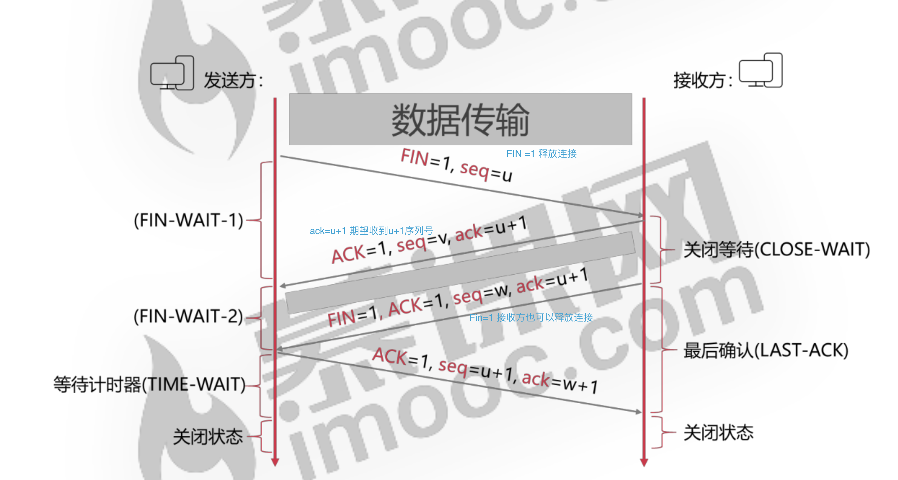

* 等待计时器 : 2MSL(Max Segment liftime),

*  **为什么需要等待计时器?**： 如果第4个挥手报文接收方没收到，那么接收方会重新发送第3次的挥手报文

* **为什么第3次挥手是接收方发出的?** :  我的理解是，第2次挥手是确认收到的回复，第三次是挥手是确认数据发送完毕，告诉发送方可以断开了,然而我又有了疑问?

* 为什么需要第4次挥手?

  

#### 应用层

##### protocol

URI

> ftp://ftp.is.co.za/rfc/rfc1808.txt http://www.ietf.org/rfc/rfc2396.txt 
>
> ldap://[2001:db8::7]/c=GB?objectClass?one mailto:John.Doe@example.com 
>
> news:comp.infosystems.www.servers.unix 
>
> tel:+1-816-555-1212
>
> telnet://192.0.2.16:80/ urn:oasis:names:specification:docbook:dtd:xml:4.1.2

##### Http(HyperText Transfer Protocol) 可靠的数据传输协议，基于TCP

1. History

   https://hpbn.co/brief-history-of-http/

   https://www.w3.org/Protocols/History.html

   https://developer.mozilla.org/en-US/docs/Web/HTTP/Basics_of_HTTP/Evolution_of_HTTP

DNS

##### http1.1 http2 diffrence

 复用连接有什么区别 https://juejin.cn/post/6844903489596833800

[HTTP1.1](https://tools.ietf.org/html/rfc7230#section-6)

[HTTP2](https://tools.ietf.org/html/rfc7540)	

ssl tls https://www.ruanyifeng.com/blog/2014/02/ssl_tls.html