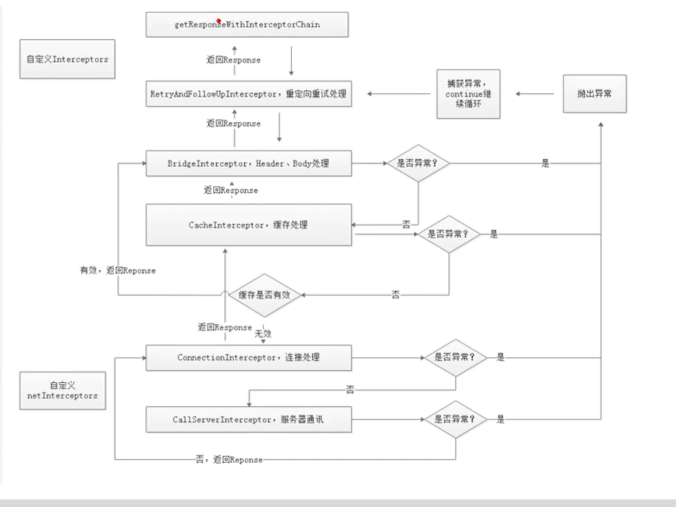

Okhttp使用线程池无 核心级线程，不应该先把阻塞队列塞满，再执行非核心级线程吗，这样任何不应该会立即执行呀？？？
阻塞队列用了synchrnized 会添加失败。所以直接创建非核心线程。

# 如何阅读开源项目

https://www.codedump.info/post/20200605-how-to-read-code-v2020/

## 编译通过

开始阅读一份项目源码的第一步，是先让这个项目能够通过你自己编译通过并且顺利跑起来。这一点尤其重要。

## 设计文档

阅读源码之前，查看该项目是否提供架构和设计文档，阅读这些文档可以了解该项目的大体设计和结构，

## 区分主线和支线剧情

了解Nginx核心的基础流程以及数据结构。
了解Nginx如何实现一个模块。

## 画图

画图，理清主干后，可以将整个流程画成流程图或者是标准的UML图，帮助记忆以及下一步的阅读。

## fork

 尽量避免大段的贴代码。我认为在这类文章中，大段贴上代码有点自欺欺人：就是看上去自己懂了，其实并不见得。如果真要解释某段代码，可以使用伪代码或者缩减代码的方式。记住：不要自欺欺人，要真的懂了。如果真的想在代码上加上自己的注释，我有一个建议是fork出来一份该项目某个版本的代码，提交到自己的github上，上面随时可以加上自己的注释并且保存提交。比如我自己注释的etcd 3.1.10代码：etcd-3.1.10-codedump，类似的我阅读的其他项目都会在github上fork出一个带上codedump后缀的项目。

## 枝叶代码

以兴趣为主，挑选感兴趣的“枝叶”代码去阅读。

## 输出

输出的手段有很多，在阅读代码时，比较建议的是自己能够多问自己一些问题，比如

* 为什么选择这个数据结构来描述这个问题？类似的场景下，其他项目是怎么设计的？都有哪些数据结构做这样的事情？
* 如果由我来设计这样的项目，我会怎么做？
  等等等等。越是主动积极的思考，就越有更好的输出，输出质量与学习质量成正比关系。

https://time.geekbang.org/column/article/186778
https://www.imooc.com/article/301778
https://www.jianshu.com/p/656dbb97a40f

不管写的怎么样，先把东西弄出来，然后参考别人的写法，做对比

#### Okhttp优势

https://square.github.io/okhttp/

OkHttp is an HTTP client that’s efficient by default:

- HTTP/2 support allows all requests to the same host to share a socket.
- Connection pooling reduces request latency (if HTTP/2 isn’t available).
- Transparent GZIP shrinks download sizes.
- Response caching avoids the network completely for repeat requests.

#### 任务运行图


##### 面试题

[*okhttp* 是如何支持 Http2 的？](https://mp.weixin.qq.com/s/TeQhe4T4wRjdAEPz6Ne45g)

Handshake则会把服务端支持的Tls版本，加密方式等都带回来，然后会把这个没有验证过的HandShake用X509Certificate去验证证书的有效性。然后会通过Platform去从SSLSocket去获取ALPN的协议支持信息，当后端支持的协议内包含Http2.0时，则就会把请求升级到Http2.0阶段。

[Okhttp连接池是咋实现的?](https://juejin.cn/post/6898145227765186567)

在连接池中找连接的时候会对比连接池中相同host的连接。

如果在连接池中找不到连接的话，会创建连接，创建完后会存储到连接池中。

在把连接放入连接池中时，会把清除操作的任务放入到线程池中执行，删除任务中会判断当前连接有没有在使用中，有没有正在使用通过RealConnection的transmitters集合的size是否为0来判断，如果不在使用中，找出空闲时间最长的连接，如果空闲时间最长的连接超过了keep-alive默认的5分钟或者空闲的连接数超过了最大的keep-alive连接数5个的话，会把存活时间最长的连接从连接池中删除。保证keep-alive的最大空闲时间和最大的连接数

* [雨露均沾的OkHttp—WebSocket长连接（使用篇）](https://juejin.im/post/5f0452615188252e5522b747) 

* [*OKHTTP*之缓存配置详解](http://mp.weixin.qq.com/s?__biz=MzA5MzI3NjE2MA==&mid=2650237860&idx=1&sn=d66e75f6f7752ededdcaa3ce780862d3&chksm=88639acbbf1413dd170ba41a67035c62811b489cfc7a405977ae23254205a6b3acb99358b1f2&scene=38#wechat_redirect)

* OkHttp对于网络请求都有哪些优化

* OkHttp框架中都用到了哪些设计模式
  
  https://www.codetd.com/article/4354895
  https://www.jianshu.com/p/d85e556b8da6
  https://www.cnblogs.com/jimuzz/p/13935677.html

# Interview Questions

汇总 https://www.jianshu.com/p/dfdfd45b076e

### okhttp的请求原理

  OkHttp的内部实现通过一个责任链模式完成，将网络请求的各个阶段封装到各个链条中，实现了各层的解耦。

### OkHttp里面用到了什么设计模式？

  构造者模式 : OkHttpClient ,Request,CacheControl
  外观模式   :  OkHttp使用了外观模式,将整个系统的复杂性给隐藏起来，将子系统接口通过一个客户端 OkHttpClient 统一暴露出来
  责任链模式 :  OKHttp 的核心就是责任链模式，通过5个默认拦截器构成的责任链完成请求的配置 .
  工厂模式 : （在 Call 接口中，有一个内部工厂 Factory 接口）,只有一个实现RealCall， 而且这个RealCall在okhttp 代码中深度耦合，感觉这个工厂没什么用。

  享元模式 : Dispatcher 的线程池中，不限量的线程池实现了对象复用,这个只是线程池的特性,线程池对线程的操作，没有什么代码的问题.
  策略模式 : CacheInterceptor ,在响应数据的选择中使用了策略模式，选择缓存数据还是选择网络访问。


* Http1 Http2是怎么切换的
* okhttp如何处理网络缓存的
* OkHttp怎么实现连接池
* okhttp线程使用方式


根据线程池执行流程：


问题
OkHttpThreadPool.java

```
ThreadPoolExecutor executor = new ThreadPoolExecutor(
        0, Integer.MAX_VALUE, 60, TimeUnit.SECONDS, new LinkedBlockingDeque<>());
executor.execute(() -> {
    System.out.println("任务1");
    System.out.println(Thread.currentThread());
    while (true) {
    }
});

executor.execute(() -> {
    System.out.println("任务1");
    System.out.println(Thread.currentThread());
});

executor.execute(() -> {
    System.out.println("任务1");
    System.out.println(Thread.currentThread());
});
```

运行结果:

任务1
Thread[pool-1-thread-1,5,main]

如果 new LinkedBlockingDeque<>(1)能正常执行，因为LinkedBlockingDeque加入 任务1 就满了，后面的任务创建非核心线程

但是有点疑惑，我这里核心线程是0，任务都加入到LinkedBlockingDeque, 按照线程池流程，非核心就不应该创建呀？怎么任务1就执行了呢

https://www.bilibili.com/video/BV15y4y1B7Rw?p=5

https://mp.weixin.qq.com/s/BHDrSgwUVXkzvswK1khidQ

https://github.com/Snailclimb/programmer-advancement

https://juejin.im/post/6855586076132655118

https://mp.weixin.qq.com/s?__biz=Mzg2OTA0Njk0OA==&mid=2247485441&idx=1&sn=303a25ab02fa9f14a319923e6b0d9759&chksm=cea247caf9d5cedc3a5e1d31f26c08d8ae4c11c349fbdc91ac1d90d8b35807517accb5f5d527&token=2128752750&lang=zh_CN#rd

 okhttp怎么支持http2.0
​ Handshake则会把服务端支持的Tls版本，加密方式等都带回来，然后会把这个没有验证过的HandShake用X509Certificate去验证证书的有效性。然后会通过Platform去从SSLSocket去获取ALPN的协议支持信息，当后端支持的协议内包含Http2.0时，则就会把请求升级到Http2.0阶段。

​ 配置合适的适配器，解析json数据。

​ Android 如何编写基于编译时注解的项目

​ 编译时注解与运行时注解，为什么retrofit要使用运行时注解？什么时候用运行时注解？

​ 在项目中有直接使用tcp,socket来发送消息吗

​ https://www.bilibili.com/video/BV1ib4y1f7S1


网络请求缓存处理，okhttp如何处理网络缓存的
自己去设计网络请求框架，怎么做？

 glide和OkHttp的任务调度是怎么实现的（比如同时发起很多请求）
 4.问第三方库如okhttp、picasso等底层原理如缓存机制等（一个也没答上来，literally

13.Retrofit中的Call对象如何转换成okhttp的call对象(这个题目是埋坑的)


# 分析

一开始看了网上视频，就说Okhttp是自驱动循环调用，相对于AsyncTask的优势就是 并发执行，但是这两条不就矛盾了吗，既然环形链式调用，怎么能并发呢。就从源码中找答案。
看了bi站的视频，超过5个在队列中的请求，应该是做完一个请求,继续从队列中取。

## Dispatcher 最大请求数量

runningAsyncCalls 运行时的最大请求数量64,只有多个不同的host请求才能可能让走到下面代码.因为还有  if (asyncCall.callsPerHost.get() >= this.maxRequestsPerHost)这个条件限制.

```
 if (runningAsyncCalls.size >= this.maxRequests){
          println("promoteAndExecute >= maxRequests" )
          break
        }
```

Okhttp 异步请求维护的两个队列


Dispatcher.java

```java

  /** Ready async calls in the order they'll be run. */
  private val readyAsyncCalls = ArrayDeque<AsyncCall>()

  /** Running asynchronous calls. Includes canceled calls that haven't finished yet. */
  private val runningAsyncCalls = ArrayDeque<AsyncCall>()


private int maxRequests = 64;
private int maxRequestsPerHost = 5;
synchronized void enqueue(AsyncCall call) {
    if (runningAsyncCalls.size() < maxRequests && runningCallsForHost(call) < maxRequestsPerHost) {
      runningAsyncCalls.add(call);
      executorService().execute(call);
    } else {
      readyAsyncCalls.add(call);
    }
}

可以看到提交任务 >5时，才会被添加到readyAsyncCalls队列中。<5的任务直接提交。


  private void promoteCalls() {
    if (runningAsyncCalls.size() >= maxRequests) return; // Already running max capacity.
    if (readyAsyncCalls.isEmpty()) return; // No ready calls to promote.

    for (Iterator<AsyncCall> i = readyAsyncCalls.iterator(); i.hasNext(); ) {
      AsyncCall call = i.next();

      if (runningCallsForHost(call) < maxRequestsPerHost) {
        i.remove();
        runningAsyncCalls.add(call);
        Log.i("Dispatcher", "promoteCalls:  准备队列 "+call.request().tag+" 执行");
        executorService().execute(call);
      }

      if (runningAsyncCalls.size() >= maxRequests) return; // Reached max capacity.
    }
  }


readyAsyncCalls不为空，然后取出一条，再执行，可以看到，默认情况下会有5条环形任务链。

```

if (asyncCall.callsPerHost.get() >= this.maxRequestsPerHost) 这个条件时如何判断的呢?
主要是下面的方法,默认forWebSocket==true,走到条件里.如果AsyncCall已经存在队列中,那么就直接返回，把callsPerHost数值叠加.从而实现，上面的条件判断.

```
      // Mutate the AsyncCall so that it shares the AtomicInteger of an existing running call to
      // the same host.
      if (!call.call.forWebSocket) {
        val existingCall = findExistingCallWithHost(call.host)
        if (existingCall != null) call.reuseCallsPerHostFrom(existingCall)
      }

    fun reuseCallsPerHostFrom(other: AsyncCall) {
      this.callsPerHost = other.callsPerHost
    }
```

https://juejin.cn/post/6873476209737629709/


# CacheInterceptor 缓存策略

https://www.cnblogs.com/giagor/p/15706508.html

http://mushuichuan.com/2016/03/01/okhttpcache/

https://www.mocklab.io/blog/which-java-http-client-should-i-use-in-2020/

https://www.bilibili.com/video/BV12Q4y1d7uD?p=7&spm_id_from=pageDriver


遗留的问题，sprintboot弄好后，mock服务端的head请求，再验证CacheInterceptor 策略。


Okhttp缓存

 1、添加cache 路径
 2、初始化OkhttpClient

```java
  public class NewCacheInterceptor implements Interceptor {

       @Override
       public Response intercept(Chain chain) throws IOException {
           Request request = chain.request();
           Response response = chain.proceed(request);
           Response response1 = response.newBuilder()
                   .removeHeader("Pragma")
                   .removeHeader("Cache-Control")
                   .header("Cache-Control", "max-age=" + 3600 * 24 * 30)
                   .build();

           return response1;
       }
   }
```


#### 拦截器



OkHttp的拦截器有：

- RetryAndFollowUpInterceptor：失败和重定向拦截器；
- BridgeInterceptor：负责将http协议必备的请求头加入其中(host),并添加一些默认的行为(gzip),获得结果后，调用cookie接口并解析GZIP数据。
- CacheInterceptor：缓存处理相关的拦截器；
- ConnectInterceptor： 负责找到或者新建一个连接，并获取对应的socket流；在获得结果后不进行额外的处理。
- CallServerInterceptor：进行真正的与服务器的通信，向服务器请求和读响应的拦截器；

# okio

1.简介；
1.sink：自己–》别人
2.source：别人–》自己
3.BufferSink：有缓存区域的sink
4.BufferSource：有缓存区域的source
5.Buffer：实现了3、4的缓存区域，内部有Segment的双向链表，在在转移数据的时候，只需要将指针转移指向就行
2.比java io的好处：
1.减少内存申请和数据拷贝
2.类少，功能齐全，开发效率高
3.内部实现：
1.Buffer的Segment双向链表，减少数据拷贝
2.Segment的内部byte数组的共享，减少数据拷贝
3.SegmentPool的共享和回收Segment
4.sink和source中被实际操作的其实是Buffer，Buffer可以充当sink和source
5.最终okio只是对java io的封装，所有操作都是基于java io 的
写在最后:能看到这里的人,我挺佩服你的.这篇文章是我在头条面试之前整理的,最后**80%**的题目都命中了,所以祝你好运.

不贩卖焦虑，也不标题党。分享一些这个世界上有意思的事情。题材包括且不限于：科幻、科学、科技、互联网、程序员、计算机编程。下面是我的微信公众号：世界上有意思的事，干货多多等你来看。

作者：何时夕
链接：https://www.jianshu.com/p/cf5092fa2694
来源：简书
著作权归作者所有。商业转载请联系作者获得授权，非商业转载请注明出处。

# HTTP

从网络加载一个10M的图片，说下注意事项
TCP的3次握手和四次挥手
TCP与UDP的区别
TCP与UDP的应用
HTTP协议
HTTP1.0与2.0的区别
HTTP报文结构
HTTP与HTTPS的区别以及如何实现安全性
如何验证证书的合法性?
https中哪里用了对称加密，哪里用了非对称加密，对加密算法（如RSA）等是否有了解?
client如何确定自己发送的消息被server收到?
谈谈你对安卓签名的理解。
请解释安卓为啥要加签名机制?
视频加密传输
App 是如何沙箱化，为什么要这么做？
权限管理系统（底层的权限是如何进行 grant 的）？


# Request Type

如果要抓包，需要设置Okhttp证书
```
 fun disableCertificateVerification(): OkHttpClient {
    val trustAllCerts = arrayOf<TrustManager>(object : X509TrustManager {
      override fun checkClientTrusted(
        chain: Array<out java.security.cert.X509Certificate>?,
        authType: String?,
      ) {
      }

      override fun checkServerTrusted(
        chain: Array<out java.security.cert.X509Certificate>?,
        authType: String?,
      ) {
      }

      override fun getAcceptedIssuers(): Array<java.security.cert.X509Certificate> {
        return arrayOf()
      }
    })

    val sslContext = SSLContext.getInstance("TLS")
    sslContext.init(null, trustAllCerts, java.security.SecureRandom())

    val sslSocketFactory = sslContext.socketFactory
    val trustAllHostnames = HostnameVerifier { _, _ -> true }

    return OkHttpClient.Builder()
      .sslSocketFactory(sslSocketFactory, trustAllCerts[0] as X509TrustManager)
      .hostnameVerifier(trustAllHostnames)
      .build()
  }

```

## Post

https://jsonplaceholder.typicode.com/posts

request
```
:method: POST
:path: /posts
:authority: jsonplaceholder.typicode.com
:scheme: https
content-type: application/x-www-form-urlencoded
content-length: 42
accept-encoding: gzip
user-agent: okhttp/5.0.0-SNAPSHOT

userId=1&title=article+2&body=body+article
```
response 
```
:status: 201
date: Wed, 17 Apr 2024 06:45:30 GMT
content-type: application/json; charset=utf-8
content-length: 82
location: https://jsonplaceholder.typicode.com/posts/101
report-to: {"group":"heroku-nel","max_age":3600,"endpoints":[{"url":"https://nel.heroku.com/reports?ts=1713336330&sid=e11707d5-02a7-43ef-b45e-2cf4d2036f7d&s=Hua%2F7slOIpUhGTDPNaKu4xbP%2Bjuwplp9ehOh7C014ok%3D"}]}
reporting-endpoints: heroku-nel=https://nel.heroku.com/reports?ts=1713336330&sid=e11707d5-02a7-43ef-b45e-2cf4d2036f7d&s=Hua%2F7slOIpUhGTDPNaKu4xbP%2Bjuwplp9ehOh7C014ok%3D
nel: {"report_to":"heroku-nel","max_age":3600,"success_fraction":0.005,"failure_fraction":0.05,"response_headers":["Via"]}
x-powered-by: Express
x-ratelimit-limit: 1000
x-ratelimit-remaining: 999
x-ratelimit-reset: 1713336348
vary: Origin, X-HTTP-Method-Override, Accept-Encoding
access-control-allow-credentials: true
cache-control: no-cache
pragma: no-cache
expires: -1
access-control-expose-headers: Location
x-content-type-options: nosniff
etag: W/"52-HKy3Gu5DcI5r2jj3f8TQwnYvlDs"
via: 1.1 vegur
cf-cache-status: DYNAMIC
server: cloudflare
cf-ray: 875a73ddee780484-HKG
alt-svc: h3=":443"; ma=86400

{
  "userId": "1",
  "title": "article 2",
  "body": "body article",
  "id": 101
}
```

## GET

https://api.github.com/repos/square/okhttp/contributors

Request
```
:method: GET
:path: /repos/square/okhttp/contributors
:authority: api.github.com
:scheme: https
accept-encoding: gzip
user-agent: okhttp/5.0.0-SNAPSHOT
```

Response
```
:status: 200
server: GitHub.com
date: Wed, 17 Apr 2024 06:58:41 GMT
content-type: application/json; charset=utf-8
cache-control: public, max-age=60, s-maxage=60
vary: Accept, Accept-Encoding, Accept, X-Requested-With
etag: W/"699b092aa0b0980f1b2f2bde5e810a75c5c1921ee2f53c4d9f28fc8ea5fca327"
last-modified: Wed, 17 Apr 2024 02:18:24 GMT
x-github-media-type: github.v3; format=json
link: <https://api.github.com/repositories/5152285/contributors?page=2>; rel="next", <https://api.github.com/repositories/5152285/contributors?page=9>; rel="last"
x-github-api-version-selected: 2022-11-28
access-control-expose-headers: ETag, Link, Location, Retry-After, X-GitHub-OTP, X-RateLimit-Limit, X-RateLimit-Remaining, X-RateLimit-Used, X-RateLimit-Resource, X-RateLimit-Reset, X-OAuth-Scopes, X-Accepted-OAuth-Scopes, X-Poll-Interval, X-GitHub-Media-Type, X-GitHub-SSO, X-GitHub-Request-Id, Deprecation, Sunset
access-control-allow-origin: *
strict-transport-security: max-age=31536000; includeSubdomains; preload
x-frame-options: deny
x-content-type-options: nosniff
x-xss-protection: 0
referrer-policy: origin-when-cross-origin, strict-origin-when-cross-origin
content-security-policy: default-src 'none'
content-encoding: gzip
x-ratelimit-limit: 60
x-ratelimit-remaining: 55
x-ratelimit-reset: 1713337679
x-ratelimit-resource: core
x-ratelimit-used: 5
accept-ranges: bytes
x-github-request-id: 200C:21C6BE:267A047:2720F58:661F7320

[{"login":"swankjesse","id":133019,"node_id":"MDQ6VXNlcjEzMzAxOQ==","avatar_url":"https://avatars.githubusercontent.com/u/133019?v=4","gravatar_id":"","url":"https://api.github.com/users/swankjesse","html_url":"https://github.com/swankjesse","followers_url":"https://api.github.com/users/swankjesse/followers","following_url":"https://api.github.com/users/swankjesse/following{/other_user}","gists_url":"https://api.github.com/users/swankjesse/gists{/gist_id}","starred_url":"https://api.github.com/users/swankjesse/starred{/owner}{/repo}","subscriptions_url":"https://api.github.com/users/swankjesse/subscriptions","organizations_url":"https://api.github.com/users/swankjesse/orgs","repos_url":"https://api.github.com/users/swankjesse/repos","events_url":"https://api.github.com/users/swankjesse/events{/privacy}","received_events_url":"https://api.github.com/users/swankjesse/received_events","type":"User","site_admin":false,"contributions":2768},{"login":"JakeWharton","id":66577,"node_id":"MDQ6VXNlcjY2NTc3","avatar_url":"https://avatars.githubusercontent.com/u/66577?v=4","gravatar_id":"","url":"https://api.github.com/users/JakeWharton"...
```


# Request
## RequestBody 
The RequestBody is a basic request for OkHttp. It also provides FormBody and MultipartBody to construct the request body.

```
  RequestBody body = RequestBody.create(json, JSON);
  Request request = new Request.Builder()
      .url(url)
      .post(body)
      .build();
```


