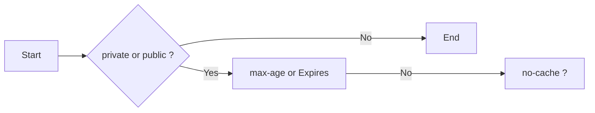

## Okhttp优势

[https://square.github.io/okhttp/](https://square.github.io/okhttp/)

OkHttp is an HTTP client that’s efficient by default:

- HTTP/2 support allows all requests to the same host to share a socket.
- Connection pooling reduces request latency (if HTTP/2 isn’t available).
- Transparent GZIP shrinks download sizes.
- Response caching avoids the network completely for repeat requests.


okhttp的请求原理

OkHttp的内部实现通过一个责任链模式完成，将网络请求的各个阶段封装到各个链条中，实现了各层的解耦。

## OKHttp请求整体流程介绍

整个网络请求过程大致如上所示

1. 通过建造者模式构建 OKHttpClient 与 Request
2. OKHttpClient 通过 newCall 发起一个新的请求
3. 通过分发器维护请求队列与线程池，完成请求调配
4. 通过五大默认拦截器完成请求重试，缓存处理，建立连接等一系列操作得到网络请求结果


## OKHttp分发器是怎样工作的

分发器的主要作用是维护请求队列与线程池,比如我们有100个异步请求，肯定不能把它们同时请求，而是应该把它们排队分个类，分为正在请求中的列表和正在等待的列表， 等请求完成后，即可从等待中的列表中取出等待的请求，从而完成所有的请求

而这里同步请求各异步请求又略有不同

#### 同步请求

```java
synchronized void executed(RealCall call) {  
   runningSyncCalls.add(call);  
} 
```

因为同步请求不需要线程池，也不存在任何限制。所以分发器仅做一下记录。后续按照加入队列的顺序同步请求即可

#### 异步请求

最新的master分支

```
  private fun promoteAndExecute(): Boolean {
    this.assertThreadDoesntHoldLock()

    val executableCalls = mutableListOf<AsyncCall>()
    val isRunning: Boolean
    synchronized(this) {
      val i = readyAsyncCalls.iterator()  // 取出待执行的任务，根据条件添加到runningAsyncCalls
      while (i.hasNext()) {
        val asyncCall = i.next()
        println("runningAsyncCalls ${runningAsyncCalls.size}") 
        if (runningAsyncCalls.size >= this.maxRequests) break // Max capacity.
        if (asyncCall.callsPerHost.get() >= this.maxRequestsPerHost) continue // Host max capacity.
        i.remove()
        asyncCall.callsPerHost.incrementAndGet()
        executableCalls.add(asyncCall)
        runningAsyncCalls.add(asyncCall)
      }
      isRunning = runningCallsCount() > 0
    }
```

所有的请求都会先添加到readyAsyncCalls，当正在执行的任务未超过最大限制64，并且同一 Host 的请求不超过5个，则会添加到正在执行队列，同时提交给线程池。每个任务完成后，都会调用分发器的 finished 方法,这里面会取出等待队列中的任务继续执行.

// 可以尝试修改 maxRequestsPerHost =12,maxRequests = 10

```java
    for (int i =0 ; i < 20;i++){
      client.newCall(request).enqueue(callback);
    }
```

根据请求runningAsyncCalls.size 打印结果。可以看到运行状态

okhttp线程使用方式

根据线程池执行流程：

一开始看了网上视频，就说Okhttp是自驱动循环调用，相对于AsyncTask的优势就是 并发执行，但是这两条不就矛盾了吗，既然环形链式调用，怎么能并发呢。就从源码中找答案。 看了bi站的视频，超过5个在队列中的请求，应该是完成一个网络请求,继续从队列中取出，任务继续执行。

Dispatcher 最大请求数量

runningAsyncCalls 运行时的最大请求数量64,只有多个不同的host请求才能可能让走到下面代码.因为还有 if (asyncCall.callsPerHost.get() >= this.maxRequestsPerHost)这个条件限制.

```
 if (runningAsyncCalls.size >= this.maxRequests){
          println("promoteAndExecute >= maxRequests" )
          break
        }
```

Okhttp 异步请求维护的两个队列

Dispatcher.java

```java
  /** Ready async calls in the order they'll be run. */
  private val readyAsyncCalls = ArrayDeque<AsyncCall>()

  /** Running asynchronous calls. Includes canceled calls that haven't finished yet. */
  private val runningAsyncCalls = ArrayDeque<AsyncCall>()

private int maxRequests = 64;
private int maxRequestsPerHost = 5;
synchronized void enqueue(AsyncCall call) {
    if (runningAsyncCalls.size() < maxRequests && runningCallsForHost(call) < maxRequestsPerHost) {
      runningAsyncCalls.add(call);
      executorService().execute(call);
    } else {
      readyAsyncCalls.add(call);
    }
}

可以看到提交任务 >5时，才会被添加到readyAsyncCalls队列中。<5的任务直接提交。

  private void promoteCalls() {
    if (runningAsyncCalls.size() >= maxRequests) return; // Already running max capacity.
    if (readyAsyncCalls.isEmpty()) return; // No ready calls to promote.

    for (Iterator<AsyncCall> i = readyAsyncCalls.iterator(); i.hasNext(); ) {
      AsyncCall call = i.next();

      if (runningCallsForHost(call) < maxRequestsPerHost) {
        i.remove();
        runningAsyncCalls.add(call);
        Log.i("Dispatcher", "promoteCalls:  准备队列 "+call.request().tag+" 执行");
        executorService().execute(call);
      }

      if (runningAsyncCalls.size() >= maxRequests) return; // Reached max capacity.
    }
  }

readyAsyncCalls不为空，然后取出一条，再执行，可以看到，默认情况下会有5条环形任务链。
```

if (asyncCall.callsPerHost.get() >= this.maxRequestsPerHost) 这个条件时如何判断的呢? 主要是下面的方法,默认forWebSocket==true,走到条件里.如果AsyncCall已经存在队列中,那么就直接返回，把callsPerHost数值叠加.从而实现，上面的条件判断.

```
      // Mutate the AsyncCall so that it shares the AtomicInteger of an existing running call to
      // the same host.
      if (!call.call.forWebSocket) {
        val existingCall = findExistingCallWithHost(call.host)
        if (existingCall != null) call.reuseCallsPerHostFrom(existingCall)
      }

    fun reuseCallsPerHostFrom(other: AsyncCall) {
      this.callsPerHost = other.callsPerHost
    }
```

问题 OkHttpThreadPool.java

```
ThreadPoolExecutor executor = new ThreadPoolExecutor(
        0, Integer.MAX_VALUE, 60, TimeUnit.SECONDS, new LinkedBlockingDeque<>());
executor.execute(() -> {
    System.out.println("任务1");
    System.out.println(Thread.currentThread());
    while (true) {
    }
});

executor.execute(() -> {
    System.out.println("任务1");
    System.out.println(Thread.currentThread());
});

executor.execute(() -> {
    System.out.println("任务1");
    System.out.println(Thread.currentThread());
});
```

运行结果:

任务1 Thread[pool-1-thread-1,5,main]

如果 new LinkedBlockingDeque<>(1)能正常执行，因为LinkedBlockingDeque加入 任务1 就满了，后面的任务创建非核心线程

但是有点疑惑，我这里核心线程是0，任务都加入到LinkedBlockingDeque, 按照线程池流程，非核心就不应该创建呀？怎么任务1就执行了呢

https://www.bilibili.com/video/BV15y4y1B7Rw?p=5
https://mp.weixin.qq.com/s/BHDrSgwUVXkzvswK1khidQ
https://github.com/Snailclimb/programmer-advancement
https://juejin.im/post/6855586076132655118
https://mp.weixin.qq.com/s?__biz=Mzg2OTA0Njk0OA==&mid=2247485441&idx=1&sn=303a25ab02fa9f14a319923e6b0d9759&chksm=cea247caf9d5cedc3a5e1d31f26c08d8ae4c11c349fbdc91ac1d90d8b35807517accb5f5d527&token=2128752750&lang=zh_CN#rd

## OkHttp里面设计模式？

#### 责任链模式

OKHttp 的核心就是责任链模式，通过5个默认拦截器构成的责任链完成请求的配置 .

拦截器


```
+----------------------------------+
|         OkHttpInterceptor        |
+----------------------------------+
| - configuration: Configuration   |
| - enabled: boolean               |
+----------------------------------+
| + intercept(chain: Chain): Response |
| + enable(): void                |
| + disable(): void               |
+----------------------------------+
|           <<interface>>          |
|             Chain                |
+----------------------------------+
| + request(): Request             |
| + proceed(request: Request): Response |
+----------------------------------+
```

## OkHttp的拦截器：

interceptor

```kotlin
 internal fun getResponseWithInterceptorChain(): Response {
    // Build a full stack of interceptors.
    val interceptors = mutableListOf<Interceptor>()
    interceptors += client.interceptors
    interceptors += RetryAndFollowUpInterceptor(client)
    interceptors += BridgeInterceptor(client.cookieJar)
    interceptors += CacheInterceptor(client.cache)
    interceptors += ConnectInterceptor
    interceptors += CallServerInterceptor(forWebSocket)
    val chain =
      RealInterceptorChain(
        call = this,
        interceptors = interceptors,
        index = 0,
        request = originalRequest,
      )
      val response = chain.proceed(originalRequest)
      return response
    }
```

- RetryAndFollowUpInterceptor：失败和重定向拦截器；
- BridgeInterceptor：负责将http协议必备的请求头加入其中(host),并添加一些默认的行为(gzip),获得结果后，调用cookie接口并解析GZIP数据。
- CacheInterceptor：缓存处理相关的拦截器；
- ConnectInterceptor： 负责找到或者新建一个连接，并获取对应的socket流；在获得结果后不进行额外的处理。
- CallServerInterceptor：进行真正的与服务器的通信，向服务器请求和读响应的拦截器；

最终网络返回的数据请求

```
  fun openResponseBody(response: Response): ResponseBody {
    try {
      val contentType = response.header("Content-Type")
      val contentLength = codec.reportedContentLength(response)
      val rawSource = codec.openResponseBodySource(response)
      val source = ResponseBodySource(rawSource, contentLength)
      return RealResponseBody(contentType, contentLength, source.buffer())
```

构造者模式 : OkHttpClient ,Request,CacheControl 外观模式 : OkHttp使用了外观模式,将整个系统的复杂性给隐藏起来，将子系统接口通过一个客户端 OkHttpClient 统一暴露出来 工厂模式 : （在 Call 接口中，有一个内部工厂 Factory 接口）,只有一个实现RealCall， 而且这个RealCall在okhttp 代码中深度耦合，感觉这个工厂没什么用。

享元模式 : Dispatcher 的线程池中，不限量的线程池实现了对象复用,这个只是线程池的特性,线程池对线程的操作，没有什么代码的问题. 策略模式 : CacheInterceptor ,在响应数据的选择中使用了策略模式，选择缓存数据还是选择网络访问。

[https://www.cnblogs.com/jimuzz/p/13935677.html](https://www.cnblogs.com/jimuzz/p/13935677.html)[https://www.codetd.com/article/4354895](https://www.codetd.com/article/4354895)[https://www.jianshu.com/p/d85e556b8da6](https://www.jianshu.com/p/d85e556b8da6)

## Okhttp Cache

https://web.dev/articles/http-cache

The app requests an API for the first time. 在客户端第一次请求数据时，此时缓存数据库中没有对应的缓存数据，需要请求服务器，服务器返回后，将数据存储至缓存数据库中：

## 缓存规则


这张图描述了整个缓存策略，其中有缓存 模块，代表了 强制缓存模块.

### 缓存应用

假设缓存数据库存在缓存数据，仅基于强制缓存，请求数据的流程如下：

```kotlin
           val client: OkHttpClient = OkHttpClient.Builder()
                .cache(
                    Cache(
                        directory = context.cacheDir,
                        maxSize = 10L * 1024L * 1024L // 10 MiB
                    )
                )
                .build()

            val request = Request.Builder()
                .url("https://publicobject.com/helloworld.txt")
                .build()

            val response1Body = client.newCall(request).execute().use {
                if (!it.isSuccessful) throw IOException("Unexpected code $it")

                println("Response 1 response:          $it")
                println("Response 1 cache response:    ${it.cacheResponse}")
                println("Response 1 network response:  ${it.networkResponse}")
                return@use it.body?.string()
            }
            println("Response 1 response:          $response1Body")

            val response2Body = client.newCall(request).execute().use {
                if (!it.isSuccessful) throw IOException("Unexpected code $it")

                println("Response 2 response:          $it")
                println("Response 2 cache response:    ${it.cacheResponse}")
                println("Response 2 network response:  ${it.networkResponse}")
                return@use it.body?.string()
            }
            println("Response 2 response:          $response2Body")

            println("Response 2 equals Response 1? " + (response1Body == response2Body))
```

Response 1 cache response: null Response 1 network response: Response{protocol=http/1.1, code=200, message=OK, url=[https://publicobject.com/helloworld.txt](https://publicobject.com/helloworld.txt)}

Response 2 cache response: Response{protocol=http/1.1, code=200, message=OK, url=[https://publicobject.com/helloworld.txt](https://publicobject.com/helloworld.txt)}

Response 2 network response: null

### 强制缓存

假设缓存数据库存在缓存数据，仅基于强制缓存，请求数据的流程如下：




强制缓存，类似这种图示。

可以看出，强制缓存如果生效，就不需要再和服务器发生交互。

强制缓存的实现依靠于Expires和Cache-Control这两个Header。

Expires/Cache-Control Expires 是 HTTP/1.0 所提供的对缓存的支持，通过这个 Header ，服务端可以告诉客户端缓存的过期时间，表示在过期时间内该资源都不会被更改，可以不用再向自己请求了。

例如：Expires: Mon, 22 Nov 2021 16:21:00 GMT 就标明了缓存的过期时间。

可以发现，它是由服务端生成的一个具体时间，浏览器之类的客户端应用会根据本地的时间与该具体时间对比，而客户端的时间可能跟服务端的时间有误差，这就会导致缓存命中的误差。

由于 Expires 存在上述的问题，因此在 HTTP/1.1 协议中引入了 Cache-Control 机制，通过这个 Header 可以在服务端与客户端之间沟通缓存信息。常见的缓存指令如下

| private     | 客户端可以缓存         |
| ----------- | --------------- |
| public      | 客户端和代理服务器都可以缓存  |
| max-age=xxx | 缓存数据在xxx秒后过期    |
| no-cache    | 需要使用对比缓存来验证缓存数据 |

其中private是默认值。

在Http/1.0版本，如果同时出现了 Cache-Control:max-age= 以及 Expires，max-age指令会被忽略，以Expires为准；

在Http/1.1版本，如果同时出现了 Cache-Control:max-age= 以及 Expires，Expires会被忽略，以 max-age 为准。

如果有no-cache就考虑使用对比缓存

### 对比缓存

假设缓存数据库存在缓存数据，仅基于对比缓存，请求数据的流程如下：


可以看出， 都需要请求服务器验证缓存标识对应的数据是否失效,对比缓存不管是否生效，所以都需要与服务端发生交互。

浏览器第一次请求数据时，服务器会将缓存标识与数据一起返回给客户端，客户端将二者备份至缓存数据库中。 再次请求数据时，客户端将备份的缓存标识发送给服务器，服务器根据缓存标识进行判断，若缓存资源仍有效，服务器会返回304状态码，通知客户端比较成功，可以使用缓存数据。

分为两种标识传递，分别是Last-Modified / If-Modified-Since和Etag / If-None-Match，下面我们分别介绍。

#### Last-Modified / If-Modified-Since

这两个字段需要配合 Cache-Control 进行使用，If-Modified-Since 位于请求头,Last-Modified 位于响应头，。它们的含义分别是：

- If-Modified-Since： 客户端缓存过期时（max-age 时间到期），发现该资源具有 Last-Modified 字段，可以在 Header 中填入 If-Modified-Since 字段，并填入Last-Modified记录的时间,(If-Modified-Since = Last-Modified time)。服务端收到该时间后会与该资源的最后修改时间进行比较。
- Last-Modified： 该响应资源最后的修改时间，服务器在响应请求的时候可以填入该字段。

若该资源已经被修改 ，则会返回状态码200，并对整个资源响应。 否则说明该资源在访问时未被修改，则会响应状态码 304，告知客户端可以使用缓存的资源。

#### Etag / If-None-Match

同样需要配合 Cache-Control 使用，Etag 位于响应头，If-None-Match 位于请求头。并且它们的优先级高于 Last-Modified/If-Modified-Since。

它们的含义分别是：

- Etag： 请求的资源在服务器中的唯一标识，规则由服务器决定。
- If-None-Match： 若客户端在缓存过期时（max-age 到期），发现该资源具有 Etag 字段，就可以添加 If-None-Match Header，并传入 Etag 中的值 (If-None-Match = Etag value)，服务器收到请求后就会将If-None-Match的值与被请求资源的唯一标识进行比对 若比对不同，说明资源有被改动过，则会返回状态码200，并响应整个资源内容 若比对相同，说明资源没有新的修改，则会返回状态码 304，告知客户端可以继续使用缓存的资源。

对于强制缓存，服务端通知客户端一个缓存时间，在缓存时间内客户端可以直接使用缓存的资源，不在缓存时间内，若客户端需要获取数据，则需要执行对比缓存策略。

对于比较缓存，客户端将缓存信息中的Etag和Last-Modified通过请求发送给服务器，由服务器校验，若返回304状态码，则客户端可以使用缓存中的资源。

网络请求缓存处理，okhttp如何处理网络缓存的

总结 强制缓存和对比缓存可以同时存在，强制缓存优先级高于对比缓存，也就是说，当执行强制缓存的规则时，如果缓存生效，直接使用缓存，不再执行对比缓存规则。

当强制缓存和对比缓存同时存在时：

对于强制缓存，服务端通知客户端一个缓存时间，在缓存时间内客户端可以直接使用缓存的资源，不在缓存时间内，若客户端需要获取数据，则需要执行对比缓存策略。

对于比较缓存，客户端将缓存信息中的Etag和Last-Modified通过请求发送给服务器，由服务器校验，若返回304状态码，则客户端可以使用缓存中的资源。

offline cache

Cached responses can be served even when the device is offline or has limited connectivity, ensuring that your app remains functional in challenging network conditions.

遗留的问题，sprintboot弄好后，mock服务端的head请求，再验证CacheInterceptor 策略。

https://www.cnblogs.com/giagor/p/15706508.htm

https://www.bilibili.com/video/BV12Q4y1d7uD
[*OKHTTP*之缓存配置详解](http://mp.weixin.qq.com/s?__biz=MzA5MzI3NjE2MA==&mid=2650237860&idx=1&sn=d66e75f6f7752ededdcaa3ce780862d3&chksm=88639acbbf1413dd170ba41a67035c62811b489cfc7a405977ae23254205a6b3acb99358b1f2&scene=38#wechat_redirect)

### CacheInterceptor

By default, OkHttp's CacheInterceptor only supports caching for GET requests.

```kotlin
  internal fun put(response: Response): CacheRequest? {
    val requestMethod = response.request.method

     if (HttpMethod.invalidatesCache(response.request.method)) { //This method determines whether it is not a get request
      try {
        remove(response.request)
      } catch (_: IOException) {
        // The cache cannot be written.
      }
      return null
    }

    if (requestMethod != "GET") {
      // Don't cache non-GET responses. We're technically allowed to cache HEAD requests and some
      // POST requests, but the complexity of doing so is high and the benefit is low.
      return null
    }
}
```

## Request

#### RequestBody

The RequestBody is a basic request for OkHttp. It also provides FormBody and MultipartBody to construct the request body.

```
  RequestBody body = RequestBody.create(json, JSON);
  Request request = new Request.Builder()
      .url(url)
      .post(body)
      .build();

fun ByteArray.commonToRequestBody(
  contentType: MediaType?,
  offset: Int,
  byteCount: Int,
): RequestBody {
  return object : RequestBody() {
    override fun writeTo(sink: BufferedSink) {
      sink.write(this@commonToRequestBody, offset, byteCount)
    }
  }
}

actual sealed interface BufferedSink : Sink, WritableByteChannel {
  fun buffer(): Buffer
  actual val buffer: Buffer
}
```

针对这一开始不理解， sink.write 是怎么写入的,它只有一个方法，没法执行,中间以为acual字段会构造对象，其实不是的，后来写了个demo。 其实是在 CallServerInterceptor中createRequestBody,创建了bufferedRequestBody,然后把之前RequestBody的数据写入。

```
            val bufferedRequestBody = exchange.createRequestBody(request, false).buffer()
            requestBody.writeTo(bufferedRequestBody)
```

#### FormBody

FormBody 重写了writeto方法，上面解析后，走的就是

```
  override fun writeTo(sink: BufferedSink) {
    writeOrCountBytes(sink, false)
  }
```

## OkHttp怎么实现连接池

OkHttp对于网络请求都有哪些优化
Okhttp demo
WebSocketEcho

https://juejin.cn/post/6844904102669844493
https://juejin.im/post/5f0452615188252e5522b747

### 连接池配置

maxIdleConnections 和 keepAliveDuration 是影响连接池行为的重要参数，你可以根据你的应用程序需求和服务器配置进行适当的设置。

* maxIdleConnections（最大空闲连接数）
  这个参数表示连接池中允许存在的最大空闲连接数。空闲连接是指当前没有正在使用的连接。如果连接池中的空闲连接数达到了这个最大值，那么新的连接将不再被创建，而是会被关闭。较大的空闲连接数可以提高连接的复用性和请求响应速度，但也会占用更多的系统资源。对于具体的值，可以根据你的应用程序负载和服务器负载进行评估和调整。

* keepAliveDuration（保持活动连接的时间）
  
   这个参数表示连接的最大空闲时间。如果一个连接在这段时间内处于空闲状态（没有被使用），它将被关闭并从连接池中移除。较长的 keep-alive 时间可以减少频繁创建和关闭连接的开销，并提高连接的复用性，但也会增加服务器端资源的占用。在设置这个值时，可以考虑服务器的 keep-alive 配置和网络延迟等因素。

在连接池中找连接的时候会对比连接池中相同host的连接。

如果在连接池中找不到连接的话，会创建连接，创建完后会存储到连接池中。

在把连接放入连接池中时，会把清除操作的任务放入到线程池中执行，删除任务中会判断当前连接有没有在使用中，有没有正在使用通过RealConnection的transmitters集合的size是否为0来判断，如果不在使用中，找出空闲时间最长的连接，如果空闲时间最长的连接超过了keep-alive默认的5分钟或者空闲的连接数超过了最大的keep-alive连接数5个的话，会把存活时间最长的连接从连接池中删除。保证keep-alive的最大空闲时间和最大的连接数

### 连接复用实现

```kotlin
  fun callAcquirePooledConnection(
    connectionUser: ConnectionUser,
    routes: List<Route>?,
  ): RealConnection? {
    for (connection in connections) {
      // In the first synchronized block, acquire the connection if it can satisfy this call.
      val acquired =
        synchronized(connection) {
          when {
            requireMultiplexed && !connection.isMultiplexed -> false
            !connection.isEligible(address, routes) -> false
            else -> {
              connectionUser.acquireConnectionNoEvents(connection)
            }
          }
        }
      // Confirm the connection is healthy and return it.
      if (connection.isHealthy(doExtensiveHealthChecks)) return connection
    }
  }
```

OkHttp 对连接池的优化思路：cleanup

根据连接池中的连接对象闲置了多久

指定闲置时间限制：超过了，就清理掉
默认为5 min

连接池中存放了大量的空闲连接对象

此时没有正在使用，
将闲置时间最长的清理掉，知道不超过5 个连接(LRU 思想)

cleanup 具体的业务逻辑

遍历所有的连接，记录正在使用的连接数与空闲的连接数(会记录空闲时间)

https://juejin.cn/post/7126235541917401119

## okhttp怎么支持http2.0

Handshake则会把服务端支持的Tls版本，加密方式等都带回来，然后会把这个没有验证过的HandShake用X509Certificate去验证证书的有效性。然后会通过Platform去从SSLSocket去获取ALPN的协议支持信息，当后端支持的协议内包含Http2.0时，则就会把请求升级到Http2.0阶段。

glide和OkHttp的任务调度是怎么实现的（比如同时发起很多请求） 4.问第三方库如okhttp、picasso等底层原理如缓存机制等（一个也没答上来，literally

Http1 Http2是怎么切换的
[*okhttp* 是如何支持 Http2 的？](https://mp.weixin.qq.com/s/TeQhe4T4wRjdAEPz6Ne45g)

Handshake则会把服务端支持的Tls版本，加密方式等都带回来，然后会把这个没有验证过的HandShake用X509Certificate去验证证书的有效性。然后会通过Platform去从SSLSocket去获取ALPN的协议支持信息，当后端支持的协议内包含Http2.0时，则就会把请求升级到Http2.0阶段。

13.Retrofit中的Call对象如何转换成okhttp的call对象(这个题目是埋坑的)

Interview Questions

汇总 [https://www.jianshu.com/p/dfdfd45b076e](https://www.jianshu.com/p/dfdfd45b076e)

分析

[https://juejin.cn/post/6873476209737629709/](https://juejin.cn/post/6873476209737629709/)

## OKHTTP  抓包

如果要，需要设置Okhttp证书

```
 fun disableCertificateVerification(): OkHttpClient {
    val trustAllCerts = arrayOf<TrustManager>(object : X509TrustManager {
      override fun checkClientTrusted(
        chain: Array<out java.security.cert.X509Certificate>?,
        authType: String?,
      ) {
      }

      override fun checkServerTrusted(
        chain: Array<out java.security.cert.X509Certificate>?,
        authType: String?,
      ) {
      }

      override fun getAcceptedIssuers(): Array<java.security.cert.X509Certificate> {
        return arrayOf()
      }
    })

    val sslContext = SSLContext.getInstance("TLS")
    sslContext.init(null, trustAllCerts, java.security.SecureRandom())

    val sslSocketFactory = sslContext.socketFactory
    val trustAllHostnames = HostnameVerifier { _, _ -> true }

    return OkHttpClient.Builder()
      .sslSocketFactory(sslSocketFactory, trustAllCerts[0] as X509TrustManager)
      .hostnameVerifier(trustAllHostnames)
      .build()
  }
```

验证证书

```
  private fun connectTls(
    sslSocket: SSLSocket,
    connectionSpec: ConnectionSpec,
  ) {
      if (connectionSpec.supportsTlsExtensions) {
        Platform.get().configureTlsExtensions(sslSocket, address.url.host, address.protocols)
      }
      // Force handshake. This can throw!
      sslSocket.startHandshake()
      // Verify that the socket's certificates are acceptable for the target host.
      if (!address.hostnameVerifier!!.verify(address.url.host, sslSocketSession)) {
        val peerCertificates = unverifiedHandshake.peerCertificates
        if (peerCertificates.isNotEmpty()) {
          val cert = peerCertificates[0] as X509Certificate
          throw SSLPeerUnverifiedException(
            """
            |Hostname ${address.url.host} not verified:
            |    certificate: ${CertificatePinner.pin(cert)}
            |    DN: ${cert.subjectDN.name}
            |    subjectAltNames: ${OkHostnameVerifier.allSubjectAltNames(cert)}
            """.trimMargin(),
          )
      val certificatePinner = address.certificatePinner!!

      // Check that the certificate pinner is satisfied by the certificates presented.
      certificatePinner.check(address.url.host) {
        handshake.peerCertificates.map { it as X509Certificate }
      }
  }
}
```

## 应用拦截器和网络拦截器有什么区别

从下面的代码可以看到 interceptors和networkInterceptors的区别.
 interceptors 是在最前面

```
  internal fun getResponseWithInterceptorChain(): Response {
    // Build a full stack of interceptors.
    val interceptors = mutableListOf<Interceptor>()
    interceptors += client.interceptors
    interceptors += RetryAndFollowUpInterceptor(client)
    interceptors += BridgeInterceptor(client.cookieJar)
    interceptors += CacheInterceptor(client.cache)
    interceptors += ConnectInterceptor
    if (!forWebSocket) {
      interceptors += client.networkInterceptors
    }
    interceptors += CallServerInterceptor(forWebSocket)
    val chain =
      RealInterceptorChain(
        call = this,
        interceptors = interceptors,
        index = 0,
        request = originalRequest
      )
      val response = chain.proceed(originalRequest)
      return response
  }
```

应用拦截器

仅调用一次，即使 http 响应是从缓存中获取的结果。
主要关注应用程序的原始意图，不关心 okhttp 注入的头，如 If-None-Match ...
允许短路操作，即 不调用 Chain.proceed()。
允许重试并多次调用 Chain.proceed()
可以使用 withConnectTimeout, withReadTimeout, withWriteTimeout 来调整 Call 超时时间。

 网络拦截器

能够操作中间处理过程，如重定向和重试。
不关注 cache 层拦截的短路操作
关注网络层数据传输
执行 Connection 请求

https://juejin.cn/post/7151761448757264415

## OKHttp 如何复用 TCP 连接

ChatGpt
Resuming TCP connections in OkHttp is not straightforward because TCP connection resumption at the application level is generally managed by the underlying operating system and network stack rather than by application-level code. However, you can manage HTTP request retries and connection pooling to effectively handle network interruptions and failures.

Here are a few steps and strategies to handle TCP connection issues and retries in OkHttp:

Connection Pooling
OkHttp manages connections in a connection pool, which can be reused for multiple requests. This reduces latency by avoiding the need to establish a new TCP connection for each request. Ensure your connection pool is properly configured.

```java
ConnectionPool connectionPool = new ConnectionPool(5, 5, TimeUnit.MINUTES);
OkHttpClient client = new OkHttpClient.Builder()
    .connectionPool(connectionPool)
    .build();
```

这个link 详细介绍了物理层面 连接复用规则Keep-Alive
https://juejin.cn/post/6844904037167415310#heading-8

## OKHttp 空闲连接如何清除

     Find the longest-idle connections in 2 categories:
    
      1. OLD: Connections that have been idle for at least keepAliveDurationNs. We close these if
         we find them, regardless of what the address policies need.
    
      2. EVICTABLE: Connections not required by any address policy. This matches connections that
         don't participate in any policy, plus connections whose policies won't be violated if the
         connection is closed. We only close these if the idle connection limit is exceeded.
    
     Also count the evictable connections to find out if we must close an EVICTABLE connection

1. 在将连接加入连接池时就会启动定时任务 RealConenctionPool
   
   ```
   fun put(connection: RealConnection) {
   connection.assertThreadHoldsLock()
   connections.add(connection)
   //    connection.queueEvent { connectionListener.connectEnd(connection) }
   scheduleCloser()
   }
   ```

2. 有空闲连接的话，如果最长的空闲时间大于5分钟 或 空闲数 大于5，就移除关闭这个最长空闲连接；如果 空闲数 不大于5 且 最长的空闲时间不大于5分钟，就返回到5分钟的剩余时间，然后等待这个时间再来清理。

RealConnectionPool

```java
  fun closeConnections(now: Long): Long {
    // Compute the concurrent call capacity for each address. We won't close a connection if doing
    // so would violate a policy, unless it's OLD.
    val addressStates = this.addressStates
    for (state in addressStates.values) {
      state.concurrentCallCapacity = 0
    }
    for (connection in connections) {
      val addressState = addressStates[connection.route.address] ?: continue
      synchronized(connection) {
        addressState.concurrentCallCapacity += connection.allocationLimit
      }
    }

    // Find the longest-idle connections in 2 categories:
    //
    //  1. OLD: Connections that have been idle for at least keepAliveDurationNs. We close these if
    //     we find them, regardless of what the address policies need.
    //
    //  2. EVICTABLE: Connections not required by any address policy. This matches connections that
    //     don't participate in any policy, plus connections whose policies won't be violated if the
    //     connection is closed. We only close these if the idle connection limit is exceeded.
    //
    // Also count the evictable connections to find out if we must close an EVICTABLE connection
    // before its keepAliveDurationNs is reached.
    var earliestOldIdleAtNs = (now - keepAliveDurationNs) + 1
    var earliestOldConnection: RealConnection? = null
    var earliestEvictableIdleAtNs = Long.MAX_VALUE
    var earliestEvictableConnection: RealConnection? = null
    var inUseConnectionCount = 0
    var evictableConnectionCount = 0
    for (connection in connections) {
      synchronized(connection) {
        // If the connection is in use, keep searching. 如果该连接正在被使用，则继续遍历，使用连接数+1
        if (pruneAndGetAllocationCount(connection, now) > 0) {
          inUseConnectionCount++
          return@synchronized
        }

        // 记录最长空闲时长，以及最长空闲时长对应的连接
        val idleAtNs = connection.idleAtNs

        if (idleAtNs < earliestOldIdleAtNs) {
          earliestOldIdleAtNs = idleAtNs
          earliestOldConnection = connection
        }

        if (isEvictable(addressStates, connection)) {
          evictableConnectionCount++
          if (idleAtNs < earliestEvictableIdleAtNs) { // 当连接最长空闲时长大于配置的时长
            earliestEvictableIdleAtNs = idleAtNs
            earliestEvictableConnection = connection
          }
        }
      }
    }

    val toEvict: RealConnection?
    val toEvictIdleAtNs: Long
    when {
      // We had at least one OLD connection. Close the oldest one.
      earliestOldConnection != null -> {
        toEvict = earliestOldConnection
        toEvictIdleAtNs = earliestOldIdleAtNs
      }

      // We have too many EVICTABLE connections. Close the oldest one.
      evictableConnectionCount > maxIdleConnections -> { //空闲连接个是> 配置的个数
        toEvict = earliestEvictableConnection
        toEvictIdleAtNs = earliestEvictableIdleAtNs
      }

      else -> {
        toEvict = null
        toEvictIdleAtNs = -1L
      }
    }

    when {
      toEvict != null -> {
        // We've chosen a connection to evict. Confirm it's still okay to be evicted, then close it.
        synchronized(toEvict) {
          if (toEvict.calls.isNotEmpty()) return 0L // No longer idle.
          if (toEvict.idleAtNs != toEvictIdleAtNs) return 0L // No longer oldest.
          toEvict.noNewExchanges = true
          connections.remove(toEvict)
        }
        addressStates[toEvict.route.address]?.scheduleOpener()
        toEvict.socket().closeQuietly()
        connectionListener.connectionClosed(toEvict)
        if (connections.isEmpty()) cleanupQueue.cancelAll()

        // Clean up again immediately.
        return 0L
      }

      earliestEvictableConnection != null -> {
        // A connection will be ready to evict soon.
        return earliestEvictableIdleAtNs + keepAliveDurationNs - now
      }

      inUseConnectionCount > 0 -> {
        // All connections are in use. It'll be at least the keep alive duration 'til we run again.
        return keepAliveDurationNs
      }

      else -> {
        // No connections, idle or in use.
        return -1
      }
    }
  }
```

* close OkhttpClient
  立即关闭空闲连接，maxIdle、keepAliveDuration限制

```java
  fun evictAll() {
    val i = connections.iterator()
    while (i.hasNext()) {
      val connection = i.next()
      val socketToClose =
        synchronized(connection) {
          if (connection.calls.isEmpty()) {
            i.remove()
            connection.noNewExchanges = true // 只有连接空闲，先标记，防止close前又被复用.
            return@synchronized connection.socket()
          } else {
            return@synchronized null
          }
        }
      if (socketToClose != null) {
        socketToClose.closeQuietly()
        connectionListener.connectionClosed(connection)
      }
    }
    if (connections.isEmpty()) cleanupQueue.cancelAll()

    for (policy in addressStates.values) {
      policy.scheduleOpener()
    }
  }
```

https://juejin.cn/post/6844904054095790087

3. 没有空闲连接就等5分钟后再尝试清理。
4. 没有连接不清理。
