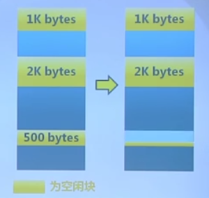
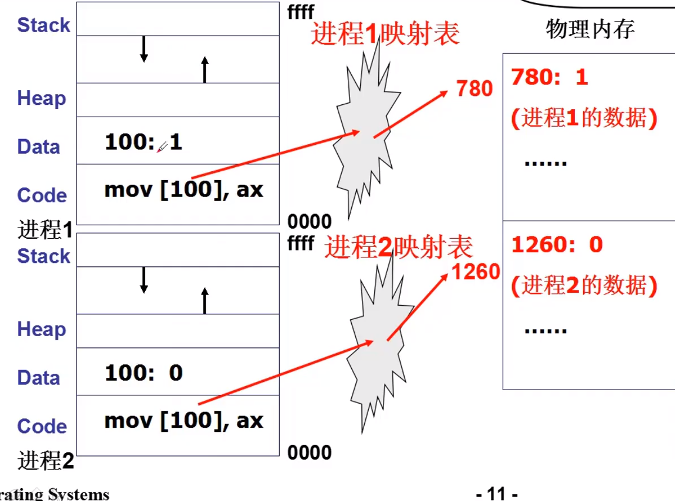
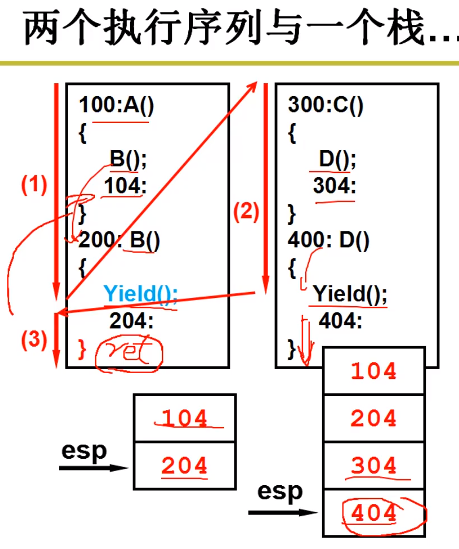
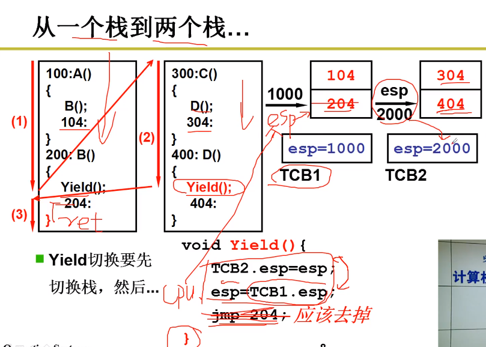
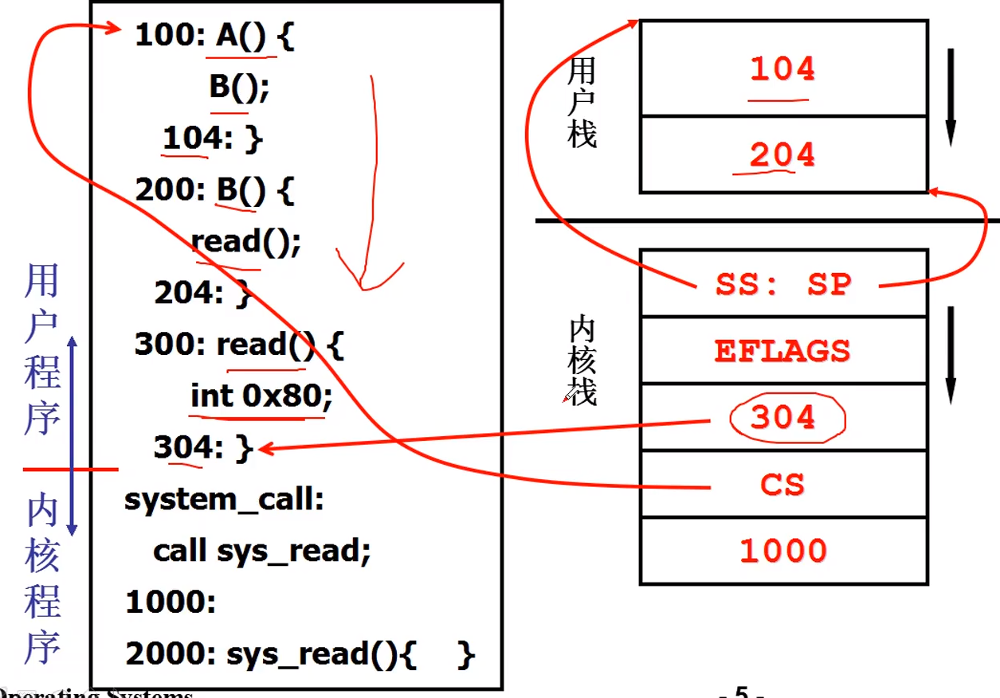

# MIT6.S081

[MIT 6.S081: Operating System Engineering - CS自学指南](https://csdiy.wiki/%E6%93%8D%E4%BD%9C%E7%B3%BB%E7%BB%9F/MIT6.S081/)


这几位教授还专门写了一本[教程](https://pdos.csail.mit.edu/6.828/2021/xv6/book-riscv-rev2.pdf)，详细讲解了 xv6 的设计思想和实现细节。

这门课的讲授也很有意思，老师会带着学生依照 xv6 的源代码去理解操作系统的众多机制和设计细节，而不是停留于理论知识。每周都会有一个 lab，让你在 xv6 上增加一些新的机制和特性，非常注重学生动手能力的培养。整个学期一共有 11 个 lab，让你全方位地深刻理解操作系统的每个部分，非常有成就感。而且所有的lab都有着非常完善的测试框架，有的测试代码甚至上千行，让人不得不佩服 MIT 的几位教授为了教好这门课所付出的心血。

这门课的后半程会讲授操作系统领域的多篇经典论文，涉及文件系统、系统安全、网络、虚拟化等等多个主题，让你有机会接触到学界最前沿的研究方向。

## 课程资源

- 课程网站：https://pdos.csail.mit.edu/6.828/2021/schedule.html
- 课程视频： [- YouTube](https://www.youtube.com/watch?v=L6YqHxYHa7A)，每节课的链接详见课程网站
- 课程视频翻译文档：https://mit-public-courses-cn-translatio.gitbook.io/mit6-s081/
- 课程教材：https://pdos.csail.mit.edu/6.828/2021/xv6/book-riscv-rev2.pdf
- 课程作业：https://pdos.csail.mit.edu/6.828/2021/schedule.html，11个lab，具体要求详见课程网站


[6.S081 Fall 2020 Lecture 1: Introduction and Examples - YouTube](https://www.youtube.com/watch?v=L6YqHxYHa7A)


## xv6 补充资源

- [xv6 操作系统的深入讲解](https://space.bilibili.com/1040264970/)
- [xv6 中文文档](https://th0ar.gitbooks.io/xv6-chinese/content/index.html)
- [xv6 关键源码逐行解读 + 整体架构分析](https://www.youtube.com/playlist?list=PLbtzT1TYeoMhTPzyTZboW_j7TPAnjv9XB)
- [课程教材翻译 xv6-riscv-book-zh-cn](https://blog.betteryuan.top/archives/xv6-riscv-book-zh-cn)
- [课程教材翻译源码 xv6-riscv-book-zh-cn](https://github.com/HelloYJohn/xv6-riscv-book-zh-cn.git)

## 资源汇总

@PKUFlyingPig 在学习这门课中用到的所有资源和作业实现都汇总在 [PKUFlyingPig/MIT6.S081-2020fall - GitHub](https://github.com/PKUFlyingPig/MIT6.S081-2020fall) 中。

@[KuangjuX](https://github.com/KuangjuX) 编写了 MIT 6.S081 的 lab 的[题解](https://github.com/KuangjuX/xv6-riscv-solution)，里面有详细的解法和补充知识。另外，@[KuangjuX](https://github.com/KuangjuX) 还使用 Rust 语言重新实现了 xv6-riscv 操作系统：[xv6-rust](https://github.com/Ko-oK-OS/xv6-rust)，里面对于 xv6-riscv 有更为详细的思考和讨论，感兴趣的同学可以看一下哦。

### 一些可以参考的博客

- [doraemonzzz](http://doraemonzzz.com/tags/6-S081/)
- [Xiao Fan (樊潇)](https://fanxiao.tech/posts/2021-03-02-mit-6s081-notes/)
- [Miigon's blog](https://blog.miigon.net/categories/mit6-s081/)
- [Zhou Fang](https://walkerzf.github.io/categories/6-S081/index.html)
- [Yichun's Blog](https://www.yichuny.page/tags/Operating%20System)
- [解析Ta](https://blog.csdn.net/u013577996/article/details/108679997)
- [PKUFlyingPig](https://github.com/PKUFlyingPig/MIT6.S081-2020fall)
- [星遥见](https://www.cnblogs.com/weijunji/tag/XV6/)
- [tzyt 的博客](https://ttzytt.com/tags/xv6/)


实验 + 操作系统导论


https://github.com/woai3c/MIT6.828

https://pdos.csail.mit.edu/6.828/2018/index.html

https://www.zhihu.com/question/40973610

RISC-V 微处理器

xv6

# 实验环境配置

https://pdos.csail.mit.edu/6.828/2021/tools.html

https://pdos.csail.mit.edu/6.S081/2021/xv6.html


[GitHub - chaiqingao/xv6-labs-2021: MIT 6.S081: Operating System Engineering / Fall 2021 课程实验](https://github.com/chaiqingao/xv6-labs-2021)

https://zhuanlan.zhihu.com/p/343655412

https://zhuanlan.zhihu.com/p/272199762

https://zhuanlan.zhihu.com/p/331492444

https://www.bilibili.com/video/BV11K4y127Qk?from=search&seid=8628043749223720261


### issue1

```
m@m:~/TESTLAB/xv6-labs-2021$ make  qemu
riscv64-linux-gnu-gcc -Wall -Werror -O -fno-omit-frame-pointer -ggdb -DSOL_UTIL -DLAB_UTIL -MD -mcmodel=medany -ffreestanding -fno-common -nostdlib -mno-relax -I. -fno-stack-protector -fno-pie -no-pie   -c -o user/sh.o user/sh.c
user/sh.c:55:1: error: empty declaration [-Werror]
   55 | __attribute__((noreturn));
      | ^~~~~~~~~~~~~
user/sh.c: In function ‘runcmd’:
user/sh.c:59:1: error: infinite recursion detected [-Werror=infinite-recursion]
   59 | runcmd(struct cmd *cmd)
```

修改user/sh.c :58处，添加


```
diff --git a/user/sh.c b/user/sh.c
index 83dd513..c96dab0 100644
--- a/user/sh.c
+++ b/user/sh.c
@@ -54,6 +54,7 @@ void panic(char*);
 struct cmd *parsecmd(char*);
 
 // Execute cmd.  Never returns.
__attribute__((noreturn)) //   添加
 void
 runcmd(struct cmd *cmd)
 {

```


[记录MIT6.s081 编译QEMU中的错误_error: pkg-config binary 'pkg-config' not found-CSDN博客](https://blog.csdn.net/weixin_51472360/article/details/128800041)


错误1

```
ERROR: glib-2.48 gthread-2.0 is required to compile QEMU

处理
sudo apt-get install libglib2.0-dev
```

错误2

```
ERROR: pixman >= 0.21.8 not present.
       Please install the pixman devel package.

处理
sudo apt-get install libpixman-1-dev
```

#### 实验

1. 在user目录下创建copy.c

2. 在Makefile 152行添加配置
   
   

3. 测试添加程序
   
   启动xv6后，执行copy

https://blog.csdn.net/u013577996/article/details/108680888

##### 课程学习

##### 3.4内核执行任何内核指令

3.4 之前提到，设置处理器中kernel mode的bit位的指令是一条特殊权限指令，那么一个用户程序怎么才能让内核执行任何内核指令？因为现在切换到kernel mode的指令都是一条特殊权限指令了，对于用户程序来说也没法修改那个bit位

用户程序会通过系统调用来切换到kernel mode。当用户程序执行系统调用，会通过ECALL触发一个软中断（software interrupt），软中断会查询操作系统预先设定的中断向量表，并执行中断向量表中包含的中断处理程序。中断处理程序在内核中，这样就完成了user mode到kernel mode的切换，并执行用户程序想要执行的特殊权限指令？ 

**针对这个回答，我的疑问是，怎么确保恶意程序不走这种系统调用呢**

##### 3.9 断点调试

```
 一个窗口

 make CPUS=1 qemu-gdb

 新开窗口 

 gdb-multiarch kernel/kernel
 target remote localhost:26000
```

https://zhuanlan.zhihu.com/p/331492444

GDB简单使用

```
ctrl x a 显示代码
 b 断点
 r运行
```


https://www.bilibili.com/video/BV1ei4y1V758?from=search&seid=4972450432119771986

##### 4.3页表


在最高级的page directory中的PPN，包含了下一级page directory的物理内存地址，  第二个9bit用来索引中间级的page directory，第三个9bit用来索引最低级的page directory。在最低级page directory，我们还是可以得到44bit的PPN，这里包含了我们实际上想要翻译的物理page地址，然后再加上虚拟内存地址的12bit offset，就得到了56bit物理内存地址。

第一个level1有了Level2页表的物理地址，Level2的 PPN就是页表的偏移量,指向Level3的物理地址.

https://www.bilibili.com/video/BV1zt4y1U7rq?from=search&seid=11572648099017443360

#### 启动概览


​    

简单来说 就是加电后，1。启动主板BIOS  》 2. BIOS初始化从磁盘中把加载程序bootloader 加载到内存中 》3.把磁盘镜像操作系统加载到内存中运行

**为什么不在第二步直接加载操作系统呢?**  1. 为了兼容不同的文件系统  2. bootloader只能存 512字节，系统远大于它。 

https://objectkuan.gitbooks.io/ucore-docs/content/lab1/lab1_3_booting.html

##### BIOS初始化

1. 硬件自检POST,检测系统中（内存和显卡，软盘 ，影片 光盘 USB)等关键部件的存在和工作状态查找并执行显卡等接口卡BIOS,并进行设备初始化；
2. 加载上述设备的第一个扇区（主引导扇区，Master Boot Record,or MBR）的512字节的内容读到内存固定地址0x7c00，这个内容就是bootloader,等待对Ucore操作系统的加载.

##### bootloader做的事情

1. 从实模式切换到保护模式(protection mdoe) ，为后续操作系统的执行做准备。
2. 从硬盘上读取kernel in ELF格式的ucore kernel(就是系统代码，跟在MBR后面的扇区)并放到内存中固定位置。
3. 跳转到ucore OS的入口点(entry point)执行，这时候控制器交给了 ucore.

##### 第二部细节 加载程序


​    计算机可能有不止一个分区，每个分区有不同的系统，主引导记录来确定去哪个文件系统读加载程序

1. BIOS启动过程
   
   当计算机加电后，一般不直接执行操作系统，而是执行系统初始化软件完成基本IO初始化和引导加载功能(BIOS)。简单地说，系统初始化软件就是在操作系统内核运行之前运行的一段小软件。通过这段小软件，我们可以初始化硬件设备、建立系统的内存空间映射图，从而将系统的软硬件环境带到一个合适的状态，以便为最终调用操作系统内核准备好正确的环境。最终引导加载程序把操作系统内核映像加载到RAM中，并将系统控制权传递给它。 
   
   对于绝大多数计算机系统而言，操作系统和应用软件是存放在磁盘（硬盘/软盘）、光盘、EPROM、ROM、Flash等可在掉电后继续保存数据的存储介质上。计算机启动后，CPU一开始会到一个特定的地址开始执行指令，这个特定的地址存放了系统初始化软件，负责完成计算机基本的IO初始化，这是系统加电后运行的第一段软件代码。对于Intel 80386的体系结构而言，PC机中的系统初始化软件由BIOS (Basic Input Output  System，即基本输入/输出系统，**其本质是一个固化在主板Flash/CMOS上的软件**)和位于软盘/硬盘引导扇区中的OS Boot  Loader（在ucore中的bootasm.S和bootmain.c）一起组成。BIOS实际上是被固化在计算机ROM（只读存储器）芯片上的一个特殊的软件，为上层软件提供最底层的、最直接的硬件控制与支持。更形象地说，BIOS就是PC计算机硬件与上层软件程序之间的一个"桥梁"，负责访问和控制硬件。 
   
   以Intel  80386为例，计算机加电后，CPU从物理地址0xFFFFFFF0（由初始化的CS：EIP确定，此时CS和IP的值分别是0xF000和0xFFF0)）开始执行。在0xFFFFFFF0这里只是存放了一条跳转指令，通过跳转指令跳到BIOS例行程序起始点。BIOS做完计算机硬件自检和初始化后，会选择一个启动设备（例如软盘、硬盘、光盘等），并且读取该设备的第一扇区(即主引导扇区或启动扇区)到内存一个特定的地址0x7c00处，然后CPU控制权会转移到那个地址继续执行。至此BIOS的初始化工作做完了，进一步的工作交给了ucore的bootloader。

2. bootloader启动过程
   
   BIOS将通过读取硬盘主引导扇区到内存，并转跳到对应内存中的位置执行bootloader。bootloader完成的工作包括：
   
   - 切换到保护模式，启用分段机制
   - 读磁盘中ELF执行文件格式的ucore操作系统到内存
   - 显示字符串信息
   - 把控制权交给ucore操作系统
   
   对应其工作的实现文件在lab1中的boot目录下的三个文件asm.h、bootasm.S和bootmain.c。下面从原理上介绍完成上述工作的计算机系统硬件和软件背景知识。

3. 操作系统启动过程
   
   当bootloader通过读取硬盘扇区把ucore在系统加载到内存后，就转跳到ucore操作系统在内存中的入口位置（kern/init.c中的kern_init函数的起始地址），这样ucore就接管了整个控制权。当前的ucore功能很简单，只完成基本的内存管理和外设中断管理。ucore主要完成的工作包括：
   
   - 初始化终端；
   - 显示字符串；
   - 显示堆栈中的多层函数调用关系；
   - 切换到保护模式，启用分段机制；
   - 初始化中断控制器，设置中断描述符表，初始化时钟中断，使能整个系统的中断机制；
   - 执行while（1）死循环。
   
   以后的实验中会大量涉及各个函数直接的调用关系，以及由于中断处理导致的异步现象，可能对大家实现操作系统和改正其中的错误有很大影响。而理解好函数调用关系的建立机制和中断处理机制，对后续实验会有很大帮助。下面就练习5涉及的函数栈调用关系和练习6中的中断机制的建立进行阐述。

https://objectkuan.gitbooks.io/ucore-docs/content/lab1/lab1_3_booting.html

#### 系统调用

##### POSIX

Portable Operating System Interface of Unix(IEEE制定的一个标准族)

操作系统给上层提供的接口，macos,Linux都遵循这个接口。

内核态 0 ， 用户态 3         

GDT表存了DPL为0，用户访问CPL为3， 3 > 0 没法访问。 

0x80到内核中

#### 中断、异常和系统调用


中断

硬件设对操作系统备的处理请求（缓存区里有数据，需要内核读走。或者缓冲区里数据用完了，需要内核补充新的数据）

异常

非法指令或者其他原因导致当前指令执行失败（程序出错后的处理请求）

系统调用

应用程序主动向操作系统发出的服务请求

#### 物理内存管理： 连续内存分配

最先匹配（First Fit Allocation）：

空闲分区列表按地址顺序排序

分配过程时，搜索第一个合适的分区，如果有剩下的空闲分区，继续把空闲分区切割出来，所以会产生碎片。

释放分区时，检查是否可与临近的空闲分区合并

最佳匹配（Best Fit Allocation）

空闲分区列表按照 小到大排序

分配时，查找比需要分区大的最小的分区，可避免大的空闲分区被拆分，减少碎片大小。

释放时，超找并且合并临近地址的空闲分区（如果找到）

Screenshot from 

最差匹配(WORST Fit Allocation)

空闲分区列表按大到小排序

分配时，选最大的分区，后续找大分区比较难。

释放时，检查是否可与临近的空闲分区合并，进行可能的合并并调整空闲分区列表顺序。

伙伴系统

#### 非连续内存分配

1. 虚拟地址和物理地址的转换
   
   软件实现  硬件实现

2. 非连续分配的硬件辅助记者
   
   段式存储管理（segmentation）: 分的比较大
   
   

   页式存储管理 （paging）

   把物理地址空间划分为大小相同的基本分配单位，2的n次方，如512,4096

linux启动 

http://c.biancheng.net/view/1013.html

#### linux目录结构

| 目录    | 描述                                               |
| ----- | ------------------------------------------------ |
| /bin  | 存放二进制可执行文件(ls,cat,mkdir等)，常用命令一般都在这里             |
| /etc  | 存放系统管理和配置文件                                      |
| /home | 存放所有用户文件的根目录，是用户主目录的基点，比如用户user的主目录就是 /home/user |
| /usr  | 用于存放系统应用程序，比较重要的目录/usr/local 本地系统管理员软件安装目录       |
| /opt  | `额外安装的可选应用程序包所放置的位置 `                            |
| /proc | 虚拟文件系统目录，是系统内存的映射。可直接访问这个目录来获取系统信息。              |
| /root | `超级用户(系统管理员)的主目录 `                               |
| /sbin | 存放二进制可执行文件，只有root才能访问                            |
| /dev  | 用于存放设备文件                                         |
| /mnt  | 系统管理员安装临时文件系统的安装点，系统提供这个目录是让用户临时挂载其他的文件系 统。      |
| /boot | `存放用于系统引导时使用的各种文件 `                              |
| /lib  | `存放跟文件系统中的程序运行所需要的共享库及内核模块 `                     |
| /var  | `用于存放运行时需要改变数据的文件 `                              |

#### 进程

进程调度 : FIFO , Priority

##### 进程切换

进程当前的状态存放到PCB(Process Control Block)中，获取下一个需要执行进程的PCB信息，切换进程。



##### 线程


线程 指令的切换，映射表不用切换    

###### 2个线程用一个栈的情况



```
//第一个Yield
void Yield(){ 
    找到300；
    jmp 300;
}
//第二个Yield
void Yield(){
    找到 ? ; 204
    jmp ? ;
}
```

按照    (1)  -> (2) -> (3)的顺序执行，执行玩D()中的Yield()回到B()中，到了 右括号ret 出栈，出去的是404,正确的情况时时出204

###### 两个线程 两个栈



jmp 204去掉：否则会执行两次

###### 用户程序 内核程序调用



###### 多核处理


多核情况共用一个MMU,减少切换资源调用。

进程线程区别

进程 : 有很大的独立性

线程 :  所有线程都有完全一样的地址空间,意味着它们也共享同样的全局变量。由于线程可以访问进程地址空间的每一个内存地址，所以一个线程可以读、写甚至清除另一个线程的堆栈。

每个进程中的内容 : 地址空间  全局变量 打开文件 子进程    即将发生的定时器    信号与信号处理程序

每个线程中的内容：程序计数器、寄存器、堆栈、状态.

#### 同步

原子性

原子性是指一系列操作不可被中断的特性,这一系列操作要么全部执行完成，要么全部没有执行,不存在部分执行部分未执行的情况

##### 互斥量

​            互斥量是最简单的线程同步的方法,处于两态之一的变量:解锁和加锁,两个状态可以保证资源访问的串行

##### 自旋锁与自适应自旋

* 自旋锁

​            自旋锁的线程会反复检查锁变量是否可用,自旋锁不会让出CPU，是一种忙等待状态,

​            自旋锁避免了进程或线程上下文切换的开销

​            自旋锁不适合在单核CPU使用

​            自旋锁的线程会反复检查锁变量是否可用

* 自适应自旋
  
  提到了互斥同步对性能最大的影响是阻塞的实现，挂起线程和恢 复线程的操作都需要转入内核态中完成，这些操作给Java虚拟机的并发性能带来了很大的压力。同 时，虚拟机的开发团队也注意到在许多应用上，共享数据的锁定状态只会持续很短的一段时间，为了 这段时间去挂起和恢复线程并不值得。现在绝大多数的个人电脑和服务器都是多路(核)处理器系 统，如果物理机器有一个以上的处理器或者处理器核心，能让两个或以上的线程同时并行执行，我们 就可以让后面请求锁的那个线程“稍等一会”，但不放弃处理器的执行时间，看看持有锁的线程是否很 快就会释放锁。为了让线程等待，我们只须让线程执行一个忙循环(自旋)，这项技术就是所谓的自 旋锁。
  
  自旋锁在JDK 1.4.2中就已经引入，只不过默认是关闭的，可以使用-XX:+UseSpinning参数来开 启，在JDK 6中就已经改为默认开启了。自旋等待不能代替阻塞，且先不说对处理器数量的要求，自 旋等待本身虽然避免了线程切换的开销，但它是要占用处理器时间的，所以如果锁被占用的时间很 短，自旋等待的效果就会非常好，反之如果锁被占用的时间很长，那么自旋的线程只会白白消耗处理 器资源，而不会做任何有价值的工作，这就会带来性能的浪费。因此自旋等待的时间必须有一定的限 度，如果自旋超过了限定的次数仍然没有成功获得锁，就应当使用传统的方式去挂起线程。自旋次数 的默认值是十次，用户也可以使用参数-XX:PreBlockSp in来自行更改。
  
  不过无论是默认值还是用户指定的自旋次数，对整个Java虚拟机中所有的锁来说都是相同的。在 JDK 6中对自旋锁的优化，引入了自适应的自旋。自适应意味着自旋的时间不再是固定的了，而是由 前一次在同一个锁上的自旋时间及锁的拥有者的状态来决定的。如果在同一个锁对象上，自旋等待刚 刚成功获得过锁，并且持有锁的线程正在运行中，那么虚拟机就会认为这次自旋也很有可能再次成 功，进而允许自旋等待持续相对更长的时间，比如持续100次忙循环。另一方面，如果对于某个锁，自 旋很少成功获得过锁，那在以后要获取这个锁时将有可能直接省略掉自旋过程，以避免浪费处理器资 源。有了自适应自旋，随着程序运行时间的增长及性能监控信息的不断完善，虚拟机对程序锁的状况 预测就会越来越精准，虚拟机就会变得越来越“聪明”了。

##### 读写锁

​            读写锁是一种特殊的自旋锁,

​            允许多个读者同时访问资源以提高读性能

​            对于写操作则是互斥的

##### 条件变量

​            条件变量是一种相对复杂的线程同步方法    

​            条件变量允许线程睡眠，直到满足某种条件

​            当满足条件时，可以向该线程信号，通知唤醒

#### mooc-os-lab

[现代操作系统] 示例 p55

先学习(现代操作系统) 陈渝 向勇

https://www.bilibili.com/video/BV1js411b7vg?from=search&seid=2361361014547524697

配套书： 操作系统概念(第七版) ， 操作系统-精髓与设计原理（第七版）william stallings

##### 实验环境配置

https://www.bilibili.com/video/BV1Zz4y1d7BK?from=search&seid=14777231705696776183

http://os.cs.tsinghua.edu.cn/oscourse/OS2020spring

[ucore实验基准源代码](https://github.com/LearningOS/ucore_os_lab)

https://www.bilibili.com/s/video/BV1Zz4y1d7BK

ubuntu窗口调整

device -> Insert Guest addtions CD Image

https://blog.csdn.net/u012631731/article/details/79548621

修改Ubuntu硬盘大小

https://my.oschina.net/u/4388335/blog/3321852

 windows ubuntu文件夹共享

https://www.jianshu.com/p/4e73fd1c0c74?utm_campaign=maleskine&utm_content=note&utm_medium=seo_notes&utm_source=recommendation

并发 : 多个事件在分段被单个CPU分段执行。

并行： 多个CPU同时处理多个任务。

#### 汇编

##### 操作系统

https://fishc.com.cn/forum-39-1.html

https://www.bilibili.com/video/av22872043/?p=2&spm_id_from=pageDriver

##### GCC内联汇编

C语言中加入 汇编代码


2020 南京大学 “操作系统：设计与实现” (蒋炎岩)

https://www.bilibili.com/video/BV1N741177F5?p=1&vd_source=d4c5260002405798a57476b318eccac9

https://github.com/NJU-ProjectN/am-kernels

[GitHub - NJU-ProjectN/abstract-machine: A minimal, modularized, and machine-independent hardware abstraction layer](https://github.com/NJU-ProjectN/abstract-machine)

实验不开源,可以了解

[实验指导书 · Issue #1 · mansicer/NJU-OSlab-2019 · GitHub](https://github.com/mansicer/NJU-OSlab-2019/issues/1)

[Introduction · GitBook](https://nju-projectn.github.io/ics-pa-gitbook/ics2019/)