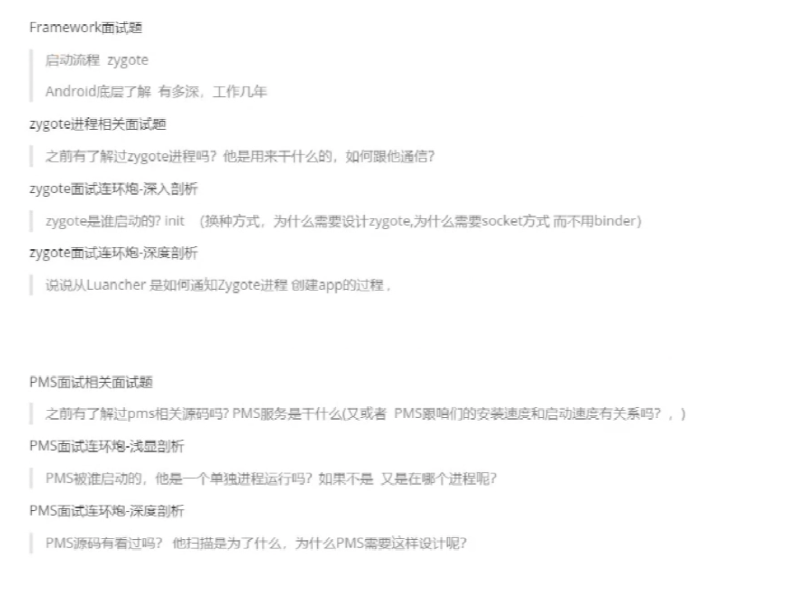

PMS

##### PMS服务是干什么的

1. 管理 加载  缓存APK文件，把APK文件加载成package对象，缓存到mPackages中
2. 当AMS需要加载Activity时，PMS提供对应的信息(javabean)

##### PMS是谁启动的

SystemServer

##### PMS扫描是为了什么

以空间换时间

##### PMS启动应用，会发生什么

1. 通过包名，找到对应的apk文件
2. 解压apk文件
3. 经过dom解析，找到Launcher对应的activity
4. 再反射加载
5. app启动成功。

