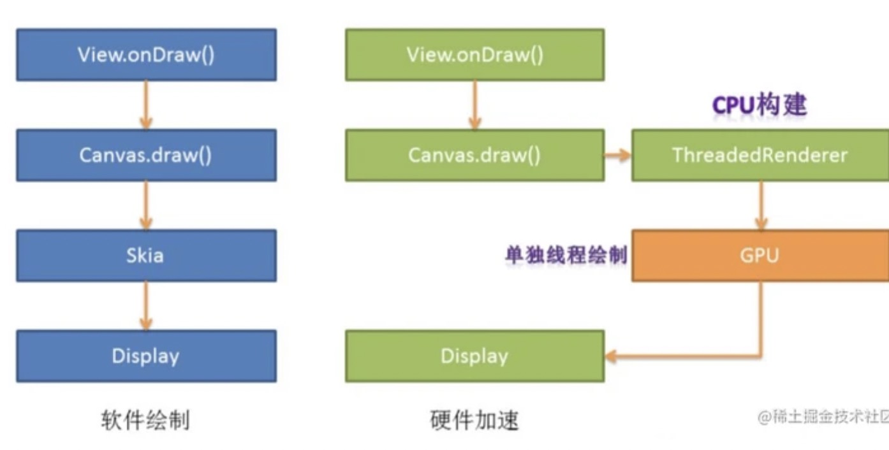

https://developer.android.com/topic/performance/vitals

#### Vitals

根据vitas提示确认解决方案

https://support.google.com/googleplay/android-developer/answer/9844486?visit_id=637902898856761718-3795427085&rd=1&hl=zh-Hans#zippy=

https://play.google.com/console/u/0/developers/5313279702199603526/app/4975846927718251228/vitals/metrics/overview?days=30

https://www.youtube.com/playlist?list=PLWz5rJ2EKKc9CBxr3BVjPTPoDPLdPIFCE

##### Vitals vs firebase

https://developer.android.google.cn/distribute/best-practices/launch/debug-crashes?hl=zh-cn

#### 红橙

https://www.jianshu.com/p/888d959683a4

https://juejin.cn/post/6950608825942868004

图片处理

https://developer.android.com/topic/performance/graphics/index.html
https://developer.android.com/topic/performance/graphics/load-bitmap.html#read-bitmap

性能优化

https://mp.weixin.qq.com/s/ceXsH06fUFa7y4lzi4uXzw

https://mp.weixin.qq.com/s/xqrGukIqA2zpGsGzah2EzA

包体积优化

https://juejin.im/post/6854573210408189960

https://mp.weixin.qq.com/s/jnZpgaRFQT5ULk9tHWMAGg

https://www.jianshu.com/p/fba7b43bdc9c

##### 布局优化

https://www.jianshu.com/p/ee9e4b8cb95f

#### strict mode

https://www.bilibili.com/video/BV1wh411H78Z?p=7

Troubleshooting app performance issues with System Trace in Android Studio

https://www.youtube.com/watch?v=EjmIit_amnE

### 硬件加速原理

相信经常看到有的文章说开启硬件加速解决卡的问题，但硬件加速是什么呢？

硬件加速的主要原理是通多底层逻辑，将CPU不擅长的图形计算转换成GPU专用指令，让更擅长图形计算的GPU来完成渲染。

硬件加速过程中包含两个步骤 ：

构建阶段 ： 遍历所有视图，将需要绘制的操作缓存下来，交给单独的Render线程使用GPU进行硬件加速渲染。(这一阶段在主线程中使用CPU构建)

绘制阶段 ： 调用OpenGL（即使用GPU）对构建好的视图进行绘制渲染，绘制的内容保存在Graphic Buffer 并交由  SurfaceFlinger 显示。(Android 5.0+ 使用Render Thread线程，专门负责 UI 渲染和动画显示。)

以上证得硬件加速具有不错的优点，但它不是万能的。

我们平时用的时候可能是直接在Application中用，一锅端，这并不严谨，因为硬件加速还没法做到支持所有的绘制操作（比如复杂的自定义View），这样的话就会造成一定的影响：

\1. 像素错位等视觉问题

\2. 不同设备版本API兼容问题

https://segmentfault.com/a/1190000041325538

Apk瘦身

https://blog.csdn.net/qq_32175491/article/details/80071987

也有不建议删SO库的说法

http://kaedea.com/2016/06/04/android-dynamical-loading-04-so-problems/

#### Code Check

Code Review之前可以做的事情.

https://developer.android.google.cn/studio/write/annotations

https://www.jianshu.com/p/cf1b97941856

https://www.cnblogs.com/endv/p/12541442.html

