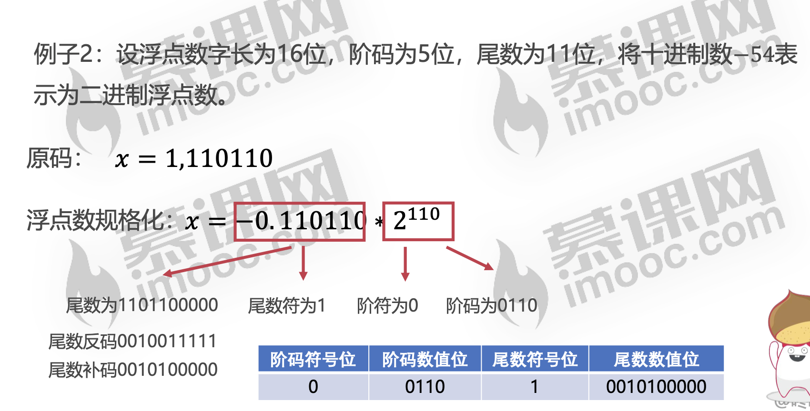
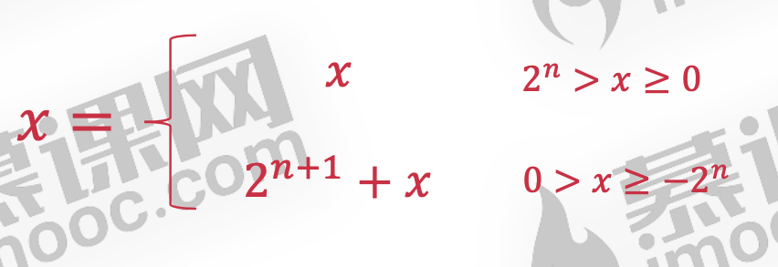
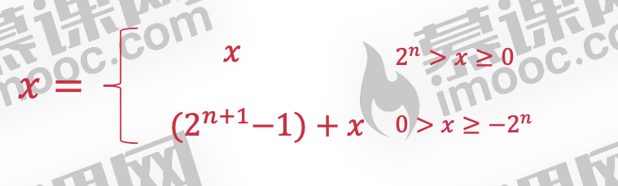
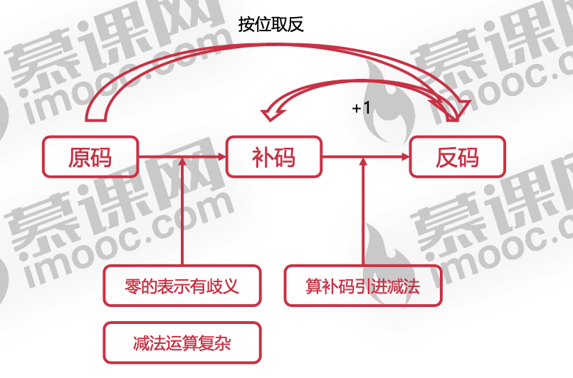
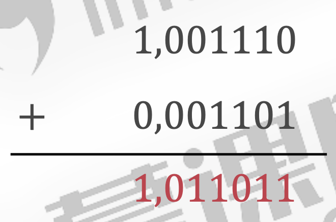
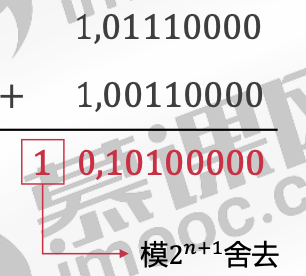

#### 进制运算的基本知识

##### 整数二进制

2进制转10进制： 重复除2取余数


##### 小数二进制 :

𝑁= 0.11001 =1∗2−1+1∗2−2+1∗2−5=0.78125=25 / 32

(小数)十进制转换二进制:重复相乘法


#### 二进制数据的表示方法

#####  原码

* 原码表示法

1. 使用0表示正数、1表示负数
2. 规定符号位位于数值第一位
3. 表达简单明了，是人类最容易理解的表示法

0有两种表示方法:00 , 10


* 缺陷

但是原码表示法有缺陷

**希望找到不同符号操作数更加简单的运算方法**

**希望找到使用正数代替负数的方法**

**使用加法操作代替减法操作，从而消除减法**	


#####  阶码 尾数



##### 补码

补码表示法



* 例子2:  x=-13，计算x的二进制原码和补码

  原码:x=1,1101

  

  补码:2^(𝑛+1) + 𝑥 = 2^(4+1) − 13 = 100000 − 1101 = <u>1</u>,0011 

  ​																				1是符号位

  补码:x=1,0011

* 例子3:   x=-7，计算x的二进制原码和补码

  原码:x=1,0111

  补码:2^(𝑛+1) + 𝑥 = 2^(4+1) − 7 = <u>100000 − 0111</u> = 11001

  ​		补码:x=1,1001

* 缺陷

  还是同样的问题,

  **希望找到使用正数代替负数的方法**$$

  **使用加法操作代替减法操作，从而消除减法**

  在计算补码的过程中，还是使用了减法!!

##### 反码





* **引进补码的目的**

  减法运算复杂，希望找到使用正数替代负数的方法

  使用加法代替减法操作，从而消除减法

* 例子1:	x=-13，计算x的二进制原码和,反码,补码

  原码: 	 x=1,1101

  

  反码:	2^(𝑛+1)−1 + 𝑥 = (2^(4+1)−1) − 13 = 011111 − 1101 = <u>1</u>0010

  ​			反码:x=1,0010

  补码:	2^(𝑛+1) + 𝑥 = 2^(4+1) − <u>13 = 100000 − 11</u>01 = 10011

* 例子2:x=-7，计算x的二进制原码和反码

  原码:x=1,0111

  

  反码:2^(𝑛+1) + 𝑥 = 2^(4+1) − 7 = 011111 − 0111 = <u>1</u>1000

  ​		反码:x=1,1000

* 反码表示法

  

  **负数的反码**等于原码除符号位外按位取反

  **负数的补码**= (反码+1)				

* 例子3:x=-7，计算x的二进制原码和反码和补码

  原码:x=1,0111					反码:x=1,1000. 		补码:x=1,1001		

* 例子4:x=-9，计算x的二进制原码和反码和补码

  原码:x=1,1001					反码:x=1,0110		 补码:x=1,0111	

  ​				

   		

  

  

  

  

  

##### 小数的补码

小数的补码 反码规则和整数一样，原码的方式按照 小数二进制 先算出来

* 例子1: x= 9/16 ，计算x的二进制原码和反码和补码

  原码:x=0,0.1001		反码:x= 0,0.1001			补码:x= 0,0.1001

* 例子2:x=- ，计算x的二进制原码和反码和补码

  原码:x=1,0.01011	反码:x=1,1.10100 			补码:x=1,1.10101


#### 二进制数据的运算

#####  **定点数的加法运算**

整数加法: A 补 + B 补 = 𝐴 + 𝐵 补 (𝑚𝑜𝑑2𝑛+1)

小数加法: A补 +B补 = 𝐴+𝐵 补(𝑚𝑜𝑑2)

数值位与符号位一同运算，并将符号位产生的进位自然丢掉				 		


* 例子1:	A=-110010， B=001101，求A+B

  A[补] = 1,001110	 => 	A[原] = 1,110010 => A[反]= 1,001101			

  B 补 = B[原] = 0,001101				
  
  A 补 +B 补 =(A+B) 补 =1,011011 
  
  A + B = −100101					

* 例子2:A=-0.1010010， B=0.0110100，求A+B

  A[补] = 1,1.0101110

  B 补 = B[原] = 0,0.0110100

  A 补 +B 补 =(A+B) 补 =1,1.1100010 

  A + B =-0.0011110					

* 例子4 ： A=-10010000， B=-11010000，求A+B

  A补 =1,01110000

  B补 =1,00110000		

   A 补 +B 补 =(A+B) 补 =0,10100000

   A + B = 10100000		A + B = 160

  A = −144	B = −208			

  发生了溢出 : A

* **判断溢出**

   双符号位判断法

  **单符号位表示变成双符号位:****0=>00,1=>11**

  **双符号位产生的进位丢弃**

  **结果的双符号位不同则表示溢出**

* 例子4:A=-10010000， B=-11010000，求A+B

  A补 =1,01110000	

  B补 =1,00110000

  A 补 +B 补 =(A+B) 补 =<u>10</u>,10100000		双符号位不同，表示溢出	

    			符号位进位舍去

* 例子3:A=-10010000， B=-01010000，求A+B

  A补 =1,01110000

  B补 =1,10110000

  A 补 +B 补 =(A+B) 补 =<u>11,</u>00100000 	双符号位相同，没有溢出

  (A+B)[原] = 11,11100000 = −11100000

#####  **定点数的减法运算**

整数减法: A补 −B补 =𝐴+(−𝐵)补(𝑚𝑜𝑑2𝑛+1)

小数减法: A 补 −B 补 =𝐴+(−𝐵) 补 (𝑚𝑜𝑑2)

-B[补]等于B[补]连同符号位按位取反，末位加一

B 补 = 1,0010101 			(−B) 补 = 0,1101011

* 例子5:A=11001000， B=-00110100，求A-B

  A 补 = A[原] = 0,11001000

  B 补 = 1,11001100

   (−B) 补 = 0,00110100

A补 −B补 =A+(−B)补

A+(−B)补 =0,11111100

A − B = 111111100


##### 浮点数的加减法运算

**対阶  						尾数求和  						尾数规格化 舍入  						溢出判断**

浮点数乘除法也是上面4个步骤


做蓝牙开发时byte数组出现 -122，来看看这个负数是怎么出现的

byte转int类型

b1 & 0xff

<http://ju.outofmemory.cn/entry/215778>

<https://blog.csdn.net/RuobaiMEN/article/details/79890823>

<https://blog.csdn.net/LVXIANGAN/article/details/72726152>

问题: 计算机负数加法 8 + （-1）

​	b1 & 0xff 不理解

<https://www.imooc.com/article/21360>

<https://blog.csdn.net/zdy10326621/article/details/50236529>

#### 字节

###### 一个字节byte 两位16进制数

1个字节是8位，二进制8位：xxxxxxxx 范围从00000000－11111111，表示0到255。

1位16进制数最大是15（用二进制表示是xxxx ）（即对应16进制的0xF 1111 4位），要表示到255,就还需要4位。

* 位运算符基本操作


<https://blog.csdn.net/qiantudou/article/details/49928423>

<https://www.orchome.com/1190>

###### 取一个字节 某几位

```
/**
 * 取一个字节高几位
 *
 * @param b
 * @param length
 * @return
 */
public static int getLeftNum(byte b, int length) {
    return b >> (8 - length);
}


/**
 * 取一个字节低几位bit
 *
 * @param b
 * @param length
 * @return
 */
public static int getRightNum(byte b, int length) {
    byte mv = (byte) (0xff >> (8 - length));
    return b & mv;
}

/**
 * https://blog.csdn.net/bluestarjava/article/details/83446129
 *
 * @param b
 * @param startIndex 高位从0开始
 * @param endIndex
 * @return
 */
public static int getMidNum(byte b, int startIndex, int endIndex) {
    byte i = (byte) getLeftNum(b, endIndex + 1);//先取高几位
    return getRightNum(i, endIndex - startIndex + 1);//再取低几位
}
```

<https://bbs.csdn.net/topics/310178646>

