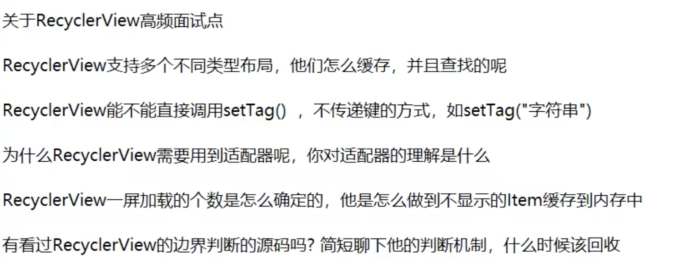

#### Question



https://www.bilibili.com/video/BV1Fi4y1x7p5?from=search&seid=3244755609076396172

1. RecycleView复用机制

2. 无

3. 问题3

   适配不同类型的View布局，将用户界面显示与逻辑代码分离

4. 无

   


##### 滑动坐标

第一个左边 - 第二个坐标

所以负值 一定是往下滑

用栈数组保存不同类型回收的view

#### 回收情况

ScrollY  第一个可见Item的左上顶点 距离屏幕左上角的距离。


##### 顶部item回收

网上滑动 

当顶部item滑出屏幕，ScrollY的高度等于第一个item高度时，就被滑出了屏幕。


##### 底部item再添加

网上滑动

当 屏幕显示的几个Item 长度 -  ScrollY  刚好等于 屏幕高度，底部item之下再开始添加item。

因为ScrollY变大.


##### 顶部item添加

向下滑动

ScrollY = 顶部item高度，顶部添加item


#### 底部item回收

ScrollY = 底部item高度，底部回收。


####  基本使用

```java
LinearLayoutManager layoutManager = new LinearLayoutManager(getActivity());
layoutManager.setOrientation(LinearLayoutManager.VERTICAL); //默认竖直布局
mRecyclerView.setLayoutManager(layoutManager);
```

 

```java
public class CustomAdapter extends RecyclerView.Adapter<CustomAdapter.ViewHolder> {
    private static final String TAG = "CustomAdapter";

    private String[] mDataSet;

    // BEGIN_INCLUDE(recyclerViewSampleViewHolder)
    /**
     * Provide a reference to the type of views that you are using (custom ViewHolder)
     */
    public static class ViewHolder extends RecyclerView.ViewHolder {
        private final TextView textView;

        public ViewHolder(View v) {
            super(v);
            // Define click listener for the ViewHolder's View.
            v.setOnClickListener(new View.OnClickListener() {
                @Override
                public void onClick(View v) {
                    Log.d(TAG, "Element " + getAdapterPosition() + " clicked.");
                }
            });
            textView = (TextView) v.findViewById(R.id.textView);
        }

        public TextView getTextView() {
            return textView;
        }
    }
    // END_INCLUDE(recyclerViewSampleViewHolder)

    /**
     * Initialize the dataset of the Adapter.
     *
     * @param dataSet String[] containing the data to populate views to be used by RecyclerView.
     */
    public CustomAdapter(String[] dataSet) {
        mDataSet = dataSet;
    }

    // BEGIN_INCLUDE(recyclerViewOnCreateViewHolder)
    // Create new views (invoked by the layout manager)
    @Override
    public ViewHolder onCreateViewHolder(ViewGroup viewGroup, int viewType) {
        // Create a new view.
        View v = LayoutInflater.from(viewGroup.getContext())
                .inflate(R.layout.text_row_item, viewGroup, false);

        return new ViewHolder(v);
    }
    // END_INCLUDE(recyclerViewOnCreateViewHolder)

    // BEGIN_INCLUDE(recyclerViewOnBindViewHolder)
    // Replace the contents of a view (invoked by the layout manager)
    @Override
    public void onBindViewHolder(ViewHolder viewHolder, final int position) {
        Log.d(TAG, "Element " + position + " set.");

        // Get element from your dataset at this position and replace the contents of the view
        // with that element
        viewHolder.getTextView().setText(mDataSet[position]);
    }
    // END_INCLUDE(recyclerViewOnBindViewHolder)

    // Return the size of your dataset (invoked by the layout manager)
    @Override
    public int getItemCount() {
        return mDataSet.length;
    }
}
```

https://github.com/googlesamples/android-RecyclerView

http://blog.csdn.net/lmj623565791/article/details/51854533
http://blog.csdn.net/qibin0506/article/details/49716795


####   Jectpack Paging

https://developer.android.com/topic/libraries/architecture/paging

https://www.youtube.com/watch?v=BE5bsyGGLf4&t=841s

https://codelabs.developers.google.com/codelabs/android-paging/index.html?index=..%2F..%2Findex#1

ItemKeyedDataSource的子类需要实现loadInitial、loadAfter、loadBefore和getKey方法。它们分别的作用如下：

- loadInitial：此方法之后在用DataSource构建PageList的时候才会调用一次。用于进行加载初始化。

- loadAfter：在每次RecyclerView滑动到`底部`没有数据的时候就会调用此方法进行数据的加载。

- loadBefore：在每次RecyclerView滑动到`顶部`没有数据的时候就会调用此方法进行数据的加载。

- getKey: 这返回下一个loadAfter调用所需要用到的key。**就相当于链表的指针。**

  [https://anriku.top/2018/09/25/Android%E5%A4%A7%E9%87%8F%E6%95%B0%E6%8D%AE%E5%8A%A0%E8%BD%BD-Paging%E7%9A%84%E4%BD%BF%E7%94%A8/](https://anriku.top/2018/09/25/Android大量数据加载-Paging的使用/)


https://github.com/fmtjava/Jetpack_GitHub

https://github.com/Hankkin/JetPack_Note

解释 paging diff

http://www.jeepxie.net/article/25492.html

https://www.jianshu.com/p/bbb96fc62bcd

https://www.jianshu.com/p/10bf4bf59122

https://juejin.im/post/5db06bb6518825646d79070b


#### Item分类

前面添加header, footer就用到了item分类
reclverview也有很多分类方式


- 使用adapter　组合设计模式，进行组装，代码简洁，比较好操作
  [多adapter分类](http://www.jcodecraeer.com/a/anzhuokaifa/androidkaifa/2015/0810/3282.html) 

https://github.com/luizgrp/SectionedRecyclerViewAdapter
http://blog.csdn.net/wzlyd1/article/details/52292548
https://github.com/luizgrp/SectionedRecyclerViewAdapter

https://github.com/donkingliang/GroupedRecyclerViewAdapter

https://mp.weixin.qq.com/s/oCl4BQ8uB9ZDSOEKESM7hA


 复杂布局: https://github.com/385841539/RecycleviewStaggered

 竖直嵌套水平:https://github.com/drakeet/MultiType/issues/67


#### Reycleview preview

https://medium.com/aubergine-solutions/creating-recyclerview-layout-in-android-no-pain-only-gain-404280471003

```
tools:itemCount="5"
tools:listitem="@layout/adapter_red_pack"
```

```
tools:src="@sample/RedPack.json/dataList/redEnvelopeMoney"
```


#### 问题

使用recycleView中会遇到一些问题,总结一下

1. 问题1
   下拉刷新 滑动列表 crash

使用下拉刷新的时候 往上滑动item会出现这样的错误

```
 E/CrashReport: sys default last handle start!
 FATAL EXCEPTION: main
  Process: com.huifu, PID: 22865
  java.lang.IndexOutOfBoundsException: Inconsistency detected. Invalid item position 4(offset:4).state:10
  at android.support.v7.widget.RecyclerView$Recycler.tryGetViewHolderForPositionByDeadline(RecyclerView.java:5504)
  at android.support.v7.widget.GapWorker.prefetchPositionWithDeadline(GapWorker.java:282)
  at android.support.v7.widget.GapWorker.flushTaskWithDeadline(GapWorker.java:336)
  at android.support.v7.widget.GapWorker.flushTasksWithDeadline(GapWorker.java:349)
  at android.support.v7.widget.GapWorker.prefetch(GapWorker.java:356)
  at android.support.v7.widget.GapWorker.run(GapWorker.java:387)
  at android.os.Handler.handleCallback(Handler.java:739)
  at android.os.Handler.dispatchMessage(Handler.java:95)
  at android.os.Looper.loop(Looper.java:148)
  at android.app.ActivityThread.main(ActivityThread.java:5417)
  at java.lang.reflect.Method.invoke(Native Method)
  at com.android.internal.os.ZygoteInit$MethodAndArgsCaller.run(ZygoteInit.java:726)
  at com.android.internal.os.ZygoteInit.main(ZygoteInit.java:616)

```

 刷新之后数据清空，再滑动数据和item不一致, 情况数据应该在拿到数据之后, 使用下面这种方式解决问题，

```
    @Override
    public void onRefresh() {
//        if (!mProjectList.isEmpty()) {
//            mProjectList.clear();
//        }
        start = 0;
        loadData();
    }
//拿到数据后

 public void onSuccess(List<Project> projects) {
                        swipeInvest.setRefreshing(false);
                        isloading = false;
                        if (start == 0) mProjectList.clear();
 }

```

  http://blog.csdn.net/weixiao_812/article/details/78138075
 [下拉刷新时快速滑动崩溃的问题解决](https://allen218.github.io/2016/06/02/RecyclerView%E4%B8%8B%E6%8B%89%E5%88%B7%E6%96%B0%E6%97%B6%E5%BF%AB%E9%80%9F%E6%BB%91%E5%8A%A8%E5%B4%A9%E6%BA%83%E7%9A%84%E9%97%AE%E9%A2%98%E8%A7%A3%E5%86%B3/)  

2. 问题2

界面不能展示 ,和ListView  不同的是RecyclerView不同,没设置下面的参数是不显示的

```
        mLayoutManager = new LinearLayoutManager(getActivity());
        rcvRrecord.setLayoutManager(mLayoutManager);
```

如果还是没有就看看 recycleview布局是否显示

https://blog.csdn.net/mjb00000/article/details/106014544

不用等数据来了后再显示

https://github.com/leobert-lan/Pandora 


#### RecyclerView拖拽功能

https://www.jianshu.com/p/9605d14ddcc2

https://www.jianshu.com/p/b9a22f0c537d

https://medium.com/@ipaulpro/drag-and-swipe-with-recyclerview-b9456d2b1aaf


##### drag禁用

https://github.com/CymChad/BaseRecyclerViewAdapterHelper/issues/3378


#### BaseRecyclerViewAdapterHelper

getLayoutPosition getAdapterPosition区别

如果界面在notifyDataSetChanged()刷新所有数据,获取的adapterPosition 有可能会是-1,而layoutPosition获取到的还是旧的值.
 如果使用但如果用的是notifyItemInserted(0),获取的adapterPosition就能立刻获取到新的值.


作者：JimmyZou92
链接：https://juejin.cn/post/6999213411204595720
来源：稀土掘金
著作权归作者所有。商业转载请联系作者获得授权，非商业转载请注明出处。
