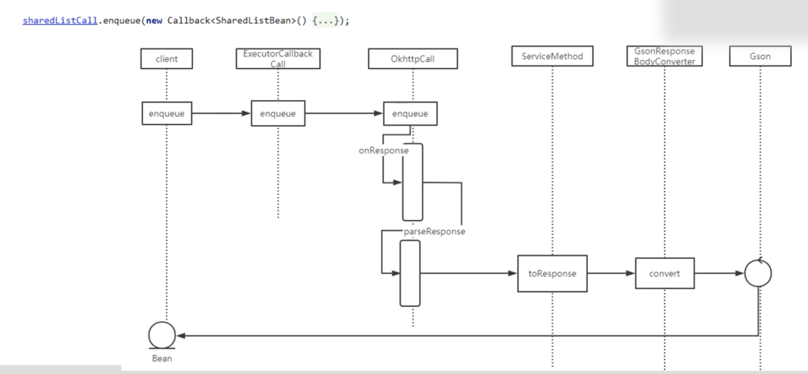
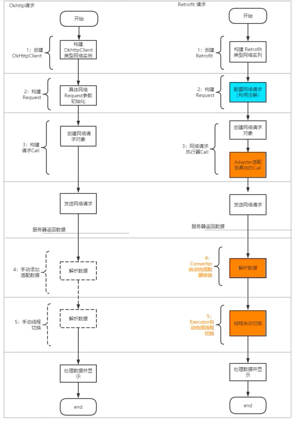

#### Okhttp缺陷 


####  Retofit调用




#### Retrofit Rxjava





 Retorift使用过程

1. 动态生成了实现了接口类型的， 类的对象。

   调用方法,通过反射解析接口，拿到方法参数

   

   生成代理类

   Retrofit.java

   ```java
   public <T> T create(final Class<T> service) {
     validateServiceInterface(service);
     return (T)
         Proxy.newProxyInstance(
             service.getClassLoader(),
             new Class<?>[] {service},
             new InvocationHandler() {
               private final Platform platform = Platform.get();
               private final Object[] emptyArgs = new Object[0];
   
               @Override
               public @Nullable Object invoke(Object proxy, Method method, @Nullable Object[] args)
                   throws Throwable {
                 // If the method is a method from Object then defer to normal invocation.
                 if (method.getDeclaringClass() == Object.class) {
                   return method.invoke(this, args); //传入的是this
                 }
                 args = args != null ? args : emptyArgs;
                 return platform.isDefaultMethod(method)
                     ? platform.invokeDefaultMethod(method, service, proxy, args)
                     : loadServiceMethod(method).invoke(args); //这个动态代理的形式，为什么没传对象？
               }
             });
   }
   ```

   ```java
   IApiStores iApiStores = RetrofitFactory.create(IApiStores.class);
   retrofit2.Call<List<SharedListBean>> sharedListCall = iApiStores.getSharedList(2, 1);
   ```

   

2. ServiceMethod

   一个方法对应一个serviceMethod,使用hashmap缓存,构建okhttp的网络请求。


####  Retrofit包装类

Retrofit组装完数据，使用Okhttp进行网络请求的类

OkHttpCall.java

```java
@Override
public void enqueue(final Callback<T> callback) {
  Objects.requireNonNull(callback, "callback == null");

  okhttp3.Call call;
  Throwable failure;
  synchronized (this) {
    call = rawCall = createRawCall();     // 创建OkhttpCall
  }

  call.enqueue(
      new okhttp3.Callback() {
        @Override
        public void onResponse(okhttp3.Call call, okhttp3.Response rawResponse) {
          Response<T> response;
          try {
            response = parseResponse(rawResponse);
          } catch (Throwable e) {
            throwIfFatal(e);
            callFailure(e);
            return;
          }

          try {
            callback.onResponse(OkHttpCall.this, response);
          } catch (Throwable t) {
            throwIfFatal(t);
            t.printStackTrace(); // TODO this is not great
          }
        }

        @Override
        public void onFailure(okhttp3.Call call, IOException e) {
          callFailure(e);
        }

        private void callFailure(Throwable e) {
          try {
            callback.onFailure(OkHttpCall.this, e);
          } catch (Throwable t) {
            throwIfFatal(t);
            t.printStackTrace(); // TODO this is not great
          }
        }
      });
}
```


https://www.bilibili.com/video/BV1mU4y1p71g?p=10&spm_id_from=pageDriver

https://www.bilibili.com/video/BV12Q4y1d7uD?p=7&spm_id_from=pageDriver


http://www.jianshu.com/p/308f3c54abdd
这篇文章不错，深入浅出
我还加了了提交Map参数的[Demo](https://gitee.com/huaiyi/RetrofitDemo.git) Demo

 http://www.10tiao.com/html/227/201701/2650238307/1.html
 http://blog.csdn.net/itjianghuxiaoxiong/article/details/52135748

https://juejin.im/post/5afc1706518825426f30f6ec

要实现类似这样的请求,用post方式怎么也不行
https://newsapi.org/v2/top-headlines?sources=financial-times&apiKey=e4f505f73a9f4ee99119ab33a19ab05e
http://wuxiaolong.me/2016/06/18/retrofits/