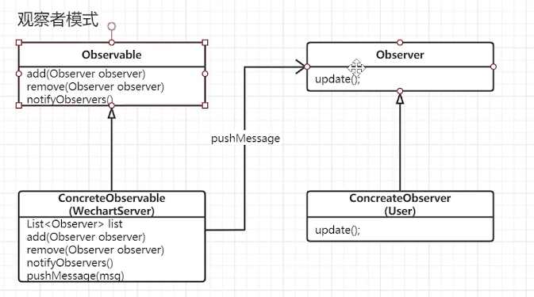
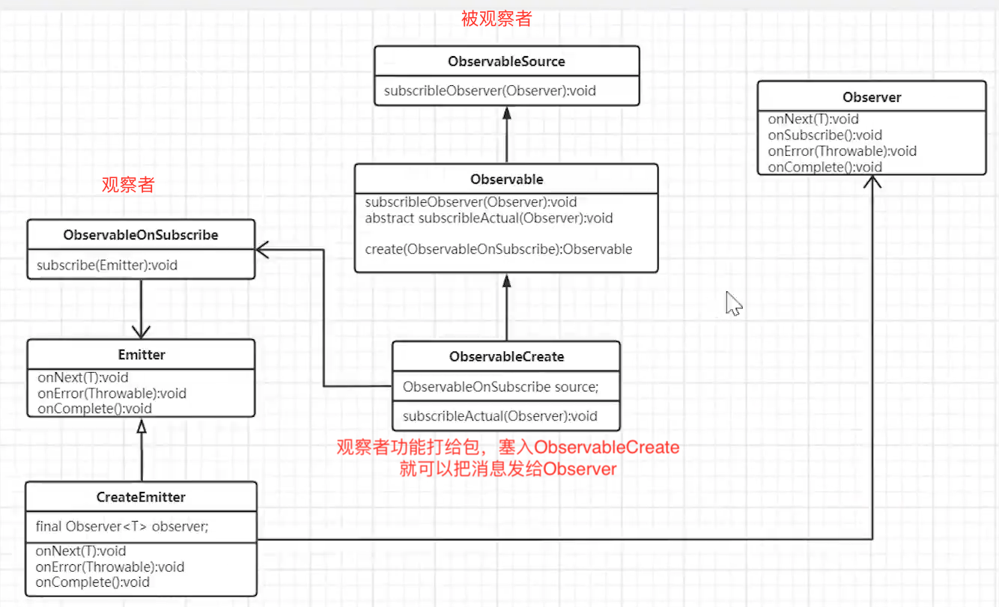
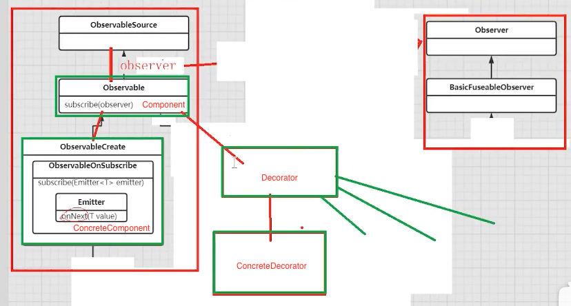

#### 原理






1. 最主要的是Observable里面持有observer引用，就可以给observer发消息，其他的都是拓展。
2. Rxjava2会有Flower等背压类继承ObservableSource，所以 Observable 从ObservableSource分离出来，让ObservableCreate实现subscribeAcutal(Observer)
3. 本来可以在ObservableCreate中直接发消息，因为emmit也可能变，现在把调用流程放到了ObservableOnSubscribe,并且传了emmit,最终ObservableOnSubscribe打包给了了ObservableCreate





#### 匿名内部类和lambda区别

[https://github.com/CarpenterLee/JavaLambdaInternals/blob/master/2-Lambda%20and%20Anonymous%20Classes(II).md](https://github.com/CarpenterLee/JavaLambdaInternals/blob/master/2-Lambda and Anonymous Classes(II).md)

**匿名内部类仍然是一个类，只是不需要程序员显示指定类名，编译器会自动为该类取名**。因此如果有如下形式的代码，编译之后将会产生两个class文件


**Lambda表达式通过\*invokedynamic\*指令实现，书写Lambda表达式不会产生新的类**

推论，this引用的意义

既然Lambda表达式不是内部类的简写，那么Lambda内部的`this`引用也就跟内部类对象没什么关系了。在Lambda表达式中`this`的意义跟在表达式外部完全一样。因此下列代码将输出两遍`Hello Hoolee`，而不是两个引用地址。

#### Java 函数式接口

1. java接口
2. 只有一个方法

##### 传统方法

```
private static void log(int level, String msg) {
    if (level == 1) { //如果不是1  msg已经拼接 所以造成浪费
        System.out.println(msg);
    }
}

public static void main(String[] args) {
    String msgA = "Hello";
    String msgB = "World";
    String msgC = "Java";
    log(1, msgA + msgB + msgC);
}
```

##### lambda

```
@FunctionalInterface
interface MessageBuilder {
    String builderMessage();
}

private static void showLog(int level, MessageBuilder msg) {
    if (level == 1) {
        System.out.println(msg.builderMessage());
    }
}


public static void main(String[] args) {
    String msgA = "Hello";
    String msgB = "World";
    String msgC = "Java";

    showLog(1, () ->
            msgA + msgB + msgC);
    //使用lambda表达式只是作为参数传递，仅仅吧参数传到showLog()中
    //只有日志等级是1时 才会调用builderMessage 拼接字符串


    showLog(1, () -> {
                System.out.println("1 是否执行");
                return msgA + msgB + msgC;
            }
    );
    showLog(2, () -> {
                System.out.println("2 是否执行");
                return msgA + msgB + msgC;
            }
    );

}
```


这样看来 lambda:  (左边是参数)  ->  {右边是方法体} 

方法体是 接口中唯一方法的实现

https://www.bilibili.com/video/BV1U4411V7Sv?p=5


#### Consumer

```
@FunctionalInterface
public interface Consumer<T> {

    /**
     * Performs this operation on the given argument.
     *
     * @param t the input argument
     */
    void accept(T t);

    /**
     * Returns a composed {@code Consumer} that performs, in sequence, this
     * operation followed by the {@code after} operation. If performing either
     * operation throws an exception, it is relayed to the caller of the
     * composed operation.  If performing this operation throws an exception,
     * the {@code after} operation will not be performed.
     *
     * @param after the operation to perform after this operation
     * @return a composed {@code Consumer} that performs in sequence this
     * operation followed by the {@code after} operation
     * @throws NullPointerException if {@code after} is null
     */
    default Consumer<T> andThen(Consumer<? super T> after) {
        Objects.requireNonNull(after);
        return (T t) -> { accept(t); after.accept(t); };
    }
}
```


##### accept

```
public static void method(String name,Consumer<String> con){
    con.accept(name);
}
```

```
method("john",(String name)->{
    System.out.println(name);
});
```


##### andThen

示例1

```
public static void method3(String s, Consumer1 con1, Consumer1 con2) {
    con1.andThen3(con2).accept(s);
}
```

等价于

示例2

```
public static void method(String s, Consumer<String> con1, Consumer<Double> con2) {
    con1.accept(s);
    con2.accept(Double.parseDouble(s));
}
```


```
method3("3.14", (t) -> {
    System.out.println(t + "15926");
}, (t) -> {
    System.out.println(t + "jj");
});
```


一开始 纳闷 ` con1.andThen3(con2).accept(s);`  为啥还调用一个accept(s)


自定义的Consumer1


```
@FunctionalInterface
public interface Consumer1 {

    /**
     * Performs this operation on the given argument.
     *
     * @param t the input argument
     */
    void accept(String t);

  
    default Consumer1 andThen(Consumer1 after) {
        Objects.requireNonNull(after);
        return (String t) -> {
            accept(t);
            after.accept(t);
        };
    }

    default Consumer1 andThen1(Consumer1 after) {
        Objects.requireNonNull(after);
        return (String t) -> {
            accept(t);
            after.accept(t);
        };
    }

    default Consumer1 andThen2(Consumer1 after) {
        Objects.requireNonNull(after);
        return (String t) -> {
            accept(t);
            accept(t);
            after.accept(t);
            after.accept(t);
        };
    }

    default Consumer1 andThen3(Consumer1 after) {
        Consumer1 m = (String t) -> {
            System.out.println("接收参数 t : "+t);

            after.accept(t);
            accept(t);
        };
        return m;
    }
}
```

我的理解 ：


1. 可以看 lambda 延迟调用的示例，当调用accept(s)方法 才开始调用方法体 `{ accept(t); after.accept(t); }`的方法，

2. 返回lambda,可以当作匿名内部类的语法糖, `accept(s)`当作匿名内部类的方法， s作为参数 传入到 `(T t) -> { accept(t); after.accept(t); }`  t中

   通过下面这个示例可以验证

   

   ```
   @FunctionalInterface
   interface MessageBuilder1 {
       String builderMessage(int param);
   }
   ```

   ```
   
   private static void showLog1(int level, MessageBuilder1 msg) {
       if (level == 1) {
           System.out.println(msg.builderMessage(5));
       }
   }
   ```

   ```
   showLog1(1, (t) -> {
       System.out.println(t);
       return msgA + msgB + msgC;
   });
   ```

   输出

   5
   HelloWorldJava

#### Function

```

package java.util.function;
/**
 * Represents a function that accepts one argument and produces a result.
 *
 * <p>This is a <a href="package-summary.html">functional interface</a>
 * whose functional method is {@link #apply(Object)}.
 *
 * @param <T> the type of the input to the function
 * @param <R> the type of the result of the function
 *
 * @since 1.8
 */
@FunctionalInterface
public interface Function<T, R> {

    /**
     * Applies this function to the given argument.
     *
     * @param t the function argument
     * @return the function result
     */
    R apply(T t);

    /**
     * Returns a composed function that first applies the {@code before}
     * function to its input, and then applies this function to the result.
     * If evaluation of either function throws an exception, it is relayed to
     * the caller of the composed function.
     *
     * @param <V> the type of input to the {@code before} function, and to the
     *           composed function
     * @param before the function to apply before this function is applied
     * @return a composed function that first applies the {@code before}
     * function and then applies this function
     * @throws NullPointerException if before is null
     *
     * @see #andThen(Function)
     */
    default <V> Function<V, R> compose(Function<? super V, ? extends T> before) {
        Objects.requireNonNull(before);
        return (V v) -> apply(before.apply(v));
    }

    /**
     * Returns a composed function that first applies this function to
     * its input, and then applies the {@code after} function to the result.
     * If evaluation of either function throws an exception, it is relayed to
     * the caller of the composed function.
     *
     * @param <V> the type of output of the {@code after} function, and of the
     *           composed function
     * @param after the function to apply after this function is applied
     * @return a composed function that first applies this function and then
     * applies the {@code after} function
     * @throws NullPointerException if after is null
     *
     * @see #compose(Function)
     */
    default <V> Function<T, V> andThen(Function<? super R, ? extends V> after) {
        Objects.requireNonNull(after);
        return (T t) -> after.apply(apply(t));
    }

    /**
     * Returns a function that always returns its input argument.
     *
     * @param <T> the type of the input and output objects to the function
     * @return a function that always returns its input argument
     */
    static <T> Function<T, T> identity() {
        return t -> t;
    }
}
```


```
public int compute(int a, Function<Integer,Integer> function){
    int reuslt = function.apply(a); //  相当于 2 * value  操作
    return reuslt;
}
```


```
FunctionTest functionTest = new FunctionTest();
functionTest.compute(1,value->{return  2 * value ;});

Function<Integer,Integer> function = value -> value *2;
functionTest.compute(1,function);

function.compose(function);
```


 RxJava 思考

https://gank.io/post/560e15be2dca930e00da1083#toc_31

https://juejin.im/post/6844903670203547656

https://juejin.im/post/6844903711416778765


https://www.jianshu.com/p/7fce2955f2db

https://juejin.im/post/6844903838978146317