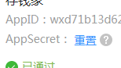
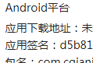

平常集成SDK虽然简单，但是过了半年就全忘了，又得重新来过

## 友盟分享

### 微信分享

[微信开发者平台](https://open.weixin.qq.com/)
创建应用需要 **应用签名**

* 关键信息:  微信分享主要有 appId AppSecret  应用签名 包名 友盟appkey
    	..	      
 
* 需要签名工具,可以从 [微信资源中心](https://open.weixin.qq.com/cgi-bin/showdocument?action=dir_list&t=resource/res_list&verify=1&id=open1419319167&token=&lang=zh_CN) 获取，安装后查看签名和微信平台签名是否一致

