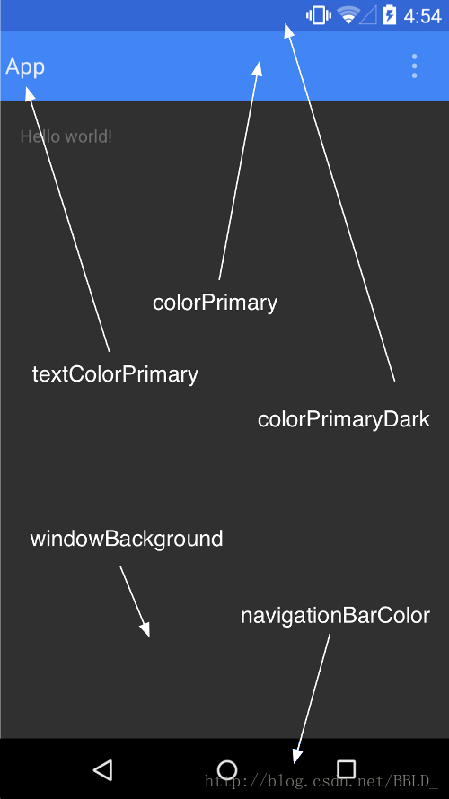
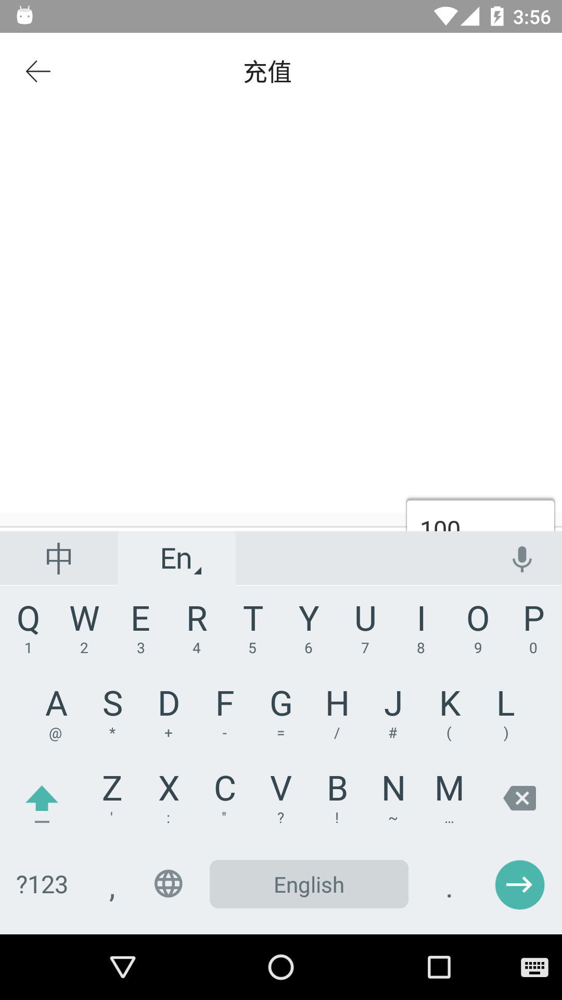

# 官网教程
 
 https://developer.android.com/training/appbar/setting-up.html?hl=zh-cn
在Best Practices for User Interface -> Adding the App Bar 


# toolbar整体设置

 

 参考:http://blog.csdn.net/a553181867/article/details/51336899


##  颜色设置
   
  AppTheme下的设置

```
  <application
        android:name=".application.NBBApplication"
        android:allowBackup="true"
        android:icon="@mipmap/icon"
        android:label="@string/app_name"
        android:supportsRtl="true"
        android:theme="@style/AppTheme">

```

* Toolbar颜色:
`<item name="colorPrimary">@color/toolbar_color</item>`
* 状态栏设置 : 
`<item name="android:windowTranslucentStatus">true</item>`
 在 API 19 及更高版本上，Toolbar 内容延伸至状态栏上去了, statebar把toolbar给覆盖了
 要解决这个问题就需要下面的属性
 *  android:fitsSystemWindows ="true"
  这个属性能保持与statebar一定 的padding,能解决上面windowTranslucentStatus的重叠问题
 
 参考: [亦枫](http://yifeng.studio/2017/02/19/android-statusbar/) 
 
  

## 自定义返回键

` mToolbar.setNavigationIcon(R.mipmap.ic_back);//自定义返回键`

或者这样设置 
 `app:navigationIcon="@mipmap/ic_back"`

 

## 项目中导航栏 

http://yifeng.studio/2016/10/12/android-toolbar/
http://www.bijishequ.com/detail/239876


还有一种方式是在application设置，这样就不用集成baseActivity
https://www.diycode.cc/topics/783


# menu设置

AppBarLayout下的 `app:theme="@style/toolbar_menu"`用于设置menu

## menu字体颜色

需要设置 app:theme ,用 android:theme不起作用.
 
`<item name="android:actionMenuTextColor">@color/text_my_black</item>`

## menu事件


    @Override
    public boolean onCreateOptionsMenu(Menu menu) {
        getMenuInflater().inflate(R.menu.menu_login, menu);
        menu.findItem(R.id.item_right_text).setTitle("注册"); //设置文字
        return true;
    }

    @Override
    public boolean onOptionsItemSelected(MenuItem item) {
        switch (item.getItemId()) {
            
                break;
        }
        return super.onOptionsItemSelected(item);
    }


# 问题
 
使用toolbar过程中遇到了一些问题

## 问题 1

弹出键盘后 editext不见了，应该是toolbar被拉伸了


暂时解决方式:


         <activity
            android:name=".activity.WebActivity"
            android:hardwareAccelerated="true"
            android:screenOrientation="portrait"
            android:windowSoftInputMode="adjustPan" />
https://github.com/CoolThink/StatusBarAdapt/issues/2
 

# fragment使用toolbar
http://wuxiaolong.me/2015/12/21/fragmentToolbar/
