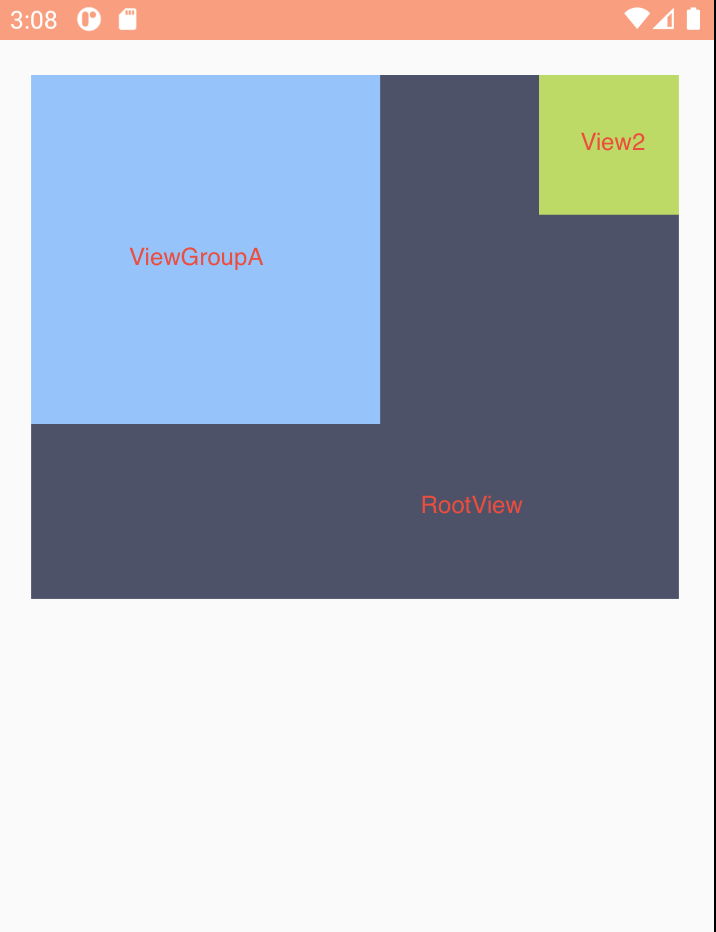
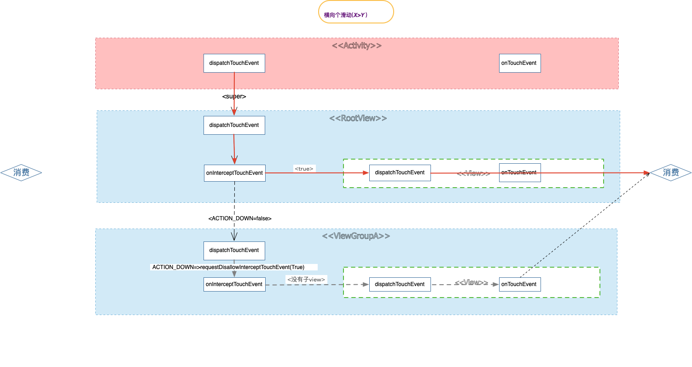

####  Button TextView

button clickable=true,所以 默认消费事件,TextView不会

* value.xml

```xml
<style name="Base.Widget.AppCompat.Button" parent="android:Widget">
    <item name="android:background">@drawable/abc_btn_default_mtrl_shape</item>
    <item name="android:textAppearance">?android:attr/textAppearanceButton</item>
    <item name="android:minHeight">48dip</item>
    <item name="android:minWidth">88dip</item>
    <item name="android:focusable">true</item>
    <item name="android:clickable">true</item>
    <item name="android:gravity">center_vertical|center_horizontal</item>
</style>
```


**处理开篇问题**

#### 处理方法

##### 外部拦截法:

​	需要在父ViewGroup，重写onInterceptTouchEvent( [ˌɪntərˈsept])方法，根据业务需要，判断哪些事件是父Viewgroup需要的，需要的话就对该事件进行拦截，然后交由onTouchEvent方法处理，若不需要，则不拦截，然后传递给子view或子viewGroup。


##### 内部拦截法

主要由子view控制事件，配合requestDisallowInterceptTouchEvent(),父View不拦截任何down事件

,思路是这样的，在ViewGroupA的Action_Down动作中设置requestDisallowInterceptTouchEvent(true),这样RootView不会走拦截方法，保证Action_Move,能进入ViewGroupA,然后在ViewGroupA的move事件中，根据需要控制RootView发送过来的后续Action_Move事件.




1. 代码

ViewGroupA

```
   @Override
    public boolean dispatchTouchEvent(MotionEvent ev) {
        Logger.d(ev.getAction(), TAG, Static.dispatchTouchEvent + "老板要做淘宝,下周上线?");
        int x = (int) ev.getX();
        int y = (int) ev.getY();
        switch (ev.getAction()) {
            case MotionEvent.ACTION_DOWN:
								getParent().requestDisallowInterceptTouchEvent(true);
                break;

            case MotionEvent.ACTION_MOVE:
                int deltaX = x - mLastX;
                int deltaY = y - mLastY;
                if (Math.abs(deltaX) > Math.abs(deltaY)) {
                    getParent().requestDisallowInterceptTouchEvent(false);
                } else {
                    getParent().requestDisallowInterceptTouchEvent(true);
                }
                break;
        }

        mLastX = x;
        mLastY = y;
        return super.dispatchTouchEvent(ev);
    }
```

RootView

```
    @Override
    public boolean onInterceptTouchEvent(MotionEvent ev) {
        Logger.d(ev.getAction(), TAG, Static.onInterceptTouchEvent + "(老板可能疯了,但又不是我做.)");
        if (ev.getAction() == MotionEvent.ACTION_DOWN) {
            return false;
        }else {
            return true;
        }
    }
```

2. 内部拦截ViewGroupA消费事件


运行结果

> D/MainActivity [老板] ACTION_DOWN: dispatchTouchEvent     经理,我准备发展一下电商业务,下周之前做一个淘宝出来.
> D/RootView     [经理] ACTION_DOWN: dispatchTouchEvent     呼叫技术部,老板要做淘宝,下周上线.
> D/RootView     [经理] ACTION_DOWN: onInterceptTouchEvent  (老板可能疯了,但又不是我做.)
> D/ViewGroupA   [组长] ACTION_DOWN: dispatchTouchEvent     老板要做淘宝,下周上线?
> D/ViewGroupA   [组长] ACTION_DOWN: onInterceptTouchEvent  (看着不太靠谱,先问问小王怎么看)
> D/ViewGroupA   [组长] ACTION_DOWN: onTouchEvent           小王说做不了
>
> 
>
> D/MainActivity [老板] ACTION_MOVE: dispatchTouchEvent     经理,我准备发展一下电商业务,下周之前做一个淘宝出来.
> D/RootView     [经理] ACTION_MOVE: dispatchTouchEvent     呼叫技术部,老板要做淘宝,下周上线.
> D/ViewGroupA   [组长] ACTION_MOVE: dispatchTouchEvent     老板要做淘宝,下周上线?
> D/ViewGroupA   [组长] ACTION_MOVE: onTouchEvent           小王说做不了
>
> 
>
> D/MainActivity [老板] ACTION_MOVE: dispatchTouchEvent     经理,我准备发展一下电商业务,下周之前做一个淘宝出来.
> D/RootView     [经理] ACTION_MOVE: dispatchTouchEvent     呼叫技术部,老板要做淘宝,下周上线.
> D/ViewGroupA   [组长] ACTION_MOVE: dispatchTouchEvent     老板要做淘宝,下周上线?
> D/ViewGroupA   [组长] ACTION_MOVE: onTouchEvent           小王说做不了

代码流程

Action_down都会被ViewGroupA消费,所以主要分析Action_Move事件流程,由于Action_down  requestDisallowInterceptTouchEvent(true)那么 disallowIntercept =true,

> 第1次 Action_Move 分发
>
> RootView 	 :   dispatchTouchEvent() 29 => 32=>36 intercepted = false => 58 =>
>
> ViewGroupA:   dispatchTouchEvent() 29=> 设置 getParent().requestDisallowInterceptTouchEvent(true) =>view => dispatchTouchEvent被消费
>
> 第2次Action_Move 分发
>
> RootView 	 :   dispatchTouchEvent() 29 => 32=>36 intercepted = false => 58 =>
>
> ViewGroupA:   dispatchTouchEvent() 29=> 设置y>x getParent().requestDisallowInterceptTouchEvent(true) =>view => dispatchTouchEvent被消费




运行结果

> 225 24328-24328/ D/MainActivity [老板] ACTION_DOWN: dispatchTouchEvent     经理,我准备发展一下电商业务,下周之前做一个淘宝出来.
> 226 24328-24328/ D/RootView     [经理] ACTION_DOWN: dispatchTouchEvent     呼叫技术部,老板要做淘宝,下周上线.
> 226 24328-24328/ D/RootView     [经理] ACTION_DOWN: onInterceptTouchEvent  (老板可能疯了,但又不是我做.)
> 227 24328-24328/ D/ViewGroupA   [组长] ACTION_DOWN: dispatchTouchEvent     老板要做淘宝,下周上线?
> 227 24328-24328/ D/ViewGroupA   [组长] ACTION_DOWN: onInterceptTouchEvent  (看着不太靠谱,先问问小王怎么看)
> 228 24328-24328/ D/ViewGroupA   [组长] ACTION_DOWN: onTouchEvent           小王说做不了
>
> 237 24328-24328/ D/MainActivity [老板] ACTION_MOVE: dispatchTouchEvent     经理,我准备发展一下电商业务,下周之前做一个淘宝出来.
> 237 24328-24328/ D/RootView     [经理] ACTION_MOVE: dispatchTouchEvent     呼叫技术部,老板要做淘宝,下周上线.
> 237 24328-24328/ D/ViewGroupA   [组长] ACTION_MOVE: dispatchTouchEvent     老板要做淘宝,下周上线?
> 237 24328-24328/ D/ViewGroupA   [组长] ACTION_MOVE: dispatchTouchEvent     dx:0 dy:0
> 238 24328-24328/ D/ViewGroupA   [组长] ACTION_MOVE: dispatchTouchEvent     Math.abs(deltaX) > Math.abs(deltaY) false
> 238 24328-24328/ D/ViewGroupA   [组长] ACTION_MOVE: onTouchEvent           小王说做不了
>
> 287 24328-24328/ D/MainActivity [老板] ACTION_MOVE: dispatchTouchEvent     经理,我准备发展一下电商业务,下周之前做一个淘宝出来.
> 287 24328-24328/ D/RootView     [经理] ACTION_MOVE: dispatchTouchEvent     呼叫技术部,老板要做淘宝,下周上线.
> 287 24328-24328/ D/ViewGroupA   [组长] ACTION_MOVE: dispatchTouchEvent     老板要做淘宝,下周上线?
> 288 24328-24328/ D/ViewGroupA   [组长] ACTION_MOVE: dispatchTouchEvent     dx:2 dy:0
> 288 24328-24328/ D/ViewGroupA   [组长] ACTION_MOVE: dispatchTouchEvent     Math.abs(deltaX) > Math.abs(deltaY) true
> 288 24328-24328/ D/ViewGroupA   [组长] ACTION_MOVE: onTouchEvent           小王说做不了
>
> 304 24328-24328/ D/MainActivity [老板] ACTION_MOVE: dispatchTouchEvent     经理,我准备发展一下电商业务,下周之前做一个淘宝出来.
> 305 24328-24328/ D/RootView     [经理] ACTION_MOVE: dispatchTouchEvent     呼叫技术部,老板要做淘宝,下周上线.
> 305 24328-24328/ D/RootView     [经理] ACTION_MOVE: onInterceptTouchEvent  (老板可能疯了,但又不是我做.)
>
> 320 24328-24328/ D/MainActivity [老板] ACTION_MOVE: dispatchTouchEvent     经理,我准备发展一下电商业务,下周之前做一个淘宝出来.
> 321 24328-24328/ D/RootView     [经理] ACTION_MOVE: dispatchTouchEvent     呼叫技术部,老板要做淘宝,下周上线.
> 321 24328-24328/ D/RootView     [经理] ACTION_MOVE: onTouchEvent           报告老板, 技术部说做不了
>
> 338 24328-24328/ D/MainActivity [老板] ACTION_MOVE: dispatchTouchEvent     经理,我准备发展一下电商业务,下周之前做一个淘宝出来.
> 338 24328-24328/ D/RootView     [经理] ACTION_MOVE: dispatchTouchEvent     呼叫技术部,老板要做淘宝,下周上线.
> 338 24328-24328/ D/RootView     [经理] ACTION_MOVE: onTouchEvent           报告老板, 技术部说做不了

代码流程

> 百思不得其姐， RootView dispatchTouchEvent 后面的onInterceptTouchEvent() 方法日志为什么没打印，其他都能通

```
MotionEvent.ACTION_DOWN requestDisallowInterceptTouchEvent(true),必须设置,否则后续的Action_Move无法进入 ViewGroupA
```

https://mp.weixin.qq.com/s?__biz=MzA5MzI3NjE2MA==&mid=2650237941&idx=1&sn=40bca69abe10015cc469132f8c76a910&chksm=88639a9abf14138cae7409adec85c5496486a044d7f4ef102e513d9c052aaa30017fb37e3439&scene=38#wechat_redirect