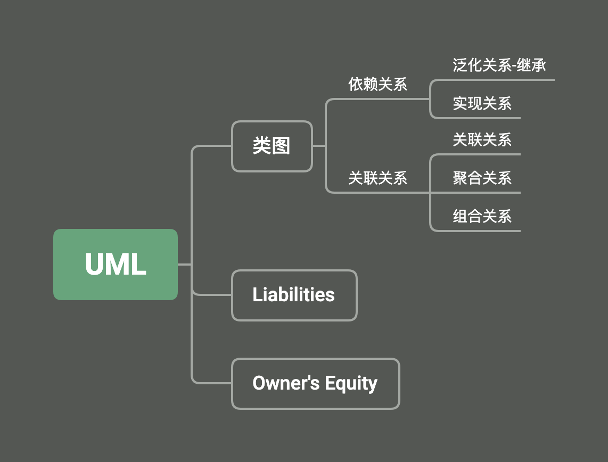
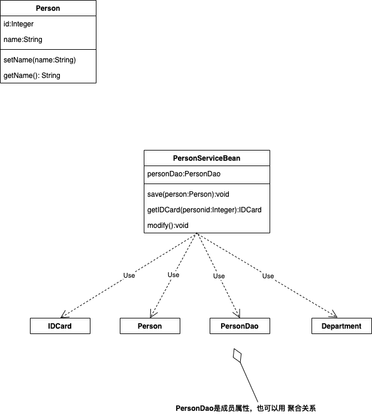
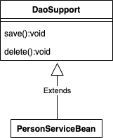
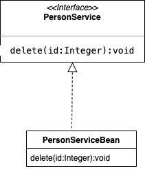
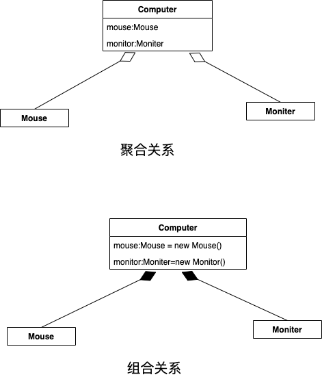
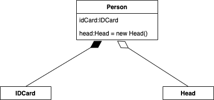

#### 工具

Android Studio插件




 							  				UML.xmind


#### **UML标准建模语言中5种主要的类型图**
https://design-patterns.readthedocs.io/zh-cn/latest/read_uml.html

https://www.visual-paradigm.com/tw/guide/uml-unified-modeling-language/what-is-uml/

https://www.cnblogs.com/shindo/p/5579191.html

https://juejin.im/post/5e96b1cae51d4546e41beeb3
https://design-patterns.readthedocs.io/zh-cn/latest/read_uml.html


#### 类图

```java
public class Person {
    private Integer age;
    private String name;

    public Integer getAge() {
        return age;
    }

    public void setAge(Integer age) {
        this.age = age;
    }

    public String getName() {
        return name;
    }

    public void setName(String name) {
        this.name = name;
    }
}
```


##### 依赖关系-dependency

1. 类中用到了对方。
2. 如果是类的成员属性。
3. 如果是方法的返回类型。
4. 是方法接收的参数类型。
5. 方法中使用到。





```java
public class PersonServiceBean {
    private PersonDao personDao;

    public void save(Person person) {
    }

    public void modify() {
        Department department = new Department();
    }
}

class PersonDao {
}

class IdCard {
}

class Person {
}

class Department {
}
```


##### 泛化关系-generalization

泛化关系实际上就是继承关系，他是依赖关系的特例。




```java
abstract class DataSupport {
    public void save(Object entity) {

    }

    public void delete(Object id) {

    }
}


public class PersonServiceBean extends DataSupport {
}
```


##### 实现关系-realization

A实现B类，就是依赖关系的特例。



```java
//A实现B类，就是依赖关系的特例。
public class PersonServiceBean implements PersonService {
    @Override
    public void delete(Integer id) {
        System.out.println("delte..");
    }
}

interface  PersonService{
    public void delete(Integer id);
}
```


##### 关联关系-Association

关联关系实际上是 类与类之间的联系，他是依赖关系的特例。

关联具有导航性（理解成属性）： 即双向关系或单向关系

关系具有多重性： “1” 有且仅有一个，“0”表示0个或者多个，"n...m"表示n到m个


单向一对一关系

```java
Public class Person{
  private IDCard card;
}

public class IDCard{}

```


双向一对一关系

```java
Public class Person{
  private IDCard card;
}

public class IDCard{
  private Person person;
}

```


##### 聚合关系- Aggregation

表示整体和部分的关系，整体与部分可以分开。聚合关系是关联关系的特例，所有他具有关联的导航性与多重性。

如:一台电脑由keyboard ,monitor  mouse组成，组成电脑的各个配件是可以从电脑上分离处理的，使用带空心菱形的实线表示。




```java
public class Computer {
    private Moniter moniter; //moniter可以和computer分离
    private Mouse mouse;//mouse可以和computer分离

}

class Mouse {
}

class Moniter {

}
```


下面是组合关系

```java
// computer对象创建moniter,mouse创建， computer销毁也跟着销毁。
public class Computer {
    private Moniter moniter = new Moniter(); //moniter可以和computer不能分离
    private Mouse mouse = new Mouse();//mouse可以和computer不能分离

}

class Mouse {
}

class Moniter {

}
```

##### 组合关系-Composition

也是整体与部分的关系，整体与部分不可以分开。

Person与IDCard Head，Head与Person就是组合关系，IDCard与Person就是聚合关系。


但是如果在程序中Person实体中定义了对 IDCard进行 **级联删除**，即删除Person时连同IDCard一起删除，那么IDCard和Person就是组合了。




```java
public class Person {
    private IDCard card;
    private Head head = new Head();
}

class IDCard{}
class Head{}
```


https://www.bilibili.com/video/BV1W4411c77E?p=28&spm_id_from=pageDriver


#### drawio部署

​	https://zhangzw.com/posts/20200107.html

1. [tomacat](https://tomcat.apache.org/download-80.cgi) 下载,下载 Core下的文件,解压

2. [Draw](https://github.com/jgraph/drawio/releases)下载，解压放到/apache-tomcat-8.5.65/webapps

3. 启动`tomcat chomd +x ./startup.sh  ,`

   ` sudo ./statup.sh`


#### PlantUml

https://plantuml.com/zh/

https://tngdigital.yuque.com/tngd-mobile/key-battle/xccdfz

时序图都是plantuml,点编辑才能看到code
