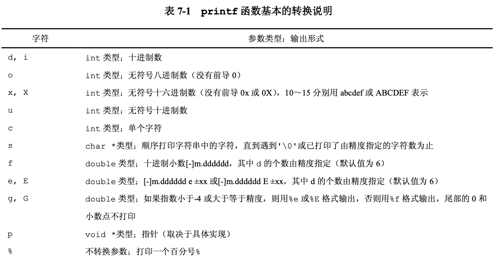
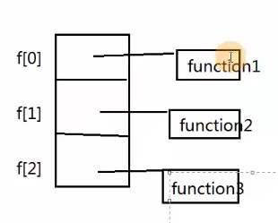

#### 指针

```c
#include <stdio.h>
#include <stdlib.h>

int main(int argc, const char * argv[]) {
    // insert code here...
    char* p = (char*)malloc(10);    //字符型指针 malloc堆空间分配内存
    *p = 'a';
    *(p+1) = 'b';
    *(p+2) = 'c';
    free(p);
    // p = NULL;
    printf("%s \n",p); 
}

```

输出 abc


##### 指针函数:带指针的函数

 函数的返回值为指针类型

 函数声明 : `int* func(int x,int y)`


指针函数调用

```c
char *q;
q = func(m);	// q与被调用的函数的返回类型一致
```


###### 示例1

```c
#include <stdio.h>

char *getWord(char c){
    switch (c) {
        case 'A': return "Apple";
        case 'B': return "Banana";
        case 'C': return "Cat";
        case 'D': return "Dog";
        default:return "None";
    }
}

int main(int argc, const char * argv[]) {
    char input;
    printf("please input a charactar:");
    input = getchar();
    printf("%c\n",input);
    printf("%s\n",getWord(input));
    getchar();
    return 0;
}

```

运行结果

```
please input a charactar:A
A
Apple
```

>  输入A ，getWord()返回值为 Apple的首地址,printf("%s\n),输出首地址所指向的值


###### 示例2

```c
#include <stdio.h>

char *getWord2(char c){
    char str1[] = "Apple";
    char str2[] = "Banana";
    char str3[] = "Cat";
    char str4[] = "Dog";
    char str5[] = "None";

    switch (c) {
        case 'A': return str1;
        case 'B': return str2;
        case 'C': return str3;
        case 'D': return str4;
        default:return str5;
    }
}


//#if (0)
int main(int argc, const char * argv[]) {
    char input;
    printf("please input a charactar:");
    input = getchar();
    printf("%c\n",input);
    printf("%s\n",getWord2(input));
    getchar();
    return 0;
}
//#endif

```

**注意: 不要返回局部变量的指针**

例子2中,str1数组是局部变量，这个字符数组在子程序结束后，它对应的存储空间会被释放.


##### 函数指针：指向函数的指针

指向函数起始地址的指针

###### 函数指针的定义

* `int (*fptr)(int,int)`  // (*func)中括号是必要的，这会告诉编译器我们声明的是函数指针而不是声明一个具有返回型为指针的函数

* 指针变量 :  *fptr , 

* 如果*fptr变为函数名，整个就是一个函数

###### 函数指针的使用

` fptr = func;`

int x = fptr(5,8);

> "%x " 打印指针本身

1. 示例

```c
#include <stdio.h>


int square(int num){
    return  num * num;
}

int main(int argc, const char * argv[]) {
    int num;
    int (*fp)(int); // fp是一个指针，指向返回类型为int，参数为int的函数.
    printf("please input a number:");
    scanf("%d",&num);
    fp = square;	// 函数与指针的联系
    printf("fp = 0x%x, %d\n",fp,(*fp)(num));	//'0x%x' 打印指针本身
    
    printf("fp = 0x%x, %d\n",fp,fp(num));		// fp直接调用也可以
    return  0;
     
}

```


square内存中占据的位置，fp保存square指针的入口地址,fp指向square(),*fp代表 调用square().


2. 用法

```c
#include <stdio.h>

int add(int num1,int num2){
    return num1+num2;
}


int sub(int num1,int num2){
    return num1-num2;
}

int calculate(int (*fp)(int,int),int num1,int num2){	//通用功能的函数
    return (*fp)(num1,num2);
}

int main(int argc, const char * argv[]) {
    printf("3+5=%d\n",calculate(add,3,5));
    printf("3-5=%d\n",calculate(sub,3,5));
    return 0;
}

```


3. 函数指针数组

```c
#include <stdio.h>

void function1(int);
void function2(int);
void function3(int);

void function1(int choice){
    printf("input %d, run function1().\n ",choice);
}


void function2(int choice){
    printf("input %d, run function2().\n ",choice);
}


void function3(int choice){
    printf("input %d, run function3().\n ",choice);
}

#if(1)
int main(int argc, const char * argv[]) {
    void (*f[3])(int) = {function1,function2,function3};//f[3] f是有3个元素的数组，数组的每个元素是指针类型,每个指针指向 参数为(int)类型的函数
    int choice;
    printf("please enter a digit : [0-2]: ");
    scanf("%d",&choice);
    while (choice>0&&choice<3) {
        (*f[choice])(choice);
        printf("please enter a digit : [0-2]: ");
        scanf("%d",&choice);
    }
    printf("run end");
}
#endif

```



https://www.bilibili.com/video/BV15J411Q7t9?from=search&seid=1110914330533311902


函数指针pft指向了一个已经声明的函数bar()，然后通过pft来实现输出字符和整型的目的。


```c++
void bar(char, int);

typedef  void (*PFT)(char, int);
int main(){
    PFT pft;
    pft = bar;
    pft('e',91);
}
void bar(char ch,int i){
    cout<< " bar "<<ch<<' '<<i<<endl;
    return;
}
```

函数指针作为函数的参数，我们可以在一个函数的形参列表中传入一个函数指针， 然后便可以在这个函数中使用这个函数指针所指向的函数

```c++
typedef void (*PFT)(char, int);

void bar(char ch, int i) {
    cout << "bar " << ch << ' ' << i << endl;
    return;
}

void foo(char ch, int i, PFT pf) {
    pf(ch, i);
    return;
}


int main() {
    PFT pft;
    pft = bar;
    foo('e', 12, pft);
}
```


函数对象

```c++
class A {
public:
    int operator()(int x) { return x; }
};


int main(){
    A a;
    cout<<a(5)<<endl;
}
```

```c++
class Func {
public:
    int operator()(int a, int b) {
        cout << a << '+' << b << '=' << a + b << endl;
        return a;
    }
};

int addFunc(int a, int b, Func &func) {
    func(a, b);
    return a;
}

int main() {

    Func func;
    addFunc(1, 3, func);
}
```


#### 结构体

##### 结构指针

point

```c
 		struct point  *pp;
    struct point pt = {400,600};
    pp = &pt;
    
    printf("pt  %d, %d   \n",pt.x, pt.y);//(*pp.x)中的圆括号是必须的，因为结构成员运算符的 "." 的优先级比先级高
    printf("*pp %d, %d    \n",(*pp).x, (*pp).y);
    printf("pp->  %d, %d  \n",pp->x, pp->y);
```

运行

```
pt  400, 600   
*pp 400, 600    
pp->  400, 600  

```

结构指针的使用频度非常高，C语言提供了另一种简写方式，假定P指向一个结构的指针，可以用

p-> 结构成员  ==  *p.结构成员

代码表达式`printf("origin is (%d,%d)\n", pp->x, pp->y);`


```c
 		struct rect r = {{200,300},{400,500}};
    struct rect *rp = &r;
    printf("pt1.x %d         \n",r.pt1.x);
    printf("(*rp).pt1.x %d  \n",(*rp).pt1.x);
    printf(" rp->pt1.x %d   \n",rp->pt1.x);
    printf("r.pt1.x %d  \n",r.pt1.x);
```

运行结果

```
pt1.x 200         
(*rp).pt1.x 200  
 rp->pt1.x 200   
r.pt1.x 200  
```


#### 动态内存分配

```c
    int a[5] = {4,10,2,8,6};
    int len;
    printf("请输入你需要分配的数组的长度：len = ");
    scanf("%d",&len);

    /**
     * sizeof(int) *len 分配len个int字节的长度，len =5时，就是20个字节
     * malloc返回 指向 第一个字节的地址
     * int * 第一个字节的地址，代表Int类型地址， pArr等价于a， pArr+1代表第二个Int地址
     */
    int *pArr = (int *)malloc(sizeof(int) *len);
    *pArr = 5; //类似于 a[0] =4;
     pArr[1] = 10; //类似于a[1]=10;
//     printf("%d %d ",*pArr,pArr[1]);

    for (int i = 0; i <len ; ++i) {
        scanf("%d" , &pArr[i]);
    }
    for (int i = 0;  i<len ; ++i) {
        printf("%d\n " , *(pArr+i));
    }

    free(pArr); //把pArr所代表的动态分配的20个字节的内存释放
```


##### 结构体变量(hao)

```c
#include <stdio.h>
#include <memory.h>

struct Student {
    int sid;
    char name[200];
    int age;
};


void g(struct Student student);

void g2(struct Student *pst);

void f(struct Student *pst);

int main() {
    struct Student st = {1000, "张三", 20};
    printf("%d   %s   %d\n", st.sid, st.name, st.age);
    st.sid = 99;
//    st.name = "lili"; //error
    strcpy(st.name, "lili");//复制
    st.age = 22;
    printf("%d   %s   %d\n", st.sid, st.name, st.age);


    struct Student *pst;
    pst = &st;
    pst->sid = 99; //  pst -> sid 等价于 (*pst).sid 而(*pst).sid 等价于 st.sid

    // pst -> sid
    // 所指向的结构体变量的sid这个成员

    g(st);
    g2(&st);

    return 0;
}

void g2(struct Student *pst) {
    printf("g2  %d   %s   %d\n", pst->sid, pst->name, pst->age);
}

//这种方式多耗 208 内存，耗时间 不推荐
void g(struct Student st) {
    printf("g  %d   %s   %d\n", st.sid, st.name, st.age);
}
```


##### 跨函数使用内存

```
#include <stdio.h>
#include <malloc.h>


struct Student{
    int sid;
    int age;
};


struct Student *createStudent(void);

void showStudent(struct Student *pst);

int main(){
    struct  Student *ps;
    ps = createStudent();
    showStudent(ps);
}

void showStudent(struct Student *pst) {
    printf("%d %d\n",pst->sid,pst->age);
}

struct Student *createStudent() {
    struct  Student *p = malloc(sizeof(struct Student)); //表示   struct Student整体的数据类型代表的字节数
            p->sid = 99;
            p->age = 88;
    return p;
}
```


##### 运算符优先级

* java运算符优先级

  > !   &&	||

#### 算法

https://space.bilibili.com/501486236/video


##### typedef  别名

type_1

```c
typedef int ZHANGSAN;//为int再重新多取一个名字，ZHANGSAN等价于int
typedef struct Student {
    int sid;
    char name[100];
    char sex;
} ST;


int main(void) {
    int i = 10; //等价于 ZHANGSAN i = 10;
    ZHANGSAN j = 20;
    printf("%d\n", j);

    struct Student st;//等价于 ST st;
    struct Student *ps = &st; // 等价于 ST * ps
    ST st2;
    st2.sid = 200;
    printf("%d\n",st2.sid);
}
```

type_2

```c
typedef struct Student {
    int sid;
    char name[100];
    char sex;
} * PST ; //PST等价于 struct Student * ,这样就是一个指针类型了

int main(void){
    struct  Student st;
    PST ps  = &st;
    ps->sid = 99;
    printf("%d\n",ps->sid);
    return 0;
}
```


type_3

```c
typedef struct Student {
    int sid;
    char name[100];
    char sex;
} * PSTU, STU; //等价于 ST代表了 struct Student st, PST 代表了struct Student *;

int main(void) {
    STU st; //等价于 struct Student st;
    PSTU  ps = &st; //struct Student * ps = &st;
    ps->sid = 99;
    printf("%d\n",ps->sid);
    return 0;
}
```


#### C++

##### 引用

> ```
> C++ 引用引用变量是一个别名，也就是说，它是某个已存在变量的另一个名字。一旦把引用初始化为某个变量，就可以使用该引用名称或变量名称来指向变量
> ```


```c++
#include <iostream>

using namespace std;

void swap(int &x, int &y) {
    int t = x;
    x = y;
    y = t;
}

int main() {
    int a = 3, b = 4;
    cout << a << "\t" << b << endl;
    swap(a, b);
    cout << a << "\t" << b << endl;
}
```

##### 函数模板

```c++

#include <iostream>

using namespace std;

template<typename  T>
T add(T x,T y){
    return  x+y;
}

int main(){
#if 0
    cout<<add<int>(5,3)<<endl;
    cout<<add<double >(5.3,7.8)<<endl;
    cout<<add<int>(4,6)<<endl;
    cout<<add<string>("hello","world")<<endl;
#else
    //类型自动推断
    cout<<add(5,3)<<endl;
    cout<<add(5.3,7.8)<<endl;
    cout<<add(4,6)<<endl;
    cout<<add((double)5,7.8)<<endl;
#endif
}
```


#### swift语法

```swift
var a = 10
var b: Int = 20
let aa = 40 //const

if a<20{
    print("a < 20 , true" )
}else{
    print("a >= 20")
}

switch a {
    case 10:
        print("a equals 10")
case 20:
        print("a equals 20")
default :
    print("other")
}

print("Hello, World!")

for i in 25..<100{
    print("aa,i=",i)
}

var list  = [1,2,3,4,5]
for i in list{
    print("aa, i=",i);
}


var loop = 0
while loop<10 {
    print("loop, xxx = ",loop)
    loop = loop + 1
}
func myFunc(a : Int) -> Int{
    print("this is a function",a)
    return a
}
var mm  = myFunc(a: 10)

print("Hello, World!",a,b,aa,mm)

```


environment
https://juejin.im/post/5ad98412518825670960c13c

https://developer.android.com/ndk/

