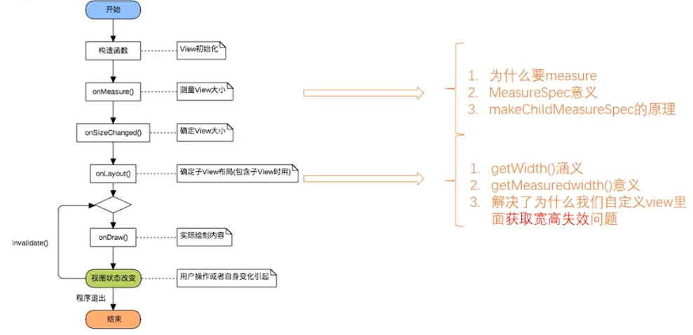
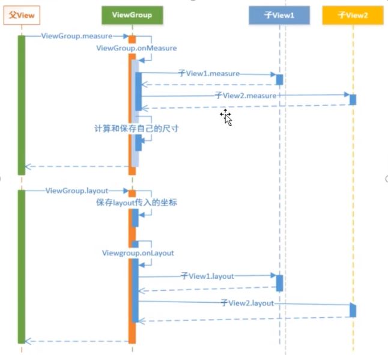
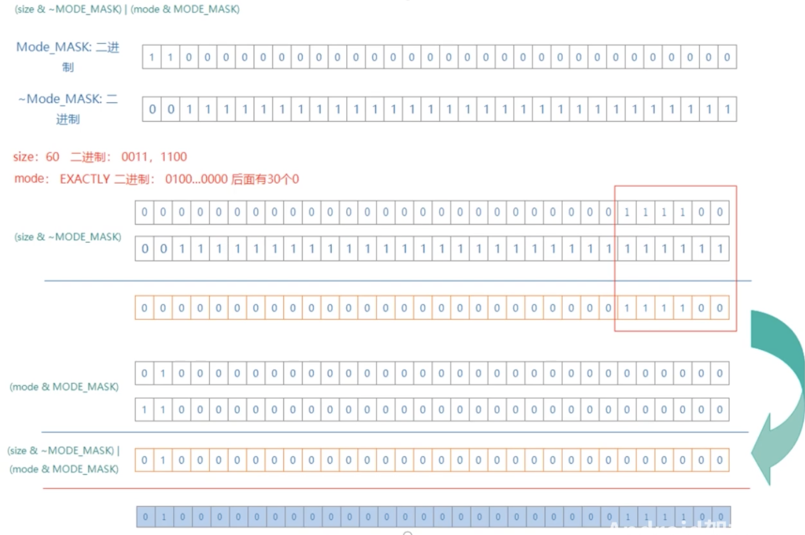

#### 生命周期




每次onMeasure，onLayout用到的值都不能在构造方法里面初始化。


#### 座标系 


getLeft()直接调用是0 ? 需要自己设置 chidView.layout(left, top,right,bottom),

没调用chidView.layout 就获取不到 getLeft()的值。

left这些参数的座标系 是基于ViewGroup.


#### getMeasuredWidth getWidth

##### getMeasuredWidth

1. 在measure()过程结束后就可以获取到对应的值。

2. 通过setMeasuredDimension()方法来进行设置。

##### getWidth

1. 在view.layout()过程结束后才能获取到；
2.  通过视图右边的坐标-左边的左边计算出来的


```java
final int childHeightMeasureSpec;
if (lp.height == LayoutParams.MATCH_PARENT) {
    final int height = Math.max(0, getMeasuredHeight()
            - getPaddingTopWithForeground() - getPaddingBottomWithForeground()
            - lp.topMargin - lp.bottomMargin);
    childHeightMeasureSpec = MeasureSpec.makeMeasureSpec(
            height, MeasureSpec.EXACTLY);
} else {
    childHeightMeasureSpec = getChildMeasureSpec(heightMeasureSpec,
            getPaddingTopWithForeground() + getPaddingBottomWithForeground() +
            lp.topMargin + lp.bottomMargin,
            lp.height);
}

child.measure(childWidthMeasureSpec, childHeightMeasureSpec);
```

Frame layout 子节点重新绘制，为什么

Framelayout边界怎么算的

```java
switch (absoluteGravity & Gravity.HORIZONTAL_GRAVITY_MASK) {
    case Gravity.CENTER_HORIZONTAL:
        childLeft = parentLeft + (parentRight - parentLeft - width) / 2 +
        lp.leftMargin - lp.rightMargin;
        break;
    case Gravity.RIGHT:
        if (!forceLeftGravity) {
            childLeft = parentRight - width - lp.rightMargin;
            break;
        }
    case Gravity.LEFT:
    default:
        childLeft = parentLeft + lp.leftMargin;
}
```


#### LayoutParams MeasureSpec

的关系

##### ViewGroup测量





先度量child View,再度量自己的大小。

先度量 child View,child view度量完成，如果是 wrap_content，就是all childview的size.


​															// parent size		 child want size

​																


```java
public static int getChildMeasureSpec(int spec, int padding, int childDimension) {// padding是parent view的
    int specMode = MeasureSpec.getMode(spec);
    int specSize = MeasureSpec.getSize(spec);

    int size = Math.max(0, specSize - padding);// parent size

    int resultSize = 0;
    int resultMode = 0;

    switch (specMode) {
    // Parent has imposed an exact size on us
    case MeasureSpec.EXACTLY:
        if (childDimension >= 0) {
            resultSize = childDimension;
            resultMode = MeasureSpec.EXACTLY;
        } else if (childDimension == LayoutParams.MATCH_PARENT) {
            // Child wants to be our size. So be it.
            resultSize = size;
            resultMode = MeasureSpec.EXACTLY;
        } else if (childDimension == LayoutParams.WRAP_CONTENT) {
            // Child wants to determine its own size. It can't be
            // bigger than us.
            resultSize = size;
            resultMode = MeasureSpec.AT_MOST;
        }
        break;

    // Parent has imposed a maximum size on us
    case MeasureSpec.AT_MOST:
        if (childDimension >= 0) {
            // Child wants a specific size... so be it
            resultSize = childDimension;
            resultMode = MeasureSpec.EXACTLY;
        } else if (childDimension == LayoutParams.MATCH_PARENT) {
            // Child wants to be our size, but our size is not fixed.
            // Constrain child to not be bigger than us.
            resultSize = size;
            resultMode = MeasureSpec.AT_MOST;
        } else if (childDimension == LayoutParams.WRAP_CONTENT) {
            // Child wants to determine its own size. It can't be
            // bigger than us.
            resultSize = size;
            resultMode = MeasureSpec.AT_MOST;
        }
        break;

    // Parent asked to see how big we want to be
    case MeasureSpec.UNSPECIFIED:
        if (childDimension >= 0) {
            // Child wants a specific size... let him have it
            resultSize = childDimension;
            resultMode = MeasureSpec.EXACTLY;
        } else if (childDimension == LayoutParams.MATCH_PARENT) {
            // Child wants to be our size... find out how big it should
            // be
            resultSize = View.sUseZeroUnspecifiedMeasureSpec ? 0 : size;
            resultMode = MeasureSpec.UNSPECIFIED;
        } else if (childDimension == LayoutParams.WRAP_CONTENT) {
            // Child wants to determine its own size.... find out how
            // big it should be
            resultSize = View.sUseZeroUnspecifiedMeasureSpec ? 0 : size;
            resultMode = MeasureSpec.UNSPECIFIED;
        }
        break;
    }
    //noinspection ResourceType
    return MeasureSpec.makeMeasureSpec(resultSize, resultMode);
}
```


##### MeasureSpec创建规则


1. 子View为精确宽高，无论父容器的MeasureSpec，子View的MeasureSpec都为精确值且遵循LayoutParams中的值。 
2. 子View为match_parent时，如果父容器是精确模式，则子View也为精确模式且为父容器的剩余空间大小；如果父容器是最大模式，则子View也是最大模式且不会超过父容器的剩余空间。
3. 子View为wrap_content时，无论父View是精确还是最大模式，子View的模式总是最大模式，且不会超过父容器的剩余空间。 

艺术探索


https://www.jianshu.com/p/cb529ed03597

https://juejin.cn/post/6844904094205739016

##### MeasureSpec表示

1. MeasureSpec用int表示,总共32位，高2位代表SpecMode，低30位代表SpecSize,SpecMode是指测量模式，而SpecSize是指在某种测量模式下的规格大小。MeasureSpec通过将SpecMode和SpecSize打包成一个int值来避免过多的对象内存分配.打包makeMeasureSpec。
2. 高2位 00 , 01, 10, 分别对应UNSPECIFIED, EXACTLY,AT_MOST。


* **UNSPECIFIED**

  父容器不对View有任何限制，要多大给多大，这种情况一般用于系统内部，表示一种测量的状态. 开发者用不了.

* **EXACTLY**

  父容器已经检测出View所需要的精确大小，这个时候View的最终大小就是SpecSize所指定的值。它对应于LayoutParams中的match_parent和具体的数值这两种模式。

* **AT_MOST** 

  父容器指定了一个可用大小即SpecSize,View的大小不能大于这个值


​	 





Inflate解析过程

https://www.bilibili.com/video/BV1Ka4y1j7HA?p=4&spm_id_from=pageDriver

https://www.youtube.com/watch?v=aOb4Hvqbeu4

https://www.bilibili.com/video/BV1M54y1y79P?from=search&seid=18028227823566625572&spm_id_from=333.337.0.0


#### 自定义View Margin

https://blog.csdn.net/qiantanlong/article/details/82347850
