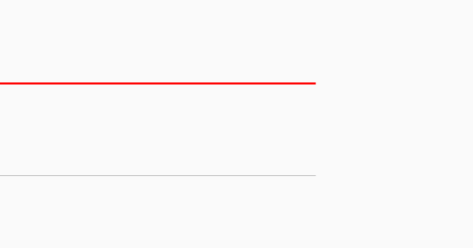

####  Canvas的常用操作速查表

| 操作类型     | 相关API                                                      | 备注                                                         |
| ------------ | ------------------------------------------------------------ | ------------------------------------------------------------ |
| 绘制颜色     | drawColor, drawRGB, drawARGB                                 | 使用单一颜色填充整个画布                                     |
| 绘制基本形状 | drawPoint, drawPoints, drawLine, drawLines, drawRect, drawRoundRect, drawOval, drawCircle, drawArc | 依次为 点、线、矩形、圆角矩形、椭圆、圆、圆弧                |
| 绘制图片     | drawBitmap, drawPicture                                      | 绘制位图和图片                                               |
| 绘制文本     | drawText,    drawPosText, drawTextOnPath                     | 依次为 绘制文字、绘制文字时指定每个文字位置、根据路径绘制文字 |
| 绘制路径     | drawPath                                                     | 绘制路径，绘制贝塞尔曲线时也需要用到该函数                   |
| 顶点操作     | drawVertices, drawBitmapMesh                                 | 通过对顶点操作可以使图像形变，drawVertices直接对画布作用、 drawBitmapMesh只对绘制的Bitmap作用 |
| 画布剪裁     | clipPath,    clipRect                                        | 设置画布的显示区域                                           |
| 画布快照     | save, restore, saveLayerXxx, restoreToCount, getSaveCount    | 依次为 保存当前状态、 回滚到上一次保存的状态、 保存图层状态、 回滚到指定状态、 获取保存次数 |
| 画布变换     | translate, scale, rotate, skew                               | 依次为 位移、缩放、 旋转、错切                               |
| Matrix(矩阵) | getMatrix, setMatrix, concat                                 | 实际画布的位移，缩放等操作的都是图像矩阵Matrix，只不过Matrix比较难以理解和使用，故封装了一些常用的方法。 |


> PS： Canvas常用方法在上面表格中已经全部列出了，当然还存在一些其他的方法未列出，具体可以参考官方文档 [Canvas](http://developer.android.com/reference/android/graphics/Canvas.html)


#### Use Canvas

##### Path

* lineTo简单实现

```java
 				canvas.translate(DeviceUtil.mWidth / 2, DeviceUtil.mHeight / 2); //原点移动到屏幕中心
        Path path = new Path();
        path.lineTo(200, 200);
        path.lineTo(200, 0);
        canvas.drawPath(path, mPaint);
```


从字面意思 lineto,顾名思义肯定就有from的坐标点，再看这个借的图，第一条线是从原点开始的，第二条线是从A开始的，

```java
path.close();  //形成封闭的图形
```


   这些操作都可以叠加

* Rect RectF区别: Rect是使用int类型作为数值，RectF是使用float类型作为数值。

  四个参数是 矩形左上角和右下角两个点的坐标

* 画线

```java
       Path path = new Path();
       path.moveTo(100, 100);
       path.rLineTo(100, 200);
       canvas.drawPath(path, mPaint);
```

##### Draw Circle

- 画笔

  ```
  mPaint = new Paint();
  mPaint.setColor(Color.BLUE);
  mPaint.setStyle(Paint.Style.FILL); // Fill是空心圆 ，STROKE实心圆,
  空心圆就需要设置setStrokeWidth这个属性
  ```

  canvas.drawCircle(getWidth()/2,getHeight()/2,getWidth()/2,mPaint);

  public void drawArc(RectF oval, float startAngle, float sweepAngle, boolean useCenter, Paint paint)

  

  oval :指定圆弧的外轮廓矩形区域。
  startAngle: 圆弧起始角度，单位为度。
  sweepAngle: 圆弧扫过的角度(起始位置 X轴)，顺时针方向，单位为度,从右中间开始为零度。
  useCenter: 如果为True时，在绘制圆弧时将圆心包括在内，通常用来绘制扇形

  RectF是矩形的内接圆,left top right bottom分别对象 左上角和右下角 坐标


##### drawText

坐标(0,0)位于左下角

```
canvas?.drawText("测试文字",0f,0f,mPaint)
```

measure textSize 

```

val kgRect = Rect()
var kgText = "hello world"
mDialPaint.getTextBounds(kgText,0,kgText.length,kgRect)
var txtHeight = kgRect.height()
var txtWidth = kgRect.width()
```


```
 canvas.drawPoint(200, 200, mPaint);
        canvas.drawPoints(new float[]{          //绘制一组点，坐标位置由float数组指定
                500, 500,
                500, 600,
                500, 700
        }, mPaint);
```

位移(translate)

```
			 // 在坐标原点绘制一个黑色圆形
        canvas.translate(200, 200);
        canvas.drawCircle(0, 0, 100, mPaint);
        // 在坐标原点绘制一个蓝色圆形
        mPaint.setColor(Color.BLUE);
        canvas.translate(200, 200);
        canvas.drawCircle(0, 0, 100, mPaint);
```

缩放(scale)

```
 				canvas.translate(mWidth / 2, mHeight / 2);
        RectF rect = new RectF(0, -400, 400, 0);   // 矩形区域
        mPaint.setColor(Color.BLACK);           // 绘制黑色矩形
        canvas.drawRect(rect, mPaint);
        canvas.scale(-0.5f, -0.5f);          // 画布缩放  <-- 缩放中心向右偏移了200个单位
        mPaint.setColor(Color.BLUE);            // 绘制蓝色矩形
        canvas.drawRect(rect, mPaint);
        
        
        
        RectF rect = new RectF(-400, -400, 400, 400);
        canvas.drawRect(rect, mPaint);
        for (int i = 0; i < 20; i++) {
            canvas.scale(0.9f, 0.9f);
            canvas.drawRect(rect, mPaint);
        }
```

旋转(rotate)

```
canvas.rotate(180);
```

#####  drawPicture 三个方法

> public void drawPicture (Picture picture) 
>
> public void drawPicture (Picture picture, Rect dst) 
>
> public void drawPicture (Picture picture, RectF dst)

##### drawBitmap 三个方法

> // 第一种 public void drawBitmap (Bitmap bitmap, Matrix matrix, Paint paint) 
>
> // 第二种 public void drawBitmap (Bitmap bitmap, float left, float top, Paint paint)
>
> // 第三种 public void drawBitmap (Bitmap bitmap, Rect src, Rect dst, Paint paint) public void drawBitmap (Bitmap bitmap, Rect src, RectF dst, Paint paint)

直接看第三种方法

```
        // 指定图片绘制区域(左上角的四分之一)
        Rect src = new Rect(0, 0, bitmap.getWidth() / 2, bitmap.getHeight() / 2);

        // 指定图片在屏幕上显示的区域
        Rect dst = new Rect(0, 0, 400, 500);
        //绘制图片
        canvas.drawBitmap(bitmap, src, dst, null);
```


Angle

**在常见的数学坐标系中角度增大方向为逆时针，**

**在默认的屏幕坐标系中角度增大方向为顺时针。**


sweepAngle扫过的角度

```
drawArc(@NonNull RectF oval, float startAngle, float sweepAngle, boolean useCenter,
        @NonNull Paint paint)
```

canvas?.drawArc(rectF,0f,145f,false,mDialPaint)


##### save restore

SaveRestoreView

```
   canvas?.drawLine(0f,200f,700f,200f,linePaint)
//        canvas?.save()  //将画布状态保存
   canvas?.rotate(90f, px / 2, py / 2);
//        canvas?.restore();//恢复画布状态 这个操作能撤销到 上次保存的画布状态
   canvas?.drawLine(0f,400f,700f,400f,bgPaint)
```

运行效果：


打开注释后的运行效果，这样运行后相当于 没有发生选择画布这件事。




#### saveslayer 图层

https://blog.csdn.net/cquwentao/article/details/51423371


 https://www.jianshu.com/p/0bd672626c8d

Canvas demo

https://medium.com/better-programming/learn-all-android-canvas-draw-functions-dd5d6595884a