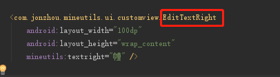

绘制心电图

<https://github.com/SeekerFighter/LuckyEcgDemo>

<https://www.jianshu.com/p/16301de41a18>


##### 表单输入


```
/**
 * EditText文字固定在右边
 */
public class EditTextRight extends AppCompatEditText {
    private String txtRight;
    private Paint mPaint;

    public EditTextRight(Context context) {
        super(context);
    }

    public EditTextRight(Context context, AttributeSet attrs) {
        super(context, attrs);

        initAttrs(context, attrs);

    }

    private void initAttrs(Context context, AttributeSet attrs) {
        TypedArray ta = context.obtainStyledAttributes(attrs, R.styleable.EditTextRight);
        mPaint = new Paint(Paint.ANTI_ALIAS_FLAG);
        txtRight = ta.getString(R.styleable.EditTextRight_textright);
//        Timber.d("text" + txtRight);
        ta.recycle();
    }


    @Override
    protected void onDraw(Canvas canvas) {
        super.onDraw(canvas);
        float txtSize = getTextSize();
        if (!TextUtils.isEmpty(txtRight)) {
            float yrig = getWidth() - txtSize * txtRight.length() - 10; //getWidth() 控件宽度
            Timber.d("txt " + txtRight + "   getRight " + yrig);
            canvas.drawText(txtRight, yrig, getBaseline(), getPaint());
        }
    }
}
```

```
  <com.jonzhou.mineutils.ui.customview.EditTextRight
        android:layout_width="100dp"
        android:layout_height="wrap_content"
        mineutils:textright="幢" />
```


##### 自定义属性

画正方形

- ```
  <com.jonzhou.cusomview.view.MyView
      android:layout_width="wrap_content"
      android:layout_height="100dp"
      android:background="@android:color/holo_blue_bright" />
  ```

```
public class MyView extends View {
    public MyView(Context context) {
        super(context);
    }

    public MyView(Context context, AttributeSet attrs) {
        super(context, attrs);
        Timber.i(" MyView(Context context, AttributeSet attrs)");
    }

    public MyView(Context context, AttributeSet attrs, int defStyleAttr) {
        super(context, attrs, defStyleAttr);
    }


    @Override
    protected void onMeasure(int widthMeasureSpec, int heightMeasureSpec) {
        super.onMeasure(widthMeasureSpec, heightMeasureSpec);

        Timber.i("onMeasure(int widthMeasureSpec, int heightMeasureSpec)");
        int width = getMySize(100, widthMeasureSpec);
        int height = getMySize(100, heightMeasureSpec);
        if (width < height) {
            height = width;
        } else {
            width = height;
        }
        Timber.i("width " + width + "   height  " + height);
        setMeasuredDimension(width,height);
    }

    private int getMySize(int defaultSize, int measureSpec) {
        int mySize = defaultSize;
        int mode = MeasureSpec.getMode(measureSpec);
        int size = MeasureSpec.getSize(measureSpec);
        switch (mode) {
            case MeasureSpec.UNSPECIFIED: //如果没有指定大小，就设置为默认大小
                mySize = defaultSize;
                break;
            case MeasureSpec.AT_MOST://如果测量模式是最大取值为size
                //我们将大小取最大值,你也可以取其他值
                mySize = size;
                break;
            case MeasureSpec.EXACTLY:
                mySize = size;
                break;
        }
        return mySize;
    }
}
```

设置 match_parent不是正方形?

- 关于自定义属性不提示 declare-styleable name要和自定义类名相同，然后重启Ide就好了


- 那么获取到的mode和size又代表了什么呢？ 
  mode代表了我们当前控件的父控件告诉我们控件，你应该按怎样的方式来布局。 
  mode有三个可选值：EXACTLY, AT_MOST, UNSPECIFIED。它们的含义是：

  EXACTLY：父控件告诉我们子控件了一个确定的大小，你就按这个大小来布局。比如我们指定了确定的dp值和macth_parent的情况。 
  AT_MOST：当前控件不能超过一个固定的最大值，一般是wrap_content的情况。 UNSPECIFIED:当前控件没有限制，要多大就有多大，这种情况很少出现。

  - 下面是一个重写onMeasure的固定伪代码写法：

  ```
  if mode is EXACTLY{
       父布局已经告诉了我们当前布局应该是多大的宽高, 所以我们直接返回从measureSpec中获取到的size 
  }else{
       计算出希望的desiredSize
       if mode is AT_MOST
            返回desireSize和specSize当中的最小值
       else:
            返回计算出的desireSize
     }
  ```


  原文：https://blog.csdn.net/yissan/article/details/51136088 

##### 自定义属性不提示 

  按照如图两名称一致，重启AndroidStudio




 https://blog.csdn.net/skysmile_/article/details/78833438

 https://developer.android.com/guide/topics/ui/custom-components

 https://developer.android.com/training/custom-views/custom-drawing

绘图
http://blog.csdn.net/huaiyiheyuan/article/details/52205969

画圆
http://www.jianshu.com/p/d891fe636898


##### Scroll 滑动

https://juejin.im/post/5c7f4f0351882562ed516ab6#heading-17

https://blog.csdn.net/guolin_blog/article/details/48719871


#### Kotlin

```
class TermRoundView @JvmOverloads constructor(
        context: Context?, attrs: AttributeSet?,
        defStyleAttr: Int = 0
) : View(context, attrs, defStyleAttr) {
	init{
	  val a = context?.theme?.obtainStyledAttributes(attrs, R.styleable.TermRoundView, 0, 0)
        try {
            isRulerInput = a!!.getBoolean(R.styleable.TermRoundView_isRulerInput, false)
        } finally {
            a?.recycle()
        }
	}
}
```

 


https://juejin.im/post/6844903909320835080