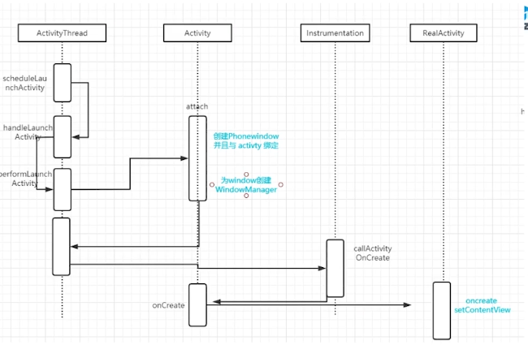
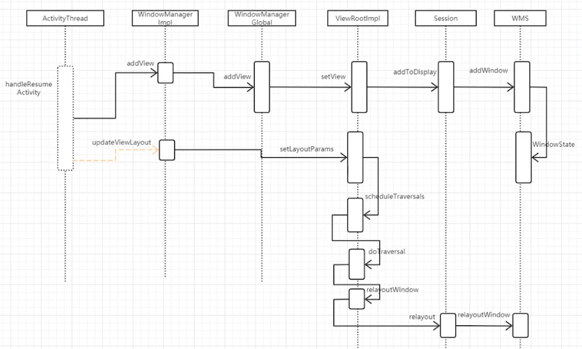
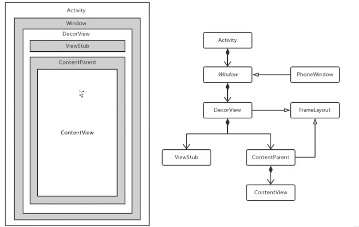

AMS启动activity

##### Activity启动流程






##### window作用

单一职责:解藕activity view





##### View是生命周期哪个方法绘制

1. window负责管理UI,因为window是在 onCreate()之后产生的，所以view绘制一定在onCreate()之后。

2.  onResume() decorview和Activity进行绑定，所以也是 onCreate()能在子线程刷新UI的原因 ,

3. 接着在 onResume()调用 performMeasure() performLayout(), performDraw()

   


```java
textView = findViewById(R.id.tv_thread);
new Handler().post(() -> {
    Log.i("GlideActivity", "onResume: " + textView.getWidth());
});
```

运行结果 

> I/GlideActivity: onResume: 0


OnResume()也是一个消息，虽然post消息放在后面，但是是因为建立了消息屏障。所以还是先执行，然后获取宽度为0;


https://www.bilibili.com/video/BV1FK4y1R7Nw?from=search&seid=12068296586023469576
