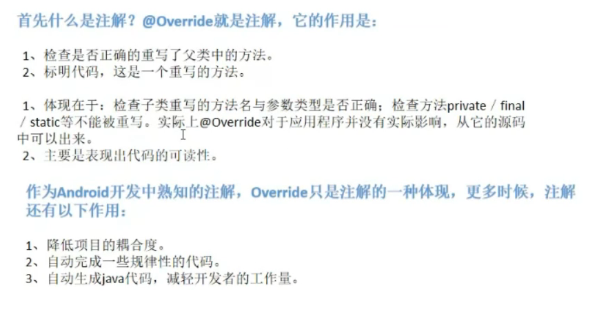
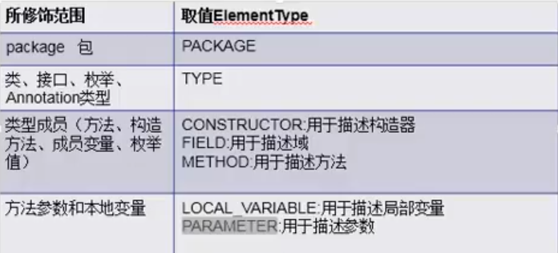
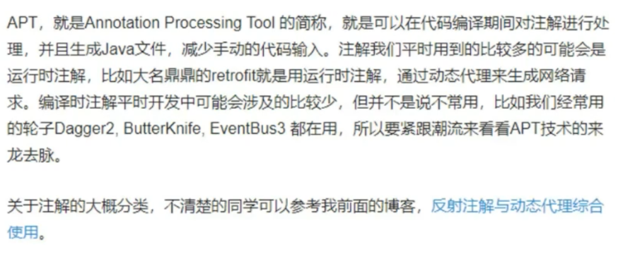
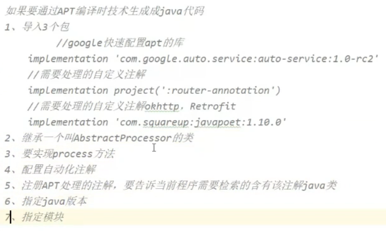
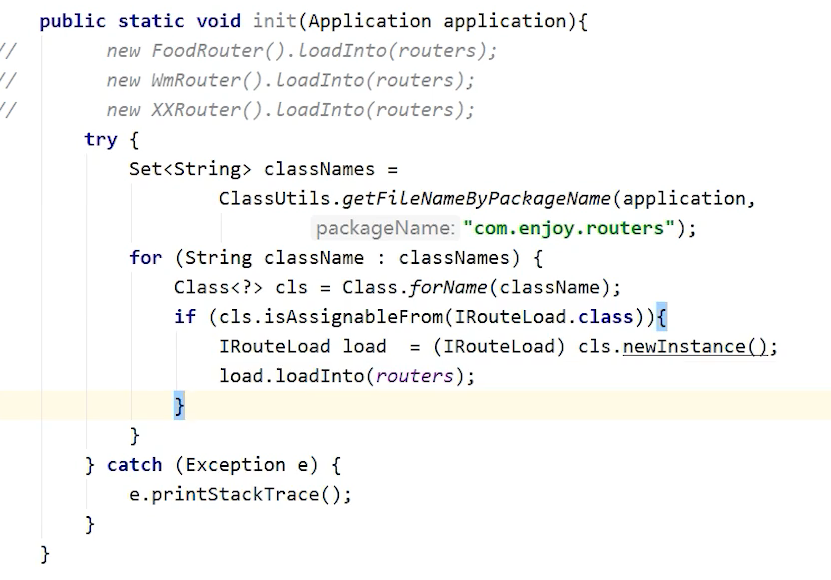

### 注解

#### 注解的作用



https://blog.csdn.net/briblue/article/details/73824058


- 提供信息给编译器： 编译器可以利用注解来探测错误和警告信息
- 编译阶段时的处理：  软件工具可以用来利用注解信息来生成代码、Html文档或者做其它相应处理。
- 运行时的处理：  某些注解可以在程序运行的时候接受代码的提取


元注解 ： 不可以再分的注解， 负责注解其他注解。java定义了4个标准的meta-annotation类型,它们被用来提供对其它annotation类型作说明。Target Retention Documented Inherited

​				如上图的 Overide被@Target和@Retention修饰，他们用来说明解释其他注解，位于 java.lang.annotation下


#### 元注解类型

##### Target 

用于描述注解的使用范围(注解可以用在什么地方)

如 类 属性 方法等




##### Retention

需要什么级别保存该注释信息，用于保留注解的生命周期


##### @Inherited

标明所修饰的注解，在所作用的类上，是否可以被继承。


##### @Documented

javadoc的工具文档化


#### 注解使用

```java
public @interface Sxt{
 	String studentName();  // studentName 参数名， String参数类型
}
```


注解元素必须要有值，我们定义注解元素时，经常使用空字符串，0作为默认值。

也经常使用负数(比如:-1)表示不存在的含义

annotation01

```java
@Target(value = {ElementType.METHOD,ElementType.TYPE}) //针对方法 和类有效
@Retention(RetentionPolicy.RUNTIME)	// 针对运行时有效
public @interface Annotation01 {
    String studentName() default "";
    int age() default 0;
    int id() default -1; // String indexOf("abc") -1

    String[] schools() default {"清华大学","哈工大"};
}
```

Annotation02

```java
@Target(value = {ElementType.METHOD,ElementType.TYPE})
@Retention(RetentionPolicy.RUNTIME)
public @interface Annotation02 {
    String value();
}
```

如果只有一个参数，一般写成value

Demo01

```java
@Annotation01
public class Demo02 {
    @Annotation01(age = 19, studentName = "老高",
            id = 1001, schools = {"哈工大", "清华大学"})
    public void test() {
    }
    @Annotation02(value = "aaaa")
    public void test01() {

    }
    @Annotation02("aaaa")
    public void test02() {
    }
}
```

使用注解,参照 test01(),也可以省略"value=" 参见test02()


##### 注解实例

注解设置 SxtStudent信息，映射数据库

```java
@Target(value = {ElementType.TYPE})
@Retention(RetentionPolicy.RUNTIME)
public @interface SxtTable {
    String value();
}
```


```java
@Target(value = {ElementType.FIELD})
@Retention(RetentionPolicy.RUNTIME)
public @interface SxtField {
    String columnName();
    String type();
    int length();
}
```


```java
@SxtTable("tb_student")
public class SxtStudent {
    @SxtField(columnName = "id",type = "int",length = 10)
    private  int id;

    @SxtField(columnName = "sname",type = "varchar",length = 10)
    private String studentName;

    @SxtField(columnName = "age",type = "int",length = 3)
    private int age;
}
```

通过第三方工具获取注解信息

```java
try {
    Class clazz = Class.forName("annotation.SxtStudent");

    //获得类的所有有效注解
    Annotation[] annotations = clazz.getAnnotations();
    for (Annotation a:annotations){
        System.out.println(a);
    }
    //获得类的指定注解
    SxtTable st = (SxtTable)clazz.getAnnotation(SxtTable.class);
    System.out.println(st.value());

    //获得类的属性的注解
    Field f = clazz.getDeclaredField("studentName");
    SxtField sxtField = f.getAnnotation(SxtField.class);
    System.out.println(sxtField.columnName()+"--" + sxtField.type()+"---" + sxtField.length());

} catch (ClassNotFoundException e) {
    e.printStackTrace();
} catch (NoSuchFieldException e) {
    e.printStackTrace();
}
```


运行结果

> @annotation.SxtTable(value=tb_student)
> tb_student
> sname--varchar---10


##### 反射实例

```java
String path = "reflection.User";
try {
    Class<?> clazz = Class.forName(path);
    //对象是表示或封装一些数据。一个类被加载后，JVM会创建一个对应该类的Class对象，类的整个结构信息会放到对应的CLass对象中。
    //这个Class对象就像一面镜子一样，通过这面镜子我可已看到对应类的全部信息。
    System.out.println(clazz.hashCode());

    Class clazz2 = Class.forName(path); // 一个类对应的一个class对象
    System.out.println(clazz2.hashCode());

    Class intCLazz = int.class;
    int[] arr01 = new int[10];
    int[][] arr02 = new int[30][3];
    int[]arr03 = new int[30];
    double[] arr04 = new double[10];

    System.out.println(arr01.getClass().hashCode());
    System.out.println(arr02.getClass().hashCode());
    System.out.println(arr03.getClass().hashCode());
    System.out.println(arr04.getClass().hashCode());
```


https://www.youtube.com/watch?v=vZe5zG0vh3U&list=PLC664nq_h8b9Jzh-qYJ_AeOpmSoBLC_tg&index=1


### 注解处理器

是javac处理注解的一种工具，它用来在编译时扫描和处理注解。简单来说就是在编译器，通过注解采集信息，生成.java文件。减少重复代码的编写。

##### APT原理




##### 步骤




##### 问题

APT就这固定的几步，网上demo可以生成，我的就是没法生成，原来是因为,@DIActivity类的头部没有设置

```java
@DIActivity
public class MainActivity extends AppCompatActivity {
}
```

项目 MRouter


#### Arouter

##### 原理

获得当前程序在手机中对应的apk文件,使用classsloader:dexfile(PMS)，反射获取apk所有的类，筛选出注册activity的类。初始化


##### 核心实现




https://www.bilibili.com/video/BV1Ly4y1W7f5?p=6&spm_id_from=pageDriver

https://www.bilibili.com/video/BV1nU4y1a79o?from=search&seid=3188418579827888379


https://juejin.cn/post/6925283352698159117#heading-14

https://juejin.cn/post/6947992544252788767

https://blog.csdn.net/xx326664162/article/details/68490059

https://hanshuliang.blog.csdn.net/article/details/117072224

https://github.com/han1202012/APT


#### 反射机制

Java反射机制是在运行状态中，对于任意一个类，都能够知道这个类的所有属性和方法；对于任意一个对象都能够调用它的任意一个方法；这种动态获取的信息以及动态调用对象的方法的功能称为java的反射机制。

##### 基本使用

```java
package reflection;
public class MethodReflect {
    public int addResult(int addNum) {
        return addNum;
    }
}
```


```java
//使用反射第一步:获取操作类MethodDemoFieldDemo所对应的Class对象
Class < ?>cls = Class.forName("reflection.MethodReflect");
//使用MethodDemo类的class对象生成 实例
Object obj = cls.newInstance();

//获取public int addResult(int addNum)方法
Method addMethod = cls.getMethod("addResult", new Class[] {
        int.class
});
System.out.println("修饰符: " + Modifier.toString(addMethod.getModifiers()));
System.out.println("返回值: " + addMethod.getReturnType());
System.out.println("方法名称: " + addMethod.getName());
System.out.println("参数列表: " + addMethod.getParameterTypes());
int result = (int) addMethod.invoke(obj, 2);
System.out.println("调用addResult后的运行结果:" + result);

System.out.println("--------------------------------");

//获取public String toString() 方法
Method toStringMethod = cls.getMethod("toString", new Class[] {});
System.out.println("修饰符: " + Modifier.toString(toStringMethod.getModifiers()));
System.out.println("返回值: " + toStringMethod.getReturnType());
System.out.println("方法名称: " + toStringMethod.getName());
System.out.println("参数列表: " + toStringMethod.getParameterTypes());
String msg = (String) toStringMethod.invoke(obj);
System.out.println("调用toString后的运行结果:" + msg);
```


Method类的invoke(Object obj,Object  args[])方法接收的参数必须为对象,如果参数为基本类型数据,必须转换为相应的包装类型的对象。invoke()方法的返回值总是对象,如果实际被调用的方法的返回类型是基本类型数据,那么invoke()方法会把它转换为相应的包装类型的对象,再将其返回.


```java
public class InvokeTester {
    private String name;

    public void setName(String name) {
        this.name = name;
    }

    public String getName() {
        return name;
    }

    public InvokeTester() {
    }

    public int add(int param1, int param2) {
        return param1 + param2;
    }

    public String echo(String mesg) {
        return "echo" + mesg;
    }

    public static void main(String[] args) throws Exception {
        Class classType = InvokeTester.class;
        Object invokertester = classType.newInstance(); //1
        Method addMethod = classType.getMethod("add", new Class[]{ //2
                int.class,
                int.class
        });

        Object result = addMethod.invoke(invokertester, new Object[]{ //3
                new Integer(100),
                new Integer(200)
        });

        System.out.println(result);
        Method echo = classType.getMethod("echo", new Class[]{
                String.class
        });
        Object obj = echo.invoke(invokertester, new Object[]{
                new String("Jon is very good!!!")
        });
        System.out.println(obj.toString());

        InvokeTester test = new InvokeTester(); //1
        test.setName("黄翊"); //2
        //Method[] methods;
        Method[] methods = test.getClass().getDeclaredMethods(); //3
        //循环查找获取id方法，并执行查看是否有返回值
        for (int i = 0; i < methods.length; i++) {
            //如果此方法有get和Id关键字则执行
            if (methods[i].getName().indexOf("get") != -1 && methods[i].getName().indexOf("Name") != -1) {
                // 获取此get方法返回值,判断是否有值,如果没有值说明即将执行的操作新增
                if (methods[i].invoke(test, null) == null) { //4
                    System.out.println("此对象没有值！！！");
                } else {
                    Object strName = methods[i].invoke(test, null);
                    System.out.println(strName);
                }
            }
        }
    }
}
```


#####  invoke方法的使用

实际上invoke方法的使用，和我们常见的有所区别。

我们经常创建一个对象A，A对象里面的方法getA()方法，然后A.getA()

我们采用新的方式调用
（1）弄一个方法的“替身”（其实就是构建一个Method对象，让这个Method对象来代替你现在要用的方法）
（2）然后给替身需要的对象和参数，让替身去替你调用（像替身替你去战斗）


```java
package reflection;

import org.junit.jupiter.api.Test;

import java.lang.reflect.Method;

public class InvokeTest {
    public void test(String[] arg){
        for (String string : arg) {
            System.out.println("zp is " + string);
        }
    }
    @Test
    public void invokeDemo() throws Exception {
        //获取字节码对象,这里要填好你对应对象的包的路径
        Class<InvokeTest> clazz = (Class<InvokeTest>) Class.forName("reflection.InvokeTest");
        //形式一：获取一个对象
//        Constructor con =  clazz.getConstructor();
//        InvokeTest m = (InvokeTest) con.newInstance();
        //形式二：直接new对象，实际上不是框架的话，自己写代码直接指定某个对象创建并调用也可以
        InvokeTest m = new InvokeTest();
        String[] s = new String[]{"handsome","smart"};
        //获取Method对象
        Method method = clazz.getMethod("test", String[].class); //invoke方法要比别的方法多做一步
        //调用invoke方法来调用
        method.invoke(m, (Object) s);
    }
}
```

输出结果

> zp is handsome
> zp is smart

所以使用invoke方法要比别的方法多做一步，就是构建一个Method对象，这个对象替代的是现在程序要调用方法的替代品。

而且除了参数以外，invoke还会多要一个对象，因为方法调用需要对象，所以invoke要想调用的目标方法，就需要目标方法的需要的对象。

看起来invoke方法不仅比平常方法直接调用要麻烦很多，但是你有想过吗，我只需要输入参数，我可以调用替代各种方法，在未知的情况下，根据条件决定去调用什么对象，什么方法，一下子就让代码变得灵活，这不仅是invoke的妙处，也是整个反射的妙处，在程序运行时根据条件灵活使用。

https://zhuanlan.zhihu.com/p/350058223


##### Method信息

我们已经能通过`Class`实例获取所有`Field`对象，同样的，可以通过`Class`实例获取所有`Method`信息。`Class`类提供了以下几个方法来获取`Method`：

- `Method getMethod(name, Class...)`：获取某个`public`的`Method`（包括父类）
- `Method getDeclaredMethod(name, Class...)`：获取当前类的某个`Method`（不包括父类）
- `Method[] getMethods()`：获取所有`public`的`Method`（包括父类）
- `Method[] getDeclaredMethods()`：获取当前类的所有`Method`（不包括父类）


```java
class Student extends Person {
    public int getScore(String type) {
        return 99;
    }

    private int getGrade(int year) {
        return 1;
    }

//    @Override
//    public void hello() {
//        System.out.println("Student:hello");
//    }
}

class Person {
    public String getName() {
        return "Person";
    }

    public void hello() {
        System.out.println("Person:hello");
    }
}
```

```java
Class<Student> methodClass = Student.class;
Arrays.stream(methodClass.getMethods()).forEach(method -> System.out.println("method方法:    " + method));
```

打印出

> method方法:    public int reflection.liao.Student.getScore(java.lang.String)
> method方法:    public void reflection.liao.Person.hello()
> method方法:    public java.lang.String reflection.liao.Person.getName()


```java
Class<Person> methodClass = Person.class;
Arrays.stream(methodClass.getMethods()).forEach(method -> System.out.println("method方法:    " + method));
```

打印出

> method方法:    public void reflection.liao.Person.hello()
> method方法:    public java.lang.String reflection.liao.Person.getName()
>
> ...object方法

1. getMethods()可以 获取所有`public`的`Method`（包括父类），

2. 不能获取到子类的方法,除非是是多肽实现


##### getDeclaredMethod获取的Method能否调用子类?

父类class通过getDeclaredMethod获取的Method能否调用子类的对象

验证是不可以

```java
Class<?> clz = Class.forName("reflection.liao.Person");
Object o = clz.newInstance();
Method methodGetName = clz.getMethod("getName");
Object noParams = methodGetName.invoke(o);
System.out.println(noParams);

Method methodHello  = clz.getMethod("hello");
System.out.println(methodHello.invoke(o));

Method methodGetGrade = clz.getMethod("getGrade");
System.out.println(methodGetGrade.invoke(o));
```

> A Person
> Person:hello
> null		// 这个null是哪里来的


提示

java.lang.NoSuchMethodException: reflection.liao.Person.getGrade()

所以是调用不了的。


https://www.liaoxuefeng.com/wiki/1252599548343744/1264803678201760

http://www.51gjie.com/java/796.html

https://www.cnblogs.com/onlywujun/p/3519037.html
