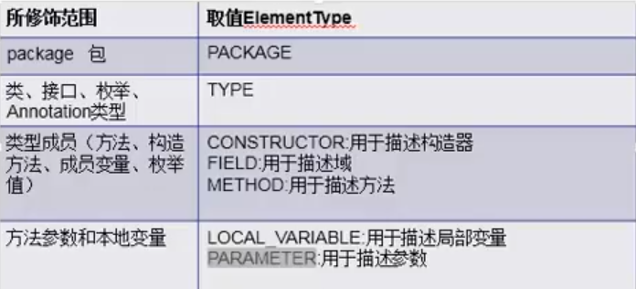
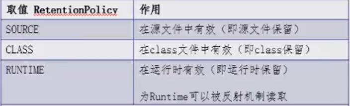

https://blog.csdn.net/briblue/article/details/73824058


- 提供信息给编译器： 编译器可以利用注解来探测错误和警告信息
- 编译阶段时的处理：  软件工具可以用来利用注解信息来生成代码、Html文档或者做其它相应处理。
- 运行时的处理：  某些注解可以在程序运行的时候接受代码的提取


元注解 ： 负责注解其他注解。java定义了4个标准的meta-annotation类型,它们被用来提供对其它annotation类型作说明。Target Retention Documented Inherited

##### 注解类型

* Target 

用于描述注解的使用范围(注解可以用在什么地方)




* Retention

需要什么级别保存该注释信息，用于秘奥是注解的生命周期





##### 注解使用

```java
public @interface Sxt{

​	String studentName();  // studentName 参数名， String参数类型

}
```


注解元素必须要有值，我们定义注解元素时，经常使用空字符串，0作为默认值。

也经常使用负数(比如:-1)表示不存在的含义

annotation01

```java
@Target(value = {ElementType.METHOD,ElementType.TYPE})
@Retention(RetentionPolicy.RUNTIME)
public @interface Annotation01 {
    String studentName() default "";
    int age() default 0;
    int id() default -1; // String indexOf("abc") -1

    String[] schools() default {"清华大学","哈工大"};
}
```

Annotation02

```java
@Target(value = {ElementType.METHOD,ElementType.TYPE})
@Retention(RetentionPolicy.RUNTIME)
public @interface Annotation02 {
    String value();
}
```

如果只有一个参数，一般写成value

Demo01

```java
@Annotation01
public class Demo02 {
    @Annotation01(age = 19, studentName = "老高",
            id = 1001, schools = {"哈工大", "清华大学"})
    public void test() {
    }
    @Annotation02(value = "aaaa")
    public void test01() {

    }
    @Annotation02("aaaa")
    public void test02() {
    }
}
```

使用注解,参照 test01(),也可以省略"value=" 参见test02()


##### 注解实例

注解设置 SxtStudent信息，映射数据库

```java
@Target(value = {ElementType.TYPE})
@Retention(RetentionPolicy.RUNTIME)
public @interface SxtTable {
    String value();
}
```


```java
@Target(value = {ElementType.FIELD})
@Retention(RetentionPolicy.RUNTIME)
public @interface SxtField {
    String columnName();
    String type();
    int length();
}
```


```java
@SxtTable("tb_student")
public class SxtStudent {
    @SxtField(columnName = "id",type = "int",length = 10)
    private  int id;

    @SxtField(columnName = "sname",type = "varchar",length = 10)
    private String studentName;

    @SxtField(columnName = "age",type = "int",length = 3)
    private int age;
}
```

通过第三方工具获取注解信息

```java
try {
    Class clazz = Class.forName("annotation.SxtStudent");

    //获得类的所有有效注解
    Annotation[] annotations = clazz.getAnnotations();
    for (Annotation a:annotations){
        System.out.println(a);
    }
    //获得类的指定注解
    SxtTable st = (SxtTable)clazz.getAnnotation(SxtTable.class);
    System.out.println(st.value());

    //获得类的属性的注解
    Field f = clazz.getDeclaredField("studentName");
    SxtField sxtField = f.getAnnotation(SxtField.class);
    System.out.println(sxtField.columnName()+"--" + sxtField.type()+"---" + sxtField.length());

} catch (ClassNotFoundException e) {
    e.printStackTrace();
} catch (NoSuchFieldException e) {
    e.printStackTrace();
}
```


##### 反射

```java
String path = "reflection.User";
try {
    Class<?> clazz = Class.forName(path);
    //对象是表示或封装一些数据。一个类被加载后，JVM会创建一个对应该类的Class对象，类的整个结构信息会放到对应的CLass对象中。
    //这个Class对象就像一面镜子一样，通过这面镜子我可已看到对应类的全部信息。
    System.out.println(clazz.hashCode());

    Class clazz2 = Class.forName(path); // 一个类对应的一个class对象
    System.out.println(clazz2.hashCode());

    Class intCLazz = int.class;
    int[] arr01 = new int[10];
    int[][] arr02 = new int[30][3];
    int[]arr03 = new int[30];
    double[] arr04 = new double[10];

    System.out.println(arr01.getClass().hashCode());
    System.out.println(arr02.getClass().hashCode());
    System.out.println(arr03.getClass().hashCode());
    System.out.println(arr04.getClass().hashCode());
```


https://www.youtube.com/watch?v=vZe5zG0vh3U&list=PLC664nq_h8b9Jzh-qYJ_AeOpmSoBLC_tg&index=1
