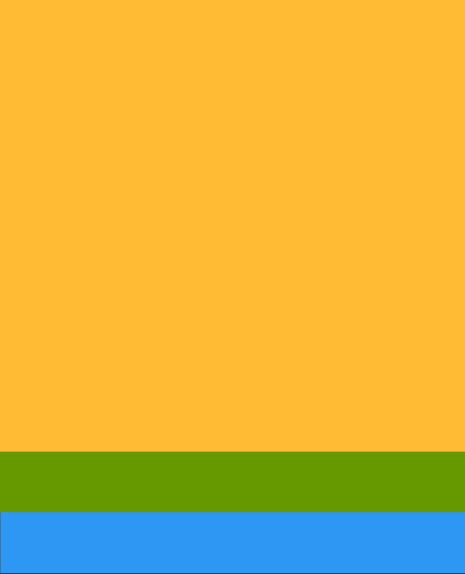

 ** 为了提高App性能，经常会用到代码写背景 **

####  基本属性
 - solid : 　填充内容

 - stroke:   绘制边框

   代码里设置颜色  `Color.parseColor("#fa6d62")`


#####  点击选中状态

* android:state_pressed 是否按下，如一个按钮触摸或者点击。
* android:state_focused 是否取得焦点，比如用户选择了一个文本框。
*  android:state_hovered 光标是否悬停，通常与focused state相同，它是4.0的新特性 
* android:state_selected 被选中，它与focus state并不完全一样，如一个list view 被选中的时候，它里面的各个子组件可能通过方向键，被选中了。 
* android:state_checkable 组件是否能被check。如：RadioButton是可以被check的。 android:state_checked 被checked了，如：一个RadioButton可以被check了。
*  android:state_enabled 能够接受触摸或者点击事件 android:state_activated 被激活(这个麻烦举个例子，不是特明白) android:state_window_focused 应用程序是否在前台，当有通知栏被拉下来或者一个对话框弹出的时候应用程序就不在前台了 

注意:如果有多个item，那么程序将自动从上到下进行匹配，最先匹配的将得到应用。（不是通过最佳匹配） 如果一个item没有任何的状态说明，那么它将可以被任何一个状态匹配。 

https://blog.csdn.net/yinbucheng/article/details/52922759

seleced用于单选，checked用于多选,

selected是选择很多项，但是只取当前的项，即最后一个选中的

checked是选中很多项，都选中。

# shape  layer-list    selector

##### 设置Button按钮背景 #####


```
<shape xmlns:android="http://schemas.android.com/apk/res/android">
    <corners android:radius="20dp" />

    <!-- 边框的颜色-->
    <stroke
        android:width="2dp"
        android:color="#009cff" />
    <!--填充的颜色 -->
    <solid android:color="@android:color/transparent" />
</shape>
```

#####  shape

        <shape android:shape="rectangle"> 
            <solid android:color="#2e97f3" />       //填充颜色
            <stroke
                android:width="2dp"                 //描边宽度
                android:color="#2e97f3" />          //描边颜色
        </shape>

##### layer-list 

    <?xml version="1.0" encoding="utf-8"?>
    <layer-list xmlns:android="http://schemas.android.com/apk/res/android">
     <item>
        <shape android:shape="rectangle">
            <solid android:color="#2e97f3" />
            <stroke
                android:width="2dp"
                android:color="#2e97f3" />
        </shape>
    </item>
    
    <item android:top="50dp">
        <shape android:shape="rectangle">
            <solid android:color="@android:color/holo_green_dark" />
            <padding android:left="50dp"/>
        </shape>
    </item>
    
    <item android:top="100dp">
        <shape android:shape="rectangle">
            <solid android:color="@android:color/holo_orange_light" />
        </shape>
    </item>
    </layer-list>



LayerDrawable 是管理其他可绘制对象阵列的可绘制对象。列表中的每个可绘制对象按照列表的顺序绘制，列表中的最后一个可绘制对象绘于顶部。每个可绘制对象由单一 元素内的 元素表示。我们需要注意的是layer-list中有item的先后顺序会影响展示效果，不同顺序的效果可能大相径庭，因为，后面的item总是在之前的item之上并覆盖显示。

####  selector 

* 底部选择器

```
    <?xml version="1.0" encoding="utf-8"?>
<selector xmlns:android="http://schemas.android.com/apk/res/android">
    <item android:state_selected="true">
        <layer-list>
            <item>
                <color android:color="#2e97f3" />
            </item>

            <item android:bottom="5dp" android:drawable="@color/white" />
        </layer-list>
    </item>
    <item>
        <layer-list>
            <item>
                <color android:color="#2e97f3" />
            </item>

            <item android:drawable="@color/white" />
        </layer-list>
    </item>
</selector>
```
参考 https://keeganlee.me/post/android/20150909

* 背景选择器

```
<?xml version="1.0" encoding="utf-8"?>
<selector xmlns:android="http://schemas.android.com/apk/res/android">
    <item android:drawable="@drawable/bg_circle_tab_yellow" android:state_selected="true" />
    <item android:drawable="@drawable/bg_circle_tab_gray" />
</selector>
```

* 字体颜色选择器

  ```
  <?xml version="1.0" encoding="utf-8"?>
  <selector xmlns:android="http://schemas.android.com/apk/res/android">
      <item android:color="@color/white" android:state_selected="true" />
      <item android:color="#999999" />
  </selector>
  ```


**后面的item在之前的item上显示，所有前面设置的padding,后面叠加形成图层**

http://blog.csdn.net/xiehuimx/article/details/70242676
https://developer.android.com/guide/topics/resources/drawable-resource.html#Transition

#  首页阴影效果

##  office
前端时间一直找这种资料，效果一直不如意，不得已用了图片，真是　踏破铁鞋无觅处
https://developer.android.com/training/material/shadows-clipping.html

```
	<?xml version="1.0" encoding="utf-8"?>
<shape xmlns:android="http://schemas.android.com/apk/res/android"
    android:shape="rectangle">
    <stroke
        android:width="1dp"
        android:color="#f9fafc" />
    <corners android:radius="2dp" />
    <solid android:color="@color/white" />
</shape>
```
 不过这种方法还是差强人意
##  another

可以试试下面这种方式　
http://blog.csdn.net/u011421608/article/details/51923812
http://yifeng.studio/2017/02/26/android-elevation-and-shadow/

#  画虚线

    <?xml version="1.0" encoding="utf-8"?>
    <shape xmlns:android="http://schemas.android.com/apk/res/android"
     android:shape="line">
    <!-- jon  虚线-->
    <size android:height="1dp" />
    <stroke
        android:width="1dp"
        android:color="@color/white"
        android:dashGap="2dp"
        android:dashWidth="4dp" />
    
    <!-- dashwidth是指- - -中每一个-的宽度-->
    <!-- dashGap是指虚线中每一个间隔的宽度 -->
   </shape>

* height比height高  关闭硬件加速   android:layerType="software"

```
<View
    android:layout_width="match_parent"
    android:layout_height="10dp"
    android:layout_below="@+id/rl_time_day"
    android:background="@drawable/bg_dash_line" />
```

参考：
  https://lianyuchen.github.io/2017/05/09/%E5%85%B3%E4%BA%8Eshape%E7%94%BB%E8%99%9A%E7%BA%BF/
  http://www.jianshu.com/p/75cc93195f7a?from=jiantop.com

  https://keeganlee.me/post/android/20150909

####  LinearLayout默认横线

* ```
  android:divider="@drawable/shape_line
  android:dividerPadding="@dimen/dimen_15"
  
  ```

* shape_line.xml

  ```
  <shape xmlns:android="http://schemas.android.com/apk/res/android">
      <solid android:color="@color/line_color" />
      <size android:height="0.5dp" />
  </shape>
  ```

https://blog.csdn.net/BingShuShu/article/details/51444206

