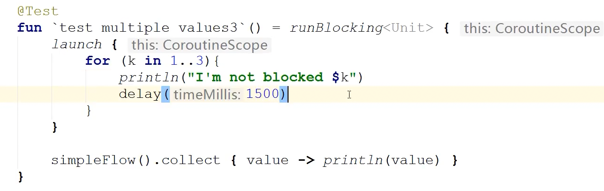
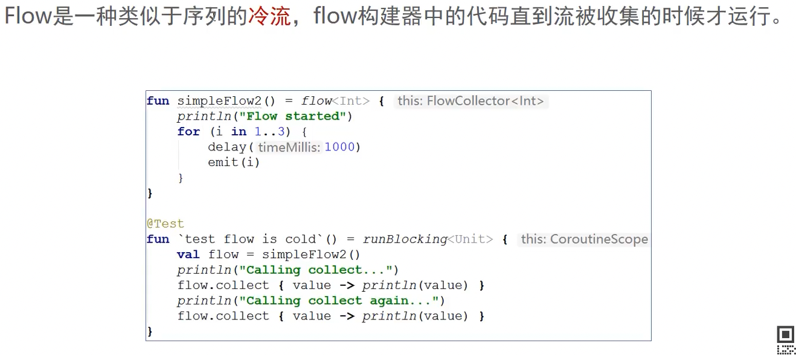

### 56Flow 异步流

##### 异步返回多个值的方案

集合 , 序列 , 挂起函数 ,Flow

##### 如何表示多个值

##### 通过Flow异步返回多个值

  

**可以去掉suspend**

再起一个任务，确认线程是否阻塞

##### Flow与其他方式的区别

##### Flow应用

### 流的特性

##### 60 冷流

类似于懒加载

61.流的连续性

62. asFlow 

    flowOf

    

63. 流上下文

    flowOn

64. 知道协程中收集流

    launchIn()

65. 流的取消

    withTimeoutOrNull

66. 流的取消检测

    Cancellable()

67. 背压

    buffer

    

101.  stateFlow

     

102. sharedFlow

     
