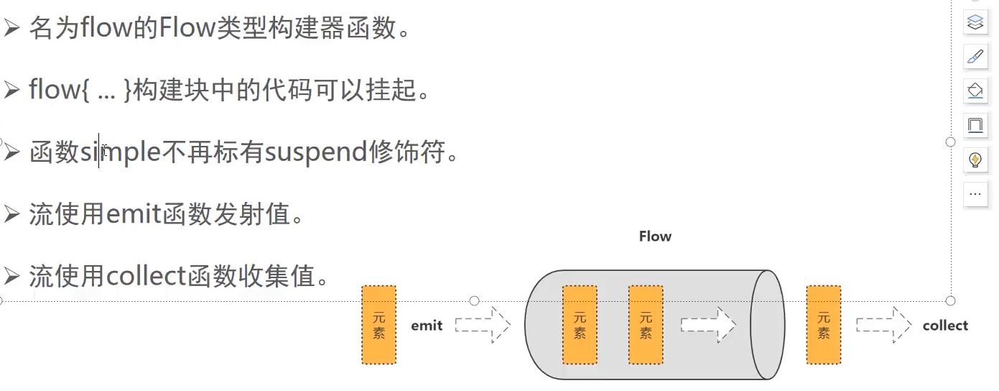
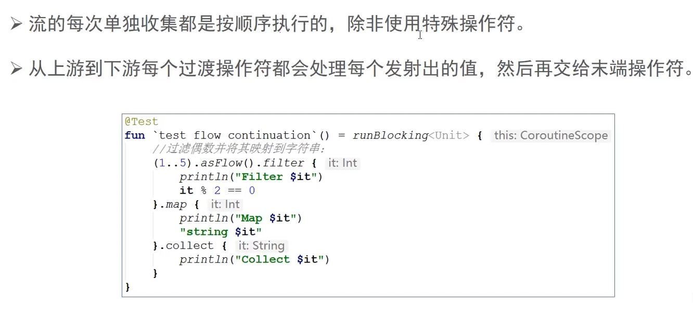
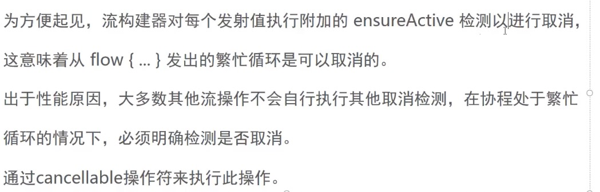
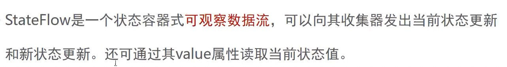

如何表示多个值

挂起函数可以异步的返回单个值，但是该如何异步的返回多个计算好的值呢？


异步返回多个值的方案

集合 序列。挂起函数。Flow


### Flow 异步流


##### 56异步返回多个值 集合 序列 挂起函数

集合 , 序列 , 挂起函数 ,Flow


```kotlin
    fun simpleList(): List<Int> = listOf(1, 2, 3)


    fun simpleSequence(): Sequence<Int> = sequence {
        for (i in 1..3) {
//            Thread.sleep(1000) // 阻塞，假装在计算
//            delay(1000)
            yield(i)
        }
    }

    suspend fun simpleList2(): List<Int> {
        delay(1000)
        return listOf(1, 2, 3)
    }

    @Test
    fun `test multiple values`() {
//        simpleList().forEach { values -> println(values) }  // 返回了多个值，但不是异步
        simpleSequence().forEach { value -> println(value) }// 返回了多个值，是同步
    }

    @Test
    fun `test multiple values2`() = runBlocking {
        simpleList2().forEach { values -> println(values) }  // 返回了多个值，是异步，但是是一次性返回的
    }
```


##### 57-通过Flow异步返回多个值


```kotlin
    suspend fun simpleFlow() = flow<Int> {
        for (i in 1..3) {
            delay(1000) // 怎么证明没有阻塞，而是挂起
            emit(i) // 发生，产生一个元素
        }
    }

    @Test
    fun `test multiple values3`() = runBlocking {
        launch {			//再起一个任务，确认线程是否阻塞
            for (k in 1..3){
                println("I am not blocked $k")
                delay(1500)
            }
        }
        simpleFlow().collect { value -> println(value) }
    }
```

返回多个值 而且是异步的

I am not blocked 1
1
I am not blocked 2
2
I am not blocked 3
3


##### 58 Flow与其他方式的区别



##### 59 Flow应用


### 流的特性

##### 60 冷流


Flow是一种类似于序列的冷流，flow够坚强中的代码知道流被收集的时候才运行

类似于懒加载, 点了Button，collect才开始下载


```kotlin
fun simpleFlow2() = flow<Int> {
    println("Flow started")
    for (i in 1..3) {
        delay(1000) // 怎么证明没有阻塞，而是挂起
        emit(i) // 发生，产生一个元素
    }
}

@Test
fun `test flow is cold`() = runBlocking {
    val flow = simpleFlow2()
    println("Calling collect...")
    flow.collect { value -> println(value) }
    println("Calling collect again")
    flow.collect { value -> println(value) }
}
```


##### 61.流的连续性




```kotlin
(1..5).asFlow().filter {
    it % 2 == 0
}.map {
    "string $it"
}.collect{
    println("Collect ${it}")
}
```


```
Collect string 2
Collect string 4
```

62. ##### 流构建器 

    flowOf构建器定义了一个发射固定值集的流

    使用asFlow()拓展函数，可以将各种集合与序列转换为流

    

    ```kotlin
    flowOf("one", "two", "three")
        .onEach { delay(1000) }
        .collect {
            println(it)
        }
    
    (1..3).asFlow().collect {
        println(it)
    }
    ```


```
one
two
three
1
2
3
```


63. ##### 流上下文

flowOn


```kotlin
fun simpleFlow3()= flow<Int> {
    println("Flow started ${Thread.currentThread().name}")
    for (i in 1..3){
        delay(1000)
        emit(i)
    }
}

 @Test
 fun `test flow context`() = runBlocking {
     simpleFlow3().collect{
         println("Collected $it ${Thread.currentThread().name}")
     }
 }
```


构建流和保存流在同一个上下文


```kotlin
fun simpleFlow4() = flow<Int> {
    withContext(Dispatchers.IO) {
        println("Flow started ${Thread.currentThread().name}")
        for (i in 1..3) {
            delay(1000)
            emit(i)
        }
    }

}

@Test
fun `test flow context4`() = runBlocking {
    simpleFlow4().collect {
        println("Collected $it ${Thread.currentThread().name}")
    }
}
```


Flow started DefaultDispatcher-worker-1 @coroutine#1

Flow invariant is violated: // 报错


```kotlin
fun simpleFlow5() = flow<Int> {
    println("Flow started ${Thread.currentThread().name}")
    for (i in 1..3) {
        delay(1000)
        emit(i)
    }
}.flowOn(Dispatchers.Default)

@Test
fun `test flow context5`() = runBlocking {
    simpleFlow5().collect {
        println("Collected $it ${Thread.currentThread().name}")
    }
}
```


```
Flow started DefaultDispatcher-worker-1 @coroutine#2
Collected 1 Test worker @coroutine#1
Collected 2 Test worker @coroutine#1
Collected 3 Test worker @coroutine#1
```

发送在后台线程，收集在主线程


64. ##### 在知道协程中收集流

    使用launchin替换collect 我们可以在单独的协程中启动流的收集 

    ```kotlin
        fun events() = (1..3)
            .asFlow()
            .onEach { delay(100) }
            .flowOn(Dispatchers.Default)
    
    
        @Test
        fun `test flow launch`() = runBlocking<Unit> {
            val job =
                events().onEach { events -> println("Event: $events ${Thread.currentThread().name}") }
    //            .collect()
                    .launchIn(CoroutineScope(Dispatchers.IO)) // 单独的协程中，启动流的收集
                    .join()
            delay(200)
    
    //        job.cancelAndJoin()
        }
    ```


Event: 1 DefaultDispatcher-worker-3 @coroutine#2
Event: 2 DefaultDispatcher-worker-3 @coroutine#2
Event: 3 DefaultDispatcher-worker-2 @coroutine#2


##### 65. 流的取消


```kotlin
fun simpleFlow6() = flow<Int> {
    println("Flow started ${Thread.currentThread().name}")
    for (i in 1..3) {
        delay(1000)
        emit(i)
        println("Emitting $i")
    }
}.flowOn(Dispatchers.Default)

@Test
fun `test cancel flow`() = runBlocking<Unit> {
    withTimeoutOrNull(2500){ // 2.5s超时
        simpleFlow6().collect{value-> println(value)}
    }
    println("Done")
}
```


withTimeoutOrNull

```
Flow started DefaultDispatcher-worker-1 @coroutine#2
Emitting 1
1
Emitting 2
2
Done
```

协程被取消 3没有打印


##### 66流的取消检测



```kotlin
fun simpleFlow7() = flow<Int> {
    for (i in 1..5) {
        delay(1000)
        emit(i)
        println("Emitting $i")
    }
}

@Test
fun `test cancel flow check`() = runBlocking<Unit> {
    withTimeoutOrNull(2500) { // 2.5s超时
        simpleFlow7().collect { value ->
            println(value)
            if (value == 3) cancel()
        }
    }
}
```


1
Emitting 1
2
Emitting 2
BUILD SUCCESSFUL in 3s


62. 背压

    buffer

    

63. stateFlow

    

64. sharedFlow

    
