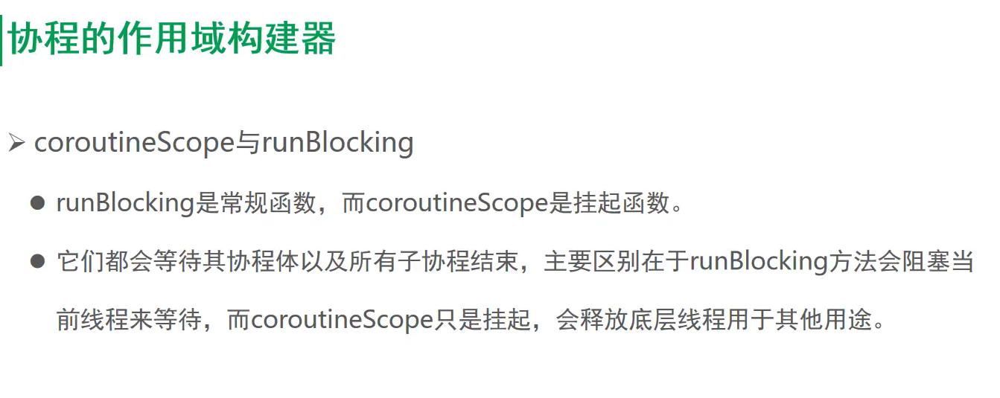
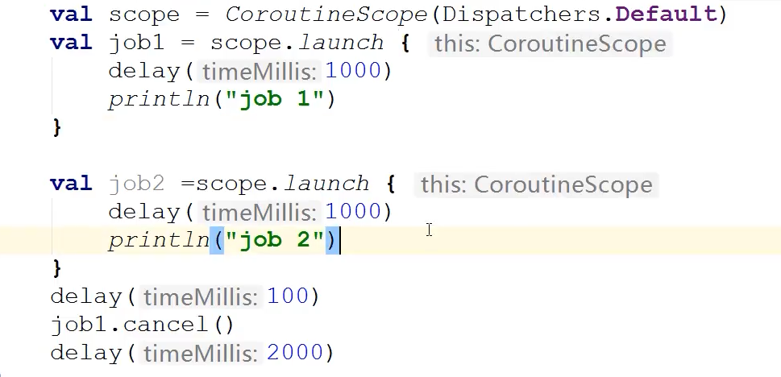

runblocking会等待子协程执行完成.


https://www.bilibili.com/video/BV1uo4y1y7ZF?p=24&spm_id_from=pageDriver


##### P20 launch async


Async  返回执行结果

```
Job1 finished.

Job2 finished

Job2 finished
```


##### P21 join与await等待协程的作业


```kotlin
@Test
fun `test coroutine join`() = runBlocking {
    val job1 = launch() {
        delay(200)
        println("One")
    }
    job1.join() // job1执行完，再执行job2 job3
    val job2 = launch() {
        delay(200)
        println("Two")
    }
    val job3 = launch() {
        delay(200)
        println("Three")
    }
}

@Test
fun `test coroutine await`() = runBlocking {
    // 刷新界面，拿到执行结果后，再执行其他的。
    val job1 = async() {
        delay(200)
        println("One")
    }
    job1.await() // job1执行完，再执行job2 job3
    val job2 = async() {
        delay(200)
        println("Two")
    }
    val job3 = async() {
        delay(200)
        println("Three")
    }
}
```

区别是await可以拿到执行结果，

接口1请求成功，拿到接口，再请求其他接口。


##### P22 async组合并发

```kotlin
@Test
fun `test sync`() = runBlocking {
    val time = measureTimeMillis {
        val one = doOne()  // 同步，串行任务
        val two = doTwo()
        println("The result : ${one + two}")
    }
    println("completed in $time ms")
}

@Test
fun `test combine async`() = runBlocking {
    val time = measureTimeMillis {
        val one = async{doOne()} // 并发的两个异步任务
        val two = async{doTwo()}
        println("The result : ${one.await() + two.await()}")
    }
    println("completed in $time ms")
}

private suspend fun doOne(): Int {
    delay(1000)
    return 14
}

private suspend fun doTwo(): Int {
    delay(1000)
    return 25
}
```


执行的结果相加


##### 协程的启动模式


CoroutineStart.DEFAULT


##### p24 协程的作用域构建器

runBlocking阻塞当前线程等待



```kotlin
coroutineScope {
    val job1 = launch {
        delay(1000)
        println("Job1 finished.")
    }
    val job2 = async {
        delay(1000)
        println("Job2 finished.")
    }
}
```


coroutineScope 也需要等待子协程执行结束，和 runBlocking很像.

区别coroutineScope是挂起函数.


coroutineScope与supervisorScope


还有SupervisorJob


```kotlin
coroutineScope {
    val job1 = launch {
        delay(400)
        println("Job1 finished.")
    }
    val job2 = async {
        delay(200)
        println("Job2 finished.")
        "job2 result"
    }
}
```

Job2 finished.
Job1 finished.


job2中断 job1也中断

```kotlin
@Test
fun `test coroutineScope scope builder`() = runBlocking {
    coroutineScope {
        val job1 = launch {
            delay(400)
            println("job1 finished.")
        }
        val job2 = launch {
            delay(200)
            println("job2 finished.")
            "job2 result"
            throw  IllegalArgumentException()
        }
    }
}

```

job2 finished.

java.lang.IllegalArgumentException

两个协程都退出


job2中断 job1继续

```
@Test
fun `test supervisorScope scope builder`() = runBlocking {
    supervisorScope {
        val job1 = launch {
            delay(400)
            println("job1 finished.")
        }
        val job2 = launch {
            delay(200)
            println("job2 finished.")
            "job2 result"
            throw  IllegalArgumentException()
        }
    }
}
```


job2 finished.
Exception in thread "Test worker @coroutine#3"

Job1 finished.

##### 25 Job的生命周期


### 协程的取消


##### 26-取消作用域

```kotlin
    @Test
    fun `test scope cancel`() = runBlocking<Unit> {
        val scope = CoroutineScope(Dispatchers.Default)
        scope.launch {
            delay(1000)
            println("Job 1.")
        }

        scope.launch {
            delay(1000)
            println("Job 2.")
        }
//        delay(2000)  //需要加这个才能看到 打印,CoroutineScope没有继承runBlocking的上下文
    }
```


```kotlin
@Test
fun `test scope cancel`() = runBlocking<Unit> {
    val scope = CoroutineScope(Dispatchers.Default)
    scope.launch {
        delay(1000)
        println("Job 1.")
    }

    scope.launch {
        delay(1000)
        println("Job 2.")
    }
    delay(100)  //需要加这个才能看到 打印
    scope.cancel()
    delay(2000)
}
```


CorountineScope和corountineScope的区别(大小写的区别，大写的可以取消)





##### P27-取消兄弟协程

```kotlin
@Test
fun `test scope cancel`() = runBlocking<Unit> {
    val scope = CoroutineScope(Dispatchers.Default)
    val job1 = scope.launch {
        delay(1000)
        println("Job 1.")
    }

    val job2=scope.launch {
        delay(1000)
        println("Job 2.")
    }
    delay(100)  //需要加这个才能看到 打印
    job1.cancel()
    delay(2000)
}
```


被取消的协程，不会影响其余的兄弟协程

```
Job 2.
```


##### 28-协程取消的异常


```kotlin
@Test
fun `test CancellationException `() = runBlocking<Unit> {
    val job1 = GlobalScope.launch {
        try {
            delay(1000)
            println("Job 1.")
        }catch (e:Exception){
            e.printStackTrace()
        }
    }
    delay(100)
    job1.cancel(CancellationException("取消"))
    job1.join() // 否则不会打印GlobalScope不在runBlocking上下文
}
```

java.util.concurrent.CancellationException: 取消


### cpu密集型任务取消

##### 29cpu密集型任务取消 isActive


isActive判断取消，否则还是计算5次,这个和线程while操作很像


##### p30- cpu密集型任务取消 - ensureActive


 退出循环


##### p31-yiled取消


##### p32-coroutine取消副作用


##### p33 标准函数use

自动关闭文件对象


##### 34不能取消的任务

NonCancellable 


##### 35超时任务

网络请求超时


超时1300后的处理


