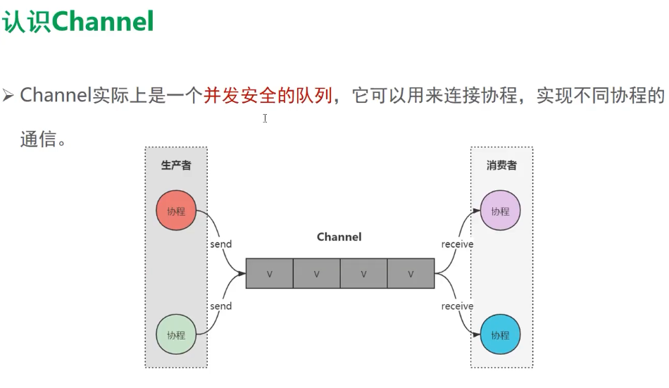

#### channel

##### 78 channel



channel是并发安全的队列,队列一定存在缓冲区满了，并且没有人调用receive取走函数，send就挂起


82. produce与actor

83. ##### 复用多个await 

    多路复用

    
    
    网络和本地缓存获取数据，哪一个先返回就先用那个做展示
    
    
    
    ```kotlin
    fun CoroutineScope.getUserFromLocal() = async(Dispatchers.IO) {
        // 模拟读取本地数据
        delay(1000)
        "getUserFromLocal"
    }
    
    fun CoroutineScope.getUserFromNetwork() = async(Dispatchers.IO) {
        // 模拟读取网络数据
        delay(500)
        "getUserFromNetwork"
    }
    
    fun testSelectAwait() = runBlocking {
        GlobalScope.launch {
            val userFromLocal = getUserFromLocal()
            val userFromNetwork = getUserFromNetwork()
            val select = select<String> {
                userFromLocal.onAwait { it }
                userFromNetwork.onAwait { it }
            }
            println(select)
        }.join()
    }
    ```
    
    

