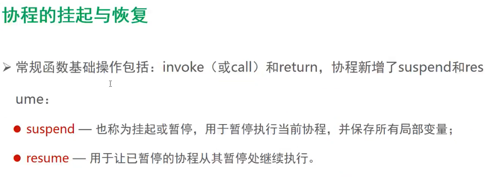
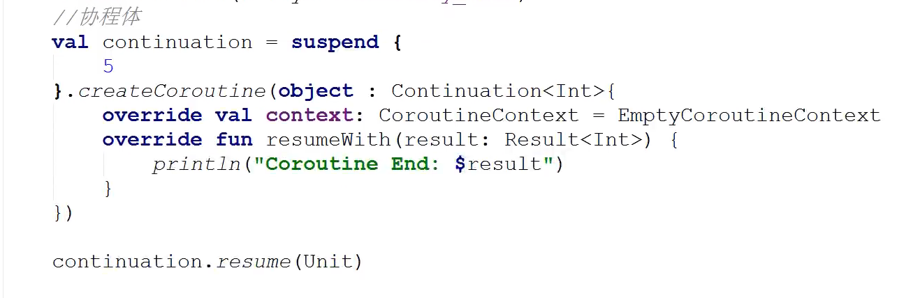
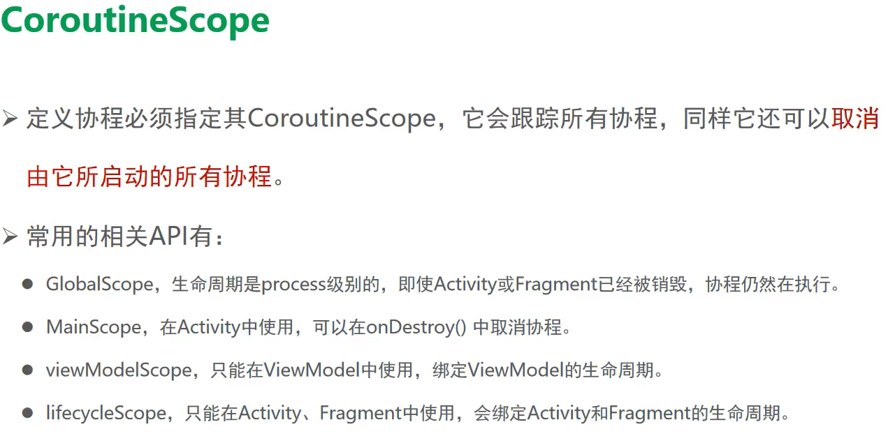

##### 协程是什么 03

##### 协程的挂起与恢复 08

##### 挂起阻塞的区别 09

##### 协程的调度器 P13

1. Dispatchers.Main

2. Dispatchers.IO

3. Dispatchers.Default

   

#####  任务泄漏 P14

##### 结构化并发 p15

使用结构化并发可以做到

##### CoutineScope P16

GlobalScope

mainscope协程 可以通过抛出异常取消.

