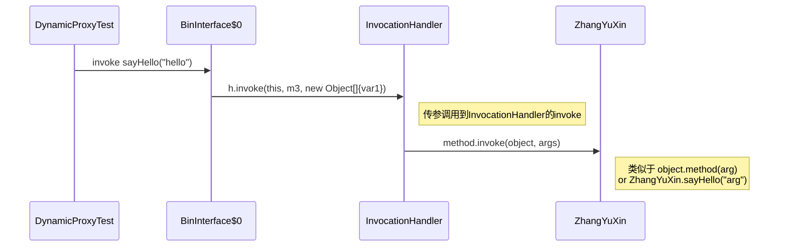

也可以参考一起
https://jonblog.site/2024/05/31/reflection/
https://jonblog.site/2024/05/28/designpattern-proxy/
https://jonblog.site/2024/06/06/annotation/

# Static Proxy

编译的时候就已经存在
Static proxies are created at compile time. You need to write the proxy class manually, and it will contain references to the methods of the original class.
Key Characteristics:

1. Compile-Time Creation: Static proxies are created at compile time, meaning you need to write the proxy class manually.
2. Tight Coupling: Since you need to write the proxy class, there's a tighter coupling between the proxy and the original class.
3. Use Cases: Often used for simple scenarios where you need to add a specific behavior to a method call.
4. Separate Proxy Class: You have to create a separate class for the proxy which implements the same interface as the target class.

## Java implement

```java
public interface ZyxInterface {
    void sayHello(String name);
}

public class ZhangYuXin implements  ZyxInterface {
    @Override
    public void sayHello(String name) {
        System.out.println("Hello from zyx "+ name);
    }
}
```

代理类

```java
public class ZhangYuXinProxy implements ZyxInterface {
    private ZhangYuXin zhangYuXin;

    public ZhangYuXinProxy(ZhangYuXin zhangYuXin) {
        this.zhangYuXin = zhangYuXin;
    }

    @Override
    public void sayHello(String name) {
        System.out.println("拍电影前的准备工作");
        zhangYuXin.sayHello(name);
        System.out.println("拍电影后的收尾工作");
    }
}
```

```java
ZhangYuXin zyxHello = new ZhangYuXin();
ZhangYuXinProxy zhangYuXin = new ZhangYuXinProxy(zyxHello);
zhangYuXin.sayHello("hello");
```

运行结果

> 拍电影前的准备工作
> Hello from zyx
> 拍电影后的收尾工作

## UML


代理模式

1. 代理类与委托类有同样的接口
2. 代理类主要负责为委托类预处理消息、过滤消息、把消息转发给委托类，以及事后处理消息等。
3. 一个代理类的对象与一个委托类的对象关联，代理类的对象本身并不真正实现服务，而是通过调用委托类的对象的相关方法，来提供特定的服务。

# Dynamic Proxy

通过反射机制生成的代理对象


Dynamic proxies in Java are created at runtime. They use reflection and the java.lang.reflect.Proxy class along with the InvocationHandler interface to handle method invocations.

Key Characteristics:

1. Runtime Creation: Dynamic proxies are created at runtime, which means you don't need to write separate classes for proxies.
2. Flexibility: Since they are created at runtime, they can be more flexible and can easily adapt to changes.
3. Use Cases: Commonly used in frameworks like Spring AOP for cross-cutting concerns (e.g., logging, transaction management).
4. No Implementation Class Needed: You don't need to create a separate class for the proxy; you just need to provide an implementation for the InvocationHandler.

# Summary

* Dynamic Proxy:
    Created at runtime using java.lang.reflect.Proxy.
    More flexible and decoupled.
    No need for separate proxy classes.
* Static Proxy:
    Created at compile time by manually writing the proxy class.
    Tighter coupling with the target class.
    Requires a separate proxy class.

## Dynamic proxy implementation

生成的动态代理Class文件

```java
public class DoSomeThingDynamic {
    Object object;

    public DoSomeThingDynamic(Object object) {
        this.object = object;
    }

    /**
     * @param say 需要代理执行的接口类
     * @param <T>
     * @return 动态代理 运行时生成的一个say对应类型的类，用于调用say接口的时候 运行
     */
    public <T> T create(final Class<T> say) {
        return (T) Proxy.newProxyInstance(say.getClassLoader(),
                new Class<?>[]{say},
                new InvocationHandler() {
                    /**
                     * invoke方法:  代理类 BinInterface$0 调用super.h.invoke(this, m3, new Object[]{var1});就会调用到
                     * Object o : 代表生成的new BinInterface$0()对象，
                     * Method method : 代理类调用的方法，把方法传进来。
                     * Object[] args ： 方法的参数
                     */
                    @Override
                    public Object invoke(Object o, Method method, Object[] args) throws Throwable {
                        System.out.println("拍电影前的准备工作");
                        /**
                         *  method这个函数是 反射的函数
                         *
                         * 等价于 zhangYuXin.sayHello();
                         * similar to
                         * object.method(arg)
                         *
                         * object 是目标类，也就是 new zhangYuXin()
                         * 下面object 不能用invoke(Object o)中的参数o替代。
                         */
                        Object result = method.invoke(object, args);
                        System.out.println("拍电影后的收尾工作");
                        return result;
                    }
                }
        );
    }
}
```

## call from client

```java
        DoSomeThingDynamic say1 = new DoSomeThingDynamic(zyxHello);
        ZyxInterface zyxProxy = say1.create(ZyxInterface.class);
        zyxProxy.sayHello("John");

        System.out.println("---------------------\n");

        BinBin binBye = new BinBin();
        DoSomeThingDynamic say2 = new DoSomeThingDynamic(binBye);
        BinInterface bbProxy = say2.create(BinInterface.class);
        bbProxy.sayBye();


        /**
         * 生成代理类的，并且输出字节码
         */
        byte[] classFile = ProxyGenerator.generateProxyClass("BinInterface$0", new Class[]{ZyxInterface.class});
        try {
            FileOutputStream out = new FileOutputStream( "BinInterface$0.class");
            out.write(classFile);
            out.flush();
        } catch (FileNotFoundException e) {
            e.printStackTrace();
        } catch (IOException e) {
            e.printStackTrace();
        }
```

BinInterface$0.class 

```java
public final class BinInterface$1 extends Proxy implements ZyxInterface {
    private static Method m1;
    private static Method m3;
    private static Method m2;
    private static Method m0;

    public BinInterface$1(InvocationHandler var1) throws  {
        super(var1);
    }

    public final boolean equals(Object var1) throws  {
        try {
            return (Boolean)super.h.invoke(this, m1, new Object[]{var1});
        } catch (RuntimeException | Error var3) {
            throw var3;
        } catch (Throwable var4) {
            throw new UndeclaredThrowableException(var4);
        }
    }

    public final void sayHello(String var1) throws  {
        try {
            super.h.invoke(this, m3, new Object[]{var1});
        } catch (RuntimeException | Error var3) {
            throw var3;
        } catch (Throwable var4) {
            throw new UndeclaredThrowableException(var4);
        }
    }

    public final String toString() throws  {
        try {
            return (String)super.h.invoke(this, m2, (Object[])null);
        } catch (RuntimeException | Error var2) {
            throw var2;
        } catch (Throwable var3) {
            throw new UndeclaredThrowableException(var3);
        }
    }

    public final int hashCode() throws  {
        try {
            return (Integer)super.h.invoke(this, m0, (Object[])null);
        } catch (RuntimeException | Error var2) {
            throw var2;
        } catch (Throwable var3) {
            throw new UndeclaredThrowableException(var3);
        }
    }

    static {
        try {
            m1 = Class.forName("java.lang.Object").getMethod("equals", Class.forName("java.lang.Object"));
            m3 = Class.forName("pattern.proxy.xiangxue.ZyxInterface").getMethod("sayHello", Class.forName("java.lang.String"));
            m2 = Class.forName("java.lang.Object").getMethod("toString");
            m0 = Class.forName("java.lang.Object").getMethod("hashCode");
        } catch (NoSuchMethodException var2) {
            throw new NoSuchMethodError(var2.getMessage());
        } catch (ClassNotFoundException var3) {
            throw new NoClassDefFoundError(var3.getMessage());
        }
    }
}
```

运行结果

> 拍电影前的准备工作
> Hello from zyx John
> 拍电影后的收尾工作
> 
> ---
> 
> 拍电影前的准备工作
> Bye Bye from BinBin
> 拍电影后的收尾工作

https://www.bilibili.com/video/BV1ib4y1f7S1?p=10&spm_id_from=pageDriver
https://www.bilibili.com/video/BV1uQ4y1Z7gA?p=23
https://juejin.cn/post/6844903520919879694
https://juejin.cn/post/6844903978342301709
https://time.geekbang.org/column/article/201823

# Dynamic proxy principle



我们下面 `bbProxy.sayBye();` 调用开始分析整个流程

1. bbProxy 是生成的代理类对象,调用后进入到代理类方法
   
   ```java
   public final void sayHello(String var1) throws  {
       try {
           super.h.invoke(this, m3, new Object[]{var1}); //这个是方法的传参，不是反射
       } catch (RuntimeException | Error var3) {
           throw var3;
       } catch (Throwable var4) {
           throw new UndeclaredThrowableException(var4);
       }
   }
   ```
2. 调用 super.h.invoke(this, m3, new Object[]{var1});       super.h 是调用`public static Object newProxyInstance(ClassLoader loader, Class<?>[] interfaces, InvocationHandler h)`传进来的new InvocationHandler() 最终调用到
   cons.newInstance(new Object[]{h}); InvocationHandler()传入构造方法,然后调用  protected Proxy(InvocationHandler h)

## cons.newInstance(new Object[]{h}

```java
private static final Class<?>[] constructorParams =
        { InvocationHandler.class };
public static Object newProxyInstance(ClassLoader loader,
                                          Class<?>[] interfaces,
                                          InvocationHandler h) {
            final Constructor<?> cons = cl.getConstructor(constructorParams);
            return cons.newInstance(new Object[]{h});
 }
```

cl.getConstructor(constructorParams) 指定的是 InvocationHandler类型的构造方法, 也就是

```java
    protected Proxy(InvocationHandler h) {
        Objects.requireNonNull(h);
        this.h = h;
    }
```

    正常流程
    
    ```java
                    @Override
                    public Object invoke(Object o, Method method, Object[] args) throws Throwable {
                        System.out.println("拍电影前的准备工作");
                        /**
                         *  method这个函数是 反射的函数
                         *
                         * 等价于 zhangYuXin.sayHello();
                         * similar to
                         * object.method(arg)
                         *
                         * object 是目标类，也就是 new zhangYuXin()
                         * 下面object 不能用invoke(Object o)中的参数o替代。
                         */
                        Object result = method.invoke(object, args);
                        System.out.println("拍电影后的收尾工作");
                        return result;
                    }
    
    ```

3. Object result = method.invoke(object, args); 开始调用代理类的方法。
   
   ```java
   @Override
   public void sayHello(String name) {
      System.out.println("拍电影前的准备工作");
      zhangYuXin.sayHello(name);
      System.out.println("拍电影后的收尾工作");
   }
   ```

# Simulate Jdk

this video write code  simulate JDK dynamic proxy

https://www.bilibili.com/video/BV1Ve411o7WM

## simple

```java
public class ProxyDog  implements Target{

    InvocationHandler h;

    public ProxyDog(InvocationHandler h) {
        this.h = h;
    }

    @Override
    public void eat() {
        h.invoke();
    }

    @Override
    public void drink() {
        h.invoke();
    }
}


        /**
         * stimulate Jdk dynamic proxy 方式1
         */
        ProxyDog proxyDog = new ProxyDog(new InvocationHandler() {
            @Override
            public void invoke() {
                //enhancement feature
                System.out.println("before");
                new TargetDog().eat();
            }
        });
        proxyDog.eat();
        proxyDog.drink();  //从这里看， 调用 drink()后，还是调用了eat()
```

这种方式 调用 drink()后，没法区分，调用drink()， 还是调用了eat()

## simulate jdk

模拟jdk动态代理，InvocationHandler方法是自己的。

```java
interface InvocationHandler {
    void invoke(Method method,Object[] args);
}


public class ProxyDog implements Target {

    InvocationHandler h;


    public ProxyDog(InvocationHandler h) {
        this.h = h;
    }

    static Method eat;
    static Method drink;

    static {
        try {
            eat = Target.class.getMethod("eat");
            drink = Target.class.getMethod("drink");
        } catch (NoSuchMethodException e) {
            throw new RuntimeException(e);
        }
    }

    @Override
    public void eat() {
        h.invoke(eat, new Object[0]);
    }

    @Override
    public void drink() {
        h.invoke(drink, new Object[0]);
    }
}

        ProxyDog proxyDog = new ProxyDog(new InvocationHandler() {
            @Override
            public void invoke(Method method, Object[] args) {
                //enhancement feature
                System.out.println("before");
//                new TargetDog().eat();
                try {
                    method.invoke(new TargetDog(),args);
                } catch (IllegalAccessException e) {
                    throw new RuntimeException(e);
                } catch (InvocationTargetException e) {
                    throw new RuntimeException(e);
                }
            }
        });
        proxyDog.eat();
        proxyDog.drink(); 
```

# simulate with jdk InvocationHandler

下面的做法使用Jdk自带的InvocationHandler

```java
public class ProxyDog implements Target {

    InvocationHandler h;


    public ProxyDog(InvocationHandler h) {
        this.h = h;
    }

    static Method eat;
    static Method drink;

    static {
        try {
            eat = Target.class.getMethod("eat");
            drink = Target.class.getMethod("drink");
        } catch (NoSuchMethodException e) {
            throw new RuntimeException(e);
        }
    }

    @Override
    public void eat() {
        try {
            h.invoke(this,eat, new Object[0]);
        } catch (Throwable e) {
            throw new RuntimeException(e);
        }
    }

    @Override
    public void drink() {
        try {
            h.invoke(this,drink, new Object[0]);
        } catch (Throwable e) {
            throw new RuntimeException(e);
        }
    }
}

        ProxyDog proxyDog = new ProxyDog(new InvocationHandler() {

            @Override
            public Object invoke(Object proxy, Method method, Object[] args) {
                //enhancement feature
                System.out.println("before");
//                new TargetDog().eat();
                try {
                    return method.invoke(new TargetDog(), args);
                } catch (IllegalAccessException e) {
                    throw new RuntimeException(e);
                } catch (InvocationTargetException e) {
                    throw new RuntimeException(e);
                }
            }
        });
        proxyDog.eat();
        proxyDog.drink();
```

从上面可以看到，Method eat = Target.class.getMethod("eat"); class中的Method,可以作为参数传递。

## Dynamic Constructor analysis

final Constructor<?> cons = cl.getConstructor(constructorParams);

# kotlin 委托的作用

```kotlin
interface Base {
    fun print()
}

class BaseImpl(val x: Int) : Base {
    override fun print() { print(x) }
}

class Derived(b: Base) : Base by b   // kotlin这里自动生成了java代理类

fun main() {
    val b = BaseImpl(10)
    Derived(b).print()
}
```

反编译后的代码

```java
// BaseImpl.java
package test;
public final class BaseImpl implements Base {
   private final int x;

   public void print() {
      int var1 = this.x;
      System.out.print(var1);
   }

   public final int getX() {
      return this.x;
   }
   public BaseImpl(int x) {
      this.x = x;
   }
}


public final class Derived implements Base { // 生成的代理类
   private final Base $$delegate_0;

   public Derived(@NotNull Base b) {
      Intrinsics.checkNotNullParameter(b, "b");
      super();
      this.$$delegate_0 = b;
   }

   public void print() {
      this.$$delegate_0.print();
   }
}
```