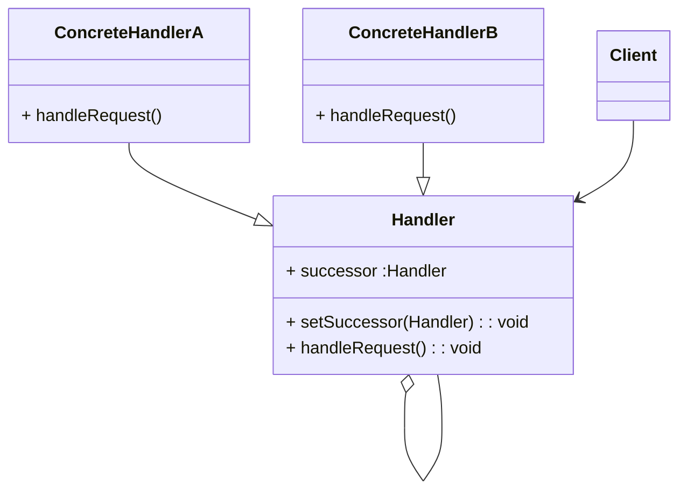

# Resource

## Overview

https://refactoring.guru/design-patterns/abstract-factory
https://design-patterns.readthedocs.io/zh-cn/latest/behavioral_patterns/behavioral.html

https://blog.csdn.net/unique_perfect/article/details/109621369

meituan 
https://tech.meituan.com/2022/03/10/interesting-talk-about-design-patterns.html

列举了视频示例 
https://blog.csdn.net/mrhanzhou5273/article/details/119248595

尚硅谷-Java设计模式 
https://www.bilibili.com/video/BV1W4411c77E
https://github.com/vectorxxxx/NOTE_DesignPatterns

23种 https://www.cnblogs.com/furenjun/archive/2008/12/28/DesignPatterns1.html
https://masiyi.blog.csdn.net/article/details/128345543
https://www.yuque.com/u22582281/qyidho/bd7d1k#e3c84592

画em的图 [https://github.com/noteforme/noteforme.github.io/blob/main/source/_posts/DesignPatterns_Factory.md](https://github.com/noteforme/noteforme.github.io/blob/main/source/_posts/DesignPatterns_Factory.md)

# 设计原则

## 设计模式六大原则1-单一职责原则

    一个类应该只负责一项职责。

## 设计模式六大原则2-里氏替换原则

> 子类必须实现父类的抽象方法，但不得重写（覆盖）父类的非抽象（已实现）方法，里氏替换原则规定，子类不能覆写父类已实现的方法。父类中已实现的方法其实是一种已定好的规范和契约，如果我们随意的修改了它，那么可能会带来意想不到的错误。
> 
> 子类完美继承父类的设计初衷，并做了增强

  https://www.jianshu.com/p/cf9f3c7c0df5

 里氏替换

* 所有使用基类的地方必须能透明的使用其子类。

* 使用继承时，遵循里氏替换原则，**子类尽量不要重写父类的方法**。继承实际上让两个类耦合性增强了，适当情况下可以通过 聚合 组合 依赖来解决问题。
  
    通用做法是： 原来的父类和子类都继承一个更通俗的基类，原有的继承关系去掉，采用依赖，聚合，组合等关系代替。

之前的方案

```java
public class Liskov {
    public static void main(String[] args) {
        A a = new A();
        System.out.println("11-3=" + a.func1(11, 3));
        System.out.println("1-8=" + a.func1(1, 8));

        System.out.println("---------------");
        B b = new B();
        System.out.println("11-3=" + b.func1(11, 3));
        System.out.println("1-8=" + b.func1(1, 8));
        System.out.println("11+3+9=" + b.func2(11, 3));
    }
}

class A {
    public int func1(int num1, int num2) {
        return num1 - num2;
    }
}

class B extends A {
    //没意识到 重写了该方法
    public int func1(int num1, int num2) {
        return num1 + num2;
    }

    public int func2(int a, int b) {
        return func1(a, b) - 9;
    }
}
```

改进后的方案

```java
public class Liskov {
    public static void main(String[] args) {
        A a = new A();
        System.out.println("11-3=" + a.func1(11, 3));
        System.out.println("1-8=" + a.func1(1, 8));

        System.out.println("---------------");
        B b = new B();
        //因为B类不再继承A类，因此调用者，不会再func1求减法
        System.out.println("11+3=" + b.func1(11, 3));
        System.out.println("1+8=" + b.func1(1, 8));
        System.out.println("11+3+9=" + b.func2(11, 3));


        //使用组合仍然可以使用A类相关方法
        System.out.println("11-3=" + b.func3(11, 3));

    }
}
 class  Base{
    //把更基础的方法和成员写到Base类中
}

class A extends Base {
    public int func1(int num1, int num2) {
        return num1 - num2;
    }


}

class B extends Base {
    //如果B需要使用A类的方法，使用组合关系
    private A a = new A();
    //没意识到 重写了该方法
    public int func1(int num1, int num2) {
        return num1 + num2;
    }

    public int func2(int a, int b) {
        return func1(a, b) +9;
    }

    public int func3(int a,int b){
        return this.a.func1(a,b);
    }
}
```

9. 开闭原则 ocp

open closed principle

* 不适用该原则的方案
  
  ```java
  public class GraphicEditor {
      public static void main(String[] args) {
          GraphicEditor graphicEditor = new GraphicEditor();
          graphicEditor.drawShape(new Rectangle());
          graphicEditor.drawShape(new Circle());
          graphicEditor.drawShape(new Triangle());
      }
  
      //添加一个图形需要修改
      public void drawShape(Shape s) {
          if (s.m_type == 1)
              drawRectangle(s);
          else if (s.m_type == 2)
              drawCircle(s);
          else if (s.m_type == 3)
              drawTriangle(s);
      }
  ```
  
      private void drawCircle(Shape s) {
          System.out.println("绘制圆形");
      
      }
      
      private void drawRectangle(Shape s) {
          System.out.println("绘制矩形");
      }
      
      //添加一个图形需要修改
      private void drawTriangle(Shape s) {
          System.out.println("绘制三角形");
      }
  
  }
  
  class Shape {
  
      public int m_type;
  
  }
  
  class Rectangle extends Shape {
  
      public Rectangle() {
          super.m_type = 1;
      }
  
  }
  
  class Circle extends Shape {
  
      public Circle() {
          super.m_type = 2;
      }
  
  }
  
  //新增图形
  class Triangle extends Shape {
  
      public Triangle() {
          super.m_type = 3;
      }
  
  }

可以看到改动很多

* 使用ocp原则改进后

```java
public class GraphicEditor {
    public static void main(String[] args) {
        GraphicEditor graphicEditor = new GraphicEditor();
        graphicEditor.drawShape(new Rectangle());
        graphicEditor.drawShape(new Circle());
        graphicEditor.drawShape(new Triangle());
        graphicEditor.drawShape(new OtherGraphic());
    }

    public void drawShape(Shape s) {
        s.drawShape();
    }

}


abstract class Shape {
    public int m_type;

    abstract void drawShape();
}

class Rectangle extends Shape {
    @Override
    void drawShape() {
        System.out.println("绘制矩形");
    }
}

class Circle extends Shape {
    @Override
    void drawShape() {
        System.out.println("绘制圆形");
    }
}


class Triangle extends Shape {
    @Override
    void drawShape() {
        System.out.println("绘制三角形");
    }
}

//新增一个图形
class OtherGraphic extends Shape {

    @Override
    void drawShape() {
        System.out.println("新增一个图形");
    }
}
```

  实现代码没有任何改动

## 设计模式六大原则3-依赖倒置原则

> 高层模块不应该依赖于底层模块，两者都应该依赖于抽象，
>   抽象不应该依赖于细节，细节应该依赖于抽象
>   依赖倒置的中心思想是**面向接口编程**。

## 设计模式六大原则4-接口隔离原则

  接口隔离原则:Clients should not be forced to depend upon interfaces that they do not use.与外部关系上只依赖需要的抽象
  客户端不应该依赖它不需要的接口，即一个类对另一个类的依赖应该建立在最小的接口上。

> 接口隔离原则的关键是接口以及这个接口要小，如何小呢，也就是我们要为专门的类创建专门的接口，这个接口只对它有效，不要试图让一个接口包罗万象，要建立最小的依赖关系

  https://blog.csdn.net/dingshuo168/article/details/103531805

## 设计模式六大原则5-迪米特法则

  减少依赖 Each unit should have only limited knowledge about other units: only units “closely” related to the current unit. Or: Each unit should only talk to its friends; Don’t talk to strangers

> 一个类应该应该对其他类尽可能了解得最少；类只与直接的朋友通信等等。但是其最终目的只有一个，就是让类间解耦。

  https://tianweili.github.io/2015/02/12/%E8%AE%BE%E8%AE%A1%E6%A8%A1%E5%BC%8F%E5%85%AD%E5%A4%A7%E5%8E%9F%E5%88%99-%E8%BF%AA%E7%B1%B3%E7%89%B9%E6%B3%95%E5%88%99/

迪米特法则

* 一个对象应该对其他对象保持最少的了解

* Demeter Principle又叫最少知道原则， 即一个类对自己依赖的类知道的越少越好。也就是说，对于被依赖的类不管多么复杂，都尽量将逻辑封装在类的内部。对外出了提供的public方法，不泄漏任何信息

* 只与直接的朋友通信。
  
  直接的朋友: 每个对象都会与其他对象有耦合关系，只要两个对象之间有耦合关系，我们就说这两个对象之间是朋友关系。耦合的方式很多， 依赖 关联，组合，聚合等。 其中，我们称出现成员变量，方法参数，方法返回值中的类为直接的朋友，而出现在局部变量中的类不是直接的朋友。也就是说，陌生的类最好不要以局部变量的形式出现在类的内部。

​    改进前

​    

```java
public class Demeter1 {
    public static void main(String[] args) {
        SchoolManager schoolManager = new SchoolManager();
        schoolManager.printAllEmployee(new CollegeManger());

    }
}

//学校总部员工的类
class SchollEmployee {
    private String id;

    public String getId() {
        return id;
    }

    public void setId(String id) {
        this.id = id;
    }
}

//学院的员工
class CollegeEmployee {
    private String id;

    public String getId() {
        return id;
    }

    public void setId(String id) {
        this.id = id;
    }
}

//管理学院员工的管理类
class CollegeManger {
    public List<CollegeEmployee> getAllEmployee() {
        ArrayList<CollegeEmployee> list = new ArrayList<>();
        for (int i = 0; i < 10; i++) {
            CollegeEmployee collegeEmployee = new CollegeEmployee();
            collegeEmployee.setId("学院员工id= " + i);
            list.add(collegeEmployee);
        }
        return list;
    }
}

// SchollEmployee , CollegeManger 是直接朋友
// CollegeEmployee 不是直接朋友，而是一个陌生类，这样违反了 迪米特法则。
class SchoolManager {

    public List<SchollEmployee> getAllEmployee() {//方法返回值:直接朋友
        ArrayList<SchollEmployee> list = new ArrayList<>();
        for (int i = 0; i < 5; i++) {
            SchollEmployee schollEmployee = new SchollEmployee(); // CollegeEmployee 不是直接朋友，以局部变量出现在SchoolManager
            schollEmployee.setId("学校总部员工id= " + i);
            list.add(schollEmployee);
        }
        return list;
    }
    //该方法完成输出学校总部和学院员工ID
    void printAllEmployee(CollegeManger sub) {//方法参数:直接朋友

        List<CollegeEmployee> list1 = sub.getAllEmployee();
        System.out.println("-----------学院员工--------");
        for (CollegeEmployee e : list1) {
            System.out.println(e.getId());
        }

        List<SchollEmployee> list2 = this.getAllEmployee();
        System.out.println("-----------学校总部员工--------");
        for (SchollEmployee e : list2) {
            System.out.println(e.getId());
        }
    }
}
```

改进后

```java
public class Demeter2 {
    public static void main(String[] args) {
        System.out.println("使用迪米特法则的改进");
        SchoolManager schoolManager = new SchoolManager();
        schoolManager.printAllEmployee(new CollegeManger());

    }
}


//学校总部员工的类
class SchollEmployee {
    private String id;

    public String getId() {
        return id;
    }

    public void setId(String id) {
        this.id = id;
    }
}

//学院的员工
class CollegeEmployee {
    private String id;

    public String getId() {
        return id;
    }

    public void setId(String id) {
        this.id = id;
    }
}

//管理学院员工的管理类
class CollegeManger {
    public List<CollegeEmployee> getAllEmployee() {
        ArrayList<CollegeEmployee> list = new ArrayList<>();
        for (int i = 0; i < 10; i++) {
            CollegeEmployee collegeEmployee = new CollegeEmployee();
            collegeEmployee.setId("学院员工id= " + i);
            list.add(collegeEmployee);
        }
        return list;
    }

    // 输出学院员工的信息
    void printCollegeEmployee() {
        //改进方法： 将输出学院员工的方法，封装到CollegeManager中。
        List<CollegeEmployee> list1 = getAllEmployee();
        System.out.println("-----------学院员工--------");
        for (CollegeEmployee e : list1) {
            System.out.println(e.getId());
        }
    }
}


// SchollEmployee , CollegeManger 是直接朋友
// CollegeEmployee 不是直接朋友，而是一个陌生类，这样违反了 迪米特法则。
class SchoolManager {

    public List<SchollEmployee> getAllEmployee() {//方法返回值:直接朋友
        ArrayList<SchollEmployee> list = new ArrayList<>();
        for (int i = 0; i < 5; i++) {
            SchollEmployee schollEmployee = new SchollEmployee(); // CollegeEmployee 不是直接朋友，以局部变量出现在SchoolManager
            schollEmployee.setId("学校总部员工id= " + i);
            list.add(schollEmployee);
        }
        return list;
    }

    //该方法完成输出学校总部和学院员工ID
    void printAllEmployee(CollegeManger sub) {//方法参数:直接朋友

      /*
        List<CollegeEmployee> list1 = sub.getAllEmployee();
        System.out.println("-----------学院员工--------");
        for (CollegeEmployee e : list1) {
            System.out.println(e.getId());
        }*/
        //改进方法： 将输出学院员工的方法，封装到CollegeManager中。
        sub.printCollegeEmployee();

        List<SchollEmployee> list2 = this.getAllEmployee();
        System.out.println("-----------学校总部员工--------");
        for (SchollEmployee e : list2) {
            System.out.println(e.getId());
        }
    }
}
```

## 设计模式六大原则6-开闭原则

## 控制反转

  在使用框架之后，整个程序的执行流程通过框架来控制。流程的控制权从程序员“反转”给了框架。

谈一谈自己对依赖、关联、聚合和组合之间区别的理解

http://blog.itpub.net/69952849/viewspace-2672009/

# Creational Design Patterns

## Singleton

## Factory

## Prototype 原型

# Behavioral Patterns

## Chain of Responsibility

   将请求的发送和接收解耦，让多个接收对象都有机会处理这个请求。将这些接收对象串成一条链，并沿着这条链传递这个请求，直到链上的某个接收对象能够处理它为止。

[https://refactoring.guru/design-patterns/chain-of-responsibility](https://refactoring.guru/design-patterns/chain-of-responsibility)[https://www.bilibili.com/video/BV1W4411c77E?p=147](https://www.bilibili.com/video/BV1W4411c77E?p=147)

[https://github.com/vectorxxxx/NOTE_DesignPatterns/blob/main/%E8%A1%8C%E4%B8%BA%E5%9E%8B%E6%A8%A1%E5%BC%8F/22-%E8%81%8C%E8%B4%A3%E9%93%BE%E6%A8%A1%E5%BC%8F/README.md](https://github.com/vectorxxxx/NOTE_DesignPatterns/blob/main/%E8%A1%8C%E4%B8%BA%E5%9E%8B%E6%A8%A1%E5%BC%8F/22-%E8%81%8C%E8%B4%A3%E9%93%BE%E6%A8%A1%E5%BC%8F/README.md)



为请求创建了一个接收者对象的链. 职责链模式通常每个接收者都包含对另一个接收者的引用。如果一个对象不能处理该请求，那么它会把相同的请求传给下一个接收者，依此类推

将这个对象连成一条链，并沿着这条链传递该请求，直到有一个对象处理它为止

- Handler抽象处理者： 定义了一个处理请求的方法，同时含有另外一个Handler
- ConcreteHandler具体处理者： 处理自己负责的请求，同时可以访问它的后继者（即下一个处理者） ；如果可以处理请求，则进行处理，否则交给后继者去处理，从而形成一个职责链
- Request含有很多属性，表示一个请求

## Command

       命令模式将请求（命令）封装为一个对象，这样可以使用不同的请求参数化其他对象（将不同请求依赖注入到其他对象），并且能够支持请求（命令）的排队执行、记录日志、撤销等（附加控制）功能

> 在策略模式中，不同的策略具有相同的目的、不同的实现、互相之间可以替换。比如，BubbleSort、SelectionSort 都是为了实现排序的，只不过一个是用冒泡排序算法来实现的，另一个是用选择排序算法来实现的。而在命令模式中，不同的命令具有不同的目的，对应不同的处理逻辑，并且互相之间不可替换

## Iterator

    一般会涉及容器 List 和容器迭代器 iterator 两部分内容.

## Mediator 中介者

        将一组对象之间的交互关系（或者依赖关系）从多对多（网状关系）转换为一对多（星状关系).

## Memento 备忘录

       这个模式理解、掌握起来不难，代码实现比较灵活，应用场景也比较明确和有限，主要是用来防丢失、撤销、恢复等.

## Observer

## State

## Strategy

   包含一组策略可选，客户端代码如何选择使用哪个策略，有两种确定方法：编译时静态确定和运行时动态确定。其中，“运行时动态确定”才是策略模式最典型的应用场景。

>  类似于面向接口编程,策略模式包含策略的定义、创建和使用三部分，从代码结构上来，它非常像工厂模式。它们的区别在于，策略模式侧重“策略”或“算法”这个特定的应用场景，用来解决根据运行时状态从一组策略中选择不同策略的问题，而工厂模式侧重封装对象的创建过程，这里的对象没有任何业务场景的限定，可以是策略，但也可以是其他东西。从设计意图上来，这两个模式完全是两回事儿

## Template Method

       模板方法模式在一个方法中定义一个算法骨架，并将某些步骤推迟到子类中实现。模板方法模式可以让子类在不改变算法整体结构的情况下，重新定义算法中的某些步骤。

   回调基于组合关系来实现，把一个对象传递给另一个对象，是一种对象之间的关系；模板模式基于继承关系来实现，子类重写父类的抽象方法，是一种类之间的关系。

## Visitor

       在不违背封装原则的前提下，捕获一个对象的内部状态，并在该对象之外保存这个状态，以便之后恢复对象为先前的状态.

# Structural : 类或对象的组合或组装

## Adapter

   适配器模式是一种事后的补救策略。适配器提供跟原始类不同的接口，而代理模式、装饰器模式提供的都是跟原始类相同的接口。

   类适配器: 通过继承关系

   对象适配器：通过组合关系

## Proxy

代理模式在不改变原始类接口的条件下，为原始类定义一个代理类，主要目的是控制访问，而非加强功能，这是它跟装饰器模式最大的不同。

## Bridge

有两种理解方式。第一种理解方式是“将抽象和实现解耦，让它们能独立开发

## Decorator

1. 装饰器类和原始类继承同样的父类，这样我们可以对原始类“嵌套”多个装饰器类
   
   装饰器类是对功能的**增强**，这也是装饰器模式应用场景的一个重要特点。
   
   > 代理模式中，代理类附加的是跟原始类无关的功能，而在装饰器模式中，装饰器类附加的是跟原始类相关的增强功能。
   > 
   > 对于为什么必须继承装饰器父类 FilterInputStream的思考：
   > 装饰器如BufferedInputStream等，本身并不真正处理read()等方法，而是由构造函数传入的被装饰对象：InputStream（实际上是FileInputStream或者ByteArrayInputStream等对象）来完成的。
   > 如果不重写默认的read()等方法，则无法完成如FileInputStream或者ByteArrayInputStream等对象所真正实现的read功能。
   > 所以必须重写对应的方法，代理给这些被装饰对象进行处理（这也是类似于代理模式的地方）。
   > 如果像DataInputStream和BufferedInputStream等每个装饰器都重写的这些方法话，会存在大量重复的代码。
   > 所以让它们都继承FilterInputStream提供的默认实现，可以减少代码重复，让装饰器只聚焦在它自己的装饰功能上即可。
   
   https://noteforme.github.io/2017/09/12/JavaIo/

## Facade 门面模式

   门面模式为子系统提供一组统一的接口，定义一组高层接口让子系统更易用。这个定义很简洁，我再进一步解释一下。假设有一个系统 A，提供了 a、b、c、d 四个接口。系统 B 完成某个业务功能，需要调用 A 系统的 a、b、d 接口。利用门面模式，我们提供一个包裹 a、b、d 接口调用的门面接口 x，给系统 B 直接使用

## Composite 组合模式

1. 将一组对象组织（Compose）成树形结构，以表示一种“部分 - 整体”的层次结构。组合让客户端（在很多设计模式书籍中，“客户端”代指代码的使用者。）可以统一单个对象和组合对象的处理逻辑。
   
   > 组合模式的设计思路，与其说是一种设计模式，倒不如说是对业务场景的一种数据结构和算法的抽象。其中，数据可以表示成树这种数据结构，业务需求可以通过在树上的递归遍历算法来实现。

## Flayweight 享元模式

   如果这些重复的对象是不可变对象，我们就可以利用享元模式将对象设计成享元，在内存中只保留一份实例，供多处代码引用。这样可以减少内存中对象的数量，起到节省内存的目的.

   实际上，不仅仅相同对象可以设计成享元，对于相似对象，我们也可以将这些对象中相同的部分（字段）提取出来，设计成享元，让这些大量相似对象引用这些享元。

> 思考: 提取相同对象，最终还是要创建相同的数量的对象，只是字段省略了

https://github.com/mxg133/learnforJava_DesignPattern

设计模式

##### 原则

1. 设计模式六大原则1-单一职责原则

2. 设计模式六大原则2-里氏替换原则
   
   > 子类必须实现父类的抽象方法，但不得重写（覆盖）父类的非抽象（已实现）方法，里氏替换原则规定，子类不能覆写父类已实现的方法。父类中已实现的方法其实是一种已定好的规范和契约，如果我们随意的修改了它，那么可能会带来意想不到的错误。
   > 
   > 子类完美继承父类的设计初衷，并做了增强
   
   [六大设计原则之里氏替换原则（LSP） - 简书](https://www.jianshu.com/p/cf9f3c7c0df5)

3. 设计模式六大原则3-依赖倒置原则
   
   > 高层模块不应该依赖于底层模块，两者都应该依赖于抽象，抽象不应该依赖于细节，细节应该依赖于抽象

4. 设计模式六大原则4-接口隔离原则
   
   接口隔离原则:Clients should not be forced to depend upon interfaces that they do not use.与外部关系上只依赖需要的抽象
   
   > 接口隔离原则的关键是接口以及这个接口要小，如何小呢，也就是我们要为专门的类创建专门的接口，这个接口只对它有效，不要试图让一个接口包罗万象，要建立最小的依赖关系
   
   [18 | 理论四：接口隔离原则有哪三种应用？原则中的“接口”该如何理解？_接口隔离原则有哪三种应用?原则中的接口该如何理解?-CSDN博客](https://blog.csdn.net/dingshuo168/article/details/103531805)

5. 设计模式六大原则5-迪米特法则
   
   减少依赖 Each unit should have only limited knowledge about other units: only units “closely” related to the current unit. Or: Each unit should only talk to its friends; Don’t talk to strangers
   
   > 一个类应该应该对其他类尽可能了解得最少；类只与直接的朋友通信等等。但是其最终目的只有一个，就是让类间解耦。
   
   https://tianweili.github.io/2015/02/12/%E8%AE%BE%E8%AE%A1%E6%A8%A1%E5%BC%8F%E5%85%AD%E5%A4%A7%E5%8E%9F%E5%88%99-%E8%BF%AA%E7%B1%B3%E7%89%B9%E6%B3%95%E5%88%99/

6. 设计模式六大原则6-开闭原则

7. 控制反转
   
   在使用框架之后，整个程序的执行流程通过框架来控制。流程的控制权从程序员“反转”给了框架。

谈一谈自己对依赖、关联、聚合和组合之间区别的理解

http://blog.itpub.net/69952849/viewspace-2672009/

##### 设计模式之美

迪米特法则的描述为：不该有直接依赖关系的类之间，不要有依赖；有依赖关系的类之间，尽量只依赖必要的接口。

[关于Android设计模式，设计模式面试必会 - 简书](https://www.jianshu.com/p/35f76e87ac45)

https://juejin.im/post/6844903591686176776

[GitHub - Meng997998/AndroidJX: Flutter+Kotlin+小程序+面试大全+面经。加BAT技术交流q群；708683109 vx[xx13414521]免费领取资料,](https://github.com/Meng997998/AndroidJX)

[深入了解volatile关键字关键字volatile可以保证变量对所有线程的可见性，也就是当一个线程修改了这个变量的值， - 掘金](https://juejin.im/post/6864252499466354701)

[GitHub - JsonChao/Awesome-Android-Interview: :fire: A awesome android expert interview questions and answers（continuous updating ...）](https://github.com/JsonChao/Awesome-Android-Interview)

[一年经验 Android 开发面经总结19 年双非本科毕业，洋洋洒洒的写了一年多业务，九月份开始面试，将一些面试题分享给 - 掘金](https://juejin.im/post/6878902981400625160)

#### 并发

单例为什么使用volatile修饰

https://juejin.im/post/6844903605292498958

http://static.kancloud.cn/alex_wsc/mianshi/1811436

https://mp.weixin.qq.com/s/eCotdGOWvSMki062eLjS8g

https://mp.weixin.qq.com/s/7DvReHYugl1KClKFGBwSfg

- 平常有用到什么锁，synchronized底层原理是什么
- 锁之间的区别
- 线程间同步的方法
- 阿里编程规范不建议使用线程池，为什么？
- RXJava怎么切换线程
- 平常有用到什么锁，synchronized底层原理是什么
- 简单描述下Handler,Handler是怎么切换线程的,Handler同步屏障
- synchronized是公平锁还是非公平锁,ReteranLock是公平锁吗？是怎么实现的
- 线程间同步的方法
- 锁之间的区别
- OkHttp怎么实现连接池
- 如果让你来实现一个网络框架，你会考虑什么
- 说说你对volatile字段有什么用途？
- 四种线程池原理？
- 怎么中止一个线程，Thread.Interupt一定有效吗？
- 如何让两个线程循环交替打印
- 线程池了解多少？拒绝策略有几种,为什么有newSingleThread

okhttp线程使用方式

#### RXJava

- RXJava怎么切换线程
- Rxjava自定义操作符

##### JVM

[Android 面试必备之 JVM 相关口水话Java 中的运行时数据可以划分为两部分，一部分是线程私有的，包括虚拟机栈 - 掘金](https://juejin.im/post/6875638406165037063)

设计模式之美

25 26 39. 40代码没什么了解

Hashmap

#### 注解作用

路线图

注解