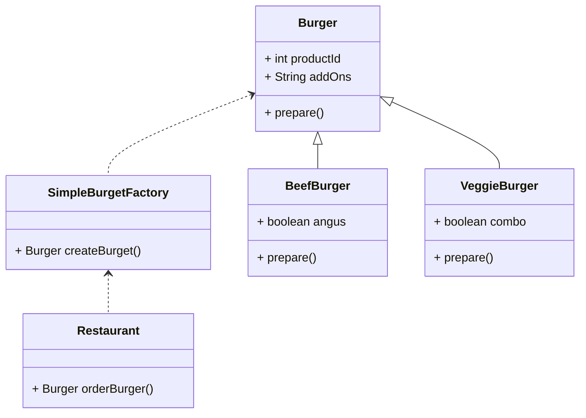
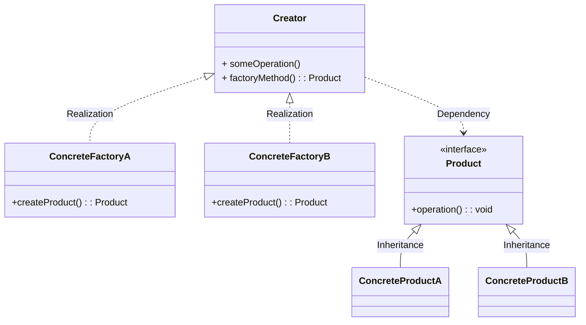
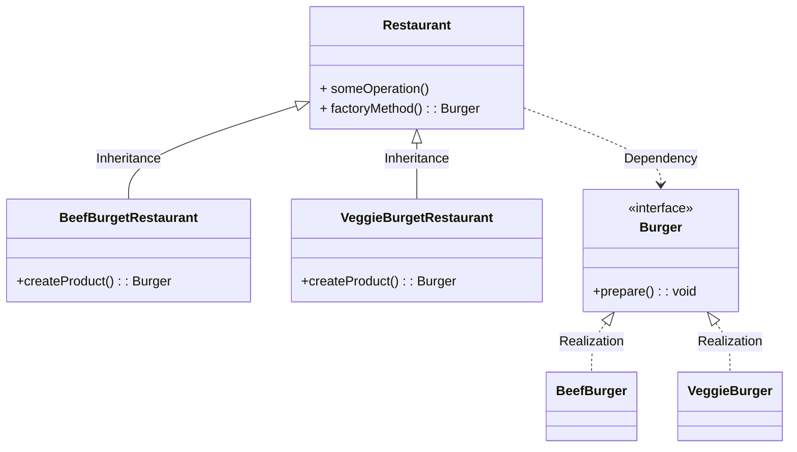
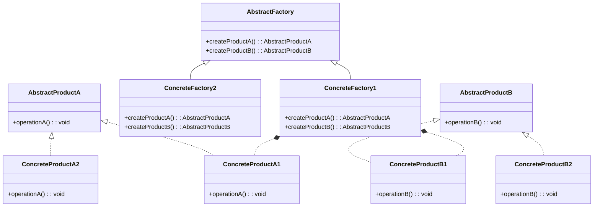

https://www.youtube.com/watch?v=EdFq_JIThqM

# origin

1. donnot have a common base class

```
public class Restuarant{
    public ???? orderBuger(String request){
        if("BEEF".equals(request)){
            BeefBurger burger  = new BeefBurger();
            burget.prepare();
            return burger;
        }else if("VEGGIE".equals(request)){
            VeggieBurger burger = new VeggieBurger();
            burget.prepare();
            return burger;
        }
    }
}
```

We can extract common foods then  have a standard factory below.
It extracts common methods from the BeefBurger and VeggieBurger classes, reducing duplicated methods.

# Static Factory Method (Simple Factory)

is not a full-fledged offical pattern

* Implementation
    Uses a single class with a static method to create different types of objects based on input parameters.
* Use Case
    Use the Simple Factory pattern when you have a limited number of classes to instantiate and do not expect the set of classes to change frequently.

UML



implements

```
public class SimpleBurgetFactory{
    public Burger orderBuger(String request){
        if("BEEF".equals(request)){
            BeefBurger burger  = new BeefBurger();
        }else if("VEGGIE".equals(request)){
            VeggieBurger burger = new VeggieBurger();
        }
        burget.prepare();
        return burger;
    }
}
```

# Factory method

https://refactoring.guru/design-patterns/factory-method

"When we need to add a new recipe, we still need to change SimpleBurgetFactory code."
工厂方法模式   ： 只创建一种类型的实例，
抽象工厂方法模式 ： 创建多种类型的实例, 抽象工厂 只有一个实例后，也就是工厂方法。


工厂方法和抽象工厂方法 都是通过工厂生产产品，由于产品都实现了相同的接口，根据获取到的产品作相应的处理

工厂方法 :返回一个产品实例 ,  继承了工厂Dialog Base类,Base类抽象方法由sub类实现

抽象工厂方法:可以返回一组相关的产品实例,实现了创建不同产品的抽象工厂接口

工厂方法，一个工厂对应一个产品.
如果我们想新增一种类型或者修改，一种类型，那么就需要修改上面简单工厂的代码。

## Standard UML




我们的工厂不再创造对象，而是把这个构建过程移到子类。

## UML IMPLEMENTATION



```
public class Restaurant{
    public Burger orderBuger(String request){
        Burger burger  = createBurget();
        burget.prepare();
        return burger;
    }
    public abstract Burget createBurget();
}

public class BeefBurgetRestaurant extends Restaurant{
    @Override
    public  Burget createBurget(){
        return new BeefBurger();
    }
}

public class VeggieBurgetRestaurant extends Restaurant{
    @Override
    public  Burget createBurget(){
        return new  VeggieBurger();
    }
}

public interface Burger{
    void prepare();
}

public class BeefBurger implements Burger{
    void prepare(){}
}

public class VeggieBurger implements Burger{
    void prepare(){}
}

/** 原来的代码没有， 可以尝试这种方式更好*/
public class Store{
    privste Restaurant factory;
    public Store(Restaurant factory){
        this.factory = factory;
    }
   public orderBuger(String request){
    factory.orderBuger(request)
   } 
}


public static void main(String[] args) {
    BeefBurgetRestaurant beefResto = new BeefBurgetRestaurant();
    Burger beefBurger =  beefResto.orderBurget();

    VeggieBurgetRestaurant veggieResto = new VeggieBurgetRestaurant();
    Burger beefBurger =  veggieResto.orderBurget();
}
```

## JDK源码解析-Collection.iterator方法

ArrayList used


11f207f50a613801f673fd4c82242b3c35d71f4b
Collection接口 : 抽象工厂类，                                Restaurant
ArrayList : 具体的工厂类；                                 BeefBurgetRestaurant 
Iterator接口是抽象商品类，                                  Burger  
ArrayList类中的Iter内部类 : 具体的商品类。        BeefBurger 

在具体的工厂类中iterator()方法创建具体的商品类的对象。

```
        List<String> list = new ArrayList<>();
        list.add("令狐冲");
        list.add("风清扬");
        list.add("任我行");

        //获取迭代器对象
        Iterator<String> it = list.iterator();
        //使用迭代器遍历
        while(it.hasNext()) {
            String ele = it.next();
            System.out.println(ele);
        }
```

另外    
DateForamt类中的getInstance()方法使用的是工厂模式；
Calendar类中的getInstance()方法使用的是工厂模式；

## The problem of Factory of method

如果我们需要新开另一家店 italian 餐厅,由于当前的工厂只能生产一种产品，所以就需要在工厂里面添加参数判断，这样使用工厂方法，还是比较耦合。

### Demo1

```
public class BeefBurgetRestaurant extends Restaurant{
    @Override
    public  Burget createBurget(String request){
         Burger burger = null;
         if("ITALIAN".equals(request)){
             burger  = new ItalianBeefBurger();
         }else if("VEGGIE".equals(request)){
             burger = new AmericanBeefBurger();
         }    
        return burger;
    }
}

public class VeggieBurgetRestaurant extends Restaurant{
    @Override
    public  Burget createBurget(String request){
         Burger burger = null;
         if("ITALIAN".equals(request)){
             burger  = new ItalianVeggieBurger();
         }else if("VEGGIE".equals(request)){
             burger = new AmericanVeggieBurger();
         }    
        return burger;
    }
}
```

### Demo2

The first picture is the factory method


But if we want to buy a new type of product, the code will look like this, the same as in demo1.


that violate the open-closed principle
How can we solve the problem?

# Abstract Factory

在原有生产GPU的产品线上，好需要添加监控的功能，此时就会出现如下 代码耦合的情况。

https://www.youtube.com/watch?v=QNpwWkdFvgQ&t=0s

## Use Case:

* Use the Abstract Factory pattern when a system needs to be independent of how its objects are created, composed, and represented.
* It is useful when a system needs to support multiple families of products.


## Implementation:

* so A single factory is not enough，
    The Abstract Factory pattern involves multiple factory methods to create a set of related objects.
* It defines an interface for creating all the objects in a family, and each concrete factory implements this interface to create specific types of objects.


The class I drew below is not very clear, so I only drew the ConcreateFactory part



### implements


```
public abstract class Company {
    public abstract Gpu createGpu();
    public abstract Monitor createMonitor();
}

public class AsusManufacturer extends Company {
    @Override
    public Gpu createGpu() {
        return new AsusGpu();
    }
    @Override
    public Monitor createMonitor() {
        return new AsusMonitor();
    }
}

public class MsiManufacturer extends Company {

    @Override
    public Gpu createGpu() {
        return new MsiGpu();
    }

    @Override
    public Monitor createMonitor() {
        return new MsiMonitor();
    }

}

    public static void main(String[] args) {

        Company msi = new MsiManufacturer();
        Company asus = new AsusManufacturer();

        List.of(msi.createGpu(), msi.createMonitor(), asus.createGpu(), asus.createMonitor())
                .forEach(Product::assemble);

    }
```

## Summary of Differences

* Scope: The Factory Method is used for creating a single product, while the Abstract Factory is used for creating families of related products.
* Complexity: The Abstract Factory pattern is more complex than the Factory Method pattern because it involves multiple factory methods to create a set of related objects.
* Inheritance vs. Composition: The Factory Method pattern uses inheritance to let subclasses decide which class to instantiate, while the Abstract Factory pattern uses composition to create families of related objects.  <u>but  I think  I think there isn't much difference. </u>

https://blog.csdn.net/qq_18242391/article/details/81503370
https://github.com/geekific-official/geekific-youtube/blob/main/design-patterns/creational-abstract-factory/src/main/java/com/youtube/geekific/MainApp.java