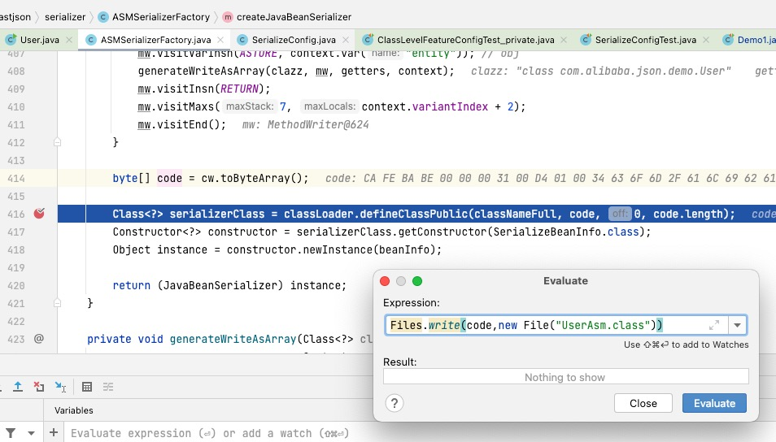

https://zonghaishang.gitbooks.io/fastjson-source-code-analysis/content/


#### FastJson为什么快

https://tobebetterjavaer.com/gongju/fastjson.html#_05%E3%80%81%E6%88%91%E4%B8%BA%E4%BB%80%E4%B9%88%E5%BF%AB


1. 为什么要进行序列化
2. 每个实体bean都必须实现serializabel接口吗

实现序列化的两个原因：1、将对象的状态保存在存储媒体中以便可以在以后重新创建出完全相同的副本；2、按值将对象从一个应用程序域发送至另一个应用程序域。实现serializable接口的作用是就是可以把对象存到字节流，然后可以恢复，所以你想如果你的对象没实现序列化怎么才能进行持久化和网络传输呢，要持久化和网络传输就得转为字节流，所以在分布式应用中及设计数据持久化的场景中，你就得实现序列化。

第二个问题，是不是每个实体bean都要实现序列化，答案其实还要回归到第一个问题，那就是你的bean是否需要持久化存储媒体中以及是否需要传输给另一个应用，没有的话就不需要，例如我们利用fastjson将实体类转化成json字符串时，并不涉及到转化为字节流，所以其实跟序列化没有关系。


Fastjson 示例没有 实现serializabel

```java
public class AutoTypeTest0 extends TestCase {
    public void test_0() throws Exception {
        String text = "{\"@type\":\"com.alibaba.json.bvt.parser.autoType.AutoTypeTest0$Model\",\"id\":123}";
        Model model = JSON.parseObject(text, Model.class);
        assertEquals(123, model.id);

        Model model2 = (Model) JSON.parse(text);
        assertEquals(123, model2.id);
    }

    public static class Model {
        public int id;
    }
}
```


针对第2个问题，那么json字符串最终网络传输有没有转化成 字节流，是怎么转的呢？,还是在网络协议中转的。

https://blog.csdn.net/weixin_44203158/article/details/88382770


#### 原理

FastJson的序列化过程，就是把一个内存中的Java Bean转换成JSON字符串，得到字符串之后就可以通过数据库等方式进行持久化了。

那么，FastJson是如何把一个Java Bean转换成字符串的，一个Java Bean中有很多属性和方法，哪些属性要保留，哪些要剔除，到底遵循什么样的原则呢？

其实，对于JSON框架来说，想要把一个Java对象转换成字符串，可以有两种选择：

- 基于成员变量
- 基于setter/getter方法

常用的JSON序列化框架中，FastJson和jackson在把对象序列化成json字符串的时候，是通过遍历出该类中的所有getter方法进行的。Gson是通过反射遍历该类中的所有属性，并把其值序列化成json。


https://codeantenna.com/a/vGtiZACEWS

https://codeantenna.com/a/JCFJvwdTsd


#### 源码分析

https://blog.csdn.net/shangzonghai/article/details/79187455

https://github.com/zonghaishang/fastjson 注释版本


Android版本

https://github.com/alibaba/fastjson/wiki/Android%E7%89%88%E6%9C%AC


#### Fastjson修bug

1. 讲解怎么打印ASM字节数据

   

   

   

   mac jdk版本切换

  https://www.bilibili.com/video/BV1JJ41197UK?spm_id_from=333.337.search-card.all.click

​	 Fastjson 为什么用 IdentityHashMap


#### 序列化流程


通过asm 获取对象上的属性的get方法集合，然后通过调用相应的方法拼装出json字符串。


```java
public final void write(Object object) {
    if (object == null) {
        /** 如果对象为空，直接输出 "null" 字符串 */
        out.writeNull();
        return;
    }

    Class<?> clazz = object.getClass();
    /** 根据对象的Class类型查找具体序列化实例 */
    ObjectSerializer writer = getObjectWriter(clazz);

    try {
        /** 使用具体serializer实例处理对象 */
        writer.write(this, object, null, null, 0);
    } catch (IOException e) {
        throw new JSONException(e.getMessage(), e);
    }
}
```


```java
private ObjectSerializer getObjectWriter(Class<?> clazz, boolean create) {
   if (create) {
    /** 没有精确匹配，使用通用JavaBeanSerializer 序列化(假设不启用asm) */
     writer = createJavaBeanSerializer(clazz);
     put(clazz, writer);
    }
         
    if (writer == null) {
       /** 尝试在已注册缓存找到特定class的序列化实例 */
     writer = serializers.get(clazz);
    }
}
```


User ASM 在这里生成

```java
public JavaBeanSerializer createJavaBeanSerializer(SerializeBeanInfo beanInfo) throws Exception {

        byte[] code = cw.toByteArray(); // 这里就是动态生成的字节码文件
  
        Class<?> serializerClass = classLoader.defineClassPublic(classNameFull, code, 0, code.length);
        Constructor<?> constructor = serializerClass.getConstructor(SerializeBeanInfo.class);
        Object instance = constructor.newInstance(beanInfo);

        return (JavaBeanSerializer) instance;
}
```


这是生成的ASM类

```java
public class ASMSerializer_1_User extends JavaBeanSerializer implements ObjectSerializer {
    public Type id_asm_fieldType = ASMUtils.getMethodType(User.class, "getId");
    public ObjectSerializer id_asm_ser_;

    public ASMSerializer_1_User(SerializeBeanInfo var1) {
        super(var1);
    }

    public void write(JSONSerializer var1, Object var2, Object var3, Type var4, int var5) throws IOException {
        if (var2 == null) {
            var1.writeNull();
        } else {
            SerializeWriter var9 = var1.out;
            if (!this.writeDirect(var1)) {
                this.writeNormal(var1, var2, var3, var4, var5);
            } else if (var9.isEnabled(32768)) {
                this.writeDirectNonContext(var1, var2, var3, var4, var5);
            } else {
                User var10 = (User)var2;
                if (!this.writeReference(var1, var2, var5)) {
                    if (var9.isEnabled(2097152)) {
                        this.writeAsArray(var1, var2, var3, var4, var5);
                    } else {
                        SerialContext var11 = var1.getContext();
                        var1.setContext(var11, var2, var3, 0);
                        char var12 = '{';
                        String var6 = "id";
                        Long var13 = var10.getId();
                        if (var13 == null) {
                            if (var9.isEnabled(260)) {
                                var9.write(var12);
                                var9.writeFieldNameDirect(var6);
                                var9.writeNull(0, 256);
                                var12 = ',';
                            }
                        } else {
                            var9.write(var12);
                            var9.writeFieldNameDirect(var6);
                            var1.writeWithFieldName(var13, var6, this.id_asm_fieldType, 0);
                            var12 = ',';
                        }

                        var6 = "name";
                        String var14 = var10.getName();
                        if (var14 == null) {
                            if (var9.isEnabled(132)) {
                                var9.write(var12);
                                var9.writeFieldNameDirect(var6);
                                var9.writeNull(0, 128);
                                var12 = ',';
                            }
                        } else {
                            var9.writeFieldValueStringWithDoubleQuoteCheck(var12, var6, var14);
                            var12 = ',';
                        }

                        if (var12 == '{') {
                            var9.write(123);
                        }

                        var9.write(125);
                        var1.setContext(var11);
                    }
                }
            }
        }
    }
}
```

https://www.jianshu.com/p/824f8f4df15d


####  反序列化

 通过asm 获取对象上的属性的set方法集合，然后调用set方法集合，赋值到相应的属性。

```java
Files.write(code,new File("ASMDeserializer.class"))
```


###### Token定义

Token是Fastjson中定义的json字符串的同类型字段，即"{"、"["、数字、字符串等，用于分隔json字符串不同字段。
 例如，{“姓名”：“张三”,“年龄”:“20”}是一个json字符串，在反序列化之前，需要先将其解析为
 `{` 、 `姓名`、 `：`、 `张三`、 `,`、 `年龄`、 `：`、 `20`、 `}`这些字段的Token流，随后再根据class反序列化为响应的对象。
 在进行Token解析之前，json字符串对程序而言只是一个无意义的字符串。需要将json字符串解析为一个个的Token，并以Token为单位解读json数据。

在`package com.alibaba.fastjson.parser`包中，给出了所有Token的定义。

稍后继续分析

https://blog.csdn.net/qq_45854465/article/details/120626835

https://blog.csdn.net/lllhhhyyy999/article/details/120896574


https://blog.csdn.net/shangzonghai/article/details/79187455
