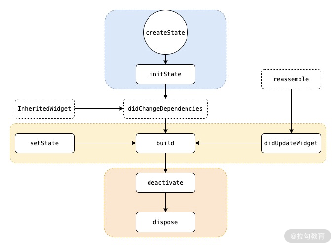

​		




https://flutter.dev/docs/development/ui/layout

#### Aligning widgets

##### MainAxisAlignment

* row 

  ```dart
  Row(
    mainAxisAlignment: MainAxisAlignment.spaceEvenly,
    children: [
      Image.asset('images/pic1.jpg'),
      Image.asset('images/pic2.jpg'),
      Image.asset('images/pic3.jpg'),
    ],
  );
  ```

  

* Column

  ```
  Widget buildRow() => Column(
        mainAxisAlignment: MainAxisAlignment.center,
        children: <Widget>[
          Image.asset('images/pic1.jpg'),
          Image.asset('images/pic2.jpg'),
          Image.asset('images/pic3.jpg'),
        ],
      );
  ```

  


####  constraints

##### ConstrainedBox

  The `ConstrainedBox` imposes **additional** constraints from its `constraints` parameter onto its child .

#####  UnconstrainedBox

The screen forces the `UnconstrainedBox` to be exactly the same size as the screen. However, the `UnconstrainedBox` lets its child `Container` be any size it wants

