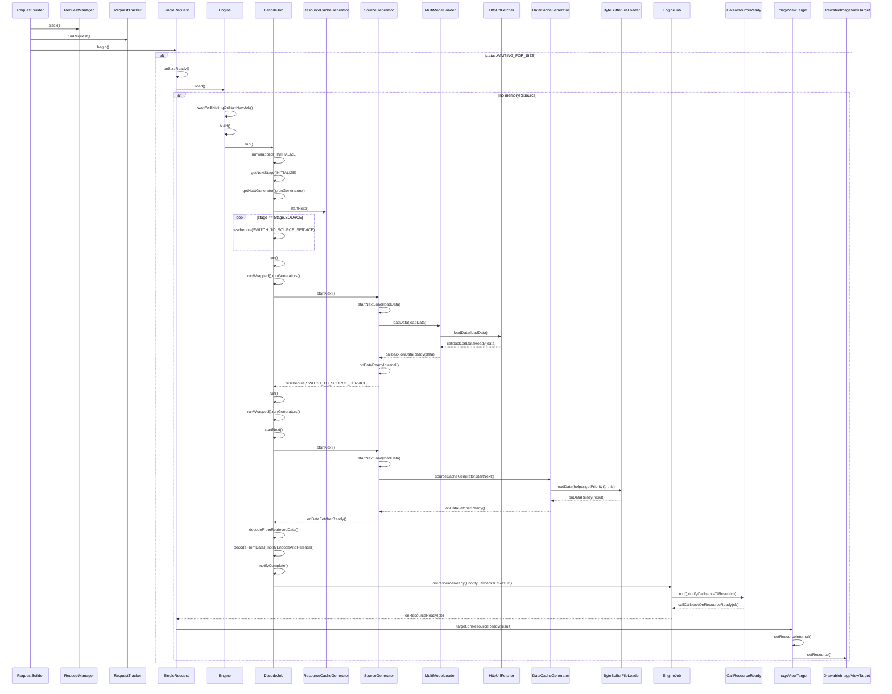
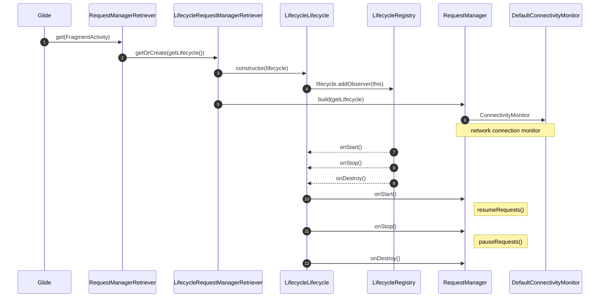
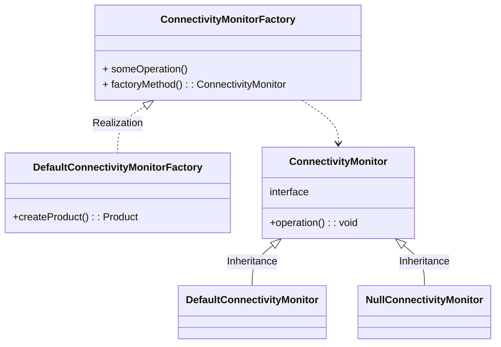
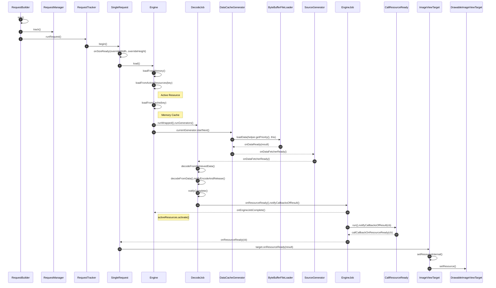
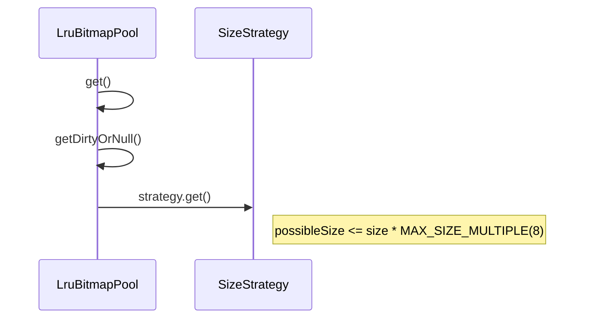

# Question

This article has many **flowcharts** to introduce the principles
https://mp.weixin.qq.com/s/ZjKkTJ5GpP8e2BnttiJEiA
https://juejin.cn/post/6882536990400020494

Glide使用什么缓存机制
LRUcache底层实现

glide和OkHttp的任务调度是怎么实现的（比如同时发起很多请求）
自己去实现图片库，怎么做？
Glide内存缓存如何控制大小？

https://juejin.cn/post/6956090846470995975

bitmap decode
https://juejin.cn/post/6844904161327185927
https://juejin.cn/post/6994669144490639368#heading-4

# Glide Flow

https://mp.weixin.qq.com/s/oSXDYhc_t4xhAVCfADxXfg
https://juejin.cn/post/7083367492810686472
https://blog.csdn.net/weixin_43298955/article/details/118661784
https://www.bilibili.com/video/BV1gq4y1n7wq?p=4
https://www.jianshu.com/p/48d9e4d5d75d


According to this picture, the image acquisition process is first from Active Resource, then from Memory cache, and then from Disk cache.

## sequenceDiagram   Status.WAITING_FOR_SIZE

Loading an image flow for the first time from the network



What should be noted here is that I looked at the source code. After getting the image from the Internet, it will not go directly to the active resource, nor will it be displayed directly on the ImageView. Instead, **it will be saved to the disk and then read from the disk**. I saw this

# Bind lifecycle

## Old lifecycle architecture


## new lifecycle architecture

The Glide library for Android indeed underwent significant changes in its architecture. As of Glide version 4.x, Glide has moved away from using ~~RequestManagerFragment~~ for lifecycle management. Instead, Glide now uses **LifecycleListener** interfaces and **RequestManagerRetriever** to more efficiently manage the lifecycle of requests.

Here is a brief overview of the changes:

 Glide 4.x and Lifecycle Management

1. Lifecycle Integration:
   Glide now directly integrates with Android's lifecycle components (Activity, Fragment, Application), which simplifies the lifecycle management of requests. Glide automatically pauses and resumes requests based on the lifecycle events.

2. LifecycleListeners:
   Glide uses LifecycleListener interfaces to handle lifecycle events. These listeners are registered with the Android components (Activities and Fragments), and they notify Glide when to start, stop, or recycle requests.

## Advantages of the New Approach

* Improved Lifecycle Handling: Glide now more accurately handles the lifecycle of requests, reducing the chances of memory leaks or unnecessary work.
* Simplified API: The new API is more intuitive and easier to use, thanks to the integration with Android's lifecycle components.

https://www.bilibili.com/video/BV1Qy4y1s7Gh?p=15

## LifeCycle flow UML



## connective lifecycle UML



# Glide caching strategy

Glide使用什么缓存机制
LRUcache底层实现


## Concept

### Cache Levels

* **Active Resources**: These are images currently being displayed. They are kept in memory for immediate access.
* **Memory Cache**: Once images are no longer in the active resources, they move to the memory cache if there is enough space.
* **Disk Cache** :  If images are no longer in the memory cache, they are still stored in the disk cache. This allows for retrieval without needing to download the image again.

### Caching Keys

* Glide generates unique keys for caching images. These keys are based on the image URL and any transformation or resizing options applied to the image.
* Custom keys can be provided by the developer to manage cache more effectively, especially when dealing with dynamic content.

### Image Requests

* When a request for an image is made, Glide first checks the active resources, then the memory cache, and finally the disk cache.
* If the image is not found in any of these caches, it is fetched from the network or local storage.

### Cache Invalidation

* Cache invalidation is necessary to ensure outdated images are not served. Glide allows developers to clear specific entries or entire caches.
* It supports automatic cache invalidation based on configurable time intervals.
* If the image does not exist in the memory cache, it is read from the disk cache and then placed into the active resources.
* If the image does not exist in the memory cache, it will be requested from the network. and then what ??? 

https://www.jianshu.com/p/dba296118f35
https://www.bilibili.com/video/BV1mT4y1R7F4/?p=37

## Disk Cache



step8 :  get Active Resources
step9 : get  Memery Cache
step20 : Read from disk cache and then put into active resources.

# KEY

In Java, the equals and hashCode methods are used to compare objects and manage how objects are stored in certain collections like HashMap and HashSet.

* equals Method
  The equals method determines whether two objects are equal. By default, the equals method in the Object class compares the memory addresses of the objects (i.e., whether they are the same instance). However, it is common to override this method to provide a meaningful equality check based on the object's state (i.e., its fields).

* hashCode Method
  The hashCode method returns an integer hash code representation of the object. The contract between equals and hashCode is that if two objects are equal according to the equals method, they must have the same hash code. However, two objects with the same hash code do not necessarily have to be equal.

## Identifying an Object

When you override the equals and hashCode methods properly, they can be used to uniquely identify an object in certain collections. Here's how:

1. Equality Check: When you use collections like HashSet or keys in HashMap, the equals method is used to check if an object already exists in the collection.
2. Hash Code: The hashCode method is used by hash-based collections (like HashMap and HashSet) to efficiently locate a bucket in which the object might be stored. Proper implementation of hashCode ensures that objects are distributed evenly across the buckets, reducing the number of collisions and improving performance.

## Example Implementation

```java
public class Person {
    private String name;
    private int age;

    // Constructor, getters, and setters

    @Override
    public boolean equals(Object obj) {
        if (this == obj) return true;
        if (obj == null || getClass() != obj.getClass()) return false;
        Person person = (Person) obj;
        return age == person.age && Objects.equals(name, person.name);
    }

    @Override
    public int hashCode() {
        return Objects.hash(name, age);
    }
}
```

## Key Points

1. Consistency: Ensure that equals and hashCode are consistent. If equals returns true for two objects, hashCode must return the same value for both.
2. Non-Equal Objects: It is acceptable for non-equal objects to have the same hash code, though this can degrade the performance of hash-based collections.

### equal objects cannot have different hash codes

1. Consistent with equals: If two objects are equal according to the equals method, they must have the same hash code.

2. Self-Consistency: If an object is compared to itself, the equals method must return true, and the hashCode method must consistently return the same integer, provided no information used in equals comparisons on the object is modified.

3. Non-Equal Objects: If two objects are not equal according to the equals method, it is not required that they have different hash codes. However, different hash codes for non-equal objects can improve the performance of hash-based collections.
   
   if two Person objects have the same name and age, they are considered equal. Consequently, their hash codes will also be the same because the hashCode method uses these fields to compute the hash code.

### Key Points

* Consistency Requirement: Equal objects must have the same hash code to ensure that hash-based collections (like HashMap and HashSet) function correctly.
* Implementation: The hashCode method should use the same fields that are used in the equals method to ensure consistency.
* Efficiency: While it is not required for unequal objects to have different hash codes, it is beneficial for the performance of hash-based collections.

Violating this contract by allowing equal objects to have different hash codes can lead to unexpected behavior in collections like HashMap and HashSet, resulting in problems such as missing entries or increased lookup times.

## Active recyle

After onDestroy() or recycling the bitmap, the active resource is put into memory cache.

ActiveResources.java

```java
  void cleanupActiveReference(@NonNull ResourceWeakReference ref) {
    synchronized (this) {
      activeEngineResources.remove(ref.key);

      if (!ref.isCacheable || ref.resource == null) {
        return;
      }
    }

    EngineResource<?> newResource =
        new EngineResource<>(
            ref.resource,
            /* isMemoryCacheable= */ true,
            /* isRecyclable= */ false,
            ref.key,
            listener);
    listener.onResourceReleased(ref.key, newResource); // 这里存储进内存缓存
  }

Engine.java
  @Override
  public void onResourceReleased(Key cacheKey, EngineResource<?> resource) {
    activeResources.deactivate(cacheKey);
    if (resource.isMemoryCacheable()) {
      cache.put(cacheKey, resource);
    } else {
      resourceRecycler.recycle(resource, /* forceNextFrame= */ false);
    }
  }
```

## LruCache


 LinkedHashMap参数含义

initialCapacity : 最大容量

loadFactor : 负载因子

accessOrder : 排序方式, true 按照访问顺序排序， false 按照插入顺序排序

 访问顺序排序

accessOrder : true

```java
LinkedHashMap<String, String> map = new LinkedHashMap<>(0, 0.75f, true);
map.put("a", "A");
map.put("b", "B");
map.put("c", "C");
map.put("d", "D");
map.put("e", "E");
map.put("f", "F");

map.get("a");
map.put("n","N");

for (Map.Entry<String, String> entry : map.entrySet()) {
    Log.d("LruCacheTest", "testLinkedHashMap : "+ entry.getKey()+" : " + entry.getValue());
}
```

结果

> D LruCacheTest: testLinkedHashMap : b : B
>  D LruCacheTest: testLinkedHashMap : c : C
>  D LruCacheTest: testLinkedHashMap : d : D
>  D LruCacheTest: testLinkedHashMap : e : E
>  D LruCacheTest: testLinkedHashMap : f : F
>  D LruCacheTest: testLinkedHashMap : a : A
>  D LruCacheTest: testLinkedHashMap : n : N

可以看到 先访问a ,在插入n,把最新最近使用和访问的 A N,放到链表后面

```java
LinkedHashMap<String, String> map = new LinkedHashMap<>(100, 0.75f, true);
```

> D LruCacheTest: testLinkedHashMap : a : A
> D LruCacheTest: testLinkedHashMap : b : B
> D LruCacheTest: testLinkedHashMap : c : C
> D LruCacheTest: testLinkedHashMap : d : D
> D LruCacheTest: testLinkedHashMap : e : E
> D LruCacheTest: testLinkedHashMap : f : F
> D LruCacheTest: testLinkedHashMap : n : N

https://github.com/JakeWharton/DiskLruCache

# Bitmap Reuse



LruBitmapPool

此步骤用于查找 entries 中最合适用来复用的 bitmap
 先找到 sizes 中大于 size 且和 size 最接近的 key，如果 key 存在且其大小不超出 size 的四倍，则使用该 key，否则直接使用 size
即找到最接近 size 但又不超出 size 太多的 bitmap，否则如果拿来复用的 bitmap 太大的话也比较浪费

链接：https://juejin.cn/post/6956090846470995975

```java
final class SizeStrategy implements LruPoolStrategy {
  private static final int MAX_SIZE_MULTIPLE = 8;

  @Override
  public Bitmap get(int width, int height, Bitmap.Config config) {
    final int size = Util.getBitmapByteSize(width, height, config);
    Key key = keyPool.get(size);

    Integer possibleSize = sortedSizes.ceilingKey(size);
    if (possibleSize != null && possibleSize != size && possibleSize <= size * MAX_SIZE_MULTIPLE) {
      keyPool.offer(key);
      key = keyPool.get(possibleSize);
    }
    return result;
  }
  }
```

# BUILD PROJECT


监控大图 
https://juejin.im/post/6844904136266219534

https://bumptech.github.io/glide/

https://github.com/xfhy/Android-Notes/blob/master/Blogs/Android/%E4%B8%89%E6%96%B9%E5%BA%93%E5%8E%9F%E7%90%86/Glide%E4%B8%BB%E6%B5%81%E7%A8%8B%E6%BA%90%E7%A0%81%E8%A7%A3%E6%9E%90.md
