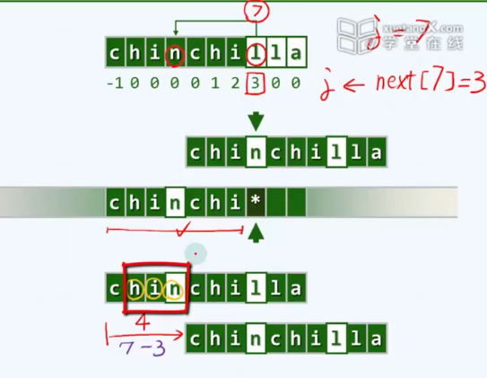

#### 蛮力算法

1. i++  j++

   ```c++
   /******************************************************************************************
    * Text     :  0   1   2   .   .   .   i-j .   .   .   .   i   .   .   n-1
    *             ------------------------|-------------------|------------
    * Pattern  :                          0   .   .   .   .   j   .   .
    *                                     |-------------------|
    ******************************************************************************************/
   int match ( char* P, char* T ) { //串匹配算法（Brute-force-1）
      size_t n = strlen ( T ), i = 0; //文本串长度、当前接受比对字符的位置
      size_t m = strlen ( P ), j = 0; //模式串长度、当前接受比对字符的位置
      while ( j < m && i < n ) //自左向右逐个比对字符
         /*DSA*/{
   //      /*DSA*/showProgress ( T, P, i - j, j );   getchar();
         if ( T[i] == P[j] ) //若匹配
            { i ++;  j++; } //则转到下一对字符
         else //否则
            { i -= (j - 1); j = 0; } //文本串回退、模式串复位   // i j 都在往右走， i -= (j - 1) 相当于i在初始位置 又往右走了一步
         /*DSA*/}
      return i - j; //如何通过返回值，判断匹配结果？
   }
   ```

2. i , j++

   ```c++
   /******************************************************************************************
    * Text     :  0   1   2   .   .   .   i   i+1 .   .   .   i+j .   .   n-1
    *             ------------------------|-------------------|------------
    * Pattern  :                          0   1   .   .   .   j   .   .
    *                                     |-------------------|
    ******************************************************************************************/
   int match ( char* P, char* T ) { //串匹配算法（Brute-force-2）
      size_t n = strlen ( T ), i = 0; //文本串长度、与模式串首字符的对齐位置
      size_t m = strlen ( P ), j; //模式串长度、当前接受比对字符的位置
      for ( i = 0; i < n - m + 1; i++ ) { //文本串从第i个字符起，与
         for ( j = 0; j < m; j++ ) //模式串中对应的字符逐个比对
            /*DSA*/{showProgress ( T, P, i, j ); getchar();
            if ( T[i + j] != P[j] ) break; //若失配，模式串整体右移一个字符，再做一轮比对
            /*DSA*/}
         if ( j >= m ) break; //找到匹配子串
      }
      return i; //如何通过返回值，判断匹配结果？
   }
   ```


数据结构下 第十三章 串

#### KMP算法


算法主体

```c++
int match ( char* P, char* T ) {  //KMP算法
   int* next = buildNext ( P ); //构造next表
   int n = ( int ) strlen ( T ), i = 0; //文本串指针
   int m = ( int ) strlen ( P ), j = 0; //模式串指针
   while ( j < m  && i < n ) //自左向右逐个比对字符
      /*DSA*/{
      /*DSA*/showProgress ( T, P, i - j, j );
      /*DSA*/printNext ( next, i - j, strlen ( P ) );
      /*DSA*/getchar(); printf ( "\n" );
      if ( 0 > j || T[i] == P[j] ) //若匹配，或P已移出最左侧（两个判断的次序不可交换）
         { i ++;  j ++; } //则转到下一字符
      else //否则
         j = next[j]; //模式串右移（注意：文本串不用回退）
      /*DSA*/}
   delete [] next; //释放next表
   return i - j;
}
```

构建next表


```c++
int* buildNext ( char* P ) { //构造模式串P的next表
   size_t m = strlen ( P ), j = 0; //“主”串指针
   int* N = new int[m]; //next表
   int t = N[0] = -1; //模式串指针
   while ( j < m - 1 )
      if ( 0 > t || P[j] == P[t] ) { //匹配
         j ++; t ++;
         N[j] = t; //此句可改进...
      } else //失配
         t = N[t];
   /*DSA*/printString ( P ); printf ( "\n" );
   /*DSA*/printNext ( N, 0, m );
   return N;
}
```


https://www.bilibili.com/video/av3246487/


**前缀是指不包含最后一个字符的所有以第一个字符开头的连续子串**。

**后缀是指不包含第一个字符的所有以最后一个字符结尾的连续子串**。


还一种理解 


Prefix 长度为k的前缀  :起始于首字符的前k个字符

suffix 长度为k的后缀 : 终止与末元素的最靠后的k个字符


前缀

字符串 :  ababacb

前缀集合 ：不包括最后一个字符  a , ab , aba , abab , ababa, ababac

后缀集合 : 不包括第一个字符 , b, cb, acb,bacb,abacb,babacb


