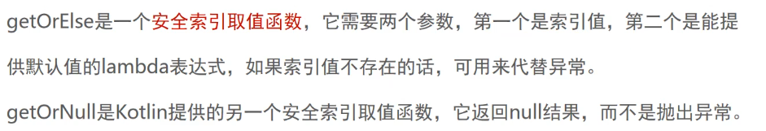
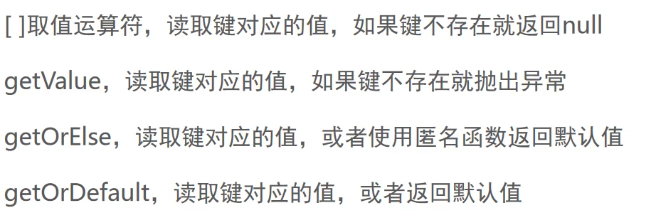

### 集合

#### List

List.kt

##### List创建与元素获取



```kotlin
val list = listOf("girl1", "girl2", "girl3")
println(list.getOrElse(3) { "Unknown" })
println(list.getOrNull(3))
println(list.getOrNull(3) ?: "Unknown")
```


##### 可变列表


```kotlin
val mutableList = mutableListOf("Jason", "Jack", "girl1")
mutableList.add("Jimmy")
mutableList.remove("Jack")
println(mutableList)

list.toMutableList() // 不可变转可变
mutableList.toList() // 可变转不可变
```


##### mutator函数


```kotlin
mutableList += "John"
mutableList -= "girl1"
mutableList.removeIf{it.contains("Jack")} //包含Jack就把 Jack移除
println(mutableList)
```


##### 集合遍历

1. for in
2. forEach
3. forEachIndexed遍历时要获取索引

```kotlin
for (s in list){
    println(s)
}
list.forEach{
    println(it)
}
list.forEachIndexed{index,item->
    println("$index  $item")
}
```

##### 解构

通过_符号过滤不想要的元素

```kotlin
//    val(girl1,girl2,girl3) = list
    val(girl1,_,girl3) = list   //如果不需要girl2,用_，这个字节码也不会取出
```


#### Set集合

##### elementAt获取元素

```kotlin
val set = setOf("girl1", "girl2", "girl3", "girl1")
println(set.elementAt(2))

val mutableSet = mutableSetOf("girl1", "girl2", "girl3", "girl1")
mutableSet += "girl5"
```


##### List去重

通过toSet去重

```kotlin
val list = mutableSetOf("girl1", "girl2", "girl3", "girl1").toSet().toList()
println(list)

val distinct = mutableSetOf("girl1", "girl2", "girl3", "girl1").distinct()
println(distinct)
```


##### 数组类型

 kotlin提供了各种Array,虽然是引用类型，但最终编译成Java基本数据类型

```kotlin
val intArray = intArrayOf(10, 30, 40)
listOf(10, 30, 40).toIntArray()
val array = arrayOf(File("xxx"), File("yyyy"))
```


#### Map集合




##### map获取

```kotlin
println(map["lucy1"])
println(map.getValue("lucy2"))
println(map.getOrElse("Jon"){"Unknown"}) //没有Jon，返回Unknown
println(map.getOrDefault("Jon",0)) //没有Jon，返回默认值0
```


##### map遍历

```kotlin
map.forEach{
    println("${it.key}, ${it.value}")
}
map.forEach{(key:String,value:Int)->
    println("${key}, ${value}")
}
```

##### mutableMap

```kotlin
val mutableMap = mutableMapOf("lucy1" to 18, "lucy2" to 19, "lucy3" to 20)
mutableMap += "jon" to 22
mutableMap.put("jon2",35)
mutableMap.getOrPut("Rose"){30} // 如果没有Rose,就添加进来
println(mutableMap)
```


### 定义类


```kotlin
Class Player{
	var name:String? = "jack" // 编译后生成了get. set方法
}

fun main(){
  var p = Player()
  p.name = "rose" //编译生成了 setName方法
}
```


##### 计算属性 

```kotlin
class Player {
    var name: String = "jack"
        get() = field.capitalize()
        set(value) {
            field = value.trim()
        }

    //计算属性是通过一个覆盖的get或set运算符来定义，这时field就不需要了。
    val rolledValue
        get() = (1..6).shuffled().first()
  
  
}
```


##### 防范竞态条件

```kotlin
//    如果一个类属性即可空又可变，那么引用它之前必须保证它非空，一个办法是用also标准函数
    var words:String? = "hello"
    fun saySomething(){
        words?.also { 
            println("Hello ${it.uppercase()}")
        }
    }
```


##### 构造函数

```kotlin
class Student(
        _name: String,
        _age: Int,
        _isNormal: Boolean
) {
    var name = _name //临时变量用 _表示 只用一次
        get() = field.capitalize()
        private set(value) {
            value.trim()
        }
    var age = _age //临时变量用 _表示 只用一次
        get() = age.absoluteValue
        set(value) {
            field = value.absoluteValue
        }
    var isNormal = _isNormal
}

fun main() {
    val p = Student("john", 19, true)
//    p.name = "rose" //Cannot assign to 'name': the setter is private in 'Student'
}
```


##### 主构造函数里定义属性

```kotlin
class Student2(
        _name: String,
        val age: Int,
        val isNormal: Boolean
) {
    var name = _name //临时变量用 _表示 只用一次
        get() = field.capitalize()
        private set(value) {
            value.trim()
        }
}

fun main() {
    val p = Student2("john", 19, true)
//    p.name = "rose" //Cannot assign to 'name': the setter is private in 'Student'
}
```


##### 次构造函数 

Student2.kt

```kotlin
constructor(_name:String):this(_name,age=100,isNormal = false)
constructor(_name:String,age: Int):this(_name,age=100,isNormal = false){ //定义初始化代码逻辑
    this.name = name.uppercase()
}

fun main(){
    val p2 = Student2("Rose")
    val p3 = Student2("Rose",20)
}
```


##### 构造函数给默认值

```kotlin
class Student3(
        _name: String,
        val age: Int = 20,
        val isNormal: Boolean
) {
    var name = _name //临时变量用 _表示 只用一次
        get() = field.capitalize()
        private set(value) {
            value.trim()
        }
}

fun main() {
    Student3(isNormal = false, _name = "Jon")
}
```


##### 初始化块

初始化块可以设置变量或值，以及执行有效性检查，如果检查传给某构造函数的值是否有效，**初始化块代码会在构造类实例时执行**。

```kotlin
class Student3(
        _name: String,
        val age: Int = 20,
        val isNormal: Boolean
) {
    var name = _name //临时变量用 _表示 只用一次
        get() = field.capitalize()
        private set(value) {
            value.trim()
        }

    init{
        require(age>0){"age must be positive"}
        require(name.isNotBlank()){"player must have a name."}
    }

}

fun main() {
    Student3(isNormal = false, _name = "Jon")
    Student3(isNormal = false, _name = "")
}
```


##### 初始化顺序

1. 主构造函数里声明的属性
2. 类级别的属性赋值
3. Init初始化块里的属性赋值和函数调用
4. 次构造函数里的属性赋值和函数调用


```kotlin
class Student4(
        _name: String,
        val age: Int	 //age 主构造函数里声明的属性
){
    var name = _name	//类级别的属性赋值 	name , score, hobby
    var score = 10;	
    private val hobby = "music" 
    val subject:String

    init {
        println("initializing student")	
        subject = "english"			//Init初始化块里的属性赋值和函数调用
    }
    constructor(_name: String):this(_name,10){
        score = 20		//次构造函数里的属性赋值和函数调用
    }
}

fun main(){
    Student4("jon")
}
```


反编译字节码后

```java
public Student4(@NotNull String _name, int age) {
   Intrinsics.checkNotNullParameter(_name, "_name");
   super();
   this.age = age;			//主构造函数里声明的属性
   this.name = _name;		//类级别的属性赋值	name , score, hobby
   this.score = 10;			
   this.hobby = "music";
   String var3 = "initializing student"; 		//Init初始化块里的属性赋值和函数调用
   boolean var4 = false;
   System.out.println(var3);
   this.subject = "english";		
}

public Student4(@NotNull String _name) {  //调用这个构造方法
   Intrinsics.checkNotNullParameter(_name, "_name");
   this(_name, 10); 
   this.score = 20;			//次构造函数里的属性赋值和函数调用
}
```


##### 延迟初始化


```kotlin
class Player4 {
    lateinit var equipment:String
    fun ready(){
        equipment = "sharp knife"
    }
    fun battle(){
        if (::equipment.isInitialized) println(equipment)
    }
}

fun main() {
    val p = Player4()
    p.ready()
    p.battle()
}
```


##### 惰性初始化

延迟初始化并不是推后初始化的唯一方式，也可以暂时不初始化某个变量，**直到首次使用它才初始化**，这个叫做惰性初始化。

```kotlin
class Player5(_name: String) {
    var name = _name

    val config by lazy { loadConfig() } // 懒汉式
//    val config = loadConfig()   //饿汉式

    private fun loadConfig(): String {
        println("loading...")
        return "beauty girl"
    }
}

fun main() {
    val p = Player5("girl")
    Thread.sleep(5000)
    println(p.config)
}
```


Java不会有这种陷阱

##### 初始化陷阱1

顺序非常重要，必须保证块中的所有属性已完成初始化

```kotlin
init {
    val bloodBonus = blood.times(4)
}
val blood  = 100 //必须保证块中的所有属性已完成初始化
```


#####  初始化陷阱2

```kotlin
class Player7 {
   val name:String //类级别属性
   private fun  firstLetter() = name[0]
    init {
        println(firstLetter())
        name= "john"    //初始化块代码排第三
    }
}

fun main() {
    Player7()
}
```

##### 初始化陷阱3

initPlayerName() 初始化 playerName时，name属性还未完初始化。

```kotlin
class InitTrapTest3(_name:String) {
    val playerName:String = initPlayerName()
    val name:String = _name     //这个要放第一句
    private fun initPlayerName() = name

}
fun main() {
   println(InitTrapTest3("John").playerName)
}
```
