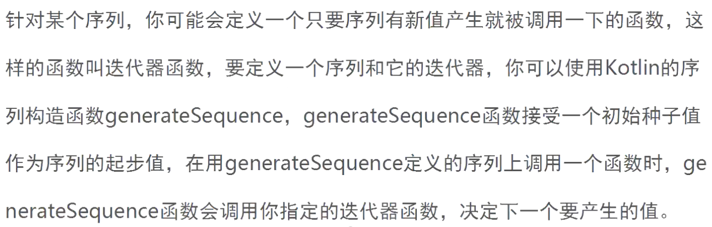

### 拓展函数


```kotlin
//给字符串追加若干个 !
fun String.addExt(amount:Int=1)= this + " !".repeat(amount)

fun Any.easyPrint() = println(this) //默认是public
//fun Any.easyPrint() = println(this) //不能定义两次

fun main() {
    println("abc".addExt(2))
    "abc".easyPrint()
    15.easyPrint()
}
```


##### 泛型拓展函数


```kotlin
//给字符串追加若干个 !
fun String.addExt(amount:Int=1)= this + " !".repeat(amount)

fun <T> T.easyPrint():T{
    println(this)
    return this
}

fun main() {
    "abc".addExt(2).easyPrint()
    15.easyPrint()
    15.also {  }
    val let = "abc".let { 50 }
}
```

##### Let源码

```kotlin
// "abc"调用let，传进来参数就是"abc"类型T为String
// let返回lambda表达式执行的结果 50 类型R为Int
public inline fun <T, R> T.let(block: (T) -> R): R {
    contract {
        callsInPlace(block, InvocationKind.EXACTLY_ONCE)
    }
    return block(this)
}
```


##### 拓展属性

给String类添加一个拓展

```kotlin
//给字符串追加若干个 !
fun String.addExt(amount: Int = 1) = this + " !".repeat(amount)
val String.numVowels
    get() = count { "aeiou".contains(it) }


fun <T> T.easyPrint(): T {
    println(this)
    return this
}

fun main() {
    "abc".addExt(2).easyPrint()

    "The people's Republic of China".numVowels.easyPrint()
}
```


##### 可空类拓展

可以定义拓展函数用于可空类型，在可空类型上定义拓展函数，你可以直接在拓展函数体内借鉴可能出现的空值问题。

```kotlin
//就是String后加?
fun String?.printWithDefault(default:String) =print(this ?: default) //null打印默认值,不为null 打印自身

fun main() {
//    val nullableString:String? = null
    val nullableString:String? = "hehe"
    nullableString.printWithDefault("abc") // nullableString?就不会设置默认值
}
```


##### Infix


```kotlin
infix fun String?.printWithDefault(default:String) =print(this ?: default) //null打印默认值,不为null 打印自身

fun main() {
//    val nullableString:String? = null
    val nullableString:String? = "hehe"
    nullableString.printWithDefault("abc") // nullableString?就不会设置默认值
    nullableString printWithDefault "abc"  // 加了infix可以简化成这样
    "girl".to(18)
    mapOf("girl" to 18)
}
```

```kotlin
//to是拓展函数，返回 Pair<A,B>
public infix fun <A, B> A.to(that: B): Pair<A, B> = Pair(this, that)
```


##### 定义拓展文件

```kotlin
package com.util.kotin.extension

fun <T> Iterable<T>.randomTake(): T = this.shuffled().first()

fun main() {
    var list = listOf("Jack", "Json", "John")
    var set = listOf("Jack", "Json", "John")
    list.shuffled().first()

    list.randomTake()
}
```


##### 重命名拓展

```kotlin
import com.util.kotin.extension.randomTake as Randomizer
fun main() {
    var list = listOf("Jack", "Json", "John")
    var set = listOf("Jack", "Json", "John")
    list.shuffled().first()

//    list.randomTake()
    list.Randomizer()
}
```


##### Apply源码


**T.()什么意思**

这个就是 带接收者的函数字面量，拓展函数里自带了接收者对象的this隐式调用


```kotlin
public inline fun <T> T.apply(block: T.() -> Unit): T {
    block()
    return this
}

T.() -> Unit //T.() 表示 任何类型无参数的拓展函数，匿名函数也可以是拓展函数
```


```kotlin
import java.io.File

//fun String.addExt(amount: Int = 1) = this + " !".repeat(amount)
fun String.addExt() = " !".repeat(this.count())

// 泛型的拓展函数
fun <T> T.easyPrint(): Unit = println(this)


// T.apply 返回的还是T
// T.() -> Unit 传入拓展函数(泛型), 而不是普通的匿名函数() -> Unit ,没用泛型T就会报错,T表示可以用任意类型
// 拓展函数里自带了接收者对象的this隐式调用
// 匿名函数，也可以是 拓展函数
//普通的匿名函数 ()->Unit
//匿名函数内部this指向一个File对象,隐式调用，File.() -> Unit
public inline fun <T> T.apply(block: T.() -> Unit): T {
    block()
    return this
}

/*public inline fun <File> File.apply(block: File.() -> Unit): File {
    block()
    return this
}*/


fun main() {
    val file = File("xx").apply {
        this.setReadable(true) //默认又一个对象指向File
    }
  
    val file = File("xx").apply {
        this.setReadable(true) //如果是 () -> Unit这样，这里就会报错，没有File类型了
    }
  

    //这里分解一下
    //1. 定义拓展函数
    fun File.ext(): Unit {
        setReadable(true)
    }
    //2.给block变量赋值
    val block = File::ext
    //3.传入apply函数
    File("xxx").apply { block }


    doSomething {
        goFix()
    }
    "abcefg".addExt().easyPrint() // "abcefg"调用addExt() ,addExt()有一个对象指向"abcefg"

    "abc".apply {
    }


}

fun doSomething(fix: () -> Unit) {
    fix
}

fun goFix(): Unit {
    "goFxi"
}
```


##### 案例LoginModel.kt

```kotlin
RpcExpress.pack {
    request.mobileNo = mobileNo
    request.metaInfo = metaInfo
}
```


```kotlin
inline fun <reified T : RpcRequest, reified R : RpcResult, reified E : RpcTask> pack(
        build: RpcPackage<T, R, E>.() -> Unit
): RpcExecutor<T, R, E> {
    val rpcPackage =
        RpcPackage<T, R, E>(T::class.java.newInstance(), R::class.java, E::class.java)
    build(rpcPackage) // 也可以写成 rpcPackage?.build() , 给rpcPackage赋值
    return this.pack(rpcPackage)
}
```


### 函数式编程


函数类别


##### Map变换


```kotlin
val animals = listOf("zebra", "giraffe", "elephant", "rat")
val banies = animals.map { animal ->
    "A baby $animal"
}.map {
    baby -> "$baby , with the cutest little tail ever!"
}

println(animals)
println(banies)
```


```kotlin
val animalsLength = animals.map { it.length }
println(animalsLength)
```


##### flatMap

faltMap函数操作一个集合的集合，将其中多个**集合中的元素的合并**后返回一个包含所有元素的单一集合。

```kotlin
val result = listOf(listOf(1, 2, 3), listOf(4, 5, 6)).flatMap { it }
println(result)
```


##### 过滤


```kotlin
val result = listOf("Jack","Jimmy","Rose","Tom").filter {
    it.contains("J")
}
println(result)
```


```kotlin
val items = listOf(
        listOf("rea apple", "green apple", "blue apple"),
        listOf("red fish", "blue fish"),
        listOf("yellow banana", "teal banana")
)
val redItems = items.flatMap { it.filter { it.contains("red") } }
println(redItems)
```


##### 找素数

找素数，除了1和它本身，不能被任何数整除的数。

```kotlin
// 除了1和它本身， 不梦被任何数整除的数
// 取模等于0，说明能够整除，如果没有一个是等于0的，说明是素数。
val numbers = listOf(7, 4, 8, 4, 3, 22, 18, 11)
val primes = numbers.filter { number ->
    (2 until number).map { number % it }.none { it == 0 }
}
println(primes)
```

#### 合并

合并是函数式编程的第三大类函数，合并能将不同的集合合并成一个新的集合。这个接收者是包含集合的的集合的flatmap函数不同。

##### zip


```kotlin
val list1 = listOf("jon", "john1", "john2")
val list2 = listOf("l1", "l2", "l3")

val toMap = list1.zip(list2).toMap()
println(toMap)
```

> {jon=l1, john1=l2, john2=l3}


##### Fold 

可以用来合并值的合并函数是fold，这个合并函数接受一个初始累加器值，随后会**根据匿名函数的结构更新**。

fold(0)  accumulator从0开始

```kotlin
//将每个元素值 乘以3后累加起来
val foldedValue = listOf(1, 2, 3, 4).fold(0) { accumulator, number ->
    println("Accmulator value: $accumulator")
    accumulator + (number * 3)
}
println("Find value: $foldedValue")
```


>Accmulator value: 0
>Accmulator value: 3
>Accmulator value: 9
>Accmulator value: 18
>Find value: 30

##### 序列





```kotlin
//判断是否是素数
fun Int.isPrime(): Boolean {
    (2 until this).map {
        if (this % it == 0) {
            return false
        }
    }
    return true
}

fun main() {
    //产生头1000个元素
    //假定 0 - 5000之内，可以找到1000个元素
    val toList = (1..5009).toList().filter { it.isPrime() }.take(1000)
    println(toList.size)

    val oneThousandPrimes = generateSequence(2) { value ->
        value + 1
    }.filter { it.isPrime() }.take(1000)
    println(oneThousandPrimes.toList().size)
}
```

##### 互操作性与可空性


```java
public class Jhava {
    private int hitPoints = 3232320;

    public int getHitPoints() {
        System.out.println("----hitPoints-----");
        return hitPoints;
    }

    public String utterGreeting() {
        return "HELLO";
    }


    public static void main(String[] args) {
//        System.out.println(HeroKt.makeProclamation());
    }

    @Nullable
    public String determineFriends() {
        return null;
    }
}

```


```kotlin
fun main() {
    val adversary = Jhava()
    println(adversary.utterGreeting())

    // determineFriends String! 平台类型
//    val level = adversary.determineFriends().toLong()
//    level?.toLong()
    println(adversary.hitPoints)
}
```

HELLO
----hitPoints-----
3232320


##### @JvmName注解指定编译类的名字

​	

```kotlin
@file:JvmName("Hero")

import senior.Jhava

fun makeProclamation() = "Greetings , beast!"
```


##### @JvmField


```java
class SpellBook {
    val spells = listOf("Magic Ms . L", "Lay onHans")

    @JvmField
    val spells1 = listOf("Magic Ms . L", "Lay onHans")
}
```


```java
SpellBook spellBook = new SpellBook();

List<String> spells = spellBook.getSpells();
List<String> spells1 = spellBook.spells1; // 直接用这个属性名，不用加get前缀
```


##### @JvmOverloads

```kotlin
//调用者可以指定英雄左手或右手拿什么食物，或者使用默认的配置 - 左手拿浆果，右手拿牛肉
@JvmOverloads
fun handoverFood(leftHand: String = "berries", rightHand: String = "beef") {
    println("Mmmm... you hand over some delicious $leftHand and $rightHand")
}
```


可以看到编译器默认对类添加了重载


```kotlin
@JvmOverloads
public static final void handoverFood(@NotNull String leftHand) {
   handoverFood$default(leftHand, (String)null, 2, (Object)null);
}

@JvmOverloads
public static final void handoverFood() {
   handoverFood$default((String)null, (String)null, 3, (Object)null);
}
```


但是代码中我获取不到 Herokt 类。

https://www.bilibili.com/video/BV1wf4y1s7TG?p=144&spm_id_from=pageDriver


##### @JvmStatic 

@JvmField注解还能用来以静态方式提供伴生对象里定义的值

@JvmStatic注解的作用类似于@JvmField, 允许你直接调用伴生对象里的函数


```kotlin
class SpellBook {

    companion object{
        @JvmField
        val MAX_SPELL_COUNT = 10
        fun getSpellbookGreeting() = println("I am the Great man!")
    }
}
```


加了@JvmField注解 就不用加 Companion调用

```java
//伴生对象
SpellBook.Companion.getSpellbookGreeting();

//添加@JvmField  支持静态调用
int maxSpellCount = SpellBook.MAX_SPELL_COUNT;
```


##### @Throws


​	

```java
public class Jhava {

    public void extendHandInFriendship() throws IOException {
        throw new IOException();
    }
}
```

###### Java异常 java处理

```java
try {
    //在java里面强制 在编译器处理的异常
    new Jhava().extendHandInFriendship();
} catch (IOException e) {
    e.printStackTrace();
}
```


###### Java异常 kotlin处理

Hero.kt

```kotlin
try {
    adversary.extendHandInFriendship()
}catch (e:Exception){
    println("exception")
}
```


kotlin异常Java处理

Hero.kt

```kotlin
fun acceptApology() {
    throw IOException()
}
```


```java
try {
    HeroKt.acceptApology();
} catch (IOException e) {   //报错 Exception 'java.io.IOException' is never thrown in the corresponding try block
    e.printStackTrace();
}
```

编译器把kotlin转成了Throwable

```java
public static final void acceptApology() {
   throw (Throwable)(new IOException());
}
```

所以catch Throwable异常没问题

```java
try {
    HeroKt.acceptApology();
} catch (Throwable e) {   
    e.printStackTrace();
}
```


##### 添加throws注解处理

```
@Throws(IOException::class)
fun acceptApology1() {
    throw IOException()
}
```

```java
try {
    HeroKt.acceptApology1();
} catch (IOException e) {
    e.printStackTrace();
}
```


##### Function


```kotlin
//添加一个translator的函数，接收一个字符串
//将其改为小写字面，再大写第一个字符，最后打印结构
var translator : (String)->Unit = { utterance: String ->
    println(utterance.toLowerCase().capitalize())
}
```


```Sjava
Function1<String, Unit> translator = HeroKt.getTranslator();
translator.invoke("TRUECE");
```
