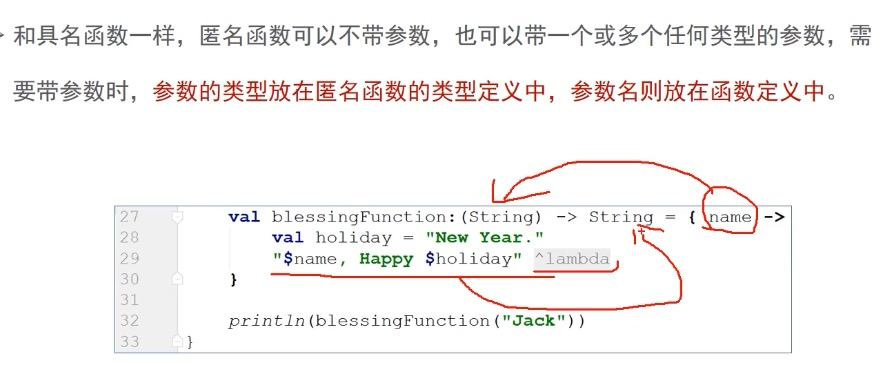
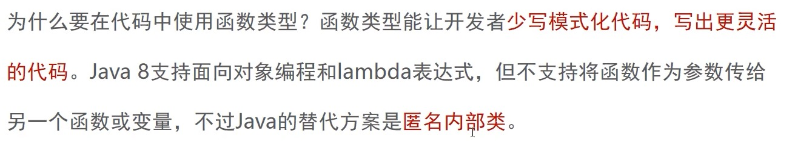

https://www.jianshu.com/p/8eb0623f08c6


### 类型

##### Kotlin内置数据类型


##### 类型推断

对于已经声明并赋值的变量，它允许你省略类型定义.


##### 编译时常量

编译时常量只能再函数外定义，因为编译时常量必须在编译时赋值，而函数时在运行时才调用，函数内的变量也是在运行时赋值，编译时常量要在这些变量赋值前就已存在。

```kotlin
const val MAX =200;
fun main() { 
    const val MAX =200;//报错 Modifier 'const' is not applicable to 'local variable'
}
```


### 基本表达式

##### age表达式

```kotlin
    val score = 6;
    if (score in 9..10){
        println("Big美女")
    }else if (score in 6..8){
        println("美女")
    }else{
        println("who knows")
    }
    if(score !in 1..5){
        println("good")
    }
```

> 美女
> good


##### when 

```kotlin
val school = "0小学";
val level = when (school) {
    "幼儿园" -> "幼儿"
    "小学" -> "少儿"
    "中学" -> "青少年"
    else -> {
        "未知"
    }
}
```


类似于 if else条件语句

```kotlin
var osd = when {
    isOdd() -> print("x is odd")
    isEven() -> print("y is even")
    else -> print("x+y is odd")
}

println("osd $osd")
```

```kotlin
fun isOdd():Boolean{
    return false
}
fun isEven():Boolean{
    return false
}
```


##### String模版 

```kotlin
val flag = false
println("Answer is : ${if (flag) "我可以" else "I can play"}")
```


##### 函数,函数参数

```kotlin
printUser("Jon")
printUser(name = "john")
fun printUser(name:String,age:Int=2){
    println(name+age)
}
```


##### Nothing类型

终止代码运行

```kotlin
TODO("nothing")
```


##### 反引号 ``

可以用来测试 某一段代码

```kotlin
fun `**~ special function with  test util ~**`(){

}
```


Kotlin和Java保留不同的关键字，使用反引号括住函数名能避免任何冲突

```java
public class KeyWordJava {
    public static void is(){ //is时关键字
        System.out.println("is invoked");
    }
}
```

```kotlin
KeyWordJava.`is`()
```


### 匿名函数


匿名函数可以当作变量赋值给函数类型变量。函数的类型，由传入的参数和返回值类型决定。

和具名函数不一样，除极少情况外，匿名函数不需要return关键字，来返回数据，匿名函数会隐式或自动返回函数体最后一行语句的结果。

通过匿名函数给标准函数 制定规则

```kotlin
val total  = "Mississippi".count()
//通过匿名函数给标准函数 制定规则
val totalS = "Mississippi".count({letter-> //letter变量
    letter =='s'//函数体
})
println(total)
println(totalS)
```


##### 函数类型与隐式返回


```kotlin
    //变量的类型是一个匿名函数,一个函数类型的变量
    val helloFunction:()->String //任意函数 无传入参数，返回类型String ,都可以 =helloFunction
    helloFunction = {
        val greet = " how  is going. "
        "hello girl , $greet "  //默认返回这行语句的结果
    }

    val helloFunction1:()->String = {//任意函数 无传入参数，返回类型String ,都可以 =helloFunction
        val greet = " how is going. "
        val hah = "haha"
        "hello beauty girl, $greet " //默认返回这行语句的结果
    }

    println(helloFunction())
    println(helloFunction1())
```

> hello girl ,  how  is going.  
> hello beauty girl,  how is going.  


##### 匿名函数参数




```kotlin
    val helloFunction2:(String)->String = {name->   // name传入参数,String参数类型
        val hah = "haha"
        "hello beauty girl, I am ${name} " //默认返回这行语句的结果
    }
    println(helloFunction2("Jon"))
```


##### it关键字

定义只有一个参数的匿名函数时，可以用it来表示参数名。当需要传入两个值参，就不能用了。

```kotlin
val helloFunction3:(String)->String = {   // name传入参数,String参数类型, 只有一个参数name可以省略，用it替代
    val hah = "haha"
    "hello beauty girl, I am ${it} " //默认返回这行语句的结果
}
println(helloFunction3("John"))
```

##### 类型推断

定义一个变量时，如果已把匿名函数作为变量赋值给它, 就不需要显示指明变量类型了。

```kotlin
val helloFunction4 = {
    val holiday = "New Year"
    "Happy $holiday"
}
println(helloFunction4())
```

类型推断也支持带参数的匿名函数，但为了帮助编译器更准确的推断变量类型，匿名函数的参数名和参数类型必须有。

```kotlin
val helloFunction5:(String,Int) -> String = {name,year ->
    val holiday = "New Year"
    "$name  Happy $holiday $year"
}
println(helloFunction5("jon",2023))

//使用类型推断
val helloFunction6  = {name:String,year:Int ->
    val holiday = "New Year"
    "$name  Happy $holiday $year"
}
println(helloFunction6("jon",2023))
```


匿名函数成为lambda,将它的定义成为lambda表达式，它返回的数据成为lambda结果。

lambda由来：在定义匿名函数时，使用了lambda演算记法。


##### 一个函数作为另一个函数的参数

```kotlin
fun main() {
    //定义参数是函数 的函数
    val disCountWord = { goodsName: String, hour: Int ->
        val currentYear = 2023;
        "${currentYear}年, 双11 ${goodsName}促销倒计时: $hour 小时"
    }
    showOnBoard("小玩具", disCountWord)
}


//getDiscountWord是第二个参数,类型时是(String, Int) -> String 函数类型
fun showOnBoard(goodsName: String, getDiscountWords: (String, Int) -> String) {
    val hour = (1..24).shuffled().last();
    print(getDiscountWords(goodsName, hour))
}
```


##### java实现传递函数

```java
public static void main(String[] args) {
    showOnBoard("牙膏",((goodsName, hour) -> {
        int currentYear = 2023;
        return String.format("%s年，双11 %s 促销倒计时 %d小时 ",currentYear,goodsName,hour);
    }));
}
public interface DiscountWords{
    String getDiscountWords(String goodsName,int hour);
}

public static void showOnBoard(String goodsName,DiscountWords discountWords){
    int hour  = new Random().nextInt(24);
    System.out.println(discountWords.getDiscountWords(goodsName,hour));
}
```


##### 简略写法

如果一个函数的lambda函数排在最后，或者是唯一的参数，那么括住的lambda值参的一对圆括号就可以省略.


唯一的参数

AnonymousFunc2.kt

```kotlin
val totalS = "Mississippi".count({letter-> //letter变量
    letter =='s'//函数体
})

val totalS1 = "Mississippi".count{letter-> //letter变量
    letter =='s'//函数体
}
```


AnonymousFunc2.kt

排在最后,一对圆括号就可以省略

```kotlin
showOnBoard("小玩具", { goodsName: String, hour: Int ->
    val currentYear = 2023;
    "${currentYear}年, 双11 ${goodsName}促销倒计时: $hour 小时"
})

showOnBoard("小玩具") { goodsName: String, hour: Int ->
    val currentYear = 2023;
    "${currentYear}年, 双11 ${goodsName}促销倒计时: $hour 小时"
}
```


##### 内联函数


类似于宏替换


```kotlin
fun main() {
    //定义参数是函数 的函数
    val disCountWord = ({ goodsName: String, hour: Int ->
        val currentYear = 2023;
        "${currentYear}年, 双11 ${goodsName}促销倒计时: $hour 小时"
    })


    showOnBoard("小玩具", disCountWord)
}


//getDiscountWord是第二个参数,类型时是(String, Int) -> String 函数类型
 fun showOnBoard(goodsName: String, getDiscountWords: (String, Int) -> String) {
    val hour = (1..24).shuffled().last();
    println(getDiscountWords(goodsName, hour))
}
```


```java
public final class AnonymousFunc2Kt {
   public static final void main() {
      Function2 disCountWord = (Function2)null.INSTANCE;
      showOnBoard("小玩具", disCountWord);
   }

   // $FF: synthetic method
   public static void main(String[] var0) {
      main();
   }

   public static final void showOnBoard(@NotNull String goodsName, @NotNull Function2 getDiscountWords) {
      Intrinsics.checkNotNullParameter(goodsName, "goodsName");
      Intrinsics.checkNotNullParameter(getDiscountWords, "getDiscountWords");
      byte var3 = 1;
      int hour = ((Number)CollectionsKt.last(CollectionsKt.shuffled((Iterable)(new IntRange(var3, 24))))).intValue();
      Object var5 = getDiscountWords.invoke(goodsName, hour);
      boolean var4 = false;
      System.out.println(var5);
   }
}
```


内联后，代码直接替换 

```java
public final class AnonymousFunc2Kt {
   public static final void main() {
      Function2 disCountWord = (Function2)null.INSTANCE;
      String goodsName$iv = "小玩具";
      int $i$f$showOnBoard = false;  
      byte var3 = 1;	//这里开始 后面代码直接复制过来了
      int hour$iv = ((Number)CollectionsKt.last(CollectionsKt.shuffled((Iterable)(new IntRange(var3, 24))))).intValue();
      Object var6 = disCountWord.invoke(goodsName$iv, hour$iv);
      boolean var5 = false;
      System.out.println(var6);
   }

   // $FF: synthetic method
   public static void main(String[] var0) {
      main();
   }

   public static final void showOnBoard(@NotNull String goodsName, @NotNull Function2 getDiscountWords) {
      int $i$f$showOnBoard = 0;
      Intrinsics.checkNotNullParameter(goodsName, "goodsName");
      Intrinsics.checkNotNullParameter(getDiscountWords, "getDiscountWords");
      byte var4 = 1;
      int hour = ((Number)CollectionsKt.last(CollectionsKt.shuffled((Iterable)(new IntRange(var4, 24))))).intValue();
      Object var6 = getDiscountWords.invoke(goodsName, hour);
      boolean var5 = false;
      System.out.println(var6);
   }
}
```


##### 函数引用

```kotlin
//函数引用
fun main() {
    showOnBoard("小玩具",::getDiscountWords)
}

//普通 具名函数
private fun getDiscountWords(goodsName: String, hour: Int): String {
    val currentYear = 2023;
    return "${currentYear}年, 双11 ${goodsName}促销倒计时: $hour 小时"
}

//getDiscountWord是第二个参数,类型时是(String, Int) -> String 函数类型
private fun showOnBoard(goodsName: String, getDiscountWords: (String, Int) -> String) {
    val hour = (1..24).shuffled().last();
    println(getDiscountWords(goodsName, hour))
}
```


函数类型作为返回类型

函数类型也是有效的返回类型，也就是说可以定义一个能返回函数的函数。


```kotlin
fun main() {
    val getDiscountWords = configDiscountWords()
    println(getDiscountWords("小玩具"))
}

fun configDiscountWords(): (String) -> String {//返回一个传入字符串 返回类型也是函数的字符串,的返回类型
    val currentYear = 2023;
    val hour = (1..24).shuffled().last();
    return { goodsName: String ->
        "${currentYear}年, 双11 ${goodsName}促销倒计时: $hour 小时"
    }
}
```


##### 闭包

作用: 控制作用域

匿名函数引用着定义自身函数里的变量

kotlin中的lambda就是闭包,上面

1. currentYear,hour	在configDiscountWords()中定义
2. { goodsName: String ->  "${currentYear}年, 双11 ${goodsName}促销倒计时: $hour 小时}  也在configDiscountWords()定义
3.  2 引用了currentYear,hour变量. 所以形成闭包


https://www.bilibili.com/video/BV1wf4y1s7TG?p=34&spm_id_from=pageDriver


##### 35 lambda与匿名内部类





java传递函数的方式


```java
public class JavaAnonymousClass {
    public static void main(String[] args) {
        showOnBoard("牙膏", new DiscountWords() {
            @Override
            public String getDiscountWords(String goodsName, int hour) {
                int currentYear = 2023;
                return String.format("%s年，双11 %s 促销倒计时 %d小时 ", currentYear, goodsName, hour);
            }
        });
    }

    public interface DiscountWords {
        String getDiscountWords(String goodsName, int hour);
    }

    public static void showOnBoard(String goodsName, DiscountWords discountWords) {
        int hour = new Random().nextInt(24);
        System.out.println(discountWords.getDiscountWords(goodsName, hour));
    }
}
```


### Null

编译时出错的方式，提前在编译期强迫开发者重视起来，而不是等到运行时报错。

##### ?

变量为null，不会执行后面的方法

let匿名函数，返回lambda最后一行

可以支持函数链式调用

```java
    var str:String? = "butterfly"
//    var str=""
    str = str?.let {
        if (it.isNotBlank()){
            it.capitalize()
        }else{
            "butterfly"
        }
    }
    println(str)
```


##### !! 

当变量为null,会抛出KotlinNullPointerException

##### 空合并操作符  ?:

类似三目运算符

```kotlin
str=null
str="guy"
str = str?.let { it.capitalize()} ?:"butterfly"	//和let一起使用
println(str ?: "girl") // str=null,就是girl,不为null就是自己
```


##### 异常

执行之前，先进行检查，可以自定义异常

```kotlin
fun main() {
    var number: Int? = null

    try {
        checkOperation(number)
        number!!.plus(1)
    } catch (e: Exception) {
        println(e)
    }
}
fun checkOperation(number: Int?) {
    number ?: throw  UnskilledException()
}
//自定义异常
class UnskilledException : IllegalArgumentException("操作不当")
```


##### 先决条件函数

kotlin标准库 提供了一些便利函数，使用这些内置函数，可以跑出带自定义信息的异常，这些便利函数叫做先决条件函数。也可以用它定义先决条件，条件必须满足，目标代码才能执行。


```kotlin
fun checkOperation(number: Int?) {
//    number ?: throw  UnskilledException()
    checkNotNull(number,{"Something is no good."})
}
```


### 字符串

String.kt

##### substring

substring支持IntRange类型的参数，until创建的范围不包括上限值。

```kotlin
const val NAME ="Jimmy's friend"
fun main() {
    val index = NAME.indexOf('\'') // \转义 '
    NAME.substring(0,index) // java写法
    val str = NAME.substring(0 until index)
    println(str)
}
```


##### spilt

siilt返回的是List集合数据，List集合又支持解构语法特性，它允许你在一个表达式里给多个变量赋值，解构常用来简化变量的赋值。

```kotlin
val data = NAMES.split(",")
val (girl1,girl2,girl3,girl4) = NAMES.split(",")
println("$girl1  $girl2  $girl3  $girl4 ")
```


##### replcae 

```kotlin
    /**
     * 加密替换一个字符串
     */
val str1  = "The people's Republic of China."
    //第一个参数是正则表达式，用来决定要替换哪些字符
    //第二个参数是匿名函数，用来确定如何替换正则表达式搜索到的字符
val str2 = str1.replace(Regex("[aeiou]")) {
    when (it.value) {
        "a" -> "8"
        "e" -> "6"
        "i" -> "9"
        "o" -> "1"
        "u" -> "3"
        else -> it.value
    }
}
println(str1)
println(str2)
```

结果

> The people's Republic of China.
> Th6 p61pl6's R6p3bl9c 1f Ch9n8.


##### 字符串的比较

用 == 检查两个字符串中的字符是否匹配， 用 === 检查两个变量是否指向内存堆上的同一对象， 而在Java中 ==做引用比较，做结构比较时用equals方法.


```kotlin
val str3 = "Jason"
val str4 = "Jason"
println(str3==str4)
println(str3===str4) //相同字符串的字符串，使用字符串常量池中相同的对象

val str5 = "jason".capitalize() //这种情况会创建新的对象，why?
println(str3===str5)
```

结果

> true
> true
> false


##### 字符串遍历

```kotlin
str1.forEach {
    print("$it ")
}
```


### 数字类型

kotlin所有的数字类型都是有符号的，也就是既可以表示正数，也可以表示负数。


##### 安全转换函数

NumberConvert

toDoubleOrNull和toIntOrNull这样的安全转换函数，如果数值不能正确转换，与其触发异常不如干脆返回null值。

```kotlin
//    val number1 = "6.66".toInt()
    val number1:Int? = "6.66".toIntOrNull()
    println(number1)

    println(8.956765.toInt())
    println(8.956765.roundToInt()) //四舍五入
    val s = "%.2f".format(8.956765)
    println(s)
```

结果

> null
> 8
> 9
> 8.96


### 标准库函数


StandLibFunc.kt

##### apply

apply函数可看作一个配置函数，传入一个接收者，然后调用一系列的函数来配置它以便使用，如果提供lambda给apply函数执行，它会返回配置好的接收者。

配置file对象，传入file对象配置它，配置完file对象返回.

```kotlin
// 配置一个File实例
val file = File("E// I have a dream.txt")
file.setReadable(true)
file.setWritable(true)
file.setExecutable(false)

//使用apply
val file1 = File("E// I have a dream.txt").apply {
    setReadable(true)
    setWritable(true)
    setExecutable(false)
}
```

Lambda表达式里，apply能让每个配置函数都作用于接收者，这种行为又叫相关作用于，因为lambda表达式里的所有函数调用都是针对接收者的，或者说他们是针对接收者的隐式调用。


##### let

let函数能是某个便利作用于lambda表达式里，让it关键字能引用它。let与apply比较，let会把接收者传给lambda，而apply什么都不传，匿名函数执行完，apply会发挥当前接收者，而let会返回lambda的最后一行。


```kotlin
 var result = listOf(3, 2, 1).first().let { it * it }
    
//    val firstElement = listOf(3, 2, 1).first() //java 方式 
//    val result = firstElement * firstElement

    println(formatGreeting(null))
    println(formatGreeting("Jack"))
    
fun formatGreeting(guestNmae: String?): String {
    return guestNmae?.let {
        "Welcom, $it"
    } ?: "What's your name"
}

// Java方式
fun formatGreeting2(guestNmae: String?): String {
    return if (guestNmae != null) {
        "Welcom, $guestNmae"
    } else {
        "What's your name"
    }
}
```


##### run

1. 光看作用域行为， run和apply差不多，但与apply不同，run函数不返回接收者，run返回的是lambda结果.
2. run也能用来执行函数引用å


```kotlin
var file = File("THINKKOTLIN/I have a dream.txt")
val result = file.run {
    readText().contains("great") //最后一行执行结果返回
    "xxx"
}
println(result)

val result2 = "The people's Republic of china.".run(::isLong)
println(result2)

"The people's Republic of china."
        .run(::isLong)
        .run(::showMessage)
        .run(::println)


fun isLong(name: String) = name.length>10

fun showMessage(isLong: Boolean): String {
    return if(isLong){
        "Name is too long."
    }else{
        "Please rename."
    }
}
```


##### with

with函数是run的变体，他们的功能行为是一样的，但with的调用方式不同，调用with时需要值参作为其第一个参数传入。

```kotlin
var result3 = "The people's Republic of china.".run { length > 10 }
val result4 = with("The people's Republic of china.") { length >= 10 }
```


##### also

​	also和let类似，和let一样，also也是把接收者作为值参传给lambda,但是有点不同: also返回接收者对象，而let返回lambda结果。因此also适合针对**同一原始对象**，利用副作用做事，肌肉also返回的是接收者对象，就可以**基于原始接收者对象执行额外的链式调用**。

```kotlin
var fileContents: List<String>
File(FILE_DREAM)
        .also {
            println(it.name)
        }.also {
            fileContents = it.readLines()
        }
println(fileContents)
```


##### takeif


```kotlin
//如果 it.exists() && it.canRead() 返回true,返回file对象，接着执行后面语句。
// 如果为false，就返回null,就不会执行后面的语句。
val readText = File(FILE_DREAM)
        .takeIf { it.exists() && it.canRead() } 
        ?.readText()
println(readText)
```


##### takeUnless

和takeif是反的

takeUnless, 只有判断你给定的条件结果是 false 时，takeUnless才会返回原始接收者对象。

```kotlin
val result5 = File(FILE_DREAM)
        .takeUnless { it.isHidden } //不是 不可见的，所以是false
        ?.readText()
println(result5)
```


##### flatmap

>  ArrayList<ServicesBean> 转成 ArrayList<CategoryEditService>


```kotlin
val flatMap = limitServiceList?.flatMap {
    mutableListOf(CategoryEditService(false, services = it))
}
```


```
{ mutableListOf(CategoryEditService(false, services = it))} 这个是一个方法，
方法类型是transform: (T) -> Iterable<R>
```


```kotlin
/**
 * Returns a single list of all elements yielded from results of [transform] function being invoked on each element of original collection.
 * 
 * @sample samples.collections.Collections.Transformations.flatMap
 */


public inline fun <T, R> Iterable<T>.flatMap(transform: (T) -> Iterable<R>): List<R> {
    return flatMapTo(ArrayList<R>(), transform)
}

/**
 * Appends all elements yielded from results of [transform] function being invoked on each element of original collection, to the given [destination].
 */
public inline fun <T, R, C : MutableCollection<in R>> Iterable<T>.flatMapTo(destination: C, transform: (T) -> Iterable<R>): C {
    for (element in this) {//这里this是limitServiceList.
        val list = transform(element) // 这里回调{mutableListOf(CategoryEditService(false, services = it))}方法
      																// 传入element值，返回list
        destination.addAll(list)	//添加新的对象,达到转换的目的
    }
    return destination
}

```
