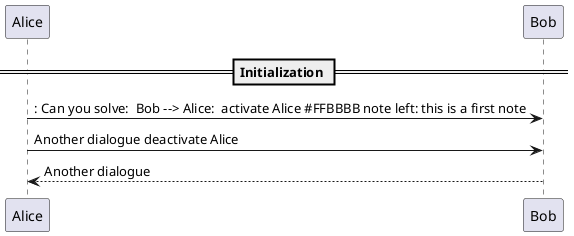
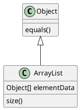

##### Linux使用

1. find  ： $ find . -name 'my*'   搜索当前目录（含子目录，以下同）中，所有文件名以my开头的文件。 http://www.ruanyifeng.com/blog/2009/10/5_ways_to_search_for_files_using_the_terminal.html

##### ubuntu　wifi热点

http://blog.csdn.net/sunmc1204953974/article/details/45740853

##### 删除build文件

`find . -name "build"  | xargs rm -rf`

