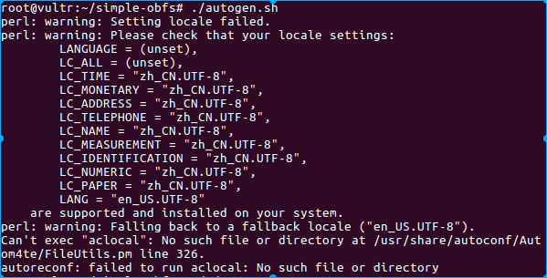
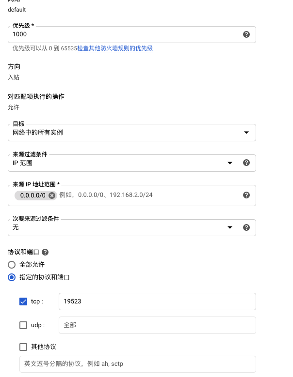

  自从shadowsocks出来，我们的上网问题算是解决了，通过google查资料确实更便利

##### shadowsocks安装

   对于新手 作者建议安装在ubuntu上，那就用他开始吧

* 安装软件
  
       sudo apt-get install python-pip
       pip install shadowsocks
  
  然而我遇到了这样的问题
  Command "python setup.py egg_info" failed with error code 1 in /tmp/pip-build-Mlx8an/shadowsocks/
  You are using pip version 8.1.1, however version 9.0.1 is available.
  You should consider upgrading via the 'pip install --upgrade pip' command.
  接着按照他的指示来
  
  pip install --upgrade pip
  
  然而又出问题了，这次是这个 Could not import setuptools which is required to install from a source distribution.
  Please install setuptools.
  这时候Google派上用场了，解决方案是 
  
     sudo pip install -U setuptools
  
  参考：https://github.com/fredley/play-pi/issues/22
  
  然后执行 pip install shadowsocks ，终于OK，Collecting shadowsocks
  Using cached shadowsocks-2.8.2.tar.gz
  Installing collected packages: shadowsocks
  Running setup.py install for shadowsocks ... done
  Successfully installed shadowsocks-2.8.2

##### 前台运行

 软件安装好了，现在可以配置了，先在前台跑下

        ssserver -p 8388 -k 123456 -m aes-256-cfb

 然后手机或电脑同样配置看下代理是否有用，Ok的话，新建一个文件替代命令

        vi  /etc/shadowsocks.json 
      {
      "server":"my_server_ip",
      "server_port":8388,
      "local_address": "127.0.0.1",
      "local_port":1080,
      "password":"123456",
      "timeout":300,
      "method":"aes-256-cfb",
      "fast_open": false
     }

   前台执行 :   

        ssserver -c /etc/shadowsocks.json

 后台执行:
​     
​        ssserver -c /etc/shadowsocks.json -d start    
​        ssserver -c /etc/shadowsocks.json -d stop 

接着就可以愉快的玩耍了

* 卸载shadowsocks

　先停掉服务 `sudo ssserver -d stop`
　然后　      `pip uninstall shadowsocks`
　
　

_ _ _

##### shadowsocks-libev安装

ubuntu 17

```
sudo apt update
sudo apt install shadowsocks-libev
```

如果是其他版本可以看下面　参考
from :https://github.com/shadowsocks/shadowsocks-libev#install-from-repository

1. 启动测试连接

和shadowsocks启动类似 ssserver 换成了 ss-server

* 启动测试 : `ss-server -s 0.0.0.0 -p 8388 -k 123456 -m aes-256-cfb`　　没有 `-d start`
  可能会占用端口

* 配置文件启动
  To run in the foreground: `ss-server -c /etc/shadowsocks-libev/config.json `

* To run in the background:　
  ｀nohup ss-server -c /etc/shadowsocks-libev/config.json｀

* 停止运行: `sudo ss-server -d stop`
2. simple-obfs(混淆工具)安装

Build
For Unix-like systems, especially Debian-based systems, e.g. Ubuntu, Debian or Linux Mint, you can build the binary like this:

* Debian / Ubuntu　环境配置
  `sudo apt-get install --no-install-recommends build-essential autoconf libtool libssl-dev libpcre3-dev libc-ares-dev libev-dev asciidoc xmlto automake `

* 下载simple-obfs
  
    //Debian / Ubuntu
    ​    sudo apt-get install --no-install-recommends build-essential autoconf libtool             libssl-dev libpcre3-dev libev-dev asciidoc xmlto automake
    ​            //CentOS / Fedora / RHEL
    ​        sudo yum install gcc autoconf libtool automake make zlib-devel openssl-devel asciidoc xmlto
    ​        // Arch
    ​    sudo pacman -Syu gcc autoconf libtool automake make zlib openssl asciidoc xmlto
    ​     //Alpine
    ​    apk add gcc autoconf make libtool automake zlib-devel openssl asciidoc xmlto libpcre32 libev-dev g++ linux-headers
  
        git clone https://github.com/shadowsocks/simple-obfs.git
        cd simple-obfs
        git submodule update --init --recursive
        ./autogen.sh
        ./configure && make
        sudo make install

​         

##### 注意:

1. Question
* 问题1
  `autoconf --version`
  需要安装 `sudo apt install autoconf`

* 问题2
  
  ```
  configure.ac:19: error: possibly undefined macro: AC_DISABLE_STATIC
      If this token and others are legitimate, please use m4_pattern_allow.
      See the Autoconf documentation.
  configure.ac:20: error: possibly undefined macro: AC_DISABLE_SHARED
  configure.ac:44: error: possibly undefined macro: AC_PROG_LIBTOOL
  autoreconf: /usr/bin/autoconf failed with exit status: 1
  ```
  
  `sudo apt-get install libtool`

* 问题3
  `sudo apt-get install automake`
  http://ask.xmodulo.com/fix-failed-to-run-aclocal.html
  
  
2. 混淆
* server端: `ss-server -c  /etc/shadowsocks-libev/config.json  --plugin obfs-server --plugin-opts "obfs=http"`

* clinet 端:`ss-local -c config.json --plugin obfs-local --plugin-opts "obfs=http;obfs-host=www.baidu.com"
  `
  也可以都放在配置文件中

```
{
    "server":"0.0.0.0",
    "server_port":your_server_port,
    "local_address":"127.0.0.1",
    "local_port":1080,
    "password":"your_password",
    "timeout":300,
    "method":"your_encryption_method",
    "plugin":"/usr/local/bin/obfs-server --obfs http"
}
```

那么服务端直接运行``ss-server -c /etc/shadowsocks-libev/config.json `就可以了

后台运行就是前面的测试连接 nohup命令　

from:https://teddysun.com/511.html

* 参数: 
  
  ```
  插件：obfs-local
  插件选项：obfs=http;obfs-host=www.baidu.com
  ```

* 客户端连接
  　client也按照 simple-obfs  服务端安装方式安装
  　连接命令 ` ss-local -c /etc/shadowsocks-libev/config.json --plugin obfs-local --plugin-opts "obfs=http;obfs-host=www.biadu.com"`

参考:https://github.com/shadowsocks/simple-obfs
https://blog.phpgao.com/shadowsocks_on_linux.html
https://softwaredownload.gitbooks.io/openwrt-fanqiang/content/ebook/03.2.html

##### 配置ubuntu开机启动

* home下　新建 run_server.sh
  输入

```
#!/bin/bash
cd /home/jon/shadowsocksr/shadowsocks
python local.py -c /etc/shadowsocks.json
```

* 修改脚本权限
  一定要让脚本具备可执行权限，可以执行如下指令：
  `$ sudo chmod 755 run_server.sh`

* 将脚本放置在启动路径下
  将run_server.sh移动到/etc/init.d路径下，可以直接拷贝，也可以链接过去
  `$ sudo cp run_server.sh /etc/init.d/`

* 将脚本添加到启动脚本。
  执行如下指令，在这里90表明一个优先级，越高表示执行的越晚

```
$ cd /etc/init.d/
$ sudo update-rc.d run_server.sh defaults 90
```

* 如何移除该脚本
  很简单，执行如下指令：
  ` sudo update-rc.d -f run_server.sh remove`

http://jackqdyulei.github.io/2016/03/06/linux-auto-script/

##### 设置系统全局代理

 https://blog.csdn.net/u012810317/article/details/52139361

* terminal代理
  
  ```
  export http_proxy=http://127.0.0.1:8118
  export https_proxy=http://127.0.0.1:8118
  ```
  
  或者
  
  git config --global http.proxy "localhost:1080"
  
  git config --global http.proxy "localhost:1080"
  
   git clone --recurse-submodules git@github.com:shadowsocks/shadowsocks-android.git

##### 修改包名

* 把apk改成 shadowsocks.apk
  
  ```
  java -jar apktool.jar d shadowsocks.apk      //解包
                                              //中间做修改
  java -jar apktool.jar b shadowsocks            //打成apk再dist目录下
  
  jarsigner -verbose -keystore androidTest.jks -signedjar signed.apk AndroidTest.apk test  //生成签名
  
  jarsigner -verbose -keystore androidTest.jks -signedjar signed.apk shadowsockstt.apk test
  ```
  
  https://blog.csdn.net/huaiyiheyuan/article/details/53114490

##### windows全局代理

<https://www.flyzy2005.com/fan-qiang/shadowsocks/proxifier-with-shadowsocks/>


##### win7下使用

1. 首先下载 Microsoft .NET Framework 4.6.2，但是win7系统不支持安装
2. 下载 **需要升级为Windows 7 SP1** 需要去官网下载 Windows 7 SP1

##### VR  INSTALL

* 安装

https://toutyrater.github.io/prep/install.html

1. Install

2. > ```
   > wget https://install.direct/go.sh
   > 
   > sudo bash go.sh
   > ```

3. check
   
   > cat /etc/v2ray/config.json
   
   you will see the config,I won't be  change it

4. ff
   
   > ```
   > $ sudo systemctl start v2ray
   > ```
   
   sudo: unable to resolve host vm8l

5. $ cat /etc/hostname
   
   vm8lcxg8.hostflyte.com
   
   or you  could use this[vr使用](https://github.com/233boy/v2ray/wiki/V2Ray%E6%90%AD%E5%BB%BA%E8%AF%A6%E7%BB%86%E5%9B%BE%E6%96%87%E6%95%99%E7%A8%8B)
* macOS use

> proxy

Github slowly

```
git config --global http.proxy socks5://127.0.0.1:1081

git config --global https.proxy socks5://127.0.0.1:1081
```

[终端使用代理加速的正确方式（Clash） | Ln's Blog](https://weilining.github.io/294.html)

```
 export http_proxy=http://127.0.0.1:7890
 export https_proxy=http://127.0.0.1:7890
```

https://www.jianshu.com/p/5e74b1042b70

GitHub 镜像 

https://github.com/Zenquan/quickgitclone

git clone  https://github.com.cnpmjs.org/android/media-samples.git

```
sudo dscacheutil -flushcache
```

Terminal

```bash
export http_proxy="http://127.0.0.1:13658"
export https_proxy="http://127.0.0.1:13658"
```

google 搭建vr

查看网络详情 -》防火墙

按照这个教程 https://zelikk.blogspot.com/2019/01/gcp-v2ray-firewall.html

网络标记就选了全部实例



      注意复制的端口号 带上了逗号

​    root身份运行    

-bash: sudo: command not found

```
dpkg -l|grep sudo
apt-get install sudo
sudo apt-get install wget
```

root运行

```
sudo -i
```

安装

```
wget https://install.direct/go.sh
sudo bash go.sh
sudo systemctl start v2ray
```

设置mac终端走ssr或者是v2ray代理

[http://www.xiaosuiyin.com/2020/02/15/%E8%AE%BE%E7%BD%AEmac%E7%BB%88%E7%AB%AF%E8%B5%B0ssr%E6%88%96%E8%80%85%E6%98%AFv2ray%E4%BB%A3%E7%90%86/](http://www.xiaosuiyin.com/2020/02/15/设置mac终端走ssr或者是v2ray代理/)

https://github.com/233boy/v2ray/wiki/V2Ray%E6%90%AD%E5%BB%BA%E8%AF%A6%E7%BB%86%E5%9B%BE%E6%96%87%E6%95%99%E7%A8%8B

https://github.com/v2fly/fhs-install-v2ray/blob/master/README.zh-Hans-CN.md

注意配置  tcp端口

[https://justmysocks3.net](https://by.affpass.com/go/jms)

wordpress backup

[- YouTube](https://www.youtube.com/watch?v=2qoX-siH0cY)

# bridge mode

https://www.bilibili.com/video/BV1wa411H7NJ/

[- YouTube](https://www.youtube.com/watch?v=t3H8kVQmTu0)

V2rayU 需要全局的才起作用

[[https://pagespr.pages.dev/trojan]](https://pagespr.pages.dev/trojan%5D)

[[https://workerpr.huaiyiheyuan.workers.dev/trojan123]](https://workerpr.huaiyiheyuan.workers.dev/trojan123%5D)

[[https://pagespr.pages.dev/trojan]](https://pagespr.pages.dev/trojan%5D)

client needs fragments 分片feature

ws 端口(port)：7个http端口可任意选择(80、8080、8880、2052、2082、2086、2095)

tls 端口(port)：6个https端口可任意选择(443、8443、2053、2083、2087、2096)

# 