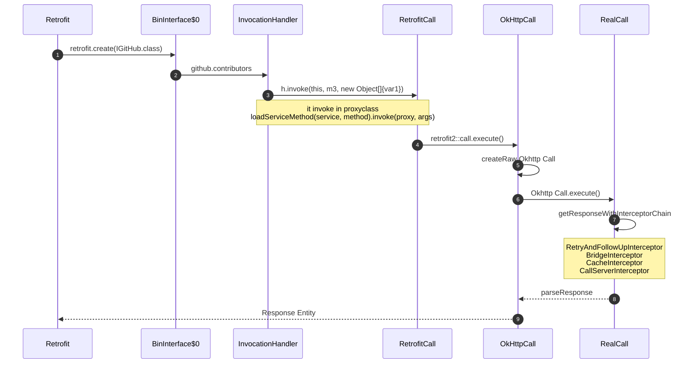
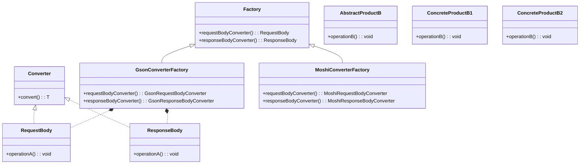
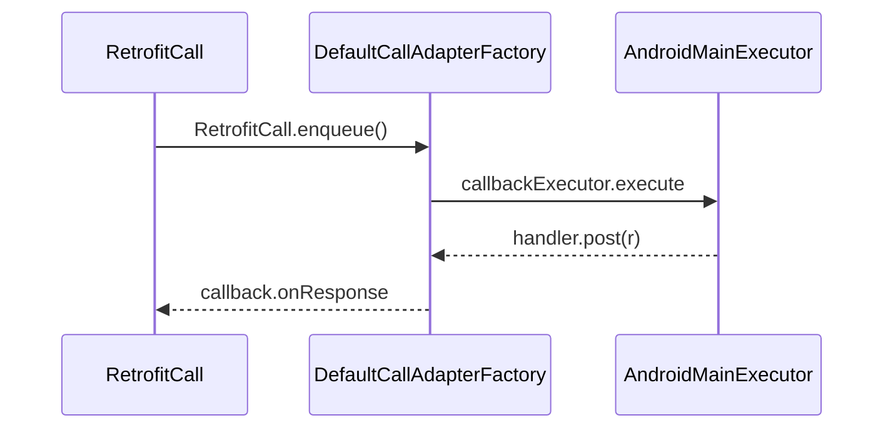

# Retofit调用关系


# illustrating  interceptor request flow

调用整体流程



1. 动态代理创建一个接口的代理类,为代理类注入一个回调。

2. The step cannot check out the source code because it is generated by ProxyGenerator. Invoke the contributors method of the proxy class.

3. The InvocationHandler parameter, h, is passed in step 1. The object is constructed with var1.newInstance(var2).

4. In step 3, create an ExecutorCallbackCall object last so that it can invoke retrofit2::execute().

5. 通过反射解析每个接口的注解、入参构造http请求获取到返回的http请求，使用Adapter解析成需要的返回值。
   
   Retrofit 交付请求给OkHttp主要是，OkHttpCall中处理, 组装数据后，请求方式就是OkHttp官方提供的方式了。
   请求的body是在这里处理的
   
   ```java
   okhttp3.Request create(@Nullable Object instance, Object[] args)  {
     handlers[p].apply(requestBuilder, args[p]);
     return requestBuilder
          .get() // 组装body和请求
          .build();
   }
   ```

# Retrofit VS  Okhttp

### Ease of Use:

* Retrofit:
  Provides a high-level API that simplifies the creation and execution of network requests. You define API endpoints using Java interfaces, and Retrofit generates the necessary code to handle these requests.

* OkHttp:
  While powerful, requires more boilerplate code to set up and execute requests. You need to manually construct HTTP requests, handle responses, and parse the results.

### Automatic JSON Parsing:

* Retrofit:
    Integrates seamlessly with JSON libraries like Gson or Moshi to automatically convert JSON responses into Java objects. This reduces the need for manual parsing and makes the code cleaner and easier to maintain.
* OkHttp:
    Does not include built-in support for JSON parsing, so you need to manually parse JSON responses using a separate library.

### Annotations:

* Retrofit:
    Uses annotations to define request parameters, headers, and endpoints. This makes the code more readable and easier to understand.
* OkHttp:
    Requires manual handling of these aspects, leading to more verbose and error-prone code.

### Interceptors and Customization:

* Retrofit:
    Allows for easy integration of OkHttp interceptors to handle logging, authentication, and other concerns. Retrofit itself focuses on simplifying API interactions while allowing OkHttp to handle lower-level HTTP operations.
* OkHttp:
    You can also use interceptors and customize requests, but it requires more effort compared to Retrofit.

### Error Handling:

* Retrofit:
    Provides built-in support for error handling, including deserialization of error responses and easier differentiation between HTTP error codes.

* OkHttp:
    Requires manual implementation of error handling, which can be more complex and less consistent.

### Scalability:

* Retrofit:
    Ideal for larger projects with multiple API endpoints. The use of interfaces and annotations makes it easier to manage and scale the codebase.

* OkHttp:
    Better suited for simpler or lower-level network tasks where fine-grained control over the HTTP layer is required.
1. 用户网络请求的借口配置 繁琐， 尤其是需要配置复杂的请求body,请求头，参数的时候。
2. 数据解析过程需要用户手动拿到respponsbody进行解析，不能复用。
3. 无法适配自动进行线程的切换。

# Retrofit底层实现，在okhttp的基础下做了哪些封装

    Retrofit在OkHttp的基础上进行了多个层次的封装，主要集中在简化网络请求的创建、执行和响应处理。以下是Retrofit在OkHttp基础上所做的主要封装：

* 接口定义和注解：
    Retrofit允许开发者使用Java接口来定义网络请求。每个接口方法对应一个API端点，并通过注解（如@GET、@POST、@Path、@Query等）来描述请求的类型、路径和参数。
  这些注解让代码更简洁、易读，避免了手动构建请求所需的冗长代码。

* 动态代理：
    Retrofit使用Java的动态代理机制（Proxy类）在运行时生成接口实现。这些实现会将方法调用转换为HTTP请求。
  通过动态代理，Retrofit能够在开发者调用接口方法时，自动创建并执行相应的OkHttp请求。

* 请求和响应转换：
  Retrofit提供了Converter接口，用于将请求体转换为HTTP请求的有效负载（如JSON）以及将HTTP响应转换为Java对象。
  常见的Converter包括GsonConverter、MoshiConverter和JacksonConverter，方便开发者使用各种JSON库来解析响应。

* 异步和同步请求：
  Retrofit支持同步和异步请求。开发者可以选择返回Call<T>对象，并使用enqueue方法进行异步请        求，或者使用execute方法进行同步请求。这种灵活性使得网络请求的处理方式更加丰富和适应不同的需求场景.

* 错误处理:
  Retrofit内置了对HTTP错误的处理机制，能够方便地捕获和处理HTTP错误状态码和网络异常。
  开发者可以通过自定义Callback或者配合使用Call对象的Response类，方便地进行错误处理和重试逻辑。

* 拦截器：
    虽然OkHttp本身也支持拦截器，Retrofit对其进行了更友好的集成。开发者可以轻松地将OkHttp的拦截器（如日志记录、认证拦截器）添加到Retrofit的配置中。
  这使得调试和网络请求的管理更加方便。

* URL管理：
  
    Retrofit支持在接口方法上通过注解来灵活配置URL参数，路径变量和查询参数。这使得构建复杂的URL变得更加简单和直观。
  通过注解和参数替换，Retrofit能够动态地生成完整的请求URL。
  内置协程支持（在Kotlin中）：

对于使用Kotlin的项目，Retrofit提供了对协程的支持，使得网络请求可以以挂起函数的形式实现，简化了异步代码的编写。
通过这些封装，Retrofit将OkHttp强大的低级网络功能与高层的API定义和处理结合起来，使得开发者能够更加专注于业务逻辑，而不需要过多关心底层的网络请求细节。

# Retrofit中的Call对象如何转换成okhttp的call对象

Retrofit中有一个OkHttpCall类，它实现了Call接口，并封装了OkHttp的Call对象。创建OkHttp Request对象：

在OkHttpCall类中，createRawCall方法会调用OkHttp的Call.Factory来创建一个新的OkHttp Call对象。

```java
@Override
public okhttp3.Call createRawCall() {
    Request request = serviceMethod.toRequest(args);
    return serviceMethod.callFactory.newCall(request);
}
```

# 在retrofit中的泛型是怎么解析的?

# 为什么retrofit要使用运行时注解？什么时候用运行时注解？

Retrofit使用运行时注解的原因在于其灵活性和动态特性，这使得Retrofit能够在运行时解析接口方法的注解和参数，并根据这些信息动态地构建HTTP请求。下面是Retrofit使用运行时注解的具体原因以及适用场景：

1. 灵活的请求配置
    运行时注解允许开发者在接口方法上灵活地配置HTTP请求。例如，可以通过注解指定HTTP方法、URL路径、查询参数、请求头等。这种方式        比硬编码请求配置更加灵活和可维护。
   
   ```java
   public interface ApiService {
   @GET("users/{user}/repos")
   Call<List<Repo>> listRepos(@Path("user") String user);
   }
   ```

2. 动态解析和生成请求
    使用运行时注解，Retrofit可以在运行时解析接口方法的注解，生成相应的请求对象。这个过程包括解析HTTP方法、URL、请求参数等信息，    并动态构建请求。这种动态生成请求的方式相比于编译时生成请求代码，更加灵活且易于修改。

3. 适应多变的API
    许多网络API会频繁变化，使用运行时注解可以更容易地适应这些变化。因为注解的解析和请求的生成是在运行时进行的，所以在代码中修改        注解即可应对API的变化，而不需要重新编译代码。

# DESIGN PATTERN

## static method factory

```java
  private static Platform findPlatform() {
   if (isAndroid()) {
     return findAndroidPlatform();
   } else {
     return findJvmPlatform();
   }
  }
```

## Abstract Factory method

Retrofit deserializes data using the abstract factory method




invoke steps

1. Retrofit , pass converterFactories
   
   ```java
   public Retrofit build() {
      return new Retrofit(
        callFactory,
        baseUrl,
        unmodifiableList(converterFactories),
        defaultConverterFactoriesSize,
        unmodifiableList(callAdapterFactories),
        defaultCallAdapterFactories.size(),
        callbackExecutor,
        validateEagerly);
    }
   }
   ```
2. execute flow

```java
call.execute();

  @Override
  public Response<T> execute() throws IOException {
    return parseResponse(call.execute());
  }


  Response<T> parseResponse(okhttp3.Response rawResponse) throws IOException {
      ExceptionCatchingResponseBody catchingBody = new ExceptionCatchingResponseBody(rawBody);
      T body = responseConverter.convert(catchingBody);

      return Response.success(body, rawResponse);
  }
```

CallAdapter.Factory is also an abstract factory method in the Retrofit library.

## Adater design

In the Adapter design pattern, there are two types: Class Adapter and Object Adapter . 但是在Retrofit中，adater使用和上面两种模式，有点差别.

Call.java     对应     Adaptee

```java
public interface Call<T> extends Cloneable { 

  Response<T> execute() throws IOException;

  void enqueue(Callback<T> callback);

  void cancel();
  Request request();
}
```

CallAdapter.java

```java
public interface CallAdapter<R, T> {

  Type responseType();

  T adapt(Call<R> call);

  abstract class Factory {

    public abstract @Nullable CallAdapter<?, ?> get(
        Type returnType, Annotation[] annotations, Retrofit retrofit);
  }


  DefaultCallAdapterFactory.java
  final class DefaultCallAdapterFactory extends CallAdapter.Factory {
 }
```

Call：Adaptee ， 这个我理解的其实是OkhttpCall，这个OkhttpCall传到适配器中
CallAdapter：Target
CallAdapter匿名类：Adapter , 这个贴出来就报错，所以没有贴出来。
通过adater调用OkhttpCall,所以我理解Adaptee对应的是OkhttpCall

## 外观模式

the use of Retrofit library

## 策略模式

  3-28 retrofit面试题：sp跨进程&apply和commit方法

https://juejin.cn/post/6879326343667023879
https://www.jianshu.com/p/435a5296ee94

# Retrofit Rxjava


### Retrofit包装类

Retrofit组装完数据，使用Okhttp进行网络请求的类

OkHttpCall.java

```java
@Override
public void enqueue(final Callback<T> callback) {
  Objects.requireNonNull(callback, "callback == null");

  okhttp3.Call call;
  Throwable failure;
  synchronized (this) {
    call = rawCall = createRawCall();     // 创建OkhttpCall
  }

  call.enqueue(
      new okhttp3.Callback() {
        @Override
        public void onResponse(okhttp3.Call call, okhttp3.Response rawResponse) {
          Response<T> response;
          try {
            response = parseResponse(rawResponse);
          } catch (Throwable e) {
            throwIfFatal(e);
            callFailure(e);
            return;
          }

          try {
            callback.onResponse(OkHttpCall.this, response);
          } catch (Throwable t) {
            throwIfFatal(t);
            t.printStackTrace(); // TODO this is not great
          }
        }

        @Override
        public void onFailure(okhttp3.Call call, IOException e) {
          callFailure(e);
        }

        private void callFailure(Throwable e) {
          try {
            callback.onFailure(OkHttpCall.this, e);
          } catch (Throwable t) {
            throwIfFatal(t);
            t.printStackTrace(); // TODO this is not great
          }
        }
      });
}
```

我还加了了提交Map参数的[Demo](https://gitee.com/huaiyi/RetrofitDemo.git) Demo
https://www.bilibili.com/video/BV1mU4y1p71g
https://www.bilibili.com/video/BV12Q4y1d7uD
http://www.jianshu.com/p/308f3c54abdd
这篇文章不错，深入浅出
 http://blog.csdn.net/itjianghuxiaoxiong/article/details/52135748
https://juejin.im/post/5afc1706518825426f30f6ec
要实现类似这样的请求,用post方式怎么也不行
https://newsapi.org/v2/top-headlines?sources=financial-times&apiKey=e4f505f73a9f4ee99119ab33a19ab05e

# Retrofit是如何将子线程切换到主线程？

## UML



## implementation

在添加默认适配器工厂defaultCallAdapterFactories时，将callbackExecutor作为了一个参数，那么它的具体实现也就是在这个默认适配器工厂中。 我们来看下callbackExecutor在里面做了些啥。

```java
  static final class ExecutorCallbackCall<T> implements Call<T> {
    final Executor callbackExecutor;
    @Override
    public void enqueue(final Callback<T> callback) {
      delegate.enqueue(
          new Callback<T>() {
            @Override
            public void onResponse(Call<T> call, final Response<T> response) {
              callbackExecutor.execute(        // 这里切换到主线程
                  () -> {
                      callback.onResponse(ExecutorCallbackCall.this, response);
                  });
            }

            @Override
            public void onFailure(Call<T> call, final Throwable t) {
              callbackExecutor.execute(() -> callback.onFailure(ExecutorCallbackCall.this, t)); // 这里切换到主线程
            }
          });
    }
```

在上述代码里了解到，callbackExecutor即Executor，一个线程调度器。在Call的enqueue实现里执行了一个异步网络请求delegate.enqueue，在请求的响应onResponse、onFailure中 Executor也同样执行了一个线程，这里就有个疑问，为什么要在一个异步请求里又调用一个线程？我们知道callbackExecutor是一个线程调度器，那他内部到底实现的是什么？ 默认callbackExecutor的创建在Retrofit的初始化中，callbackExecutor = platform.defaultCallbackExecutor();

```java
static final class Android extends Platform {

@Override
public Executor defaultCallbackExecutor() {
  return new MainThreadExecutor();
}

static final class MainThreadExecutor implements Executor {
  private final Handler handler = new Handler(Looper.getMainLooper());

  @Override
  public void execute(Runnable r) {
    handler.post(r);
  }
}
}
}
```

platform是一个Android平台，defaultCallbackExecutor 内部其实调用的是 new MainThreadExecutor() ，很清楚的看到， handler.post(r) 内部使用Handler将响应抛到了主线程。

这就是Retrofit将子线程切换到主线程的核心所在。

问3：Retrofit为什么要用动态代理？


原文链接：https://blog.csdn.net/qq_37492806/article/details/133995368

Retrofit结合RxJava 感觉RxJava可以了解下，
Retrofit结合courutine 感觉courutine代码不懂，courutine的可以了解下，感觉courutine有先级别更高一点，回来再来画Retrofit其他的类图

# Retrofit 注解是怎么消费的

```java
 private void parseMethodAnnotation(Annotation annotation) {
      if (annotation instanceof DELETE) {
        parseHttpMethodAndPath("DELETE", ((DELETE) annotation).value(), false);
      } else if (annotation instanceof GET) {
        parseHttpMethodAndPath("GET", ((GET) annotation).value(), false);
      } else if (annotation instanceof HEAD) {
        parseHttpMethodAndPath("HEAD", ((HEAD) annotation).value(), false);
      } else if (annotation instanceof PATCH) {
        parseHttpMethodAndPath("PATCH", ((PATCH) annotation).value(), true);
      } else if (annotation instanceof POST) {
        parseHttpMethodAndPath("POST", ((POST) annotation).value(), true);
}
```

https://github.com/pengMaster/BestNote/blob/master/docs/android/Android-Interview/Android/Android%E9%AB%98%E7%BA%A7%E9%9D%A2%E8%AF%9510%E5%A4%A7%E5%BC%80%E6%BA%90%E6%A1%86%E6%9E%B6%E6%BA%90%E7%A0%81%E8%A7%A3%E6%9E%90.md

https://github.com/stven0king/designmode?tab=readme-ov-file

# Build Project

