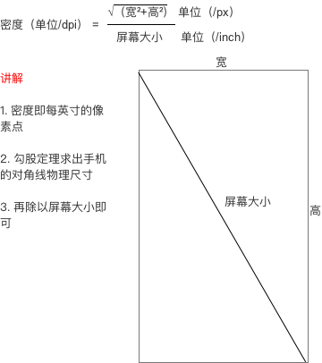

Android屏幕的一些技巧

# 官网适配方案
https://developer.android.com/training/basics/supporting-devices/index.html
https://developer.android.com/training/multiscreen/screensizes.html?hl=zh-cn

## 资源图片适配
> xhdpi: 2.0
hdpi: 1.5
mdpi: 1.0 (baseline)
ldpi: 0.75
This means that if you generate a 200x200 image for xhdpi devices, you should generate the same resource in 150x150 for hdpi, 100x100 for mdpi, and 75x75 for ldpi devices.

而UI问我们需要多少大小的图，如果效果图根据750*1334的话，可以告诉他，不过PS有个叫
cutterman的工具可以自动生成不同分辨率的图片

##  PX转 dp

以5x为例: 5X的dpi =ro.sf.lcd_density=420,   PPI = 420/160 = 2.625
设置view的宽度我们用　match_parent,那么在5X上，他是多少dp呢？

5X : width = 1080 px
dp = 1080 / PPI = 411.428571429,
所以411dp就是5X的match_parent

http://blog.csdn.net/u010983881/article/details/51993157

#　生成Values
　　生成主流屏幕的values，安宽分成320份,高400份
　　
　　假设ＵＩ根据 iphone6(750×1334)设计的效果图
　　根据下图公式计算　Dpi
　　
　　
　　
　 iphone6是4.7寸的 分辨率 750 * 1334,　它的dpi 就是　√(750²+1334²)/4.7 =  325
　　和drawable-xhdpi 320接近
　　
　　drawable-xhdpi　480上做的图就是大概是1.5倍的样子 ,分辨率在1920 *1080上的也是一样的
  
##　开发中实际转化　

　　http://www.bijishequ.com/detail/513426?p=
　　http://blog.csdn.net/zengd0/article/details/52464627
　　所以说　给的1334 * 750 　图就是
　　10px  我们写5dp

　　
　　
参考:　http://www.jianshu.com/p/ec5a1a30694b
　http://blog.csdn.net/lmj623565791/article/details/45460089
　
# percent-support-lib

这个是官网推出的，不过再API 26过时了
https://developer.android.com/reference/android/support/percent/package-summary.html

#RealeativeLayout

相对布局属性图
http://www.runoob.com/w3cnote/android-tutorial-relativelayout.html

# 样式开发
画圆　　线　矩形等
https://keeganlee.me/post/android/20150830

#相同布局处理
假如有四个框框，里面布局相同就可以用 `<include>`来处理
include嵌套后放在ReleativeLayout，想要把其中一个靠右不起作用，暂时在外面嵌套了一层布局！！！，看看有没有更好的解决方式

我把子布局 myinclde 设置成 merge为了减少层级，在MyNewFramgent 获取`v.findViewById(R.id.ic_spare)`
竟然空指针异常，先把merge改成RelativeLayout有空再看原因.
http://www.androidchina.net/2485.html

