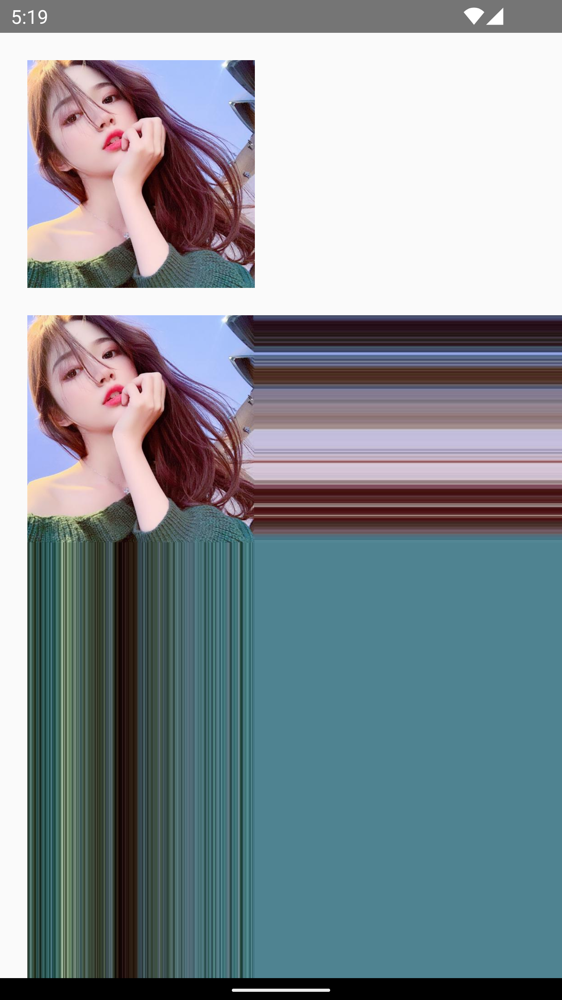
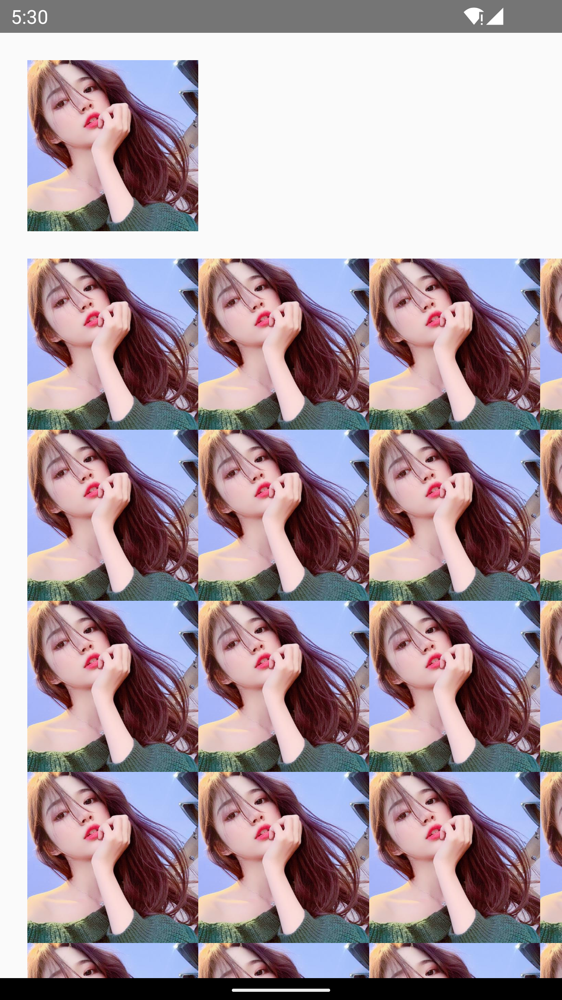
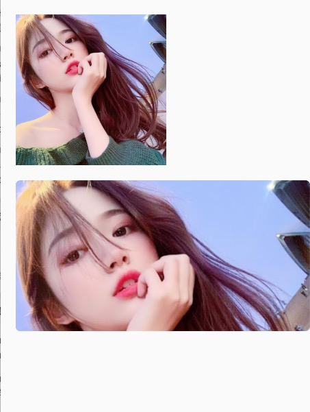
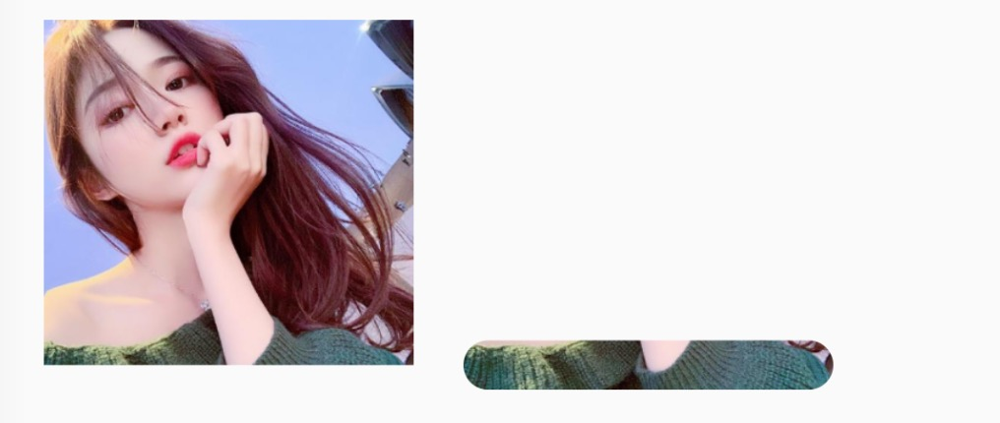

https://blog.csdn.net/xiaohanluo/article/details/52945791

https://guides.codepath.com/android/Working-with-the-ImageView


https://guides.codepath.com/android/Working-with-the-ImageView

### 全圆角

#### OutLine

```xml
<ImageView
    android:id="@+id/img_test"
    android:layout_width="wrap_content"
    android:layout_height="wrap_content"
    android:src="@drawable/music" />
```

```java
    mImg = findViewById(R.id.img_test);
    ViewOutlineProvider viewOutlineProvider = new ViewOutlineProvider() {
        @Override
        public void getOutline(View view, Outline outline) {
           outline.setOval(0,0,mImg.getWidth(), mImg.getHeight());
        }
    };
    mImg.setOutlineProvider(viewOutlineProvider);
    mImg.setClipToOutline(true);
```

https://blog.csdn.net/weixin_43499030/article/details/92799689

#### CardView

### 部分圆角

#### ShapeableImageView

这种方式官方的无风险

```xml
<!-- layout.xml 就是在布局中定义-->
<com.google.android.material.imageview.ShapeableImageView
            android:layout_width="200dp"
            android:layout_height="wrap_content"
            android:scaleType="fitXY"
            android:strokeWidth="10dp"
            android:strokeColor="@color/purple"
            android:src="@drawable/ic_launcher_background"
            app:shapeAppearance="@style/RoundAndCutImageStyle" />
```

需要通过设置 app:shapeAppearance 才有用

```xml
<!--  style.xml  可以单独给每个角设置属性-->
    <style name="RoundAndCutImageStyle">
        <item name="cornerFamilyTopLeft">rounded</item>
        <item name="cornerFamilyBottomLeft">rounded</item>
        <item name="cornerFamilyTopRight">cut</item>
        <item name="cornerFamilyBottomRight">cut</item>
        <item name="cornerSize">50%</item>
        <item name="cornerSizeBottomLeft">20dp</item>
        <item name="cornerSizeTopLeft">20dp</item>
    </style>
```

左边是圆角，右边是“切角”


https://juejin.cn/post/6913083202387050509

#### BitmapShader

setShader

setShader，顾名思义，设置着色器，我们知道在Canvas中，我们调用drawXXX可以绘制出各种各样的图形，如圆形、矩形、扇形等等，而Shader是给Paint设置的属性，决定paint绘制图形的时候如何给图形上色，比如绘制一个矩形，我想要矩形中铺满一张图片，那这些平铺的图片就相当于是给这个矩形上色了。好了，概念先说到这，Shader是一个基类，setShader中设置的都是Shader的子类
https://blog.csdn.net/huxin1875/article/details/89133025

```java
     Call this to create a new shader that will draw with a bitmap.
     Params:
     bitmap – The bitmap to use inside the shader
     tileX – The tiling mode for x to draw the bitmap in.
     tileY – The tiling mode for y to draw the bitmap in.
public BitmapShader(@NonNull Bitmap bitmap, @NonNull TileMode tileX, @NonNull TileMode tileY) {
    this(bitmap, tileX.nativeInt, tileY.nativeInt);
}
```

```kotlin
class BitmapShaderView @JvmOverloads constructor(
    context: Context?, attrs: AttributeSet?,
    defStyleAttr: Int = 0
) : View(context, attrs, defStyleAttr) {

    private var mWidth by Delegates.notNull<Int>()
    private var mHeight by Delegates.notNull<Int>()
    private lateinit var bmpShader: BitmapShader
    private lateinit var mPaint: Paint
    private lateinit var bmpRect: RectF

    override fun onSizeChanged(w: Int, h: Int, oldw: Int, oldh: Int) {
        super.onSizeChanged(w, h, oldw, oldh)
        mWidth = w  //屏幕宽
        mHeight = h //屏幕高
        bmpRect = RectF(0f, 0f, mWidth.toFloat(), mHeight.toFloat())
        val bitmap = BitmapFactory.decodeResource(resources, R.drawable.meitu122822234759011)
        //Shader.TileMode里有三种模式：CLAMP（拉伸）、MIRROR（镜像）、REPETA（重复）
        bmpShader = BitmapShader(bitmap, Shader.TileMode.CLAMP, Shader.TileMode.CLAMP)
        mPaint = Paint(Paint.ANTI_ALIAS_FLAG)
        mPaint.shader = bmpShader
    }

    override fun onDraw(canvas: Canvas?) {
        super.onDraw(canvas)
        canvas?.drawRect(bmpRect, mPaint)
    }
}
```

 先来看看BitmapShader属性的作用

 bitmap 指的是要作为纹理的图片，

 tileX 指的是在ｘ方向纹理的绘制模式

 tileY 指的是Ｙ方向上的绘制模式。

```java
    public enum TileMode {
        /**
         * Replicate the edge color if the shader draws outside of its
         * original bounds.
         */
        CLAMP   (0),
        /**
         * Repeat the shader's image horizontally and vertically.
         */
        REPEAT  (1),
        /**
         * Repeat the shader's image horizontally and vertically, alternating
         * mirror images so that adjacent images always seam.
         */
        MIRROR(2),
        /**
         * Render the shader's image pixels only within its original bounds. If the shader
         * draws outside of its original bounds, transparent black is drawn instead.
         */
        DECAL(3);

        TileMode(int nativeInt) {
            this.nativeInt = nativeInt;
        }
        final int nativeInt;
    }
```

***CLAMP 拉伸\***:设置x , 横向的最后一个横行像素，不断的重复，设置y，那么纵项的那一列像素，不断的重复；
***REPEAT 重复\***:就是横向、纵向不断重复这个bitmap
***MIRROR 镜像\***:横向不断翻转重复，纵向不断翻转重复；

##### CLAMP

```kotlin
BitmapShader(bitmap, Shader.TileMode.CLAMP, Shader.TileMode.CLAMP)
```



REPEAT

```kotlin
BitmapShader(bitmap, Shader.TileMode.REPEAT, Shader.TileMode.REPEAT)
```



##### MIRROR

```kotlin
BitmapShader(bitmap, Shader.TileMode.MIRROR, Shader.TileMode.MIRROR)
```


可以看到， x y 镜像映射

##### DECAL

最后这种就是正常显示的了


https://juejin.cn/post/6844903480809766920

##### 全部圆角

有了scale，就可以设置给我们的matrix；

然后使用mBitmapShader.setLocalMatrix(mMatrix);

最后将bitmapShader设置给paint。

关于drawable转bitmap的代码：

```kotlin
Math.max(width / bmp.width.toFloat(), height / bmp.height.toFloat())
```

View宽度 / 图片宽度 , View的高度/图片高度

他们取最大值，进行缩放，图片短的那一部分就会填满View,长的那一部分会被截掉,显示不全

计算scale

> 比如：view的宽高为50 * 100；图片的宽高为5*100 ； 最终我们应该按照宽的比例放大，而不是按照高的比例缩小；因为我们需要让缩放后的图片，自定大于我们的view宽高，并保证原图比例。

那么高度就被放大10倍到1000,值能显示到1/10

```kotlin
class RoundImageShaderView @JvmOverloads constructor(
    context: Context, attrs: AttributeSet?,
    defStyleAttr: Int = 0
) : AppCompatImageView(context, attrs, defStyleAttr) {
    private val TAG = "RoundImageShaderView"

    private lateinit var mRoundRect: RectF
    private lateinit var mBitmapShader: BitmapShader
    private val mMatrix = Matrix()
    private val mBitmapPaint = Paint();

    override fun onDraw(canvas: Canvas?) {
        canvas?.drawRoundRect(mRoundRect, 20f, 20f, mBitmapPaint)
    }


    override fun onSizeChanged(w: Int, h: Int, oldw: Int, oldh: Int) {
        super.onSizeChanged(w, h, oldw, oldh)
        setUpShader()
        mRoundRect = RectF(0f, 0f, width.toFloat(), height.toFloat())
    }

    /**
     * 初始化BitmapShader
     */
    private fun setUpShader() {
        val drawable: Drawable = drawable ?: return
        val bmp = drawableToBitamp(drawable)
        // 将bmp作为着色器，就是在指定区域内绘制bmp
        mBitmapShader = BitmapShader(bmp!!, Shader.TileMode.CLAMP, Shader.TileMode.CLAMP)
        // 如果图片的宽或者高与view的宽高不匹配，计算出需要缩放的比例；缩放后的图片的宽高，一定要大于我们view的宽高；所以我们这里取大值；
        val scale = Math.max(width / bmp.width.toFloat(), height / bmp.height.toFloat())
        // shader的变换矩阵，我们这里主要用于放大或者缩小
        mMatrix.setScale(scale, scale)
        // 设置变换矩阵
        mBitmapShader.setLocalMatrix(mMatrix)
        // 设置shader
        mBitmapPaint.shader = mBitmapShader
    }


    /**
     * drawable转bitmap
     *
     * @param drawable
     * @return
     */
    private fun drawableToBitamp(drawable: Drawable): Bitmap? {
        if (drawable is BitmapDrawable) {
            val bd: BitmapDrawable = drawable
            return bd.bitmap
        }
        val w = drawable.intrinsicWidth
        val h = drawable.intrinsicHeight
        return Bitmap.createBitmap(w, h, Bitmap.Config.ARGB_8888)
    }
}
```

```xml
<com.john.kot.view.RoundImageShaderView
    android:id="@+id/iv_girl1"
    android:layout_width="200dp"
    android:layout_height="200dp"
    android:layout_marginStart="20dp"
    android:layout_marginTop="20dp"
    android:src="@drawable/meitu122822234759011"
    app:layout_constraintStart_toStartOf="parent"
    app:layout_constraintTop_toTopOf="parent" />

<com.john.kot.view.RoundImageShaderView
    android:id="@+id/iv_girl2"
    android:layout_width="match_parent"
    android:layout_height="200dp"
    android:layout_marginStart="20dp"
    android:layout_marginTop="20dp"
    android:src="@drawable/meitu122822234759011"
    app:layout_constraintStart_toStartOf="parent"
    app:layout_constraintTop_toBottomOf="@+id/iv_girl1" />
```



可以看到，高度部分截取了

https://blog.csdn.net/lmj623565791/article/details/41967509

https://developer.android.com/reference/android/graphics/PorterDuff.Mode

https://segmentfault.com/a/1190000012253911

##### 部分圆角


第二张图就可以看到，这样做的原理



```kotlin
class RoundBottomBitmapShaderView @JvmOverloads constructor(
    context: Context, attrs: AttributeSet?,
    defStyleAttr: Int = 0
) : AppCompatImageView(context, attrs, defStyleAttr) {
    private lateinit var mBitmapShader: BitmapShader
    private val mMatrix = Matrix()
    private val mBitmapPaint = Paint();

    val radius = resources.getDimension(R.dimen.round_bitmap_radius)

    private var outHeight by Delegates.notNull<Int>()
    private var outWidth by Delegates.notNull<Int>()
    override fun onSizeChanged(w: Int, h: Int, oldw: Int, oldh: Int) {
        super.onSizeChanged(w, h, oldw, oldh)
        setUpShader()
        outWidth = w
        outHeight = h
    }

    override fun onDraw(canvas: Canvas?) {
//        super.onDraw(canvas) 要删除 super.onDraw(canvas)：否则Canvas又会在ImageView中重新绘制，将我们之前的操作都覆盖了
        //绘制圆角
        canvas?.drawRoundRect(
            RectF(
                0f,
                (outHeight - 2 * radius), outWidth.toFloat(), outHeight.toFloat()
            ), radius, radius, mBitmapPaint
        )
//         利用画笔绘制顶部上面直角部分
        canvas?.drawRect(
            RectF(
                0f, 0f, outWidth.toFloat(),
                (outHeight - radius)
            ), mBitmapPaint
        )
    }

    /**
     * 初始化BitmapShader
     */
    private fun setUpShader() {
        val drawable: Drawable = drawable ?: return
        val bmp = drawableToBitmap(drawable)
        // 将bmp作为着色器，就是在指定区域内绘制bmp
        mBitmapShader = BitmapShader(bmp, Shader.TileMode.CLAMP, Shader.TileMode.CLAMP)
        // 如果图片的宽或者高与view的宽高不匹配，计算出需要缩放的比例；缩放后的图片的宽高，一定要大于我们view的宽高；所以我们这里取大值；
        val scale = Math.max(width / bmp.width.toFloat(), height / bmp.height.toFloat())
        // shader的变换矩阵，我们这里主要用于放大或者缩小
        mMatrix.setScale(scale, scale)
        // 设置变换矩阵
        mBitmapShader.setLocalMatrix(mMatrix)
        // 设置shader
        mBitmapPaint.shader = mBitmapShader
    }

    /**
     * drawable转bitmap
     *
     * @param drawable
     * @return
     */
    private fun drawableToBitmap(drawable: Drawable): Bitmap {
        if (drawable is BitmapDrawable) {
            val bd: BitmapDrawable = drawable
            return bd.bitmap
        }
        val w = drawable.intrinsicWidth
        val h = drawable.intrinsicHeight
        return Bitmap.createBitmap(w, h, Bitmap.Config.ARGB_8888)
    }
}
```

##### 一个脚

前两步绘制的效果


```kotlin
class RoundSingleBitmapShaderView @JvmOverloads constructor(
    context: Context, attrs: AttributeSet?,
    defStyleAttr: Int = 0
) : AppCompatImageView(context, attrs, defStyleAttr) {
    private lateinit var mBitmapShader: BitmapShader
    private val mMatrix = Matrix()
    private val mBitmapPaint = Paint();

    val mRadius = resources.getDimension(R.dimen.round_bitmap_radius)

    private var outHeight by Delegates.notNull<Int>()
    private var outWidth by Delegates.notNull<Int>()
    override fun onSizeChanged(w: Int, h: Int, oldw: Int, oldh: Int) {
        super.onSizeChanged(w, h, oldw, oldh)
        setUpShader()
        outWidth = w
        outHeight = h
    }

    override fun onDraw(canvas: Canvas?) {
//        super.onDraw(canvas)  //否则Canvas又会在ImageView中重新绘制，将我们之前的操作都覆盖了

        //绘制圆
        canvas?.drawRoundRect(
            RectF(0f, 0f, 2 * mRadius, 2 * mRadius),
            mRadius,
            mRadius,
            mBitmapPaint
        )
        //绘制矩形竖线
        canvas?.drawRect(RectF(0f, mRadius, mRadius, height.toFloat()), mBitmapPaint)

          //绘制主要的图
        canvas?.drawRect(
            RectF(
                mRadius, 0f, width.toFloat(),
                height.toFloat()
            ), mBitmapPaint
        )


    }

    /**
     * 初始化BitmapShader
     */
    private fun setUpShader() {
        val drawable: Drawable = drawable ?: return
        val bmp = drawableToBitmap(drawable)
        // 将bmp作为着色器，就是在指定区域内绘制bmp
        mBitmapShader = BitmapShader(bmp, Shader.TileMode.CLAMP, Shader.TileMode.CLAMP)
        // 如果图片的宽或者高与view的宽高不匹配，计算出需要缩放的比例；缩放后的图片的宽高，一定要大于我们view的宽高；所以我们这里取大值；
        val scale = Math.max(width / bmp.width.toFloat(), height / bmp.height.toFloat())
        // shader的变换矩阵，我们这里主要用于放大或者缩小
        mMatrix.setScale(scale, scale)
        // 设置变换矩阵
        mBitmapShader.setLocalMatrix(mMatrix)
        // 设置shader
        mBitmapPaint.shader = mBitmapShader
    }

    /**
     * drawable转bitmap
     *
     * @param drawable
     * @return
     */
    private fun drawableToBitmap(drawable: Drawable): Bitmap {
        if (drawable is BitmapDrawable) {
            val bd: BitmapDrawable = drawable
            return bd.bitmap
        }
        val w = drawable.intrinsicWidth
        val h = drawable.intrinsicHeight
        return Bitmap.createBitmap(w, h, Bitmap.Config.ARGB_8888)
    }
}
```

#### Xfermode绘制圆角

##### 概览

先绘制 绘制黄色的圆

然后绘制蓝色正方形


模式    说明
PorterDuff.Mode.CLEAR    所有绘制不会绘制到画布上
PorterDuff.Mode.SRC    显示上层绘制图形
PorterDuff.Mode.DST    显示下层绘制图形
PorterDuff.Mode.SRC_OVER    图形叠加，上层盖住下层
PorterDuff.Mode.DST_OVER    图形叠加，下层盖住上层
PorterDuff.Mode.SRC_IN    显示上层交集部分
PorterDuff.Mode.DST_IN    显示下层交集部分
PorterDuff.Mode.SRC_OUT    显示上层非交集部分
PorterDuff.Mode.DST_OUT    显示下层非交集部分
PorterDuff.Mode.SRC_ATOP    显示下层非交集部分和上层交集部分
PorterDuff.Mode.DST_ATOP    显示下层交集部分与上层非交集部分
PorterDuff.Mode.XOR    去除交集部分
PorterDuff.Mode.DARKEN    交集部分颜色加深
PorterDuff.Mode.LIGHTEN    交集部分颜色变亮
PorterDuff.Mode.MULTIPLY    显示交集部分，颜色混合叠加
PorterDuff.Mode.SCREEN    取两图层全部区域，交集部分变为透明色

https://blog.csdn.net/xiaohanluo/article/details/52945791

https://developer.android.google.cn/reference/android/graphics/PorterDuff.Mode

```kotlin
  private class SampleXfermodeView(context: Context?) : View(context) {
        private val mSrcB: Bitmap
        private val mDstB: Bitmap
        private val mBG // background checker-board pattern
                : Shader

        private val modeIndex = 1 // 模式
        override fun onDraw(canvas: Canvas) {
            canvas.drawColor(Color.WHITE)
            val labelP = Paint(Paint.ANTI_ALIAS_FLAG)
            labelP.textAlign = Paint.Align.CENTER
            val paint = Paint()
            paint.isFilterBitmap = false
            canvas.translate(15F, 35F)
            var x = 0f
            var y = 0f
//            for (modeIndex in sModes.indices) {
            // draw the border
            paint.style = Paint.Style.STROKE
            paint.shader = null
            canvas.drawRect(
                x - 0.5f, y - 0.5f,
                x + W + 0.5f, y + H + 0.5f, paint
            ) // 外层正方形黑色框框
            // draw the checker-board pattern
            paint.style = Paint.Style.FILL
            paint.shader = mBG
            canvas.drawRect(x, y, x + W, y + H, paint) // 正方形框框里的灰色小格子
            // draw the src/dst example into our offscreen bitmap
            val sc: Int = canvas.saveLayer(
                x, y, x + W, y + H, null,
            ) // 保存 图层
            canvas.translate(x, y)
            canvas.drawBitmap(mDstB, 0f, 0f, paint) // 绘制黄色的圆
            paint.xfermode = sModes[modeIndex]
            canvas.drawBitmap(mSrcB, 0f, 0f, paint) //绘制蓝色正方形
            paint.xfermode = null // 我猜否则下次循环会用到
            canvas.restoreToCount(sc)
            // draw the label
            canvas.drawText(
                sLabels[modeIndex],
                x + W / 2, y - labelP.textSize / 2, labelP
            )
            x += W + 10
            // wrap around when we've drawn enough for one row
            if ((modeIndex % ROW_MAX) == ROW_MAX - 1) {
                    x = 0f
                    y += H + 30
                }
//            }
        }

        companion object {
            private val W = 200
            private val H = 200
            private val ROW_MAX = 4 // number of samples per row
            private val sModes: Array<Xfermode> = arrayOf<Xfermode>(
                PorterDuffXfermode(PorterDuff.Mode.CLEAR),
                PorterDuffXfermode(PorterDuff.Mode.SRC),
                PorterDuffXfermode(PorterDuff.Mode.DST),
                PorterDuffXfermode(PorterDuff.Mode.SRC_OVER),
                PorterDuffXfermode(PorterDuff.Mode.DST_OVER),
                PorterDuffXfermode(PorterDuff.Mode.SRC_IN),
                PorterDuffXfermode(PorterDuff.Mode.DST_IN),
                PorterDuffXfermode(PorterDuff.Mode.SRC_OUT),
                PorterDuffXfermode(PorterDuff.Mode.DST_OUT),
                PorterDuffXfermode(PorterDuff.Mode.SRC_ATOP),
                PorterDuffXfermode(PorterDuff.Mode.DST_ATOP),
                PorterDuffXfermode(PorterDuff.Mode.XOR),
                PorterDuffXfermode(PorterDuff.Mode.DARKEN),
                PorterDuffXfermode(PorterDuff.Mode.LIGHTEN),
                PorterDuffXfermode(PorterDuff.Mode.MULTIPLY),
                PorterDuffXfermode(PorterDuff.Mode.SCREEN)
            )
            private val sLabels = arrayOf(
                "Clear", "Src", "Dst", "SrcOver",
                "DstOver", "SrcIn", "DstIn", "SrcOut",
                "DstOut", "SrcATop", "DstATop", "Xor",
                "Darken", "Lighten", "Multiply", "Screen"
            )
        }

        init {
            mSrcB = makeSrc(W, H)
            mDstB = makeDst(W, H)
            // make a ckeckerboard pattern
            val bm: Bitmap = Bitmap.createBitmap(
                intArrayOf(
                    -0x1, -0x333334,
                    -0x333334, -0x1
                ), 2, 2,
                Bitmap.Config.RGB_565
            )
            mBG = BitmapShader(
                bm,
                Shader.TileMode.REPEAT,
                Shader.TileMode.REPEAT
            )
            val m = Matrix()
            m.setScale(6f, 6f)
            mBG.setLocalMatrix(m)
        }
    }

    companion object {
        // create a bitmap with a circle, used for the "dst" image
        fun makeDst(w: Int, h: Int): Bitmap {
            val bm: Bitmap = Bitmap.createBitmap(w, h, Bitmap.Config.ARGB_8888)
            val c = Canvas(bm)
            val p = Paint(Paint.ANTI_ALIAS_FLAG)
            p.color = -0x33bc
            c.drawOval(RectF(0f, 0f, w * 3f / 4, h * 3f / 4), p)
            return bm
        }

        // create a bitmap with a rect, used for the "src" image
        fun makeSrc(w: Int, h: Int): Bitmap {
            val bm: Bitmap = Bitmap.createBitmap(w, h, Bitmap.Config.ARGB_8888)
            val c = Canvas(bm)
            val p = Paint(Paint.ANTI_ALIAS_FLAG)
            p.color = -0x995501
            c.drawRect(w / 3f, h / 3f, w * 19f / 20, h * 19f / 20, p)
            return bm
        }
    }
}
```

##### 圆角图片

```kotlin
private const val TYPE_CIRCLE = 0
private const val TYPE_ROUND = 1

class XfermodeView @JvmOverloads constructor(
    context: Context?,
    attrs: AttributeSet? = null,
    defStyleAttr: Int = 0
) : View(context, attrs, defStyleAttr) {
    private var src: Bitmap? = null
    private var out: Bitmap? = null

    private var mWidth = 0
    private var mHeight = 0
    private var type = TYPE_ROUND  //设置类型，是圆角图片还是圆角矩形

    init {
        // 禁止硬件加速，硬件加速会有一些问题，这里禁用掉
        setLayerType(LAYER_TYPE_SOFTWARE, null)
    }


    override fun onMeasure(widthMeasureSpec: Int, heightMeasureSpec: Int) {
        super.onMeasure(widthMeasureSpec, heightMeasureSpec)

        //自己计算控件的宽高
        val widthSize = MeasureSpec.getSize(widthMeasureSpec)
        val widthMode = MeasureSpec.getMode(widthMeasureSpec)
        val heightSize = MeasureSpec.getSize(heightMeasureSpec)
        val heightMode = MeasureSpec.getMode(heightMeasureSpec)
        mWidth = if (widthMode == MeasureSpec.EXACTLY) {
            widthSize
        } else {
            val imgWidth = (src!!.width + paddingLeft
                    + paddingRight)
            if (widthMode == MeasureSpec.AT_MOST) {
                Math.min(widthSize, imgWidth)
            } else {
                imgWidth
            }
        }
        mHeight = if (heightMode == MeasureSpec.EXACTLY) {
            heightSize
        } else {
            val imgHeight = (src!!.height + paddingTop
                    + paddingBottom)
            if (heightMode == MeasureSpec.AT_MOST) {
                Math.min(heightSize, imgHeight)
            } else {
                imgHeight
            }
        }
        when (type) {
            TYPE_CIRCLE -> {
                val min = Math.min(mWidth, mHeight)
                setMeasuredDimension(min, min)
            }
            TYPE_ROUND -> setMeasuredDimension(mWidth, mHeight)
        }
    }

    override fun onDraw(canvas: Canvas) {
        xmodeImage()
        //把画好画的画布放到自定义的画板上面
        canvas.drawBitmap(out!!, 0f, 0f, null)
    }

    private fun xmodeImage() {
        //根据原始的图片创建一个画布
        out = Bitmap.createBitmap(mWidth, mHeight, Bitmap.Config.ARGB_8888)

        //创建一个画板，在画布的基础上
        val canvas = Canvas(out!!)
        //创建一个画笔
        val paint = Paint(Paint.ANTI_ALIAS_FLAG)
        when (type) {
            TYPE_ROUND ->            //开始在有画板的画布上用画笔作画了，这里画了一个圆角矩形
                canvas.drawRoundRect(
                    RectF(0f, 0f, mWidth.toFloat(), mHeight.toFloat()),
                    60f,
                    60f,
                    paint
                )
            TYPE_CIRCLE -> {
                //画圆，取宽高的最小值作为圆的直径
                val min = Math.min(mWidth, mHeight)
                //开始画圆
                canvas.drawCircle(
                    (min / 2).toFloat(),
                    (min / 2).toFloat(),
                    (min / 2).toFloat(),
                    paint
                )
            }
        }
        src = BitmapFactory.decodeResource(resources, R.drawable.meitu110468869)
        //设置Xfermode画笔模式为SRC_IN
        paint.xfermode = PorterDuffXfermode(PorterDuff.Mode.SRC_IN)
        //然后有画了一个图片，最终实现两个图像的叠加

        val zoomImg = zoomImg(src!!, mWidth, mHeight)
        canvas.drawBitmap(zoomImg!!, 0f, 0f, paint)
    }

    fun zoomImg(bm: Bitmap, newWidth: Int, newHeight: Int): Bitmap? {
        // 获得图片的宽高
        val width = bm.width
        val height = bm.height
        // 计算缩放比例
        val scaleWidth = newWidth.toFloat() / width
        val scaleHeight = newHeight.toFloat() / height
        // 取得想要缩放的matrix参数
        val matrix = Matrix()
        matrix.postScale(scaleWidth, scaleHeight)
        // 得到新的图片
        return Bitmap.createBitmap(bm, 0, 0, width, height, matrix, true)
    }
}
```
